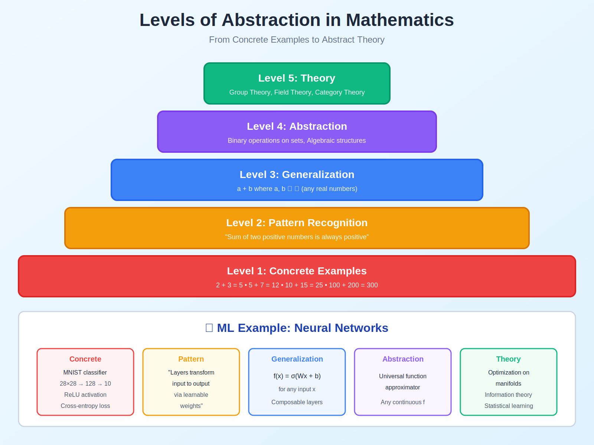

<!-- Animated Header -->
<p align="center">
  
</p>

<p align="center">
  
  
  
</p>

<p align="center">
  <i>How to think like a mathematician and ML researcher</i>
</p>


---

**✍️ Author:** [Gaurav Goswami](https://github.com/Gaurav14cs17)  
**📅 Published:** December 2024  
**🏷️ Tags:** `abstraction` `mathematical-thinking` `necessary-sufficient` `ml-foundations`

---

**🏠 [Home](../README.md)** · **📚 Series:** Mathematical Thinking → [Proof Techniques](../02-proof-techniques/README.md) → [Set Theory](../03-set-theory/README.md) → [Logic](../04-logic/README.md) → [Asymptotic Analysis](../05-asymptotic-analysis/README.md) → [Numerical Computation](../06-numerical-computation/README.md)

---

## 📌 TL;DR

Mathematical thinking is the foundation for understanding ML research. This article covers:
- **Abstraction levels** — From concrete code to abstract theory
- **Necessary vs Sufficient conditions** — The difference between → and ↔
- **Definitions vs Theorems** — What's chosen vs what's proven
- **Counterexamples** — How one example disproves a universal claim

---

## 📚 What You'll Learn

- [ ] Understand different levels of abstraction in ML
- [ ] Distinguish between necessary and sufficient conditions
- [ ] Read mathematical definitions in ML papers
- [ ] Construct counterexamples to disprove claims
- [ ] Apply logical reasoning to ML problems

---

## 📑 Table of Contents

- [Visual Overview](#-visual-overview)
- [Core Mathematical Concepts](#-core-mathematical-concepts)
- [Why Mathematical Thinking Matters](#-why-mathematical-thinking-matters)
- [Detailed Mathematical Foundations](#-detailed-mathematical-foundations)
- [Code Examples](#-code-examples-mathematical-thinking-in-ml)
- [Resources](#-resources)
- [Navigation](#-navigation)

---

## 🎯 Visual Overview



*Caption: Different levels of abstraction in mathematical thinking - from concrete examples to abstract theory.*

### Necessary vs Sufficient Conditions


*Caption: Visual guide to understanding necessary (→) vs sufficient (←) vs if-and-only-if (↔) conditions.*

---

## 📑 In This Article

| File | Topic | Application |
|------|-------|-------------|
| [abstraction.md](./abstraction.md) | Levels of abstraction | Model design |
| [necessary-sufficient.md](./necessary-sufficient.md) | ⟹ vs ⟺ conditions | Understanding theorems |

---

## 📐 Core Mathematical Concepts

### Logical Connectives

| Symbol | Name | Read As | Example |
|:------:|:-----|:--------|:--------|
| → | Implication | "If P, then Q" | P → Q |
| ↔ | Biconditional | "P if and only if Q" | P ↔ Q |
| ∧ | Conjunction | "P and Q" | P ∧ Q |
| ∨ | Disjunction | "P or Q" | P ∨ Q |
| ¬ | Negation | "Not P" | ¬P |

**Quantifiers:**

| Symbol | Read As | Meaning |
|:------:|:--------|:--------|
| ∀x : P(x) | "For all x" | P(x) holds for every x |
| ∃x : P(x) | "There exists x" | P(x) holds for some x |
| ∃!x : P(x) | "Exactly one x" | P(x) holds for unique x |

### Necessary vs Sufficient Conditions

| Type | Symbol | Meaning | Example |
|------|:------:|---------|---------|
| **Sufficient** | P ⟹ Q | If P happens, Q is guaranteed | "Convexity is sufficient for global optima" |
| **Necessary** | Q ⟹ P | Q cannot happen without P | "Differentiability is necessary for gradient descent" |
| **Iff** | P ⟺ Q | P is both necessary AND sufficient for Q | "A matrix is invertible iff det ≠ 0" |

> [!NOTE]
> **Key Insight:**
> - P ⟹ Q: "P is sufficient for Q"
> - Q ⟹ P: "P is necessary for Q"  
> - P ⟺ Q: "P if and only if Q"

### Set Theory Notation

| Symbol | Name | Example |
|:------:|:-----|:--------|
| ∈ | Element of | x ∈ S |
| ⊂, ⊆ | Subset | A ⊂ B |
| ∪ | Union | A ∪ B |
| ∩ | Intersection | A ∩ B |
| \ | Set difference | A \ B |
| ∅ | Empty set | — |
| ℝ | Real numbers | — |
| ℝⁿ | n-dimensional space | ℝ⁷⁸⁴ for MNIST |
| ℤ | Integers | — |
| ℕ | Natural numbers | — |

---

## 🎯 Why Mathematical Thinking Matters

<table>
<tr>
<td width="50%">

**📄 Reading a Paper:**

> *"Let f : ℝⁿ → ℝ be a twice differentiable, strongly convex function with L-smooth gradient. Then gradient descent with step size η ≤ 1/L converges at rate O((1-μ/L)ᵏ)."*

</td>
<td width="50%">

**🧠 You Need to Understand:**

```
              📖 Paper
       ┌──────────┼──────────┐
       │          │          │
  Function    Definitions  Conditions    Convergence
  f: ℝⁿ→ℝ   ┌─────┴─────┐  ┌───┴───┐    Rate O(...)
            │           │  │       │
         Strongly   L-smooth  Necessary?
          convex              Sufficient?
```

</td>
</tr>
</table>

### 🎓 Skill Checklist

| Concept | Question | Status |
|:-------:|:---------|:------:|
| f : ℝⁿ → ℝ | What is this function? | ⬜ |
| Strongly convex | What's the definition? | ⬜ |
| L-smooth | What does this mean? | ⬜ |
| Conditions | Necessary or sufficient? | ⬜ |
| O((1-μ/L)ᵏ) | What's the convergence rate? | ⬜ |

---

## 📐 DETAILED MATHEMATICAL FOUNDATIONS

### 1. Formal Logic: Complete System

**Propositional Logic:**

| Syntax | Name | Symbol |
|:-------|:-----|:------:|
| Atomic | Propositions | P, Q |
| Negation | NOT | ¬P |
| Conjunction | AND | P ∧ Q |
| Disjunction | OR | P ∨ Q |
| Implication | IF-THEN | P → Q |
| Biconditional | IFF | P ↔ Q |

**Truth Tables:**

| P | Q | ¬P | P ∧ Q | P ∨ Q | P → Q | P ↔ Q |
|:---:|:---:|:--------:|:-----------:|:----------:|:---------:|:---------------------:|
| T | T | F | T | T | T | T |
| T | F | F | F | T | F | F |
| F | T | T | F | T | T | F |
| F | F | T | F | F | T | T |

**Key Tautologies:**

| Law | Formula |
|:----|:--------|
| Excluded Middle | P ∨ ¬P |
| Non-Contradiction | ¬(P ∧ ¬P) |
| Double Negation | ¬¬P ↔ P |
| De Morgan (1) | ¬(P ∧ Q) ↔ (¬P ∨ ¬Q) |
| De Morgan (2) | ¬(P ∨ Q) ↔ (¬P ∧ ¬Q) |

---

**Predicate Logic (First-Order):**

| Quantifier | Symbol | Meaning |
|:-----------|:------:|:--------|
| Universal | ∀x P(x) | "For all x" |
| Existential | ∃x P(x) | "There exists x" |

**Quantifier Laws:**

| Law | Formula |
|:----|:--------|
| Negation of ∀ | ¬∀x P(x) ↔ ∃x ¬P(x) |
| Negation of ∃ | ¬∃x P(x) ↔ ∀x ¬P(x) |
| Distribution | ∀x(P(x) ∧ Q(x)) ↔ (∀xP(x)) ∧ (∀xQ(x)) |
| Distribution | ∃x(P(x) ∨ Q(x)) ↔ (∃xP(x)) ∨ (∃xQ(x)) |

> [!WARNING]
> **But NOT:**
> - ∀x(P(x) ∨ Q(x)) ↔ (∀xP(x)) ∨ (∀xQ(x)) ❌
> - ∃x(P(x) ∧ Q(x)) ↔ (∃xP(x)) ∧ (∃xQ(x)) ❌

---

### 2. Necessary vs Sufficient: Complete Analysis

```
┌───────────────────┐   ┌───────────────────┐   ┌───────────────────┐
│  ✅ SUFFICIENT    │   │  ⚠️ NECESSARY     │   │  🎯 IFF (Both)    │
│                   │   │                   │   │                   │
│     P → Q         │   │     Q → P         │   │     P ↔ Q         │
│  P guarantees Q   │   │  Q requires P     │   │     P = Q         │
└───────────────────┘   └───────────────────┘   └───────────────────┘
```

| Type | Symbol | Meaning |
|:----:|:------:|:--------|
| **Sufficient** | P → Q | If P is true, then Q must be true |
| **Necessary** | Q → P | Q cannot be true without P |
| **Iff** | P ↔ Q | P and Q always have same truth value |

**ML Examples with Proofs:**

<details>
<summary>📐 <b>Example 1: Convexity and Global Minima</b></summary>

**Claim:** Convexity is **SUFFICIENT** for "local min = global min"

```
f is convex  ───✅ Sufficient───▶  local min = global min

f(x) = x⁴    ───❌ Not convex───▶  Still has global min!
```

**Proof:**
1. Assume f is convex and x* is local minimum
2. By first-order condition: ∇f(x*) = 0
3. By convexity: f(y) ≥ f(x*) + ∇f(x*)ᵀ(y - x*) for all y
4. Since ∇f(x*) = 0: f(y) ≥ f(x*) for all y ✅

**Is convexity NECESSARY?** ❌ No! Counterexample: f(x) = x⁴

</details>

<details>
<summary>📐 <b>Example 2: Differentiability for Gradient Descent</b></summary>

**Claim:** Differentiability is **NECESSARY** for gradient descent

```
GD works  ───⚠️ Necessary───▶  f differentiable

f differentiable  ───❌ Not sufficient───▶  GD converges
```

| Property | Necessary? | Sufficient? |
|:--------:|:----------:|:-----------:|
| Differentiability | ✅ Yes | ❌ No |

</details>

<details>
<summary>📐 <b>Example 3: Matrix Invertibility (IFF)</b></summary>

**Claim:** det(A) ≠ 0 is **NECESSARY AND SUFFICIENT** for invertibility

```
A invertible  ⟺  det(A) ≠ 0
```

```
det(A) ≠ 0  ◀────↔ IFF────▶  A invertible
```

</details>

---

### 3. Abstraction Levels: Rigorous Framework

**Category Theory Perspective:**

> An abstraction is a **functor** F: C → D between categories

| Component | Description |
|:---------:|:------------|
| C | Concrete category (detailed) |
| D | Abstract category (simplified) |

**Properties preserved:**

| Property | Meaning |
|:---------|:--------|
| Structure | F(composition) = composition of F |
| Identity | F(id) = id |
| Essential | Maintained |
| Irrelevant | Discarded |

<details>
<summary><b>📐 Example: Vector Spaces</b></summary>

| Level | Representation |
|:-----:|:---------------|
| **Level 0** (Concrete) | ℝⁿ: v = (v₁, v₂, ..., vₙ) |
| **Level 1** (Abstract) | General V with axioms: closure, associativity, identity, inverse |

**Abstraction functor:** Forgets coordinates, keeps structure

</details>

**Neural Networks: 4 Levels of Abstraction**

```
┌─────────────────────────────────────────────────┐
│  🎯 Level 3: Categorical  ──  Y = f ∘ g (X)    │
└─────────────────────────────────────────────────┘
                      ▲
┌─────────────────────────────────────────────────┐
│  ⚙️ Level 2: Functional  ──  Y = ReLU(Linear(X))│
└─────────────────────────────────────────────────┘
                      ▲
┌─────────────────────────────────────────────────┐
│  📐 Level 1: Linear Algebra  ──  Z = XWᵀ + b   │
└─────────────────────────────────────────────────┘
                      ▲
┌─────────────────────────────────────────────────┐
│  🔢 Level 0: Computation  ──  for loops, indices│
└─────────────────────────────────────────────────┘
```

<table>
<tr>
<th>Level</th>
<th>Representation</th>
<th>Trade-off</th>
</tr>
<tr>
<td>🔢 <b>Level 0</b><br/>Computation</td>
<td>

```python
for i in range(batch):
  for j in range(out_dim):
    y[i,j] = sum(W[j,k]*x[i,k])
```

</td>
<td>See every op, lose big picture</td>
</tr>
<tr>
<td>📐 <b>Level 1</b><br/>Linear Algebra</td>
<td><code>Z = XWᵀ + b, Y = ReLU(Z)</code></td>
<td>Compact, vectorized</td>
</tr>
<tr>
<td>⚙️ <b>Level 2</b><br/>Functional</td>
<td><code>Y = ReLU(Linear(X; W, b))</code></td>
<td>Composable modules</td>
</tr>
<tr>
<td>🎯 <b>Level 3</b><br/>Categorical</td>
<td><code>Y = f ∘ g (X)</code></td>
<td>See structure, lose details</td>
</tr>
</table>

> [!TIP]
> **Optimal level depends on task!** Use Level 0 for debugging, Level 3 for architecture design.

---

### 4. Mathematical Definitions vs Theorems

```
┌───────────────────────────┐        ┌───────────────────────────┐
│   📖 DEFINITIONS          │        │   📜 THEOREMS             │
│                           │        │                           │
│  • A choice we make       │───▶    │  • Logical consequences   │
│  • Not provable           │lead to │  • Provable from defs     │
│  • Must be consistent     │        │  • Discovered, not chosen │
└───────────────────────────┘        └───────────────────────────┘
```

<table>
<tr>
<td width="50%">

**📖 Definitions (Stipulative)**

| Property | Meaning |
|:--------:|:--------|
| 🎯 Arbitrary | We **choose** them |
| ❓ Not provable | No truth value |
| ✅ Consistent | Not self-contradictory |
| 💡 Useful | Illuminate structure |

**Example: ε-δ limit**

```
lim(x→a) f(x) = L  ⟺  ∀ε > 0, ∃δ > 0:
0 < |x - a| < δ  ⟹  |f(x) - L| < ε
```

</td>
<td width="50%">

**📜 Theorems (Provable)**

| Property | Meaning |
|:--------:|:--------|
| 🔗 Consequence | Follows from axioms |
| ✅ Provable | Has truth value |
| 🔍 Discovered | Not chosen |

**Example: Intermediate Value Theorem**

```
If f continuous on [a,b]
and f(a) < 0 < f(b)
then ∃c ∈ (a,b): f(c) = 0
```

</td>
</tr>
</table>

> [!NOTE]
> **Key Insight:** Definitions are *chosen* to be useful. Theorems are *discovered* as consequences.

---

### 5. Counterexamples: The Power of One

```
🔨 Disproving Claims
┌─────────────────────────────────────────────────────────────────┐
│                                                                 │
│  ∀x P(x)  ────Need ONE────▶  ❌ Found x where P(x) false       │
│  Universal    counterexample                                    │
│                                                                 │
│  ∃x P(x)  ────Need to show───▶  ❌ P(x) false ∀x               │
│  Existential   ALL fail                                         │
│                                                                 │
└─────────────────────────────────────────────────────────────────┘
```

| To Disprove | What You Need | Difficulty |
|:-----------:|:--------------|:----------:|
| ∀x P(x) | **ONE** counterexample | 😊 Easy |
| ∃x P(x) | Show **ALL** fail | 😰 Hard |

> [!TIP]
> **Asymmetry:** It's much easier to disprove universal claims than existential ones!

**Famous Counterexamples in ML:**

| Claim | Counterexample | Result |
|:------|:---------------|:------:|
| "More params → Better generalization" | 10k hidden units on XOR (4 points) | ❌ Random test accuracy |
| "Deep nets can't be trained" (1990s) | AlexNet (2012) | ✅ Deep nets work! |
| "Convex losses necessary" | Non-convex NNs optimized successfully | ❌ Convexity not required |

> [!TIP]
> **Key Insight:** One counterexample disproves a universal claim. One existence proof establishes possibility.

**Constructing Counterexamples:**

| Strategy | Approach | Example |
|:--------:|:---------|:--------|
| 🔺 **Extreme cases** | Push to limits | x = 0 for "∀x: x > 0" |
| 🔬 **Pathological** | Mathematical monsters | Weierstrass: continuous, nowhere differentiable |
| 🎯 **Edge cases** | Boundary conditions | ∅ for set claims |
| 🔍 **Minimal** | Smallest breaker | 2D for "all dims behave like 1D" |

---

### 6. Proof Patterns in ML Papers

```
📐 Common Proof Patterns
┌─────────────────────────────────────────────────────────┐
│                                                         │
│  📊 Bounded Differences   🔄 Induction   🎯 Fixed Point │
│                                                         │
└─────────────────────────────────────────────────────────┘
```

<details>
<summary><b>📊 Pattern 1: Bounded Differences (Concentration)</b></summary>

**Template:**
1. Define random variable X
2. Show bounded differences: |X - X'| ≤ c
3. Apply McDiarmid's inequality:

```
P(|X - E[X]| ≥ t) ≤ 2·exp(-2t²/(nc²))
```

**Example: Generalization Bound**
- X = R̂(h) (empirical risk)
- |X - X'| ≤ 1/n when one sample changed
- **Conclude:** R̂ concentrates around true risk R ✅

</details>

<details>
<summary><b>🔄 Pattern 2: Inductive Arguments (Layer-wise)</b></summary>

**Template:**

| Step | Action |
|:----:|:-------|
| **Base** | Property holds for layer 1 |
| **Inductive** | Layer l → Layer l+1 |
| **Conclusion** | Holds for all layers |

**Example: Backprop Correctness**

```
Base: ∂L/∂W⁽ᴸ⁾ correct (direct)
Step: ∂L/∂W⁽ˡ⁾ = chain rule from W⁽ˡ⁺¹⁾
⟹ All gradients correct ✓
```

</details>

<details>
<summary><b>🎯 Pattern 3: Fixed Point Arguments (Convergence)</b></summary>

**Template:**
1. Define operator T
2. Show contraction: d(Tx, Ty) ≤ γ·d(x, y) with γ < 1
3. Apply Banach fixed point theorem
4. Conclude: x_{n+1} = Tx_n converges

**Example: Value Iteration in RL**

```
T(V)(s) = max_a [R(s,a) + γ·Σ_{s'} P(s'|s,a)V(s')]

‖TV₁ - TV₂‖ ≤ γ·‖V₁ - V₂‖  ⟹  Vₙ → V* ✓
```

</details>

---

### 7. Reading ML Papers: Theorem Checklist

```
❓ Key Questions
┌────────────────────────────────────┐
│ 1️⃣ WHAT claimed?                   │
│         │                          │
│         ▼                          │
│ 2️⃣ UNDER what conditions?          │
│         │                          │
│         ▼                          │
│ 3️⃣ HOW strong?                     │
│         │                          │
│         ▼                          │
│ 4️⃣ WHY believe it?                 │
│         │                          │
│         ▼                          │
│ 5️⃣ WHAT it MEANS?                  │
└────────────────────────────────────┘
```

| Question | Check For |
|:--------:|:----------|
| **1️⃣ WHAT claimed?** | Universal (∀) or existential (∃)? Sufficient, necessary, or iff? |
| **2️⃣ UNDER what conditions?** | Assumptions realistic? What if violated? |
| **3️⃣ HOW strong?** | Big-O or constants? Polynomial or exponential? |
| **4️⃣ WHY believe it?** | Proof technique? Key lemmas? |
| **5️⃣ WHAT it MEANS?** | Algorithm design? Hyperparameter guidance? |

---

**Example: Adam Convergence Theorem**

<details>
<summary><b>📜 Theorem [Kingma & Ba 2014]</b></summary>

Under assumptions A1-A4, Adam converges:

```
R(θ_T) - R(θ*) ≤ O(1/√T)
```

**Checklist:**

| Question | Answer |
|:---------|:-------|
| ✅ **Claim** | Convergence rate (sufficient) |
| ✅ **Conditions** | A1-A4 (smooth, bounded gradients) |
| ✅ **Strength** | O(1/√T) sublinear, same as SGD |
| ✅ **Proof** | Regret bound via online learning |
| ⚠️ **Practice** | Works empirically, theory has gaps |

**Critical reading reveals:**
- Assumptions may not hold (bounded gradients?)
- Rate matches SGD theoretically
- Empirical performance better than theory predicts
- Adaptive methods still poorly understood!

</details>

---

## 🔗 Dependency Graph

| Topic | Next Topic | Application |
|:------|:-----------|:------------|
| 🎯 **Abstraction** | Definitions vs Theorems | How to think |
| 📖 **Definitions vs Theorems** | Necessary/Sufficient | What to prove |
| ⚖️ **Necessary/Sufficient** | Counterexamples | Understanding conditions |
| ❌ **Counterexamples** | — | Why assumptions matter |

```
🎯 abstraction.md
        │
        ▼
📖 definitions-vs-theorems.md
        │
        ▼
⚖️ necessary-sufficient.md ────▶ 📈 Understanding convergence theorems
        │
        ▼
❌ counterexamples.md ──────────▶ ⚠️ Why assumptions matter
```

---

## 📚 Key Takeaways

1. **Definitions are not theorems** - Definitions are chosen, theorems are proven
2. **Necessary ≠ Sufficient** - Most conditions in ML are sufficient, not necessary
3. **Abstractions hide details** - But the right abstraction reveals structure
4. **One counterexample kills a claim** - No amount of examples proves it

---

## 💻 Code Examples: Mathematical Thinking in ML

```python
import numpy as np

# Necessary vs Sufficient in ML
# Example: Conditions for gradient descent convergence

def is_convex(f, x, num_samples=100):
    """
    Convexity is SUFFICIENT for global optimum:
    If f is convex → any local min is global min
    """
    # Jensen's inequality check: f(E[X]) ≤ E[f(X)]
    pass

def is_differentiable(f, x, eps=1e-7):
    """
    Differentiability is NECESSARY for gradient descent:
    We need ∇f to exist to compute updates
    """
    grad = (f(x + eps) - f(x - eps)) / (2 * eps)
    return np.isfinite(grad)

# Abstraction levels in neural networks
class AbstractLayer:
    """
    Level 0: Mathematical - y = σ(Wx + b)
    Level 1: Computational - Forward/backward pass
    Level 2: Implementation - PyTorch tensors
    Level 3: Application - Image classifier
    """
    def forward(self, x):
        raise NotImplementedError
    
    def backward(self, grad):
        raise NotImplementedError
```

---

## 📚 Resources

## 📚 References

| Type | Title | Link |
|------|-------|------|
| 📖 | Pólya: How to Solve It | [Book](https://press.princeton.edu/books/paperback/9780691164076/how-to-solve-it) |
| 📖 | Velleman: How to Prove It | [Book](https://www.cambridge.org/core/books/how-to-prove-it/6E4BFAB4D35CD80D5F60FB4A3AD10FFD) |
| 📖 | Mathematics for ML | [Book](https://mml-book.github.io/) |
| 🎥 | 3Blue1Brown | [YouTube](https://www.youtube.com/c/3blue1brown) |
| 🎥 | Mathologer | [YouTube](https://www.youtube.com/c/Mathologer) |
| 🎥 | Khan Academy | [Khan](https://www.khanacademy.org/) |
| 🇨🇳 | 数学思维方法论 | [知乎](https://zhuanlan.zhihu.com/p/25942876) |
| 🇨🇳 | 数学基础课程 | [B站](https://www.bilibili.com/video/BV1ys411472E) |
| 🇨🇳 | 机器学习数学基础 | [CSDN](https://blog.csdn.net/qq_37466121/article/details/88619088)

---

## 🔗 Where This Topic Is Used

| Topic | How Mathematical Thinking Is Used |
|-------|-----------------------------------|
| **Paper Reading** | Understand definitions, theorems, proofs |
| **Model Design** | Abstract problem → architecture |
| **Debugging** | Logical reasoning about errors |
| **Research** | Formulate hypotheses, prove results |
| **Optimization** | Understand convergence conditions |

### Prerequisite For

```
                🧠 Mathematical Thinking
                         │
       ┌─────────────────┼─────────────────┐
       │                 │                 │
       ▼                 ▼                 ▼
📚 All ML theory  📄 Reading papers  📈 Understanding
                                       convergence
                         │
                         ▼
                  ✍️ Proof writing
```

---

## 🧭 Navigation

<table width="100%">
<tr>
<td align="left" width="33%">

⬅️ **Previous**<br>
[🏠 Home](../README.md)

</td>
<td align="center" width="34%">

📍 **Current: 1 of 6**<br>
**Mathematical Thinking**

</td>
<td align="right" width="33%">

➡️ **Next**<br>
[📝 Proof Techniques](../02-proof-techniques/README.md)

</td>
</tr>
</table>

---

<!-- Animated Footer -->
<p align="center">
  
</p>

<p align="center">
  <a href="../README.md"></a>
</p>

<p align="center">
  <sub>Made with ❤️ by <a href="https://github.com/Gaurav14cs17">Gaurav Goswami</a></sub>
</p>

