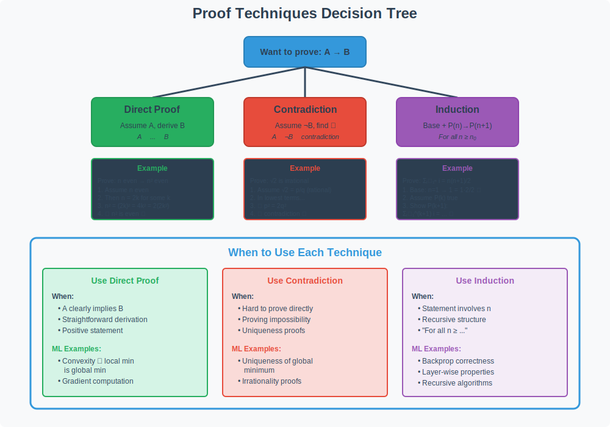

<!-- Animated Header -->
<p align="center">
  
</p>

<p align="center">
  
  
  
</p>

<p align="center">
  <i>The essential methods for mathematical reasoning in ML</i>
</p>


---

**✍️ Author:** [Gaurav Goswami](https://github.com/Gaurav14cs17)  
**📅 Published:** December 2024  
**🏷️ Tags:** `proof-techniques` `direct-proof` `contradiction` `induction` `ml-theory`

---

**🏠 [Home](../README.md)** · **📚 Series:** [Mathematical Thinking](../01-mathematical-thinking/README.md) → Proof Techniques → [Set Theory](../03-set-theory/README.md) → [Logic](../04-logic/README.md) → [Asymptotic Analysis](../05-asymptotic-analysis/README.md) → [Numerical Computation](../06-numerical-computation/README.md)

---

## 📌 TL;DR

Every ML paper contains proofs. This article teaches you the three essential techniques:
- **Direct Proof** — Show A → B by logical steps (convexity proofs)
- **Contradiction** — Assume opposite, find impossibility (uniqueness proofs)
- **Induction** — Base case + inductive step (backprop correctness)

> [!TIP]
> When reading a proof, first identify which technique is being used. This helps you follow the logic.

---

## 📚 What You'll Learn

- [ ] Write direct proofs for simple ML theorems
- [ ] Use contradiction to prove impossibility results
- [ ] Apply induction for recursive/layered structures
- [ ] Recognize proof patterns in ML papers
- [ ] Understand convergence proofs

---

## 📑 Table of Contents

- [Visual Overview](#-visual-overview)
- [Decision Tree: Which Technique?](#-decision-tree-which-technique)
- [ML Examples by Technique](#-ml-examples-by-technique)
- [Detailed Proof Mathematics](#-detailed-proof-mathematics)
- [Proof Structure Templates](#-proof-structure-templates)
- [Resources](#-resources)
- [Navigation](#-navigation)

---

## 🎯 Visual Overview



*Caption: Decision tree for choosing the right proof technique. Direct proofs work for "if-then" statements, contradiction for uniqueness and impossibility, and induction for statements about all natural numbers. Understanding these techniques is essential for reading ML theory papers.*


---

## 📂 Topics in This Folder

| File | Topic | When to Use |
|------|-------|-------------|
| [direct-proof.md](./direct-proof.md) | A → B directly | Convexity proofs, gradient bounds |

---

## 🎯 Decision Tree: Which Technique?

```
            🤔 What are you proving?
                      │
        ┌─────────────┼─────────────┐
        ▼             ▼             ▼
   Existence?    Uniqueness?    For all n?
        │             │             │
        ▼             ▼             ▼
   🔨 Constructive  ⚡ Contradiction  🔄 Induction
   (build it)     (assume 2 exist)  (base + step)
        │             │             │
        ▼             ▼             ▼
   Algorithm gives  Suppose x₁ ≠ x₂  P(1) true, then
   you the object   both work...    P(k) → P(k+1)
```

### 🎨 Proof Technique Selector

| Question | Answer | Use This |
|:--------:|:------:|:--------:|
| Can you directly derive the result? | ✅ Yes | 🎯 **Direct Proof** |
| Is the negation easier to work with? | ✅ Yes | ⚡ **Contradiction** |
| Does it involve natural numbers? | ✅ Yes | 🔄 **Induction** |
| Need to show something exists? | ✅ Yes | 🔨 **Construction** |
| Need to show at most one? | ✅ Yes | 🎭 **Uniqueness (Contradiction)** |

---

## 🌍 ML Examples by Technique

### Direct Proof

<details>
<summary><b>📐 Theorem: Convex → Local = Global</b></summary>

**Theorem:** If f is convex, then any local minimum is global.

| Step | Derivation |
|:----:|:-----------|
| 1 | Assume f is convex |
| 2 | Let x* be a local minimum |
| 3 | By convexity: f(y) ≥ f(x*) + ∇f(x*)ᵀ(y - x*) |
| 4 | At local min: ∇f(x*) = 0 |
| 5 | Therefore: f(y) ≥ f(x*) for all y ∎ |

</details>

### Proof by Contradiction

<details>
<summary><b>💥 Theorem: Strictly Convex → Unique Minimum</b></summary>

**Theorem:** A strictly convex function has at most one global minimum.

| Step | Derivation |
|:----:|:-----------|
| 1 | Suppose x₁ ≠ x₂ are both global minima |
| 2 | Then f(x₁) = f(x₂) = f* |
| 3 | Midpoint: x_mid = (x₁ + x₂)/2 |
| 4 | By strict convexity: f(x_mid) < ½f(x₁) + ½f(x₂) = f* |
| 5 | **Contradiction!** f* isn't minimum ⊥ |

</details>

### Mathematical Induction

<details>
<summary><b>🔄 Theorem: Backprop Correctness</b></summary>

**Theorem:** Backprop correctly computes ∂L/∂wᵢ for all layers.

| Step | Proof |
|:----:|:------|
| **Base** | Layer L: ∂L/∂w_L = ∂L/∂y_L · ∂y_L/∂w_L ✅ |
| **Inductive** | ∂L/∂wᵢ = ∂L/∂y_{i+1} (correct by hypothesis) · ∂y_{i+1}/∂yᵢ · ∂yᵢ/∂wᵢ ✅ |

**Conclusion:** Correct for all layers ∎

</details>

---

## 💻 Code Pattern: Induction in Algorithms

<table>
<tr>
<td width="50%">

**Factorial (Simple Induction)**

```python
def factorial(n):
    if n == 0:
        return 1  # Base case
    return n * factorial(n - 1)
```

| Step | Proof |
|:----:|:------|
| Base | `factorial(0) = 1` ✅ |
| Inductive | `n * (n-1)! = n!` ✅ |

</td>
<td width="50%">

**Merge Sort (Strong Induction)**

```python
def merge_sort(arr):
    if len(arr) <= 1:
        return arr  # Base
    mid = len(arr) // 2
    left = merge_sort(arr[:mid])
    right = merge_sort(arr[mid:])
    return merge(left, right)
```

| Step | Proof |
|:----:|:------|
| Base | `len ≤ 1` trivially sorted ✅ |
| Inductive | Two sorted halves merge ✅ |

</td>
</tr>
</table>

---

## 📐 DETAILED PROOF MATHEMATICS

### 1. Direct Proof: Complete Examples

**Template:**

```
📌 Want to prove:     1️⃣ Assume P     2️⃣ Use definitions     3️⃣ Derive Q     ✅ Therefore
    P → Q         ──▶   is true   ──▶   & theorems       ──▶  logically  ──▶   P → Q
```

**Example 1: Gradient Descent Convergence (L-smooth)**

<details>
<summary>📐 <b>Theorem: GD Convergence Rate</b></summary>

**Theorem:** If f is L-smooth and convex, gradient descent with α = 1/L satisfies:

```
f(x_k) - f(x*) ≤ 2L‖x₀ - x*‖² / k
```

```
🎯 Assume f is L-smooth
         │
         ▼
   L-smoothness bound
         │
         ▼
   Apply to GD update
         │
         ▼
     Use convexity
         │
         ▼
    Telescoping sum
         │
         ▼
  ✅ O(1/k) convergence!
```

**Proof Steps:**

| Step | What We Show |
|:----:|:-------------|
| 1 | ‖∇f(x) - ∇f(y)‖ ≤ L‖x - y‖ (L-smooth) |
| 2 | f(y) ≤ f(x) + ∇f(x)ᵀ(y-x) + (L/2)‖y-x‖² |
| 3 | f(x_{k+1}) ≤ f(x_k) - (1/2L)‖∇f(x_k)‖² |
| 4 | Apply Cauchy-Schwarz |
| 5 | Sum telescoping series → **Result** ✅ |

</details>

**Example 2: Neural Network Universal Approximation**

<details>
<summary><b>📐 Theorem: NN Universal Approximation</b></summary>

**Theorem:** Neural networks with one hidden layer can approximate any continuous function on compact domain.

```
Given: f continuous on [0,1]ⁿ
            │
            ▼
  Partition into small cubes
            │
            ▼
  Construct ReLU indicators
            │
            ▼
   Sum weighted indicators
            │
            ▼
  ✅ Approximation within ε
```

| Step | Action |
|:----:|:-------|
| 1 | Given f: [0,1]ⁿ → ℝ continuous, ε > 0 |
| 2 | Partition [0,1]ⁿ into cubes of side δ, N = (1/δ)ⁿ cubes |
| 3 | By continuity: \|f(x) - f(cᵢ)\| < ε/2 in each cube Qᵢ |
| 4 | Construct: Iᵢ(x) = ReLU(δ - ‖x - cᵢ‖∞) / δ |
| 5 | Define: g(x) = Σᵢ f(cᵢ) · Iᵢ(x) |
| 6 | \|f(x) - g(x)\| ≤ \|f(x) - f(cᵢ)\| + \|f(cᵢ) - g(x)\| < ε ✅ |

**Conclusion:** Neural network g approximates f to any ε ∎

</details>

---

### 2. Proof by Contradiction: Advanced Examples

**Template:**

```
    Assume ¬P
        │
        ▼
  Derive logical consequences
        │
        ▼
  Reach contradiction ⊥
        │
        ▼
  ∴ P must be true ✅
```

<details>
<summary><b>💥 Example 1: Unique Global Minimum</b></summary>

**Theorem:** For strictly convex f, there is at most one global minimum.

| Step | Derivation |
|:----:|:-----------|
| 1 | Suppose ∃ two minima x₁ ≠ x₂ with f(x₁) = f(x₂) = f* |
| 2 | Midpoint: m = (x₁ + x₂)/2 |
| 3 | By strict convexity: f(m) < ½f(x₁) + ½f(x₂) = f* |
| 4 | f(m) < f* contradicts that f* is minimum! 💥 |

**Conclusion:** At most one global minimum ∎

</details>

<details>
<summary><b>🚫 Example 2: No Free Lunch Theorem</b></summary>

**Theorem:** No algorithm is universally better than random search (over all functions).

| Step | Logic |
|:----:|:------|
| 1 | Suppose algorithm A beats random on ALL functions f: X → {0,1} |
| 2 | Given data D, A predicts ŷ for new x |
| 3 | For 2^(\|X\|-n) consistent functions: half have f(x)=0, half f(x)=1 |
| 4 | By symmetry: E[error] = 1/2 for ANY prediction |
| 5 | A cannot beat random! 💥 |

**Conclusion:** No universal best algorithm ∎

</details>

---

### 3. Mathematical Induction: Step-by-Step

```
🎯 Base Case     📋 Hypothesis      ⬆️ Prove          ✅ Conclusion
   P(n₀)    ──▶   Assume P(k)   ──▶  P(n+1)   ──▶   P(n) for all n
                  for k ≤ n
```

| Step | Strong Induction Template |
|:----:|:--------------------------|
| **Base** | Show P(n₀) |
| **Hypothesis** | Assume P(k) for all k, n₀ ≤ k ≤ n |
| **Inductive** | Prove P(n+1) using hypothesis |
| **Conclusion** | P(n) holds for all n ≥ n₀ |

**Example 1: Gradient Computation Correctness**

<details>
<summary><b>📐 Theorem: Backprop computes gradients correctly for all layers</b></summary>

**Proof (Induction on layer depth):**

**Notation:** Layer l: z⁽ˡ⁾ = W⁽ˡ⁾a⁽ˡ⁻¹⁾ + b⁽ˡ⁾, a⁽ˡ⁾ = σ(z⁽ˡ⁾)

---

**Base case (Layer L):**

```
∂L/∂W⁽ᴸ⁾ = ∂L/∂a⁽ᴸ⁾ · ∂a⁽ᴸ⁾/∂z⁽ᴸ⁾ · ∂z⁽ᴸ⁾/∂W⁽ᴸ⁾
```

| Term | Computation | ✅ |
|:----:|:------------|:--:|
| ∂L/∂a⁽ᴸ⁾ | Loss derivative | ✓ |
| ∂a⁽ᴸ⁾/∂z⁽ᴸ⁾ | σ'(z⁽ᴸ⁾) | ✓ |
| ∂z⁽ᴸ⁾/∂W⁽ᴸ⁾ | (a⁽ᴸ⁻¹⁾)ᵀ | ✓ |

---

**Inductive step (Layer l):**

```
∂L/∂W⁽ˡ⁾ = ∂L/∂z⁽ˡ⁺¹⁾ · ∂z⁽ˡ⁺¹⁾/∂a⁽ˡ⁾ · ∂a⁽ˡ⁾/∂z⁽ˡ⁾ · ∂z⁽ˡ⁾/∂W⁽ˡ⁾
```

All terms correct by hypothesis → Correct for layer l ✅

**By induction: Correct for all layers** ∎

</details>

**Example 2: Training Dynamics**

<details>
<summary><b>📈 Theorem: GD Convergence with Strong Convexity</b></summary>

**Theorem:** After k steps of GD with step size α = 1/L on L-smooth, μ-strongly convex f:

```
‖x_k - x*‖ ≤ (√L/√μ)ᵏ · ‖x₀ - x*‖
```

---

**Proof (Induction):**

| Step | Key Equation |
|:----:|:-------------|
| **Base** (k=0) | ‖x₀ - x*‖ ≤ 1 · ‖x₀ - x*‖ ✅ |
| **Hypothesis** | Assume holds for k |
| **GD Update** | x_{k+1} = x_k - (1/L)∇f(x_k) |

**Key step:** Using strong convexity + smoothness:

```
‖x_{k+1} - x*‖² ≤ (1 - μ/L)‖x_k - x*‖²
```

Taking square root and applying hypothesis:

```
‖x_{k+1} - x*‖ ≤ √(1 - μ/L) · (√L/√μ)ᵏ · ‖x₀ - x*‖ = (√L/√μ)ᵏ⁺¹ · ‖x₀ - x*‖
```

**By induction: Holds for all k** ∎

</details>

---

### 4. Contrapositive: When to Use

```
┌──────────────────┐        ┌──────────────────────┐
│     Original     │   ≡    │    Contrapositive    │
│    P  ──▶  Q     │  ◀═▶   │    ¬Q  ──▶  ¬P      │
└──────────────────┘        └──────────────────────┘
```

**When to use contrapositive:**
| Scenario | Why |
|:---------|:----|
| ¬Q easier to work with | Start from conclusion's negation |
| ¬P has clearer structure | End goal is more tractable |
| Showing "necessary" conditions | If not Q, then not P |

<details>
<summary><b>📐 Example: GD Convergence Requirements</b></summary>

**Theorem:** If GD converges, then α ≤ 2/L

**Proof (Contrapositive):** If α > 2/L, then GD diverges

| Step | Derivation |
|:----:|:-----------|
| 1 | Assume α > 2/L |
| 2 | Consider f(x) = ½x² (L-smooth with L=1) |
| 3 | GD update: x_{k+1} = (1 - α)x_k |
| 4 | After k steps: x_k = (1 - α)ᵏx₀ |
| 5 | If α > 2: \|1 - α\| > 1 ⟹ \|x_k\| → ∞ 💥 |

**Proved contrapositive → Original true** ∎

</details>

---

### 5. Proof by Cases: Handling Multiple Scenarios

```
                    Prove P
           ┌──────────┼──────────┐
           ▼          ▼          ▼
       Case 1: C₁  Case 2: C₂  Case 3: C₃
           │          │          │
           ▼          ▼          ▼
       P holds ✅  P holds ✅  P holds ✅
           └──────────┼──────────┘
                      ▼
          P proved for ALL cases ∎
```

<details>
<summary><b>📐 Example: ReLU is 1-Lipschitz</b></summary>

**Theorem:** ReLU(x) = max(0, x) is 1-Lipschitz continuous

**Need to show:** \|ReLU(x) - ReLU(y)\| ≤ \|x - y\| for all x, y

| Case | Condition | Calculation | Result |
|:----:|:----------|:------------|:------:|
| 1 | x ≥ 0, y ≥ 0 | \|x - y\| = \|x - y\| | ✅ |
| 2 | x < 0, y < 0 | \|0 - 0\| = 0 ≤ \|x - y\| | ✅ |
| 3 | x ≥ 0, y < 0 | \|x - 0\| = x ≤ x - y = \|x - y\| | ✅ |

**All cases covered: ReLU is 1-Lipschitz** ∎

</details>

---

### 6. Existence Proofs: Constructive vs Non-Constructive

```
📐 Existence Proof Types
  ┌────────────────────────────────────────────┐
  │                                            │
  │   🔧 Constructive    🔮 Non-Constructive   │
  │         │                    │             │
  │         ▼                    ▼             │
  │   Provides algorithm   Proves existence   │
  │                         only               │
  └────────────────────────────────────────────┘
```

<details>
<summary><b>🔧 Constructive (Algorithmic)</b></summary>

**Example: Weierstrass Approximation**

```
∀ε > 0, ∃ polynomial p: |f(x) - p(x)| < ε on [a,b]
```

**Constructive Proof (Bernstein polynomials):**

```
Bₙ(x) = Σₖ₌₀ⁿ f(k/n) · C(n,k) · xᵏ(1-x)ⁿ⁻ᵏ
```

As n → ∞, Bₙ(x) → f(x) uniformly ✅

> **Key:** This CONSTRUCTS the approximating polynomial!

</details>

<details>
<summary><b>🔮 Non-Constructive (Existence Only)</b></summary>

**Example: Pigeonhole Principle**

**Theorem:** Among n+1 numbers from {1, 2, ..., 2n}, at least two sum to 2n+1

**Proof:**
1. Partition {1, 2, ..., 2n} into n pairs: {1, 2n}, {2, 2n-1}, ..., {n, n+1}
2. Each pair sums to 2n+1
3. With n+1 numbers and n pairs (pigeonholes): two must be in same pair ✅

> **Note:** Doesn't tell us WHICH two! Just that they exist.

</details>

---

### 7. Common Proof Patterns in ML

```
🎯 ML Proof Patterns
┌─────────────────────────────────────────────────────────┐
│                                                         │
│  🔺 Triangle        📐 Telescoping      🥪 Sandwich     │
│   Inequality            Sum              Theorem        │
│       │                  │                  │           │
│       ▼                  ▼                  ▼           │
│  Decompose +        Terms Cancel      Squeeze Limits    │
│    Bound                                                │
└─────────────────────────────────────────────────────────┘
```

---

<details>
<summary>🔺 <b>Pattern 1: Decompose + Bound (Triangle Inequality)</b></summary>

**Template:**

```
   |A|
    │
    ▼
|A - B + B|
    │
    ▼
|A - B| + |B|
    │
    ▼
bound₁ + bound₂
```

```
|A| = |A - B + B| ≤ |A - B| + |B| ≤ bound₁ + bound₂
```

**Example: Generalization Error**

| Term | Meaning |
|:----:|:--------|
| E[R(h)] - R̂(h) | Total error |
| \|E[R(h)] - R(h)\| | **Estimation error** |
| \|R(h) - R̂(h)\| | **Approximation error** |

```
       E[R(h)] - R̂(h)        ≤   |E[R(h)] - R(h)|    +   |R(h) - R̂(h)|
         (Total)                   (Estimation)          (Approximation)
```

</details>

---

<details>
<summary>📐 <b>Pattern 2: Telescoping Sum</b></summary>

**Template:**

```
(a₁ - a₂) + (a₂ - a₃) + (a₃ - a₄) + ... + (aₙ - aₙ₊₁)  =  a₁ - aₙ₊₁
    └────┬────┘   └────┬────┘   └────┬────┘
        cancel!    cancel!      cancel!
```

```
Σᵢ₌₁ⁿ (aᵢ - aᵢ₊₁) = a₁ - aₙ₊₁    (most terms cancel!)
```

**Example: SGD Convergence**

```
f(x₀) - f(x*) = Σₖ₌₀ᵀ⁻¹ [f(x_k) - f(x_{k+1})]  ≤  Total bound
                    └── progress per step ──┘
```

> [!TIP]
> Telescoping is powerful because n terms collapse to just 2!

</details>

---

<details>
<summary>🥪 <b>Pattern 3: Sandwich (Squeeze) Theorem</b></summary>

**Template:**

```
    U(n) ─── Upper bound ───┐
                            ▼
                          f(n)  ──▶  If L(n) → L and U(n) → L
                            ▲              │
    L(n) ─── Lower bound ───┘              ▼
                                    Then f(n) → L ✅
```

```
L(n) ≤ f(n) ≤ U(n)

If lim(n→∞) L(n) = lim(n→∞) U(n) = L  ⟹  lim(n→∞) f(n) = L
```

**Example: Big-Θ Notation**

```
c₁·g(n) ≤ f(n) ≤ c₂·g(n)  ⟹  f(n) = Θ(g(n))
```

</details>

---

### 📊 Pattern Comparison

| Pattern | When to Use | Key Insight |
|:-------:|:------------|:------------|
| 🔺 **Triangle** | Bounding differences | Split into manageable parts |
| 📐 **Telescoping** | Sums of differences | Most terms cancel |
| 🥪 **Sandwich** | Proving limits | Squeeze between bounds |

---

## 📐 Proof Structure Templates

### 🎯 Direct Proof

```
📌 Theorem: If P, then Q
            │
            ▼
    1️⃣ Assume P is true
            │
            ▼
    2️⃣ Logical step 1
            │
            ▼
    3️⃣ Logical step 2
            │
            ▼
          ...
            │
            ▼
    ✅ Therefore Q. □
```

<table>
<tr>
<td width="50%">

**📋 Template:**

| Step | Action |
|:----:|:-------|
| 1 | State: If P, then Q |
| 2 | Assume P |
| 3 | Logical steps... |
| 4 | Conclude Q ∎ |

</td>
<td width="50%">

**📐 Example:**

| Statement | Derivation |
|:----------|:-----------|
| Assume n is even | n = 2k |
| Square it | n² = 4k² = 2(2k²) |
| **Conclusion** | n² is even ∎ |

</td>
</tr>
</table>

---

### ⚡ Contradiction

```
📌 Want to prove: P
        │
        ▼
   1️⃣ Assume ¬P
        │
        ▼
   2️⃣ Derive consequences
        │
        ▼
   3️⃣ Reach contradiction ⊥
        │
        ▼
✅ Therefore P must be true. □
```

<table>
<tr>
<td width="50%">

**📋 Template:**

| Step | Action |
|:----:|:-------|
| 1 | Want to prove P |
| 2 | Assume ¬P |
| 3 | Derive consequences |
| 4 | Reach contradiction ⊥ |
| 5 | Conclude P ∎ |

</td>
<td width="50%">

**📐 Example: √2 irrational**

| Step | Derivation |
|:-----|:-----------|
| Assume | √2 = p/q (lowest terms) |
| Then | 2q² = p² ⟹ p even |
| Let | p = 2k ⟹ q² = 2k² |
| So | q also even ⊥ |
| **Contradiction!** | √2 irrational ∎ |

</td>
</tr>
</table>

---

### 🔄 Induction

```
📌 Prove: P(n) for all n ≥ 1
              │
              ▼
    ┌─────────────────────┐
    │ 1️⃣ Base Case: P(1)  │
    └─────────────────────┘
              │
              ▼
         ✅ P(1) true?
              │ Yes
              ▼
    ┌─────────────────────┐
    │ 2️⃣ Inductive Step   │
    │   Assume P(k) true  │
    │   Prove P(k+1)      │
    └─────────────────────┘
              │
              ▼
        ✅ P(k+1) true?
              │ Yes
              ▼
    🎉 P(n) true ∀n ≥ 1
```

<table>
<tr>
<td width="50%">

**📋 Template:**

| Step | Action |
|:----:|:-------|
| **Base** | Show P(1) true |
| **Assume** | P(k) true for k ≥ 1 |
| **Prove** | P(k+1) follows |
| **Conclude** | P(n) for all n ≥ 1 ∎ |

</td>
<td width="50%">

**📐 Example: Sum Formula**

```
1 + 2 + ⋯ + n = n(n+1)/2
```

| Step | Verification |
|:-----|:-------------|
| **Base** | n=1: 1 = 1(2)/2 ✅ |
| **Inductive** | Add (k+1): k(k+1)/2 + (k+1) = (k+1)(k+2)/2 ✅ |

</td>
</tr>
</table>

---

## 📚 Resources

| Type | Title | Link |
|------|-------|------|
| 📖 | How to Prove It | Velleman |
| 📖 | Book of Proof | Hammack (free!) |
| 🎥 | MIT 6.042 | [YouTube](https://www.youtube.com/watch?v=L3LMbpZIKhQ) |
| 🇨🇳 | 数学证明方法 | 知乎 |

---

## 🔗 Where This Topic Is Used

| Topic | How Proof Techniques Are Used |
|-------|------------------------------|
| **Convergence Analysis** | Prove SGD, Adam converge (direct/induction) |
| **Generalization Bounds** | PAC learning proofs |
| **Convex Optimization** | Prove global optimum exists |
| **VC Dimension** | Prove learning is possible |
| **Backprop Correctness** | Induction over layers |
| **NP-Hardness** | Prove problems are hard (contradiction) |
| **Algorithm Analysis** | Prove correctness and complexity |
| **Information Theory** | Prove entropy properties |

### Used In These ML Papers

| Paper Topic | Proof Technique |
|-------------|-----------------|
| Transformer convergence | Direct proof with assumptions |
| Adam convergence | Induction + analysis |
| Generalization bounds | Probabilistic + induction |
| Neural network expressivity | Constructive (show network exists) |
| Lower bounds | Contradiction |

### Prerequisite For

```
                    📐 Proof Techniques
                           │
       ┌───────────────────┼───────────────────┐
       │                   │                   │
       ▼                   ▼                   ▼
📄 Reading ML      📈 Understanding      ✅ Algorithm
  theory papers      convergence        correctness
                           │
                           ▼
                    📝 Publishing
                    theoretical work
```

---

## 🧭 Navigation

<table width="100%">
<tr>
<td align="left" width="33%">

⬅️ **Previous**<br>
[🧠 Mathematical Thinking](../01-mathematical-thinking/README.md)

</td>
<td align="center" width="34%">

📍 **Current: 2 of 6**<br>
**Proof Techniques**

</td>
<td align="right" width="33%">

➡️ **Next**<br>
[🔢 Set Theory](../03-set-theory/README.md)

</td>
</tr>
</table>

---

<!-- Animated Footer -->
<p align="center">
  
</p>

<p align="center">
  <a href="../README.md"></a>
</p>

<p align="center">
  <sub>Made with ❤️ by <a href="https://github.com/Gaurav14cs17">Gaurav Goswami</a></sub>
</p>

