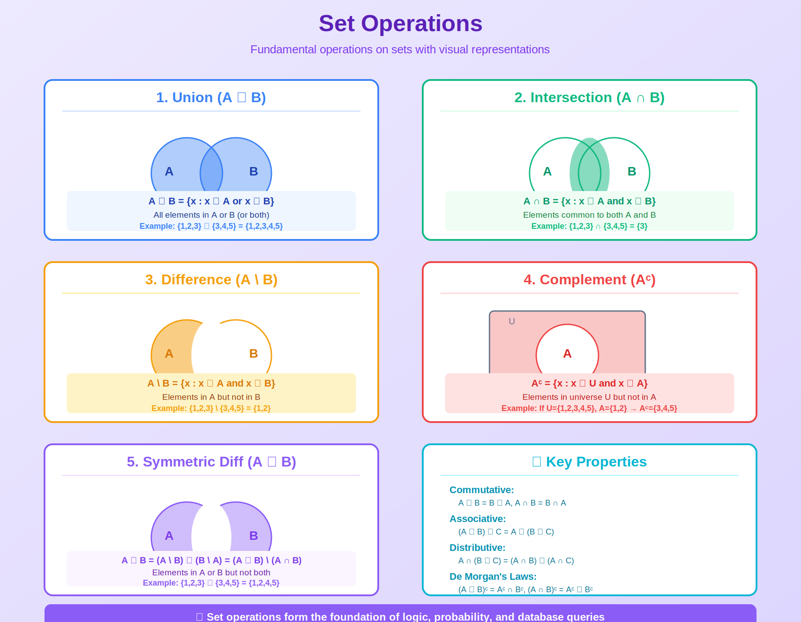
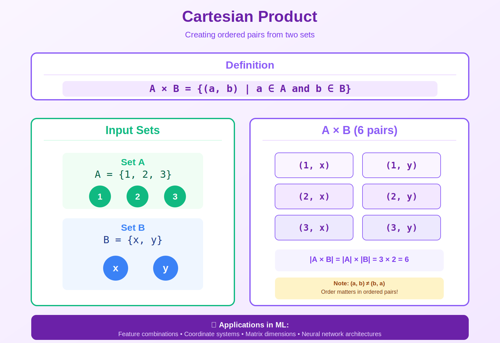

<!-- Animated Header -->
<p align="center">
  
</p>

<p align="center">
  
  
  
</p>

<p align="center">
  <i>The foundation of all mathematics and probability</i>
</p>


---

**✍️ Author:** [Gaurav Goswami](https://github.com/Gaurav14cs17)  
**📅 Published:** December 2024  
**🏷️ Tags:** `set-theory` `probability` `sigma-algebra` `relations` `functions`

---

**🏠 [Home](../README.md)** · **📚 Series:** [Mathematical Thinking](../01-mathematical-thinking/README.md) → [Proof Techniques](../02-proof-techniques/README.md) → Set Theory → [Logic](../04-logic/README.md) → [Asymptotic Analysis](../05-asymptotic-analysis/README.md) → [Numerical Computation](../06-numerical-computation/README.md)

---

## 📌 TL;DR

Set theory is the language of probability and ML. This article covers:
- **Set Operations** — Union, intersection, difference, complement
- **Functions** — Injective, surjective, bijective (normalizing flows!)
- **Relations** — Equivalence relations (clustering)
- **σ-Algebra** — Foundation for probability spaces

> [!NOTE]
> Every probability distribution is defined on a σ-algebra. Understanding sets is essential for probabilistic ML.

---

## 📚 What You'll Learn

- [ ] Perform set operations and understand De Morgan's laws
- [ ] Classify functions (injective, surjective, bijective)
- [ ] Understand equivalence relations and partitions
- [ ] Know what a σ-algebra is and why it matters
- [ ] Apply set theory to data operations (SQL, Pandas)

---

## 📑 Table of Contents

- [Visual Overview](#-visual-overview)
- [Why Set Theory for ML?](#-why-set-theory-for-ml)
- [Key Set Operations](#-key-set-operations)
- [Detailed Mathematical Theory](#-detailed-mathematical-theory)
- [Code Examples](#-code-examples)
- [Resources](#-resources)
- [Navigation](#-navigation)

---

## 🎯 Visual Overview


*Caption: This diagram shows the fundamental set operations: union (A ∪ B), intersection (A ∩ B), difference (A \ B), and complement (Aᶜ). These operations form the basis for probability theory and data manipulation in ML.*

### Complete Set Operations Reference



*Caption: Comprehensive reference for all set operations including De Morgan's laws and distributive properties.*

### Cartesian Product



*Caption: The Cartesian product A × B creates all ordered pairs where the first element comes from set A and the second from set B. This is essential for understanding feature combinations and grid search in ML.*

---

## 📂 Topics in This Folder

| File | Topic | Application |
|------|-------|-------------|

---

## 🎯 Why Set Theory for ML?

```
┌─────────────────────────┐        ┌─────────────────────────┐
│   🔢 Set Theory         │        │ 📊 Probability Theory   │
│                         │        │                         │
│   Universal Set    ─────┼───▶    │   Sample Space Ω        │
│   Subsets          ─────┼───▶    │   Events A ⊆ Ω          │
│   σ-algebra        ─────┼───▶    │   P: σ-algebra → [0,1]  │
│                         │        │                         │
└─────────────────────────┘        └─────────────────────────┘
```

**Example: Coin Flip**

| Concept | Symbol | Value |
|:-------:|:------:|:-----:|
| Sample Space | Ω | {H, T} |
| σ-algebra | F | {∅, {H}, {T}, {H,T}} |
| Probability | P({H}) | 0.5 |

---

## 📐 Key Set Operations

### Visual Venn Diagrams

```
Set Operations Visualized
┌─────────────────┬─────────────────┬─────────────────┬─────────────────┐
│  🔵 ∪ 🟢 UNION  │🔵 ∩ 🟢 INTERSECT│ 🔵 ∖ 🟢 DIFF    │  🔵ᶜ COMPLEMENT │
│                 │                 │                 │                 │
│  Everything in  │  Only what's    │   A but         │  Everything     │
│    A OR B       │   in BOTH       │    NOT B        │   NOT in A      │
└─────────────────┴─────────────────┴─────────────────┴─────────────────┘
```

### Operations Reference Table

| Operation | Symbol | Visual | Example | Result |
|:---------:|:------:|:------:|:--------|:------:|
| **Union** | A ∪ B | 🔵+🟢 | {1,2} ∪ {2,3} | **{1,2,3}** |
| **Intersection** | A ∩ B | 🔵∩🟢 | {1,2} ∩ {2,3} | **{2}** |
| **Difference** | A \ B | 🔵−🟢 | {1,2} \ {2,3} | **{1}** |
| **Complement** | Aᶜ | ¬🔵 | Ωᶜ | **∅** |
| **Cartesian** | A × B | 🔵×🟢 | {1,2} × {a,b} | **4 pairs** |

### Formulas

```
A ∪ B = {x : x ∈ A or x ∈ B}
A ∩ B = {x : x ∈ A and x ∈ B}
A \ B = {x : x ∈ A and x ∉ B}
Aᶜ = {x : x ∉ A}
```

---

## 🌍 ML Applications

| Concept | ML Application |
|---------|----------------|
| Set operations | Data filtering, SQL joins |
| Equivalence relations | Clustering (transitivity) |
| Functions | Neural network layers |
| Bijections | Normalizing flows |
| σ-algebra | Probability spaces |
| Cardinality | Continuous vs discrete distributions |

---

## 💻 Code Examples

```python
# Sets in Python
A = {1, 2, 3}
B = {2, 3, 4}

A | B       # Union: {1, 2, 3, 4}
A & B       # Intersection: {2, 3}
A - B       # Difference: {1}
A ^ B       # Symmetric difference: {1, 4}

# Cartesian product
from itertools import product
list(product(A, B))  # [(1,2), (1,3), (1,4), (2,2), ...]

# Equivalence relation (clustering)
def same_cluster(x, y, labels):
    return labels[x] == labels[y]  # Equivalence relation

# Bijection (normalizing flow)
def bijection(x):
    return torch.sigmoid(x)  # Not bijective! (not surjective)

def true_bijection(x):
    return x  # Identity is trivially bijective
```

---

## 📐 DETAILED MATHEMATICAL THEORY

### 1. Zermelo-Fraenkel Axioms (ZFC) - Foundation of Modern Set Theory

```
📜 ZFC Axioms
┌─────────────────────────────────────────────────────────┐
│  1️⃣ Extensionality ── A = B ⟺ same elements           │
│  2️⃣ Empty Set ────── ∃∅                                │
│  3️⃣ Pairing ──────── ∃{a, b}                           │
│  4️⃣ Union ────────── ∃ ⋃A                              │
│  5️⃣ Power Set ────── ∃ 𝒫(A)                            │
│  6️⃣ Infinity ─────── ∃ ℕ                               │
│  7️⃣ Choice ───────── ∏Aᵢ ≠ ∅                           │
└─────────────────────────────────────────────────────────┘
```

| # | Axiom | Formula | ML Use |
|:-:|:-----:|:-------:|:-------|
| 1 | Extensionality | A = B ⟺ ∀x(x ∈ A ⟺ x ∈ B) | Set equality |
| 2 | Empty Set | ∃ ∅ | Base cases |
| 3 | Pairing | ∃ {a, b} | Tuple creation |
| 4 | Union | ∃ ⋃A | Data merging |
| 5 | Power Set | ∃ P(A) | Feature subsets |
| 6 | Infinity | ∃ ℕ | Infinite sequences |
| 7 | Choice | ∏Aᵢ ≠ ∅ | Existence proofs |

> [!NOTE]
> **Why This Matters for ML:**
> - 📊 Foundation of probability theory (σ-algebras)
> - 📐 Dimensionality (finite vs infinite sets)
> - ✅ Existence proofs (Axiom of Choice)
> - ∞ Cardinality (countable vs uncountable)

---

### 2. Set Operations: Complete Laws

**De Morgan's Laws:**

| Law | Formula |
|:---:|:--------|
| Union complement | (A ∪ B)ᶜ = Aᶜ ∩ Bᶜ |
| Intersection complement | (A ∩ B)ᶜ = Aᶜ ∪ Bᶜ |
| Generalized (Union) | (⋃ᵢAᵢ)ᶜ = ⋂ᵢAᵢᶜ |
| Generalized (Intersection) | (⋂ᵢAᵢ)ᶜ = ⋃ᵢAᵢᶜ |

> [!TIP]
> **ML Application:** Negating complex conditions in data filtering

---

**Distributive Laws:**

```
A ∩ (B ∪ C) = (A ∩ B) ∪ (A ∩ C)
A ∪ (B ∩ C) = (A ∪ B) ∩ (A ∪ C)
```

> [!TIP]
> **ML Application:** Optimizing database queries, feature selection

**Inclusion-Exclusion Principle:**

| Sets | Formula |
|:----:|:--------|
| 2 sets | \|A ∪ B\| = \|A\| + \|B\| - \|A ∩ B\| |
| 3 sets | \|A ∪ B ∪ C\| = \|A\| + \|B\| + \|C\| - \|A ∩ B\| - \|A ∩ C\| - \|B ∩ C\| + \|A ∩ B ∩ C\| |

**General Form:**

```
|⋃ᵢ₌₁ⁿ Aᵢ| = Σᵢ|Aᵢ| - Σᵢ<ⱼ|Aᵢ ∩ Aⱼ| + Σᵢ<ⱼ<ₖ|Aᵢ ∩ Aⱼ ∩ Aₖ| - ⋯
```

> [!TIP]
> **ML Application:** Computing probabilities of unions of events

---

### 3. Functions and Relations

**Function Types:**

```
💉 Injective (1-to-1)    🎯 Surjective (Onto)    🔄 Bijective (Both)
┌─────────────────┐   ┌─────────────────┐    ┌─────────────────┐
│  a ──▶ 1        │   │  a ──┬▶ 1       │    │  a ◀──▶ 1       │
│  b ──▶ 2        │   │  b ──┘          │    │  b ◀──▶ 2       │
│  c ──▶ 3        │   │  c ──▶ 2        │    │  c ◀──▶ 3       │
└─────────────────┘   └─────────────────┘    └─────────────────┘
```

| Type | Definition | ML Application |
|:----:|:-----------|:---------------|
| **Injective** | f(x₁) = f(x₂) ⟹ x₁ = x₂ | 🔐 Encoders |
| **Surjective** | ∀y ∈ B: ∃x s.t. f(x) = y | 🎯 Full class coverage |
| **Bijective** | Both injective AND surjective | 🔄 Normalizing flows |
| **Inverse** | f⁻¹(f(x)) = x | 🔓 Decoders |

**Relations:**

```
🔗 Relation Properties
┌────────────────────────────────────────────────────┐
│ ♻️ Reflexive      xRx                              │
│ ↔️ Symmetric      xRy ⟹ yRx                        │
│ ➡️ Transitive     xRy ∧ yRz ⟹ xRz                  │
│       │               │               │            │
│       └───────────────┼───────────────┘            │
│                       ▼                            │
│           ✅ Equivalence Relation                  │
└────────────────────────────────────────────────────┘
```

| Property | Definition | Example |
|:--------:|:-----------|:--------|
| ♻️ **Reflexive** | ∀x: xRx | x ≤ x |
| ↔️ **Symmetric** | xRy ⟹ yRx | x = y |
| ➡️ **Transitive** | xRy ∧ yRz ⟹ xRz | x < y < z ⟹ x < z |

**Equivalence Relation = Reflexive + Symmetric + Transitive**

> [!NOTE]
> **ML Applications:**
> - 🎯 **Clustering:** Points in same cluster are related
> - 🔐 **VAE:** Same latent code = equivalent
> - 📏 **Embeddings:** Within ε distance = similar

---

### 4. Cardinality and Countability

```
📦 Finite           🔢 Countably Infinite    ∞ Uncountably Infinite
┌────────────┐   ┌─────────────────────┐   ┌─────────────────────┐
│  |A| = n   │──▶│   |A| = |ℕ| = ℵ₀   │──▶│     |A| > |ℕ|       │
└────────────┘   └─────────────────────┘   └─────────────────────┘
```

**Finite Sets:** |A| = n for some n ∈ ℕ (bijection with {1, 2, ..., n})

---

**Countably Infinite:** |A| = |ℕ| = ℵ₀

| Set | Countable? | Why |
|:---:|:----------:|:----|
| ℕ | ✅ Yes | Definition |
| ℤ | ✅ Yes | Enumerate: 0, 1, -1, 2, -2, ... |
| ℚ | ✅ Yes | Diagonal enumeration |

<details>
<summary>📐 <b>Proof: ℤ is countable</b></summary>

```
Enumerate: 0, 1, -1, 2, -2, 3, -3, ...

Bijection: n ↦ { n/2      if n even
                -(n+1)/2  if n odd  } ✅
```

</details>

---

**Uncountably Infinite:** |A| > |ℕ|

| Set | Example |
|:---:|:--------|
| ℝ | Real numbers |
| [0,1] | Unit interval |
| P(ℕ) | Power set of naturals |

<details>
<summary>📐 <b>Cantor's Diagonal Argument (ℝ uncountable)</b></summary>

**Proof by contradiction:**

```
1. Assume ℝ countable: r₁, r₂, r₃, ...
2. Write in binary:
   - r₁ = 0.d₁₁d₁₂d₁₃...
   - r₂ = 0.d₂₁d₂₂d₂₃...
   - r₃ = 0.d₃₁d₃₂d₃₃...
  
3. Construct: x = 0.b₁b₂b₃... where bᵢ ≠ dᵢᵢ
  
4. Then x ≠ rᵢ for all i (differs at position i)
   Contradiction! ℝ is uncountable ✓
```

**ML Implication:**
- Finite models can't represent all functions ℝⁿ → ℝ
- Neural networks are finite approximations
- Universal approximation works on compact sets

</details>

**Cardinality Hierarchy:**

```
|ℕ| < |ℝ| < |P(ℝ)| < |P(P(ℝ))| < ...
```

**Continuum Hypothesis (unsolved!):**

> Is there a set with cardinality strictly between |ℕ| and |ℝ|?
> 
> This is **independent** of ZFC axioms! (Gödel & Cohen)

---

### 5. Cartesian Products and Tuples

```
✖️ Cartesian Product
┌──────────────────────────────────────┐
│     A      B                         │
│     │      │                         │
│     └──────┼───────▶  A × B          │
│            │                         │
└──────────────────────────────────────┘
```

**Definition:** A × B = {(a,b) : a ∈ A, b ∈ B}

| Property | Formula |
|:--------:|:--------|
| **Cardinality** | \|A × B\| = \|A\| · \|B\| |
| **Empty set** | A × ∅ = ∅ |
| **Distributive** | A × (B ∪ C) = (A × B) ∪ (A × C) |

**n-ary:** A₁ × A₂ × ⋯ × Aₙ = {(a₁, a₂, …, aₙ) : aᵢ ∈ Aᵢ}

---

**ML Applications:**

| Application | Formula | Description |
|:-----------:|:--------|:------------|
| 📊 **Feature Space** | X = X₁ × ⋯ × Xₙ | Each feature from domain Xᵢ |
| 🔍 **Grid Search** | LR × BatchSize × HiddenDim | Hyperparameter space |
| 🎯 **Attention** | Q × K | \|Q\| × \|K\| scores |
| 📦 **Batching** | ℝᴮ × ℝᴰ = ℝᴮˣᴰ | Tensor shape |

---

### 6. Power Set and σ-Algebras

**Power Set:** P(A) = {S : S ⊆ A} (set of all subsets)

| Set A | Power Set P(A) | Size |
|:-------:|:---------------------------|:----:|
| {1, 2} | {∅, {1}, {2}, {1,2}} | 2² = 4 |


**Cardinality:** \|P(A)\| = 2^|A|

---

**σ-Algebra (Foundation of Probability):**

```
📊 σ-Algebra Properties
┌────────────────────────────┐
│  1. Ω ∈ F                  │
│  2. A ∈ F ⟹ Aᶜ ∈ F        │
│  3. ⋃ᵢAᵢ ∈ F               │
└────────────────────────────┘
```

F ⊆ P(Ω) is a **σ-algebra** if:

| Property | Formula | Meaning |
|:--------:|:--------|:--------|
| **Contains Ω** | Ω ∈ F | Whole space is measurable |
| **Complement-closed** | A ∈ F ⟹ Aᶜ ∈ F | Complements measurable |
| **Countable-union** | A₁, A₂, ... ∈ F ⟹ ⋃ᵢAᵢ ∈ F | Unions measurable |

**Probability Space:** (Ω, F, P)

| Component | Meaning | Example (Coin) |
|:---------:|:--------|:---------------|
| Ω | Sample space | {H, T} |
| F | σ-algebra of events | {∅, {H}, {T}, {H,T}} |
| P | Probability measure | P({H}) = 0.5 |

> [!NOTE]
> **ML Application:** Foundation of probabilistic ML, random variables, expectations

---

### 7. Partitions and Equivalence Classes

```
📦 Partition of A
┌──────────────────────────────────────────────────┐
│   A₁     ─disjoint─     A₂     ─disjoint─    A₃  │
└──────────────────────────────────────────────────┘
```

**Partition Properties:**

| Property | Formula | Meaning |
|:--------:|:--------|:--------|
| Non-empty | Aᵢ ≠ ∅ | All parts have elements |
| Disjoint | Aᵢ ∩ Aⱼ = ∅ for i ≠ j | No overlap |
| Complete | ⋃ᵢAᵢ = A | Covers everything |

> **Key:** Equivalence relation ↔ Partition (one-to-one correspondence!)

**Equivalence class:** [x] = {y ∈ A : y ~ x}

| ML Application | How Partitions Apply |
|:---------------|:---------------------|
| 🎯 **K-means** | Each cluster = equivalence class |
| 🌲 **Hierarchical** | Nested partitions |

---

**Quotient Set:** A/~ = {[x] : x ∈ A}

<details>
<summary><b>Example: ℤ mod 3</b></summary>

```
ℤ/~ = {[0], [1], [2]}
```

| Class | Elements |
|:-----:|:---------|
| [0] | {..., -3, 0, 3, 6, ...} |
| [1] | {..., -2, 1, 4, 7, ...} |
| [2] | {..., -1, 2, 5, 8, ...} |

</details>

---

### 8. Applications in Machine Learning

**Data Splitting:**

```
📁 Dataset D
┌───────────────────────────────────────────────────────┐
│ 🏋️ Train  ──∩ = ∅──  ✅ Val  ──∩ = ∅──  🧪 Test     │
└───────────────────────────────────────────────────────┘
```

| Property | Formula | Meaning |
|:--------:|:--------|:--------|
| Disjoint | Train ∩ Val = ∅ | No overlap |
| Disjoint | Val ∩ Test = ∅ | No leakage |
| Complete | Train ∪ Val ∪ Test = D | Use all data |

**Feature Unions:**

| Concept | Formula | Example |
|:--------|:--------|:--------|
| Feature selection | S ⊆ F | Selected ⊆ All features |
| Possible selections | \|P(F)\| = 2^|F| | 100 features → 10³⁰ combos! |

> [!WARNING]
> Exponential search space → Need greedy/heuristic methods!

**Set-Based Operations in SQL/Pandas:**

| Set Operation | Pandas Code | Symbol |
|:-------------:|:------------|:------:|
| **Union** | `pd.concat([df1, df2]).drop_duplicates()` | A ∪ B |
| **Intersection** | `pd.merge(df1, df2, how='inner')` | A ∩ B |
| **Difference** | `df1[~df1.index.isin(df2.index)]` | A \ B |
| **Cartesian** | `df1.merge(df2, how='cross')` | A × B |

---

**Attention Mechanism as Cartesian Product:**

```
Attention(Q, K, V) = softmax(QKᵀ / √d) V
```

| Term | Meaning |
|:----:|:--------|
| Q = {q₁, ..., qₙ} | Query set |
| K = {k₁, ..., kₘ} | Key set |
| QKᵀ ∈ ℝⁿˣᵐ | All n × m pairwise interactions! |

---

## 📚 Resources

| Type | Title | Link |
|------|-------|------|
| 📖 | Naive Set Theory | Halmos |
| 📖 | A Transition to Advanced Mathematics | Smith et al. |


## 🔗 Where This Topic Is Used

| Application | Usage |
|-------------|-------|
| **Machine Learning** | Core concept for ML systems |
| **Deep Learning** | Foundation for neural networks |
| **Research** | Important for understanding papers |

---

## 🧭 Navigation

<table width="100%">
<tr>
<td align="left" width="33%">

⬅️ **Previous**<br>
[📝 Proof Techniques](../02-proof-techniques/README.md)

</td>
<td align="center" width="34%">

📍 **Current: 3 of 6**<br>
**Set Theory**

</td>
<td align="right" width="33%">

➡️ **Next**<br>
[🔀 Logic](../04-logic/README.md)

</td>
</tr>
</table>

---

<!-- Animated Footer -->
<p align="center">
  
</p>

<p align="center">
  <a href="../README.md"></a>
</p>

<p align="center">
  <sub>Made with ❤️ by <a href="https://github.com/Gaurav14cs17">Gaurav Goswami</a></sub>
</p>


