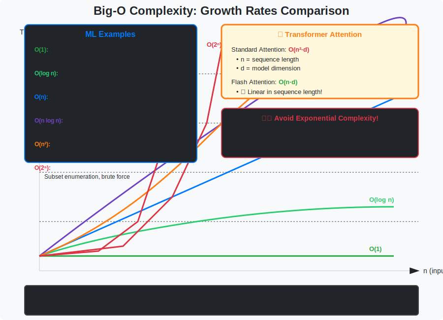
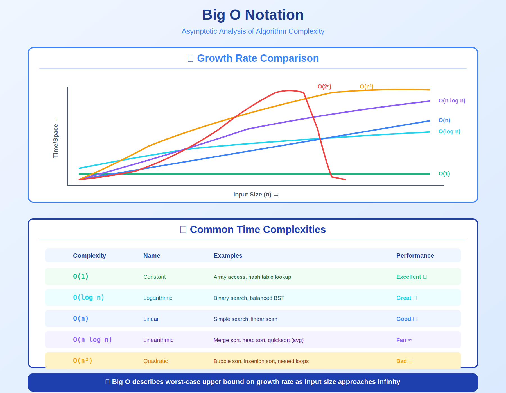

<!-- Animated Header -->
<p align="center">
  
</p>

<p align="center">
  
  
  
</p>


---

**🏠 [Home](../README.md)** · **📚 Series:** [Mathematical Thinking](../01-mathematical-thinking/README.md) → [Proof Techniques](../02-proof-techniques/README.md) → [Set Theory](../03-set-theory/README.md) → [Logic](../04-logic/README.md) → Asymptotic Analysis → [Numerical Computation](../06-numerical-computation/README.md)

---

## 📌 TL;DR

Complexity analysis tells you if your model will scale. This article covers:
- **Big-O Notation** — Upper bounds on growth rate
- **Complexity Hierarchy** — O(1) < O(log n) < O(n) < O(n²) < O(2ⁿ)
- **ML Model Complexity** — Why Transformers are O(n²) and Flash Attention helps

> [!IMPORTANT]
> **Transformers scale quadratically with sequence length!**
> - n=512: 262K operations
> - n=8192: 67M operations (256× more!)
> 
> This is why Flash Attention and linear attention are active research areas.

---

## 📚 What You'll Learn

- [ ] Define and prove Big-O, Big-Ω, Big-Θ bounds
- [ ] Analyze time and space complexity of algorithms
- [ ] Understand Transformer attention complexity
- [ ] Know when Flash Attention helps (and when it doesn't)
- [ ] Compare ML model architectures by complexity

---

## 📑 Table of Contents

- [Visual Overview](#-visual-overview)
- [Complexity Hierarchy](#-complexity-hierarchy)
- [ML Model Complexities](#-ml-model-complexities)
- [Formal Definitions](#-formal-definitions)
- [Computing Complexity](#-computing-complexity)
- [Resources](#-resources)
- [Navigation](#-navigation)

---

## 🎯 Visual Overview



*Caption: Growth rates of common complexity classes. Understanding these is crucial for analyzing ML model efficiency—Transformers are O(n²) in sequence length, which is why Flash Attention and linear attention methods are important research directions.*

### Complexity Comparison


### Complete Big-O Notation Reference



*Caption: Complete reference for Big-O, Big-Ω, Big-Θ, little-o, and little-ω notations with formal definitions.*

---

## 📂 Topics in This Folder

| File | Topic | Application |
|------|-------|-------------|
| [big-o.md](./big-o.md) | O(f(n)) upper bound | Algorithm runtime |

---

## 🎯 Complexity Hierarchy

| Category | Complexity | Example | Operations (n=1000) |
|:--------:|:----------:|:--------|:-------------------:|
| 🚀 **FAST** | O(1) | Hash lookup | 1 |
| 🚀 **FAST** | O(log n) | Binary search | 10 |
| ⚡ **MEDIUM** | O(n) | Array scan | 1,000 |
| ⚡ **MEDIUM** | O(n log n) | Merge sort | 10,000 |
| 🐢 **SLOW** | O(n²) | Attention | 1,000,000 |
| 🐢 **SLOW** | O(n³) | Matrix multiply | 1,000,000,000 |
| 💀 **AVOID** | O(2ⁿ) | Brute force | ∞ |
| 💀 **AVOID** | O(n!) | Permutations | ∞ |

```
Complexity Growth: O(1) < O(log n) < O(n) < O(n log n) < O(n²) < O(n³) < O(2ⁿ) < O(n!)
                   ────────────────────────────────────────────────────────────────────►
                   FAST                          MEDIUM                 SLOW         AVOID
```

### 📊 Visual Complexity Comparison

| n | O(1) | O(log n) | O(n) | O(n²) | O(2ⁿ) |
|:---:|:------:|:-----------:|:------:|:--------:|:--------:|
| 10 | 1 | 3 | 10 | 100 | 1,024 |
| 100 | 1 | 7 | 100 | 10,000 | 🔥 |
| 1,000 | 1 | 10 | 1,000 | 1,000,000 | 💀 |

<!-- Growth Rate Chart -->
<p align="center">
  
</p>

---

## 🌍 ML Model Complexities

| Model | Time Complexity | Space Complexity | Paper |
|-------|:---------------:|:----------------:|:-----:|
| **Transformer** | O(n²d) | O(n²) | [Vaswani 2017](https://arxiv.org/abs/1706.03762) |
| **Flash Attention** | O(n²d) | O(n) 🔥 | [Dao 2022](https://arxiv.org/abs/2205.14135) |
| **Linear Attention** | O(nd²) | O(nd) | [Katharopoulos 2020](https://arxiv.org/abs/2006.16236) |
| **CNN (per layer)** | O(k² · c · h · w) | O(c · h · w) | - |
| **RNN (per step)** | O(h²) | O(h) | - |
| **Matrix Multiply** | O(n³) naive | O(n²) | - |

### Why This Matters

**Transformer with n = sequence length:**

| n | O(n²) Operations | Scaling |
|:---:|:-------------------:|:-------:|
| 512 | 262,144 | 1× |
| 2,048 | 4,194,304 | 16× 📈 |
| 8,192 | 67,108,864 | 256× 🔥 |

> [!IMPORTANT]
> **This is why:**
> - GPT-3 has 2048 token context limit
> - Flash Attention reduces memory from O(n²) to O(n)
> - Linear attention methods are being actively researched

---

## 📐 Formal Definitions

### Big-O (Upper Bound)

> f(n) = O(g(n)) means:
> 
> `∃c > 0, n₀ such that ∀n ≥ n₀: f(n) ≤ c·g(n)`

*"f grows at most as fast as g"*

### Big-Omega (Lower Bound)

> f(n) = Ω(g(n)) means:
> 
> `∃c > 0, n₀ such that ∀n ≥ n₀: f(n) ≥ c·g(n)`

*"f grows at least as fast as g"*

### Big-Theta (Tight Bound)

> f(n) = Θ(g(n)) means:
> 
> `f(n) = O(g(n)) AND f(n) = Ω(g(n))`

*"f grows exactly as fast as g"*

---

## 💻 Computing Complexity

| Complexity | Pattern | How to Recognize |
|:----------:|:--------|:-----------------|
| 🟢 **O(n)** Linear | Single loop | `for x in arr:` |
| 🟡 **O(n²)** Quadratic | Nested loops | `for i: for j:` |
| 🔵 **O(n log n)** | Divide & conquer | Split → Recurse → Merge |

<table>
<tr>
<td width="33%">

**🟢 O(n) - Linear**

```python
def linear_search(arr, target):
    for x in arr:  # n iterations
        if x == target:
            return True
    return False
```

</td>
<td width="33%">

**🟡 O(n²) - Quadratic**

```python
def attention_naive(Q, K, V):
    for i in range(n):    # n
        for j in range(n):  # × n
            scores[i,j] = Q[i]@K[j]
    # Total: O(n²·d)
```

</td>
<td width="33%">

**🔵 O(n log n)**

```python
def merge_sort(arr):
    if len(arr) <= 1:
        return arr
    mid = len(arr) // 2
    left = merge_sort(arr[:mid])
    right = merge_sort(arr[mid:])
    return merge(left, right)
```

</td>
</tr>
</table>

> [!TIP]
> **Master Theorem:** T(n) = 2T(n/2) + O(n) ⟹ O(n log n)

---

## 🔗 Dependency Graph

| From | To | Relationship |
|:-----|:---|:-------------|
| 📐 **Big-O** (upper bound) | → | Big-Θ (tight bound) |
| 📐 **Big-Ω** (lower bound) | → | Big-Θ (tight bound) |
| 📊 **Big-Θ** | → | Time & Space Complexity |
| ⏱️ **Time Complexity** | → | 🤖 Model Analysis |
| 💾 **Space Complexity** | → | 🖥️ GPU Memory |

```
📐 Notation          📊 Analysis           🤖 ML Applications
┌─────────┐         ┌──────────────┐      ┌────────────────┐
│ Big-O   │───┐     │    Time      │─────▶│ Model Analysis │
│ Big-Ω   │───┼────▶│  Complexity  │      └────────────────┘
│ Big-Θ   │◀──┘     │    Space     │─────▶│  GPU Memory    │
└─────────┘         └──────────────┘      └────────────────┘
```

---

## 📚 Resources

| Type | Title | Link |
|------|-------|------|
| 📖 | Introduction to Algorithms (CLRS) | Chapter 3 |
| 🎥 | MIT 6.006 | [YouTube](https://www.youtube.com/watch?v=HtSuA80QTyo) |
| 🇨🇳 | 算法复杂度分析 | 知乎专栏 |


## 🔗 Where This Topic Is Used

| Application | Usage |
|-------------|-------|
| **Machine Learning** | Core concept for ML systems |
| **Deep Learning** | Foundation for neural networks |
| **Research** | Important for understanding papers |

---

## 🧭 Navigation

<table width="100%">
<tr>
<td align="left" width="33%">

⬅️ **Previous**<br>
[🔀 Logic](../04-logic/README.md)

</td>
<td align="center" width="34%">

📍 **Current: 5 of 6**<br>
**Asymptotic Analysis**

</td>
<td align="right" width="33%">

➡️ **Next**<br>
[🔢 Numerical Computation](../06-numerical-computation/README.md)

</td>
</tr>
</table>

---

<!-- Animated Footer -->

---


<p align="center">
  
</p>
