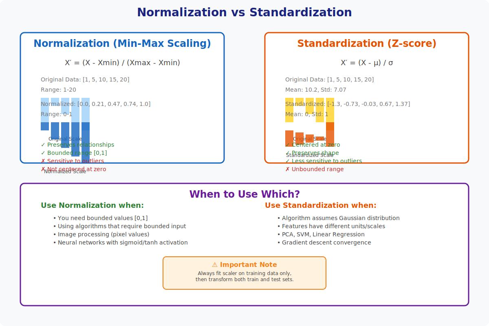

<!-- Animated Header -->
<p align="center">
  
</p>

<p align="center">
  
  
</p>

---


# 📊 Data Preprocessing

> **Preparing data for machine learning models**

---

## 🎯 Visual Overview



*Caption: Data preprocessing transforms raw data into a format suitable for ML models. Key techniques include normalization, standardization, and feature scaling.*

---

## 📐 Mathematical Foundations

### Standardization (Z-Score)
```
z = (x - μ) / σ

Where:
• μ = mean of feature
• σ = standard deviation

Result: Mean = 0, Std = 1
```

### Min-Max Normalization
```
x_norm = (x - x_min) / (x_max - x_min)

Result: Values in [0, 1]

Scaling to [a, b]:
x_scaled = a + (x - x_min)(b - a) / (x_max - x_min)
```

### Robust Scaling
```
x_robust = (x - median) / IQR

Where:
• IQR = Q3 - Q1 (Interquartile Range)

Benefit: Robust to outliers
```

---

## 🎯 Key Techniques

| Technique | Formula | When to Use |
|-----------|---------|-------------|
| **Standardization** | (x - μ) / σ | Gaussian-like data, most algorithms |
| **Min-Max** | (x - min) / (max - min) | Neural networks, bounded data |
| **Robust** | (x - median) / IQR | Data with outliers |
| **Log Transform** | log(x + 1) | Right-skewed data |
| **Power Transform** | Box-Cox, Yeo-Johnson | Non-normal distributions |

---

## 💻 Code Examples

```python
import numpy as np
from sklearn.preprocessing import StandardScaler, MinMaxScaler, RobustScaler
import torch

# Sample data
X = np.array([[1, 2], [3, 4], [5, 6], [100, 200]])

# Standardization
scaler_std = StandardScaler()
X_std = scaler_std.fit_transform(X)
print(f"Standardized mean: {X_std.mean(axis=0)}")  # ~0
print(f"Standardized std: {X_std.std(axis=0)}")    # ~1

# Min-Max Normalization
scaler_mm = MinMaxScaler()
X_mm = scaler_mm.fit_transform(X)
print(f"Min-Max range: [{X_mm.min()}, {X_mm.max()}]")  # [0, 1]

# Robust Scaling (handles outliers)
scaler_robust = RobustScaler()
X_robust = scaler_robust.fit_transform(X)

# PyTorch BatchNorm (during training)
batch_norm = torch.nn.BatchNorm1d(num_features=2)
X_tensor = torch.tensor(X, dtype=torch.float32)
X_bn = batch_norm(X_tensor)

# Manual standardization
def standardize(X):
    mean = X.mean(axis=0)
    std = X.std(axis=0)
    return (X - mean) / (std + 1e-8)  # epsilon for stability

# One-hot encoding
def one_hot(labels, num_classes):
    return np.eye(num_classes)[labels]

labels = np.array([0, 2, 1, 0])
one_hot_encoded = one_hot(labels, num_classes=3)
```

---

## 🌍 ML Applications

| Application | Preprocessing | Why |
|-------------|---------------|-----|
| **Neural Networks** | Standardization/Min-Max | Faster convergence |
| **SVM** | Standardization | Distance-based |
| **Tree-based** | Often none needed | Scale invariant |
| **Image Data** | /255 normalization | Pixel values to [0,1] |
| **NLP** | Tokenization, embedding | Text to numbers |

---

## 📊 Comparison

| Method | Outlier Sensitive | Range | Best For |
|--------|-------------------|-------|----------|
| **Standardization** | Yes | Unbounded | General use |
| **Min-Max** | Very sensitive | [0, 1] | Neural networks |
| **Robust** | No | Unbounded | Outlier-heavy data |
| **Log** | N/A | Unbounded | Skewed distributions |

---

## 📚 References

| Type | Title | Link |
|------|-------|------|
| 📖 | Scikit-learn Preprocessing | [Docs](https://scikit-learn.org/stable/modules/preprocessing.html) |
| 📖 | Feature Engineering Book | [Book](https://www.oreilly.com/library/view/feature-engineering-for/9781491953235/) |
| 🎥 | Data Preprocessing Tutorial | [YouTube](https://www.youtube.com/watch?v=5HNj4iCgoNQ) |
| 🇨🇳 | 数据预处理详解 | [知乎](https://zhuanlan.zhihu.com/p/26306568) |
| 🇨🇳 | 特征工程技巧 | [CSDN](https://blog.csdn.net/qq_37466121/article/details/88766789) |

---

## 🔗 Where This Topic Is Used

| Application | How Preprocessing Is Used |
|-------------|--------------------------|
| **Training Deep Learning Models** | Normalize inputs for stable training |
| **Computer Vision** | Image normalization (ImageNet stats) |
| **NLP** | Tokenization, normalization |
| **Tabular Data** | Feature scaling, encoding |
| **Time Series** | Differencing, scaling |

---

⬅️ [Back: 05-Asymptotic Analysis](../05-asymptotic-analysis/) | ➡️ [Next: 06-Numerical Computation](../06-numerical-computation/)

---

<p align="center">
  
</p>

