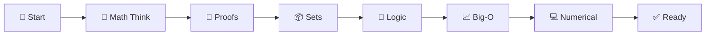
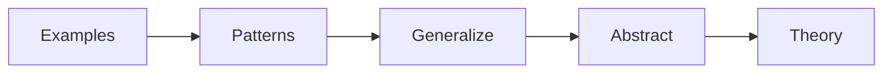
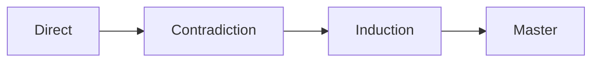
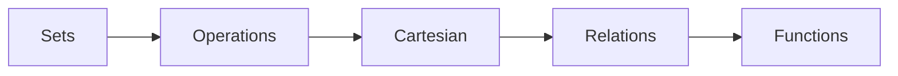
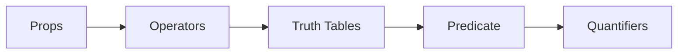
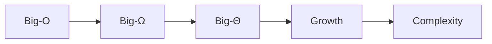
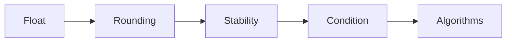
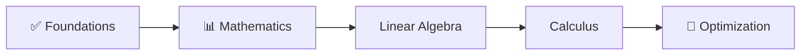

  

  
  
  

  
  

---

**✍️ Author:** [Gaurav Goswami](https://github.com/Gaurav14cs17) • **📅 Updated:** December 2024

---

## 📊 Learning Path

## 🎯 What You'll Learn

> 💡 This section builds the **essential thinking skills** needed for machine learning research.

<table>
<tr>
<td>

### 🧠 Think Like a Mathematician
- Abstract reasoning
- Pattern recognition
- Rigorous proofs

</td>
<td>

### 📊 Analyze Algorithms
- Time complexity
- Space complexity
- Scalability

</td>
<td>

### 💻 Numerical Stability
- Floating point errors
- Conditioning
- Stable algorithms

</td>
</tr>
</table>

---

## 📚 Topics

### 1️⃣ Mathematical Thinking

 

| What | Why | Topics |
|------|-----|--------|
| Think like a mathematician | ML requires abstract reasoning | Abstraction, necessary vs sufficient |

---

### 2️⃣ Proof Techniques

 

| What | Why | Topics |
|------|-----|--------|
| Prove statements rigorously | Research papers contain proofs | Direct, contradiction, induction |

---

### 3️⃣ Set Theory

 

| What | Why | Topics |
|------|-----|--------|
| Foundation of math | Probability spaces, domains | Sets, operations, products |

---

### 4️⃣ Logic

 

| What | Why | Topics |
|------|-----|--------|
| Formal reasoning | Algorithms, proofs, ML theory | AND, OR, NOT, implication |

---

### 5️⃣ Asymptotic Analysis

 

| What | Why | Topics |
|------|-----|--------|
| Analyze complexity | O(n²) attention vs O(n) FlashAttention | Big-O, Big-Ω, Big-Θ |

---

### 6️⃣ Numerical Computation

 

| What | Why | Topics |
|------|-----|--------|
| Computer arithmetic | Avoid training instability | Floating point, stability |

---

## 🎯 Learning Outcomes

After completing this section:

- [x] ✅ Think abstractly about mathematical concepts
- [x] ✅ Read and understand mathematical proofs
- [x] ✅ Analyze algorithm complexity
- [x] ✅ Recognize numerical stability issues
- [x] ✅ Use set theory and logic notation

---

## 🔗 Next Steps

  

---

## 📚 Key Resources

| Type | Resource | Link |
|:----:|----------|------|
| 🎬 | How to Think Like a Mathematician | MIT OpenCourseWare |
| 📘 | How to Prove It | Daniel Velleman |
| 🎓 | Introduction to Proofs | Coursera |

---

## 🗺️ Quick Navigation

| Previous | Current | Next |
|:--------:|:-------:|:----:|
| [🏠 Home](../README.md) | **📐 Foundations** | [📊 Mathematics →](../02-mathematics/README.md) |

---

  

