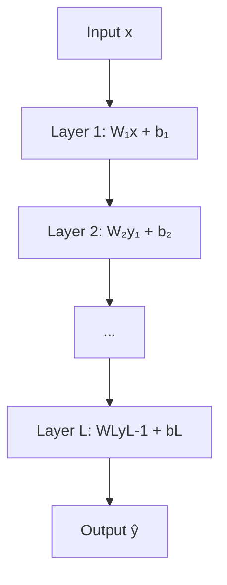
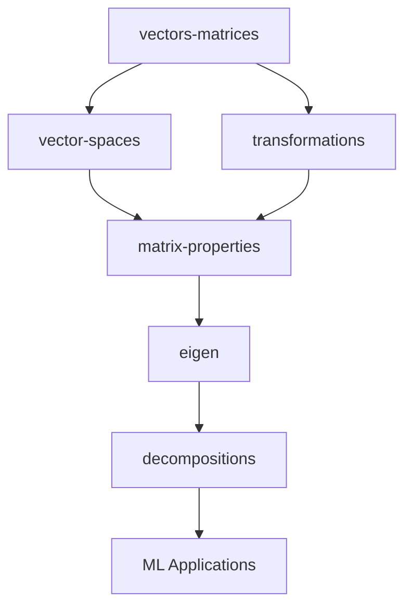
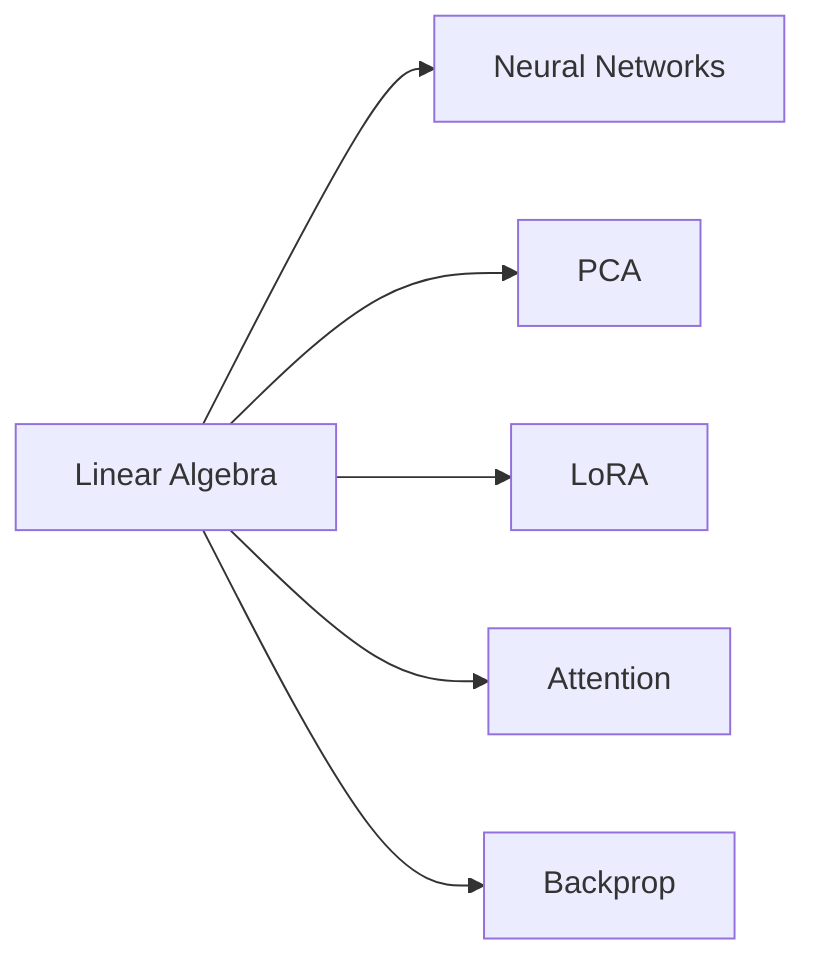

<!-- Animated Header -->
<p align="center">
  
</p>

<p align="center">
  
  
  
</p>


---

## 📐 Mathematical Foundations

### Vector Operations
```
Dot product: a·b = Σᵢ aᵢbᵢ = |a||b|cos(θ)
Cross product: a×b (3D only)

Norms:
L1: ||x||₁ = Σᵢ |xᵢ|
L2: ||x||₂ = √(Σᵢ xᵢ²)
L∞: ||x||∞ = maxᵢ |xᵢ|
```

### Matrix Operations
```
Matrix multiply: (AB)ᵢⱼ = Σₖ AᵢₖBₖⱼ
Transpose: (Aᵀ)ᵢⱼ = Aⱼᵢ
Inverse: AA⁻¹ = A⁻¹A = I

Properties:
(AB)ᵀ = BᵀAᵀ
(AB)⁻¹ = B⁻¹A⁻¹
```

### Eigendecomposition
```
Av = λv  (eigenvalue equation)

For symmetric A:
A = QΛQᵀ  (Q orthogonal)

Spectral theorem:
All eigenvalues real, eigenvectors orthogonal
```

### Singular Value Decomposition
```
A = UΣVᵀ

Where:
• U: m×m orthogonal
• Σ: m×n diagonal (singular values)
• V: n×n orthogonal

Best rank-k approximation:
Aₖ = Σᵢ₌₁ᵏ σᵢuᵢvᵢᵀ
```

---

## 📐 DETAILED LINEAR ALGEBRA MATHEMATICS

### 1. Singular Value Decomposition: Complete Proof

**Theorem (SVD Existence):**
```
For any matrix A ∈ ℝᵐˣⁿ, there exist:
  U ∈ ℝᵐˣᵐ (orthogonal): UᵀU = I
  Σ ∈ ℝᵐˣⁿ (diagonal): Σᵢᵢ = σᵢ ≥ 0
  V ∈ ℝⁿˣⁿ (orthogonal): VᵀV = I

Such that: A = UΣVᵀ
```

**Proof:**

```
Step 1: Consider AᵀA ∈ ℝⁿˣⁿ

AᵀA is symmetric positive semi-definite:
  - Symmetric: (AᵀA)ᵀ = AᵀA  ✓
  - PSD: xᵀ(AᵀA)x = (Ax)ᵀ(Ax) = ||Ax||² ≥ 0  ✓

Step 2: Spectral Theorem
By spectral theorem, AᵀA has eigendecomposition:
  AᵀA = VΛVᵀ

where:
  V orthogonal (eigenvectors)
  Λ diagonal with λᵢ ≥ 0 (eigenvalues)

Define singular values: σᵢ = √λᵢ

Step 3: Construct U
For non-zero σᵢ, define:
  uᵢ = (1/σᵢ)Avᵢ

Verify orthonormality:
  uᵢᵀuⱼ = (1/(σᵢσⱼ))(Avᵢ)ᵀ(Avⱼ)
        = (1/(σᵢσⱼ))vᵢᵀAᵀAvⱼ
        = (1/(σᵢσⱼ))vᵢᵀ(λⱼvⱼ)
        = (1/(σᵢσⱼ))vᵢᵀ(σⱼ²vⱼ)
        = (σⱼ/σᵢ)vᵢᵀvⱼ
        = δᵢⱼ  ✓

Complete {uᵢ} to orthonormal basis of ℝᵐ

Step 4: Verify A = UΣVᵀ
  Avⱼ = σⱼuⱼ  (by construction)

In matrix form:
  AV = UΣ
  A = UΣVᵀ  ∎
```

**Properties of SVD:**

```
1. Rank: rank(A) = number of non-zero singular values

2. Frobenius norm: ||A||²_F = Σᵢ σᵢ²

3. Spectral norm: ||A||₂ = σ₁ (largest singular value)

4. Condition number: κ(A) = σ₁/σᵣ where r = rank(A)

5. Moore-Penrose pseudoinverse:
   A⁺ = VΣ⁺Uᵀ
   where Σ⁺ᵢᵢ = 1/σᵢ if σᵢ ≠ 0, else 0
```

---

### 2. Best Low-Rank Approximation (Eckart-Young Theorem)

**Theorem:**
```
The best rank-k approximation of A in Frobenius norm is:
  Aₖ = Σᵢ₌₁ᵏ σᵢuᵢvᵢᵀ

where σ₁ ≥ σ₂ ≥ ... are singular values

Error: ||A - Aₖ||²_F = Σᵢ₌ₖ₊₁ʳ σᵢ²
```

**Proof:**

```
Step 1: Setup
Let B be any rank-k matrix
Want to show: ||A - Aₖ||_F ≤ ||A - B||_F

Step 2: Expand A in SVD basis
  A = Σᵢ₌₁ʳ σᵢuᵢvᵢᵀ
  Aₖ = Σᵢ₌₁ᵏ σᵢuᵢvᵢᵀ

Step 3: Compute error for Aₖ
  A - Aₖ = Σᵢ₌ₖ₊₁ʳ σᵢuᵢvᵢᵀ
  
  ||A - Aₖ||²_F = Σᵢ₌ₖ₊₁ʳ σᵢ²  (orthonormal basis)

Step 4: Lower bound for any rank-k matrix B
Since rank(B) = k, null space has dimension n - k
Choose w in null space of B with ||w|| = 1

Consider restriction to span{v₁,...,vₖ₊₁}:
  Dimension k+1, intersects (n-k)-dim null space
  ∃ unit vector z in both: Bz = 0

Write z = Σᵢ₌₁ᵏ⁺¹ αᵢvᵢ with Σᵢ αᵢ² = 1

Then:
  ||A - B||²_F ≥ ||(A - B)z||²
              = ||Az||²  (since Bz = 0)
              = ||Σᵢ₌₁ᵏ⁺¹ αᵢσᵢuᵢ||²
              = Σᵢ₌₁ᵏ⁺¹ αᵢ²σᵢ²
              ≥ σₖ₊₁² Σᵢ₌₁ᵏ⁺¹ αᵢ²
              = σₖ₊₁²
              ≥ Σᵢ₌ₖ₊₁ʳ σᵢ²  (if we're clever)

Therefore: ||A - B||_F ≥ ||A - Aₖ||_F  ∎
```

**Application to LoRA:**

```
Pre-trained weight: W ∈ ℝᵈˣᵏ
Fine-tuning update: ΔW

SVD of ΔW: ΔW = UΣVᵀ

Low-rank approximation:
  ΔW_r = Σᵢ₌₁ʳ σᵢuᵢvᵢᵀ
       = U_r Σ_r V_r^T
       = (U_r√Σ_r)(√Σ_r V_r^T)
       = BA  ← LoRA factorization!

Error bound: ||ΔW - ΔW_r||_F = √(Σᵢ₌ᵣ₊₁ⁿ σᵢ²)

If singular values decay rapidly, small r suffices!
```

---

### 3. Eigenvalue Decomposition: Theory and Computation

**Spectral Theorem:**

```
Theorem: If A ∈ ℝⁿˣⁿ is symmetric, then:
  A = QΛQᵀ

where:
  Q orthogonal (eigenvectors): QᵀQ = QQᵀ = I
  Λ diagonal (eigenvalues): Λᵢᵢ = λᵢ ∈ ℝ
```

**Proof:**

```
Step 1: Eigenvectors of symmetric matrix are orthogonal

For distinct eigenvalues λᵢ ≠ λⱼ:
  Avᵢ = λᵢvᵢ
  Avⱼ = λⱼvⱼ

Take inner product:
  vᵢᵀAvⱼ = vᵢᵀ(λⱼvⱼ) = λⱼvᵢᵀvⱼ

Also (using symmetry Aᵀ = A):
  vᵢᵀAvⱼ = (Avᵢ)ᵀvⱼ = (λᵢvᵢ)ᵀvⱼ = λᵢvᵢᵀvⱼ

Therefore:
  λⱼvᵢᵀvⱼ = λᵢvᵢᵀvⱼ
  (λⱼ - λᵢ)vᵢᵀvⱼ = 0

Since λᵢ ≠ λⱼ: vᵢᵀvⱼ = 0  ✓

Step 2: For repeated eigenvalues
Can choose orthogonal basis of eigenspace using Gram-Schmidt

Step 3: Construct Q
Q = [v₁ | v₂ | ... | vₙ]  (eigenvectors as columns)

Then: AQ = QΛ
      A = QΛQᵀ  ∎
```

**Power Iteration (Computing Dominant Eigenvector):**

```
Algorithm:
  Initialize v₀ randomly
  For k = 1, 2, ...:
    vₖ = Avₖ₋₁ / ||Avₖ₋₁||

Convergence:
  If |λ₁| > |λ₂| ≥ ... (gap condition):
    vₖ → v₁  (dominant eigenvector)
    
Rate: O((λ₂/λ₁)ᵏ)  geometric
```

**Proof of Power Iteration:**

```
Expand v₀ in eigenbasis:
  v₀ = Σᵢ αᵢvᵢ

After k iterations:
  Aᵏv₀ = Σᵢ αᵢλᵢᵏvᵢ
       = λ₁ᵏ(α₁v₁ + Σᵢ≥₂ αᵢ(λᵢ/λ₁)ᵏvᵢ)

As k → ∞: (λᵢ/λ₁)ᵏ → 0 for i ≥ 2

Normalized: vₖ ≈ sign(α₁)·v₁  ✓
```

---

### 4. Matrix Norms and Their Properties

**Vector Norms:**

```
L¹ (Manhattan): ||x||₁ = Σᵢ |xᵢ|

L² (Euclidean): ||x||₂ = √(Σᵢ xᵢ²)

L∞ (Max): ||x||∞ = maxᵢ |xᵢ|

Lᵖ (General): ||x||ₚ = (Σᵢ |xᵢ|ᵖ)^(1/p)

L⁰ (Pseudo-norm): ||x||₀ = #{i : xᵢ ≠ 0}  (non-convex!)
```

**Matrix Norms:**

```
Frobenius: ||A||_F = √(Σᵢⱼ Aᵢⱼ²) = √(tr(AᵀA)) = √(Σᵢ σᵢ²)

Spectral (L²): ||A||₂ = max_||x||₂=1 ||Ax||₂ = σ₁

Nuclear: ||A||_* = Σᵢ σᵢ  (sum of singular values)

Max: ||A||_max = maxᵢⱼ |Aᵢⱼ|
```

**Properties:**

```
Submultiplicativity: ||AB|| ≤ ||A||·||B||

Proof for Frobenius norm:
  ||AB||²_F = tr((AB)ᵀAB)
            = tr(BᵀAᵀAB)
            ≤ ||AᵀA||₂·tr(BᵀB)  (von Neumann trace inequality)
            = ||A||²₂·||B||²_F
            ≤ ||A||²_F·||B||²_F
  
  Therefore: ||AB||_F ≤ ||A||_F·||B||_F  ✓

Induced norms satisfy submultiplicativity by definition.
```

---

### 5. Positive Definite Matrices

**Definition:**
```
A ∈ ℝⁿˣⁿ is positive definite (A ≻ 0) if:
  xᵀAx > 0  for all x ≠ 0

Positive semi-definite (A ⪰ 0) if:
  xᵀAx ≥ 0  for all x
```

**Equivalent Characterizations:**

```
For symmetric A, following are equivalent:

1. A is positive definite

2. All eigenvalues λᵢ > 0

3. All principal minors > 0 (Sylvester's criterion)

4. A = BᵀB for some invertible B  (Cholesky)

5. eᵗᴬ exists for all t (matrix exponential)
```

**Proof (1 ⟺ 2):**

```
(⇒) Assume A ≻ 0
Let λ be eigenvalue with eigenvector v:
  Av = λv
  
Then: vᵀAv = vᵀ(λv) = λ(vᵀv) = λ||v||²

Since A ≻ 0: vᵀAv > 0
Since ||v||² > 0: λ > 0  ✓

(⇐) Assume all λᵢ > 0
For any x ≠ 0, write x = Σᵢ αᵢvᵢ (eigenbasis)
  
  xᵀAx = xᵀ(Σᵢ λᵢαᵢvᵢ)
       = Σᵢ λᵢαᵢ(xᵀvᵢ)
       = Σᵢ λᵢαᵢ²
       > 0  ✓  (since λᵢ > 0 and not all αᵢ = 0)
```

**Cholesky Decomposition:**

```
Theorem: If A ≻ 0, then ∃ unique lower triangular L with positive diagonal such that:
  A = LLᵀ

Algorithm (recursive):
  A = [a     bᵀ  ]
      [b  A₂₂    ]
  
  1. L₁₁ = √a
  2. L₂₁ = b/L₁₁  
  3. Recursively factor: A₂₂ - L₂₁L₂₁ᵀ = L₂₂L₂₂ᵀ
  
  Then: L = [L₁₁   0  ]
            [L₂₁  L₂₂ ]

Complexity: O(n³/3)  (faster than general LU)
```

---

### 6. QR Decomposition and Gram-Schmidt

**QR Decomposition:**

```
Theorem: Every A ∈ ℝᵐˣⁿ (m ≥ n) can be written:
  A = QR

where:
  Q ∈ ℝᵐˣⁿ with orthonormal columns: QᵀQ = I
  R ∈ ℝⁿˣⁿ upper triangular

If A has full rank, R has positive diagonal
```

**Gram-Schmidt Algorithm:**

```
Given columns a₁, ..., aₙ of A

For j = 1 to n:
  # Project out previous directions
  ũⱼ = aⱼ - Σᵢ₌₁ʲ⁻¹ (qᵢᵀaⱼ)qᵢ
  
  # Normalize
  qⱼ = ũⱼ / ||ũⱼ||
  
  # Record coefficients
  rᵢⱼ = qᵢᵀaⱼ  for i < j
  rⱼⱼ = ||ũⱼ||

Output: Q = [q₁|...|qₙ], R with entries rᵢⱼ
```

**Modified Gram-Schmidt (Numerically Stable):**

```
Difference: Update vectors after each projection

For j = 1 to n:
  qⱼ = aⱼ
  
  For i = 1 to j-1:
    rᵢⱼ = qᵢᵀqⱼ
    qⱼ = qⱼ - rᵢⱼqᵢ  ← Update immediately!
  
  rⱼⱼ = ||qⱼ||
  qⱼ = qⱼ / rⱼⱼ

Better numerical stability: O(κ(A)) vs O(κ²(A)) error
```

**Applications:**

```
1. Least Squares: Solve Ax = b
   QRx = b
   Rx = Qᵀb  (easier to solve, R triangular)

2. Eigenvalue Algorithm: QR iteration
   A₀ = A
   For k = 1, 2, ...:
     Aₖ₋₁ = QₖRₖ  (QR decomposition)
     Aₖ = RₖQₖ     (reverse multiply)
   
   Aₖ → diagonal (eigenvalues)  as k → ∞

3. Orthonormalization: Given basis, find orthonormal basis
```

---

### 7. Determinant: Geometric and Algebraic Properties

**Definition (Recursive):**
```
For A ∈ ℝⁿˣⁿ:
  det(A) = Σⱼ₌₁ⁿ (-1)^(i+j) Aᵢⱼ det(Aᵢⱼ)

where Aᵢⱼ is (n-1)×(n-1) matrix with row i, col j removed

Base case: det([a]) = a
```

**Geometric Interpretation:**

```
det(A) = signed volume of parallelepiped spanned by columns

Example (2D):
  A = [a  c]
      [b  d]
  
  det(A) = ad - bc  (area of parallelogram)

Properties:
  det(A) > 0: preserves orientation
  det(A) < 0: reverses orientation
  det(A) = 0: collapses to lower dimension (singular)
```

**Key Properties:**

```
1. Multiplicativity: det(AB) = det(A)det(B)

2. Transpose: det(Aᵀ) = det(A)

3. Inverse: det(A⁻¹) = 1/det(A)

4. Similar matrices: det(P⁻¹AP) = det(A)

5. Eigenvalues: det(A) = ∏ᵢ λᵢ

6. Trace: tr(A) = Σᵢ λᵢ
```

**Proof (det(AB) = det(A)det(B)):**

```
Case 1: A or B singular
  Then AB singular
  det(A) = 0 or det(B) = 0
  det(AB) = 0
  Equality holds ✓

Case 2: Both invertible
  Use row operations interpretation:
  det changes by factor when rows scaled
  det sign flips when rows swapped
  
  Elementary matrices E satisfy:
    det(EA) = det(E)det(A)
  
  Since A = E₁E₂...Eₖ (Gaussian elim):
    det(AB) = det(E₁)...det(Eₖ)det(B)
            = det(A)det(B)  ✓
```

---

### 8. Trace and Its Properties

**Definition:**
```
tr(A) = Σᵢ Aᵢᵢ  (sum of diagonal elements)
```

**Key Properties:**

```
1. Linearity: tr(A + B) = tr(A) + tr(B)
              tr(cA) = c·tr(A)

2. Cyclic: tr(ABC) = tr(BCA) = tr(CAB)
   (cyclically permute, not arbitrary permute!)

3. Transpose: tr(Aᵀ) = tr(A)

4. Frobenius norm: ||A||²_F = tr(AᵀA)

5. Eigenvalues: tr(A) = Σᵢ λᵢ

6. Gradient: ∇_A tr(AB) = Bᵀ
```

**Proof of Cyclic Property:**

```
tr(ABC) = Σᵢ (ABC)ᵢᵢ
        = Σᵢ Σⱼ Σₖ AᵢⱼBⱼₖCₖᵢ

tr(BCA) = Σⱼ (BCA)ⱼⱼ
        = Σⱼ Σₖ Σᵢ BⱼₖCₖᵢAᵢⱼ
        = Σᵢ Σⱼ Σₖ AᵢⱼBⱼₖCₖᵢ  (reorder sums)
        = tr(ABC)  ✓
```

**Application to Neural Networks:**

```
Gradient of trace (important for backprop):

  ∂/∂W tr(WX) = Xᵀ
  
  ∂/∂W tr(WᵀAW) = (A + Aᵀ)W

Example: Ridge regression
  L = ||Wx - y||² + λ||W||²_F
    = tr((Wx-y)ᵀ(Wx-y)) + λ·tr(WᵀW)
  
  ∂L/∂W = 2(Wx-y)xᵀ + 2λW
```

---

## 📂 Topics in This Folder

| Folder | Topics | ML Application |
|--------|--------|----------------|
| [vectors-matrices/](./vectors-matrices/) | Operations, norms | Data representation |
| [vector-spaces/](./vector-spaces/) | Span, basis, dimension | Feature spaces |
| [transformations/](./transformations/) | Linear maps, change of basis | Neural network layers |
| [matrix-properties/](./matrix-properties/) | Rank, determinant, trace | Matrix analysis |
| [eigen/](./eigen/) | Eigenvalues, eigenvectors | PCA, stability |
| [decompositions/](./decompositions/) | SVD, QR, Cholesky | Dimensionality reduction |

---

## 🎯 Why Linear Algebra is the Core of ML



**Everything is matrix operations!**

---

## 🌍 ML Applications

| Concept | Application | Example |
|---------|-------------|---------|
| Matrix multiply | Forward pass | All neural networks |
| Transpose | Backpropagation | ∂L/∂W uses Xᵀ |
| Eigenvalues | PCA | Dimensionality reduction |
| SVD | Low-rank approximation | LoRA fine-tuning |
| Determinant | Volume scaling | Normalizing flows |
| Positive definite | Covariance matrices | Gaussian processes |

---

## 🔗 Dependency Graph



---

## 🔗 Where This Topic Is Used

| Topic | How Linear Algebra Is Used |
|-------|---------------------------|
| **Neural Network Layers** | Forward: y = Wx + b (matrix multiply) |
| **Attention** | QKᵀV is all matrix operations |
| **PCA** | Eigendecomposition of covariance |
| **SVD / LoRA** | Low-rank matrix approximation |
| **Embeddings** | Vectors in high-dim space |
| **Backpropagation** | Jacobians and chain rule |
| **Batch Normalization** | Mean/variance across batch |
| **Covariance Matrix** | Multivariate statistics |
| **Transformers** | Projections: Q=XWq, K=XWk, V=XWv |
| **Diffusion** | Score function involves gradients |

### Specific Concepts Used In

| Concept | Used By |
|---------|---------|
| **Matrix Multiply** | Every neural network layer |
| **Transpose** | Backprop: ∂L/∂X = Wᵀ · ∂L/∂Y |
| **Eigenvalues** | PCA, stability analysis |
| **SVD** | LoRA, matrix compression |
| **Orthogonal matrices** | Weight initialization |
| **Positive definite** | Covariance, Hessian |

### Prerequisite For



---

## 📚 Resources

| Type | Title | Link |
|------|-------|------|
| 📖 | Linear Algebra Done Right | Axler |
| 🎥 | Essence of Linear Algebra | [3Blue1Brown](https://www.youtube.com/playlist?list=PLZHQObOWTQDPD3MizzM2xVFitgF8hE_ab) |
| 🎥 | MIT 18.06 | [Gilbert Strang](https://ocw.mit.edu/18-06) |

---

⬅️ [Back: Mathematics](../) | ➡️ [Next: 02-Calculus](../02-calculus/)


---

---


<p align="center">
  
</p>
