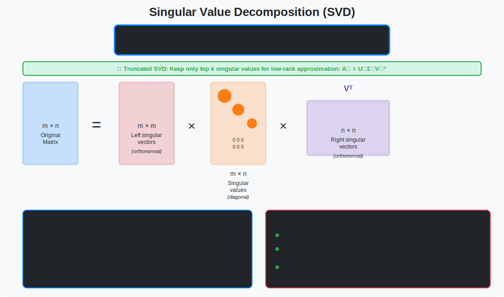

<!-- Animated Header -->
<p align="center">
  
</p>

<p align="center">
  
  
</p>

---


# Matrix Decompositions

> **Breaking matrices into useful factors**

---

## 🎯 Visual Overview



*Caption: Singular Value Decomposition (SVD) breaks any matrix A into three components: U (left singular vectors), Σ (singular values), and Vᵀ (right singular vectors). This is the most important decomposition in ML, used for PCA, LoRA, recommendation systems, and model compression.*

---

## 📂 Topics in This Folder

| File | Decomposition | Application |
|------|---------------|-------------|
| [svd.md](./svd.md) | A = UΣVᵀ | 🔥 Everything! LoRA, compression |
| [qr.md](./qr.md) | A = QR | Least squares, stability |

---

## 📐 Mathematical Foundations

### Eigendecomposition
```
For square matrix A:
Av = λv  (eigenvalue equation)
A = VΛV⁻¹

Where:
• V = [v₁|v₂|...|vₙ]  (eigenvectors as columns)
• Λ = diag(λ₁, λ₂, ..., λₙ)
• Symmetric A: V is orthogonal, λᵢ ∈ ℝ
```

### SVD (Singular Value Decomposition)
```
For ANY m×n matrix A:
A = UΣVᵀ

Properties:
• U: m×m orthogonal (UᵀU = I)
• Σ: m×n diagonal (σ₁ ≥ σ₂ ≥ ... ≥ 0)
• V: n×n orthogonal (VᵀV = I)

Rank-k approximation (Eckart-Young):
A_k = argmin_{rank(B)≤k} ||A - B||_F
    = Σᵢ₌₁ᵏ σᵢ uᵢ vᵢᵀ
```

### Cholesky Decomposition
```
For symmetric positive definite A:
A = LLᵀ  (or A = UᵀU)

Where L is lower triangular
• Exists iff A is PD
• Faster than LU: O(n³/3)
• Numerically stable
```

### QR Decomposition
```
For m×n matrix A (m ≥ n):
A = QR

Where:
• Q: m×m orthogonal
• R: m×n upper triangular

Applications:
• Least squares: Ax = b → Rx = Qᵀb
• Gram-Schmidt orthogonalization
• Eigenvalue algorithms (QR iteration)
```

---

## 🎯 When to Use What

| Decomposition | Requirements | Time | Use Case |
|---------------|--------------|------|----------|
| **Eigen** | Square matrix | O(n³) | Symmetric matrices, PCA |
| **SVD** | Any matrix | O(mn·min(m,n)) | 🔥 General purpose, most useful |
| **QR** | Any matrix | O(mn²) | Numerical stability |
| **Cholesky** | Symmetric PD | O(n³/3) | Fast for PD matrices |
| **LU** | Square matrix | O(n³) | Solving Ax = b |

---

## 🔥 SVD: The Most Important Decomposition

```
A = UΣVᵀ

Where:
• A is m × n (any matrix!)
• U is m × m orthogonal (left singular vectors)
• Σ is m × n diagonal (singular values σ₁ ≥ σ₂ ≥ ... ≥ 0)
• Vᵀ is n × n orthogonal (right singular vectors)

Low-rank approximation:
A_k = Σᵢ₌₁ᵏ σᵢ uᵢ vᵢᵀ   (best rank-k approximation!)
```

---

## 🌍 ML Applications

| Decomposition | Application | Example |
|---------------|-------------|---------|
| SVD | LoRA fine-tuning | Low-rank weight updates |
| SVD | Recommendation | Netflix matrix factorization |
| SVD | Compression | Image/weight compression |
| Eigen | PCA | Dimensionality reduction |
| Cholesky | GP regression | Covariance matrix inverse |
| QR | Linear regression | Stable least squares |

---

## 💻 Code Examples

```python
import numpy as np

A = np.random.randn(100, 50)

# SVD (most used!)
U, S, Vt = np.linalg.svd(A, full_matrices=False)
# Reconstruct: A = U @ np.diag(S) @ Vt

# Low-rank approximation (LoRA-style)
k = 10
A_lowrank = U[:, :k] @ np.diag(S[:k]) @ Vt[:k, :]

# Eigendecomposition (square matrices)
B = A.T @ A  # Make it square and symmetric
eigenvalues, eigenvectors = np.linalg.eigh(B)

# QR decomposition
Q, R = np.linalg.qr(A)

# Cholesky (positive definite)
C = A.T @ A + 0.01 * np.eye(50)  # Make PD
L = np.linalg.cholesky(C)
```

---

## 📚 Resources

| Type | Title | Link |
|------|-------|------|
| 📖 | Matrix Computations | Golub & Van Loan |
| 📄 | LoRA Paper | [arXiv](https://arxiv.org/abs/2106.09685) |

---

## 🔗 Where SVD Is Used

| Application | How SVD Is Applied |
|-------------|-------------------|
| **PCA** | Alternative to eigen-decomposition (more stable) |
| **LoRA Fine-tuning** | Low-rank weight updates: ΔW = BA |
| **Image Compression** | Keep top-k singular values |
| **Recommender Systems** | Matrix factorization (Netflix Prize) |
| **Latent Semantic Analysis** | Topic modeling in NLP |
| **Pseudoinverse** | A⁺ = VΣ⁺Uᵀ for least squares |
| **Denoising** | Remove small singular values = noise |
| **Model Compression** | Approximate weight matrices with low-rank |

---


⬅️ [Back: Linear Algebra](../)

---

➡️ [Next: Eigen](../eigen/)

---

<p align="center">
  
</p>
