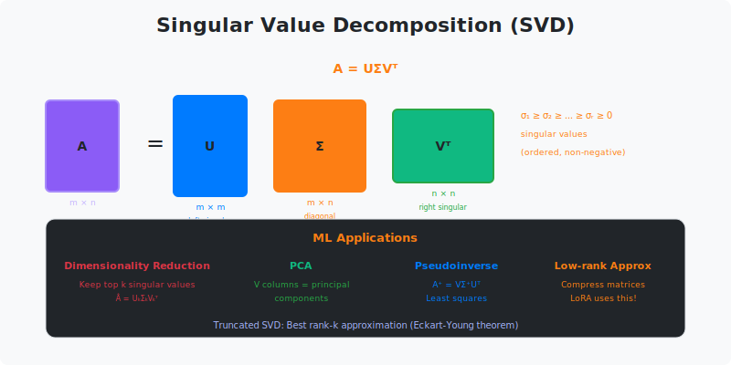

# Singular Value Decomposition (SVD)

> **The most important matrix decomposition in ML**

---

## 🎯 Visual Overview



*Caption: SVD decomposes any matrix A into three matrices: U (left singular vectors), Σ (diagonal singular values), and Vᵀ (right singular vectors). Truncating to top-k singular values gives the best rank-k approximation - this is the foundation of LoRA, PCA, and matrix compression.*

---

## 🎯 What is SVD?

Any matrix A (m × n) can be decomposed as:

```
A = UΣVᵀ

+---------+   +---------+ +---------+ +---------+
|         |   |         | | σ₁      | |         |
|    A    | = |    U    | |   σ₂   | |   Vᵀ    |
|  (m×n)  |   |  (m×m)  | |    ·   | |  (n×n)  |
|         |   |         | |     σₖ | |         |
+---------+   +---------+ +---------+ +---------+

Where:
• U: orthogonal, columns are left singular vectors
• Σ: diagonal, singular values σ₁ ≥ σ₂ ≥ ... ≥ 0
• V: orthogonal, columns are right singular vectors
```

---

## 🔥 Why SVD is Everywhere in ML

| Application | How SVD is Used | Paper/Tool |
|-------------|-----------------|------------|
| **LoRA** | Low-rank weight updates | [Hu et al. 2021](https://arxiv.org/abs/2106.09685) |
| **PCA** | SVD of centered data | Sklearn PCA |
| **Recommendation** | Matrix factorization | Netflix Prize |
| **Image compression** | Truncated SVD | JPEG2000 |
| **Latent Semantic** | Document-term matrix | LSA/LSI |
| **Pseudoinverse** | A⁺ = VΣ⁺Uᵀ | Least squares |

---

## 📐 Key Properties

### Low-Rank Approximation (Eckart-Young Theorem)

```
The best rank-k approximation of A (in Frobenius norm) is:

A_k = Σᵢ₌₁ᵏ σᵢ uᵢ vᵢᵀ = U_k Σ_k V_kᵀ

Error: ||A - A_k||_F = √(σ_{k+1}² + ... + σ_n²)

This is OPTIMAL! No other rank-k matrix is closer to A.
```

### Relationship to Eigendecomposition

```
AᵀA = VΣᵀΣVᵀ = VΣ²Vᵀ    (eigendecomposition of AᵀA)
AAᵀ = UΣΣᵀUᵀ = UΣ²Uᵀ    (eigendecomposition of AAᵀ)

Singular values of A = √(eigenvalues of AᵀA)
```

---

## 💻 Code Examples

### Basic SVD

```python
import numpy as np

A = np.random.randn(100, 50)

# Full SVD
U, S, Vt = np.linalg.svd(A, full_matrices=True)
print(f"U: {U.shape}, S: {S.shape}, Vt: {Vt.shape}")
# U: (100, 100), S: (50,), Vt: (50, 50)

# Compact SVD (more common)
U, S, Vt = np.linalg.svd(A, full_matrices=False)
print(f"U: {U.shape}, S: {S.shape}, Vt: {Vt.shape}")
# U: (100, 50), S: (50,), Vt: (50, 50)

# Verify reconstruction
A_reconstructed = U @ np.diag(S) @ Vt
print(f"Error: {np.linalg.norm(A - A_reconstructed)}")  # ≈ 0
```

### Low-Rank Approximation (LoRA-style)

```python
def low_rank_approx(A, k):
    """Compute best rank-k approximation"""
    U, S, Vt = np.linalg.svd(A, full_matrices=False)
    return U[:, :k] @ np.diag(S[:k]) @ Vt[:k, :]

# Compare compression
A = np.random.randn(1000, 500)
original_params = 1000 * 500  # 500,000

k = 50
A_k = low_rank_approx(A, k)
compressed_params = 1000 * k + k + k * 500  # 75,050 (7× compression!)

relative_error = np.linalg.norm(A - A_k) / np.linalg.norm(A)
print(f"Compression: {original_params / compressed_params:.1f}x")
print(f"Relative error: {relative_error:.4f}")
```

### PCA via SVD

```python
def pca_svd(X, n_components):
    """PCA using SVD (how sklearn does it)"""
    # Center the data
    X_centered = X - X.mean(axis=0)
    
    # SVD of centered data
    U, S, Vt = np.linalg.svd(X_centered, full_matrices=False)
    
    # Principal components are rows of Vt
    components = Vt[:n_components]
    
    # Transformed data
    X_transformed = U[:, :n_components] * S[:n_components]
    
    # Explained variance
    explained_var = S[:n_components]**2 / (len(X) - 1)
    
    return X_transformed, components, explained_var
```

### LoRA Implementation

```python
import torch
import torch.nn as nn

class LoRALinear(nn.Module):
    """Low-Rank Adaptation of linear layer"""
    
    def __init__(self, in_features, out_features, rank=4, alpha=1):
        super().__init__()
        
        # Original frozen weights
        self.weight = nn.Parameter(
            torch.randn(out_features, in_features), 
            requires_grad=False
        )
        
        # Low-rank adaptation: W' = W + BA
        # Instead of full (out × in), use (out × r) @ (r × in)
        self.lora_A = nn.Parameter(torch.randn(rank, in_features))
        self.lora_B = nn.Parameter(torch.zeros(out_features, rank))
        
        self.scale = alpha / rank
    
    def forward(self, x):
        # Original + low-rank update
        return x @ self.weight.T + self.scale * (x @ self.lora_A.T @ self.lora_B.T)

# Parameter comparison
in_f, out_f, rank = 768, 768, 4
original_params = in_f * out_f  # 589,824
lora_params = in_f * rank + out_f * rank  # 6,144 (96× fewer!)
```

---

## 📊 Singular Value Decay

```
For many real matrices, singular values decay rapidly:

σ₁ ≥ σ₂ ≥ ... ≥ σₖ >> σₖ₊₁ ≥ ... ≥ σₙ ≈ 0
-----------------    ----------------------
    Important             Negligible

This is why low-rank approximation works!

+--------------------------------------------------------+
|  Singular Values                                       |
|                                                        |
|  ▓▓▓▓▓▓▓▓▓▓▓▓▓▓▓▓▓▓▓▓                                |
|  ▓▓▓▓▓▓▓▓▓▓▓▓▓▓▓                                     |
|  ▓▓▓▓▓▓▓▓▓▓▓                                          |
|  ▓▓▓▓▓▓▓▓                   ← Rapid decay             |
|  ▓▓▓▓▓                                                |
|  ▓▓▓                                                  |
|  ▓▓                                                   |
|  ▓  ·  ·  ·  ·  ·  ·  ·  ·  ·  ·  ·  ·  ·            |
|  1  2  3  4  5  6  7  8  9  10 11 12 13 ...          |
+--------------------------------------------------------+
```

---

## 📚 Resources

| Type | Title | Link |
|------|-------|------|
| 📄 | LoRA Paper | [arXiv](https://arxiv.org/abs/2106.09685) |
| 📖 | Matrix Computations | Golub & Van Loan, Ch 2 |
| 🎥 | SVD Explained | [Steve Brunton](https://www.youtube.com/watch?v=nbBvuuNVfco) |
| 🇨🇳 | SVD详解 | 知乎专栏 |

---

---

⬅️ [Back: Qr](./qr.md)
