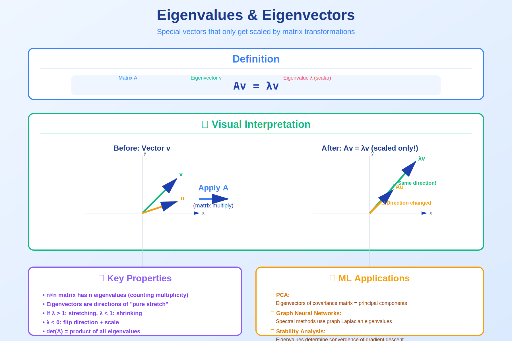

<!-- Animated Header -->
<p align="center">
  
</p>

<p align="center">
  
  
  
</p>


---

## 🎯 Visual Overview



*Caption: Eigenvalues λ and eigenvectors v satisfy Av = λv. They reveal the fundamental properties of matrices.*

---

## 📐 Key Concepts

```
Eigenvalue Equation:
Av = λv

Finding eigenvalues:
det(A - λI) = 0 (characteristic polynomial)

Properties:
• tr(A) = Σλᵢ (trace = sum of eigenvalues)
• det(A) = Πλᵢ (determinant = product)
• A is invertible ⟺ all λᵢ ≠ 0
```

---

## 💻 Code Examples

```python
import numpy as np

A = np.array([[4, 2], [1, 3]])
eigenvalues, eigenvectors = np.linalg.eig(A)

print(f"Eigenvalues: {eigenvalues}")
print(f"Eigenvectors:\n{eigenvectors}")

# Verify: Av = λv
for i in range(len(eigenvalues)):
    v = eigenvectors[:, i]
    lam = eigenvalues[i]
    print(f"Av = {A @ v}, λv = {lam * v}")
```

---

➡️ See [Eigen](../eigen/) for complete theory

---

---


<p align="center">
  
</p>
