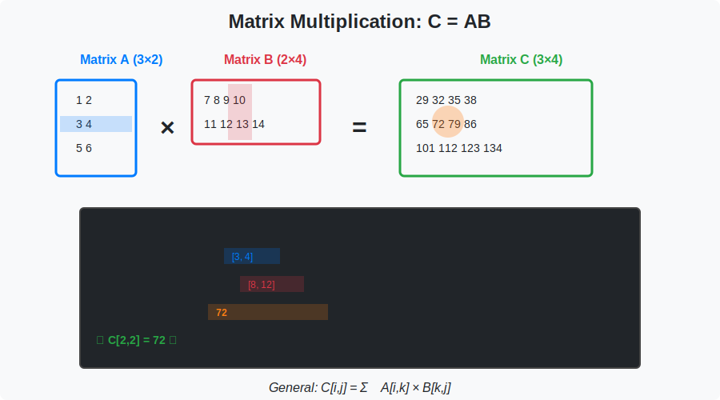

<!-- Animated Header -->
<p align="center">
  
</p>

<p align="center">
  
  
  
</p>


---

## 🎯 Visual Overview



*Caption: Matrix multiplication visualized step-by-step. Each element of the output is the dot product of a row from the first matrix and a column from the second. Understanding this operation is essential for all of deep learning.*

---

## 📐 Vector Operations

```
Column vector: x = [x₁, x₂, ..., xₙ]ᵀ ∈ ℝⁿ

Operations:
• Addition:           x + y = [x₁+y₁, x₂+y₂, ..., xₙ+yₙ]ᵀ
• Scalar multiply:    αx = [αx₁, αx₂, ..., αxₙ]ᵀ
• Dot product:        x·y = xᵀy = Σᵢ xᵢyᵢ = |x||y|cos(θ)
• Outer product:      xyᵀ = [xᵢyⱼ]  (n×m matrix)
• Element-wise:       x ⊙ y = [x₁y₁, x₂y₂, ..., xₙyₙ]ᵀ (Hadamard)
```

### Vector Norms

```
L1 Norm (Manhattan):     ‖x‖₁ = Σᵢ |xᵢ|
L2 Norm (Euclidean):     ‖x‖₂ = √(Σᵢ xᵢ²) = √(xᵀx)
L∞ Norm (Max):           ‖x‖∞ = maxᵢ |xᵢ|
Lp Norm (General):       ‖x‖ₚ = (Σᵢ |xᵢ|ᵖ)^(1/p)

Properties:
• ‖x‖ ≥ 0, equality iff x = 0
• ‖αx‖ = |α| · ‖x‖
• ‖x + y‖ ≤ ‖x‖ + ‖y‖  (triangle inequality)
```

---

## 📐 Matrix Operations

```
Matrix: A ∈ ℝᵐˣⁿ (m rows, n columns)

Operations:
• Addition:       A + B  (element-wise, same shape)
• Scalar mult:    αA = [αAᵢⱼ]
• Matrix mult:    (AB)ᵢⱼ = Σₖ AᵢₖBₖⱼ  (A: m×n, B: n×p → AB: m×p)
• Transpose:      (Aᵀ)ᵢⱼ = Aⱼᵢ
• Trace:          tr(A) = Σᵢ Aᵢᵢ  (sum of diagonal)
• Determinant:    det(A)  (only square matrices)
```

### Important Matrix Properties

```
(AB)ᵀ = BᵀAᵀ           (transpose of product)
(AB)⁻¹ = B⁻¹A⁻¹        (inverse of product)
tr(AB) = tr(BA)        (cyclic property)
det(AB) = det(A)det(B) (determinant of product)
‖AB‖ ≤ ‖A‖ · ‖B‖       (submultiplicativity)
```

---

## 🔑 Key Formulas

| Operation | Dimensions | Result | ML Use |
|-----------|------------|--------|--------|
| Ax | (m×n)(n×1) | m×1 | Linear layer forward |
| AB | (m×n)(n×p) | m×p | Batch processing |
| xᵀy | (1×n)(n×1) | scalar | Dot product attention |
| xyᵀ | (n×1)(1×m) | n×m | Outer product |
| xᵀAx | scalar | scalar | Quadratic form |

### Special Matrices

```
Identity:       I = diag(1,1,...,1)    AI = IA = A
Diagonal:       D = diag(d₁,d₂,...,dₙ)
Symmetric:      A = Aᵀ
Orthogonal:     QᵀQ = QQᵀ = I  (columns are orthonormal)
Positive def:   xᵀAx > 0 for all x ≠ 0
```

---

## 📐 DETAILED MATHEMATICAL FOUNDATIONS

### 1. Vector Dot Product: Complete Analysis

**Definition:**
```
x·y = xᵀy = Σᵢ₌₁ⁿ xᵢyᵢ

Geometric interpretation:
x·y = ‖x‖ · ‖y‖ · cos(θ)

where θ is the angle between x and y
```

**Derivation of Geometric Form:**

```
Step 1: Law of cosines
‖x - y‖² = ‖x‖² + ‖y‖² - 2‖x‖‖y‖cos(θ)

Step 2: Expand LHS
‖x - y‖² = (x-y)ᵀ(x-y)
         = xᵀx - xᵀy - yᵀx + yᵀy
         = ‖x‖² + ‖y‖² - 2xᵀy

Step 3: Equate
‖x‖² + ‖y‖² - 2xᵀy = ‖x‖² + ‖y‖² - 2‖x‖‖y‖cos(θ)

Step 4: Simplify
xᵀy = ‖x‖‖y‖cos(θ)  ∎
```

**Key Properties:**

```
1. Commutativity: x·y = y·x

2. Distributivity: x·(y + z) = x·y + x·z

3. Cauchy-Schwarz inequality:
   |x·y| ≤ ‖x‖ · ‖y‖
   
   Proof:
   Since -1 ≤ cos(θ) ≤ 1:
   |‖x‖‖y‖cos(θ)| ≤ ‖x‖‖y‖
   |x·y| ≤ ‖x‖‖y‖  ∎

4. Orthogonality: x ⊥ y ⟺ x·y = 0
```

**Application: Attention Scores**
```
In Transformers: attention(q, k) ∝ exp(q·k/√d)

Why normalize by √d?
If q, k ~ N(0, 1) independently:
  E[qᵀk] = 0
  Var(qᵀk) = d

So qᵀk ~ N(0, d) → qᵀk/√d ~ N(0, 1)
Keeps dot products in reasonable range!
```

---

### 2. Matrix Multiplication: Why This Definition?

**Definition:**
```
(AB)ᵢⱼ = Σₖ AᵢₖBₖⱼ

A: m×n, B: n×p → AB: m×p
```

**Interpretation 1: Composition of Linear Maps**

```
If f(x) = Ax and g(y) = By, then:
(f ∘ g)(x) = f(g(x)) = A(Bx) = (AB)x

Matrix multiplication = function composition!
```

**Interpretation 2: Column Combinations**

```
Each column of AB is a linear combination of columns of A:
(AB)[:,j] = A·(B[:,j])

Example:
A = [a₁ a₂ a₃], B = [b₁₁ b₁₂]
                     [b₂₁ b₂₂]
                     [b₃₁ b₃₂]

AB = [b₁₁a₁ + b₂₁a₂ + b₃₁a₃, b₁₂a₁ + b₂₂a₂ + b₃₂a₃]
```

**Interpretation 3: Row-Column Dot Products**

```
(AB)ᵢⱼ = Aᵢ,: · B:,ⱼ  (dot product of row i of A with column j of B)
```

**Why is matrix multiplication NOT commutative?**

```
Generally AB ≠ BA

Counterexample:
A = [1 0],  B = [0 1]
    [0 0]       [0 0]

AB = [0 1],  BA = [0 0]
     [0 0]        [0 0]

AB ≠ BA!

Geometric: Rotation then scaling ≠ Scaling then rotation
```

---

### 3. Matrix Norms: Complete Theory

**Induced (Operator) Norms:**

```
‖A‖ₚ = max_{x≠0} ‖Ax‖ₚ/‖x‖ₚ

Most important:
‖A‖₂ = σₘₐₓ(A)  (largest singular value)
‖A‖₁ = max_j Σᵢ|Aᵢⱼ|  (max column sum)
‖A‖∞ = max_i Σⱼ|Aᵢⱼ|  (max row sum)
```

**Frobenius Norm:**

```
‖A‖_F = √(Σᵢⱼ A²ᵢⱼ) = √tr(AᵀA)

Properties:
• ‖AB‖_F ≤ ‖A‖₂ · ‖B‖_F
• ‖AB‖_F ≤ ‖A‖_F · ‖B‖₂
• Invariant under orthogonal transforms: ‖QA‖_F = ‖A‖_F if QᵀQ = I
```

**Application: Weight Regularization**

```
L2 weight decay = minimize loss + λ‖W‖²_F

PyTorch:
optimizer = optim.Adam(model.parameters(), weight_decay=0.01)

This adds penalty λ·‖W‖²_F to each weight matrix W
```

---

### 4. Trace: Properties & Applications

**Definition:**
```
tr(A) = Σᵢ Aᵢᵢ  (sum of diagonal elements)
```

**Key Properties (with proofs):**

**Property 1: Cyclic permutation**
```
tr(ABC) = tr(CAB) = tr(BCA)

Proof:
tr(AB) = Σᵢ(AB)ᵢᵢ = Σᵢ Σⱼ AᵢⱼBⱼᵢ
tr(BA) = Σⱼ(BA)ⱼⱼ = Σⱼ Σᵢ BⱼᵢAᵢⱼ

Same! Just reordered indices. ∎
```

**Property 2: Trace of outer product**
```
tr(xyᵀ) = tr(yᵀx) = yᵀx = xᵀy  (dot product!)
```

**Property 3: Trace & eigenvalues**
```
tr(A) = Σᵢ λᵢ  (sum of eigenvalues)

For diagonal matrix D = diag(λ₁,...,λₙ): obvious
For general A: Use A = QΛQᵀ (eigendecomposition)
  tr(A) = tr(QΛQᵀ) = tr(Qᵀ QΛ) = tr(Λ) = Σᵢλᵢ  ∎
```

**Application: Efficient Computation**

```
Computing trace of product without forming product:
tr(AB) = Σᵢⱼ AᵢⱼBⱼᵢ

In code (avoid materialization):
trace = torch.sum(A * B.T)  # Element-wise multiply then sum
# vs
trace = torch.trace(A @ B)  # Forms full product first!

First is O(n²), second is O(n³) for n×n matrices
```

---

### 5. Determinant: Complete Theory

**Determinant as Volume:**

```
For matrix A ∈ ℝⁿˣⁿ with columns a₁,...,aₙ:

|det(A)| = volume of parallelepiped spanned by {a₁,...,aₙ}

If det(A) = 0: columns are linearly dependent
→ they span < n dimensions
→ A is singular (not invertible)
```

**Key Properties:**

```
1. det(AB) = det(A)·det(B)

2. det(Aᵀ) = det(A)

3. det(A⁻¹) = 1/det(A)  (if A invertible)

4. det(αA) = αⁿdet(A)  (for n×n matrix)

5. If A has row/column of zeros: det(A) = 0
```

**Computation: Laplace Expansion**

```
For 2×2:
det([a b]) = ad - bc
   [c d]

For n×n:
det(A) = Σⱼ (-1)^{i+j} Aᵢⱼ · det(Mᵢⱼ)

where Mᵢⱼ is (n-1)×(n-1) minor (delete row i, column j)

Complexity: O(n!) naive, O(n³) via LU decomposition
```

**Application: Checking Invertibility**

```python
def is_invertible(A):
    """Check if matrix is invertible"""
    det_A = np.linalg.det(A)
    return abs(det_A) > 1e-10  # Numerical tolerance

# In ML: Check if covariance matrix is positive definite
Σ = X.T @ X / len(X)
if np.linalg.det(Σ) < 1e-10:
    print("Warning: Singular covariance! Add regularization.")
    Σ += 1e-5 * np.eye(Σ.shape[0])  # Ridge regularization
```

---

### 6. Matrix Inverse: Theory & Computation

**Definition:**
```
A⁻¹ is the inverse of A if:
AA⁻¹ = A⁻¹A = I
```

**Existence:**
```
A⁻¹ exists ⟺ det(A) ≠ 0
             ⟺ A has full rank
             ⟺ columns of A are linearly independent
```

**Properties:**

```
(AB)⁻¹ = B⁻¹A⁻¹  (reverse order!)

Proof:
(AB)(B⁻¹A⁻¹) = A(BB⁻¹)A⁻¹ = AIA⁻¹ = AA⁻¹ = I  ∎

(Aᵀ)⁻¹ = (A⁻¹)ᵀ

(A⁻¹)⁻¹ = A
```

**Computation Methods:**

```
1. Gaussian elimination: O(n³)

2. LU decomposition:
   A = LU → A⁻¹ = U⁻¹L⁻¹

3. For 2×2: Direct formula
   [a b]⁻¹ = 1/(ad-bc) [ d -b]
   [c d]                [-c  a]

4. Pseudo-inverse (if singular):
   A⁺ = (AᵀA)⁻¹Aᵀ  (Moore-Penrose)
```

**ML Application: Normal Equations**

```
Linear regression: minimize ‖Xw - y‖²

Closed form solution:
w* = (XᵀX)⁻¹Xᵀy

Problem: XᵀX may be singular!
Solution: Ridge regression
w* = (XᵀX + λI)⁻¹Xᵀy  (always invertible for λ > 0)
```

---

### 7. Orthogonal Matrices: Special Properties

**Definition:**
```
Q is orthogonal if Qᵀ Q = I

Equivalently: Q⁻¹ = Qᵀ
```

**Properties:**

```
1. Preserves lengths:
   ‖Qx‖ = ‖x‖

   Proof:
   ‖Qx‖² = (Qx)ᵀ(Qx) = xᵀQᵀQx = xᵀx = ‖x‖²  ∎

2. Preserves dot products:
   (Qx)·(Qy) = x·y

3. Preserves angles:
   If x ⊥ y, then Qx ⊥ Qy

4. det(Q) = ±1
```

**Application: Stable Computations**

```
QR decomposition: A = QR
• Q: orthogonal
• R: upper triangular

Use for solving Ax = b:
QRx = b
Rx = Qᵀb  (multiply both sides by Qᵀ)

Numerically stable! No risk of amplifying errors.
```

**Application: Rotation Matrices**

```
2D rotation by angle θ:
R(θ) = [cos θ  -sin θ]
       [sin θ   cos θ]

Check: R(θ)ᵀR(θ) = I ✓

In deep learning: Rotation matrix for data augmentation
```

---

### 8. Positive Definite Matrices

**Definition:**
```
A is positive definite (A ≻ 0) if:
xᵀAx > 0  for all x ≠ 0
```

**Equivalent Conditions:**

```
A ≻ 0 ⟺ all eigenvalues > 0
       ⟺ det(A) > 0 and all principal minors > 0
       ⟺ A = BᵀB for some full-rank B
       ⟺ Cholesky decomposition A = LLᵀ exists
```

**Why It Matters:**

```
Covariance matrices are always positive semi-definite:
Σ = E[(X - μ)(X - μ)ᵀ]

For any v:
vᵀΣv = E[vᵀ(X-μ)(X-μ)ᵀv] = E[(vᵀ(X-μ))²] ≥ 0  ✓
```

**Application: Checking Hessian**

```
For optimization: is x* a minimum?
Check Hessian H = ∇²f(x*):

• H ≻ 0 → x* is strict local minimum
• H ≺ 0 → x* is strict local maximum
• H indefinite → x* is saddle point

In PyTorch:
H = torch.autograd.functional.hessian(loss, x)
eigenvalues = torch.linalg.eigvalsh(H)
if all(eigenvalues > 0):
    print("Local minimum!")
```

---

### 9. Research Paper Connections

| Concept | Papers | Application |
|---------|--------|-------------|
| **Matrix Multiplication** | AlexNet (2012), ResNet (2015) | Neural network layers |
| **Dot Product** | Attention Is All You Need (2017) | Attention scores q·k |
| **Outer Product** | LoRA (2021) | Low-rank updates: W + AB^T |
| **Norms** | Weight Decay papers | L2 regularization |
| **Orthogonal** | Spectral Normalization (2018) | GAN stability |
| **Positive Definite** | Gaussian Processes | Kernel matrices |
| **Trace** | Fisher Information Matrix | Natural gradient |

---

## 💻 Code Examples

```python
import numpy as np
import torch

# Vector operations
x = np.array([1, 2, 3])
y = np.array([4, 5, 6])

dot_product = x @ y           # 32
outer_product = np.outer(x, y)  # 3x3 matrix
l1_norm = np.linalg.norm(x, 1)  # 6
l2_norm = np.linalg.norm(x, 2)  # 3.74

# Matrix operations
A = np.random.randn(3, 4)
B = np.random.randn(4, 2)
C = A @ B                     # 3x2

# Trace and determinant
D = np.random.randn(3, 3)
trace = np.trace(D)
det = np.linalg.det(D)

# PyTorch for GPU
A_gpu = torch.randn(1000, 1000, device='cuda')
B_gpu = torch.randn(1000, 1000, device='cuda')
C_gpu = A_gpu @ B_gpu  # Fast matrix multiply on GPU
```

---

## 🌍 ML Applications

| Concept | Application |
|---------|-------------|
| Matrix multiply | Neural network forward pass: y = Wx + b |
| Dot product | Attention scores: q·k |
| Norms | Regularization (L1, L2), loss functions |
| Outer product | Embedding lookups, rank-1 updates |
| Hadamard product | Gating mechanisms, element-wise ops |

---

## 📚 References

| Type | Title | Link |
|------|-------|------|
| 🎥 | 3Blue1Brown: Linear Algebra | [YouTube](https://www.youtube.com/playlist?list=PLZHQObOWTQDPD3MizzM2xVFitgF8hE_ab) |
| 🎥 | Khan Academy: Linear Algebra | [Khan](https://www.khanacademy.org/math/linear-algebra) |
| 📖 | MIT 18.06 Linear Algebra | [OCW](https://ocw.mit.edu/courses/18-06-linear-algebra-spring-2010/) |
| 🇨🇳 | 线性代数基础 | [知乎](https://zhuanlan.zhihu.com/p/25377279) |
| 🇨🇳 | 3Blue1Brown中文 | [B站](https://www.bilibili.com/video/BV1ys411472E) |
| 🇨🇳 | 矩阵运算详解 | [CSDN](https://blog.csdn.net/qq_37466121/article/details/88619088)

---

## 🔗 Where Matrix Operations Are Used

| Application | How It's Used |
|-------------|---------------|
| **Neural Network Layers** | Forward pass: y = Wx + b (matrix-vector multiply) |
| **Attention Mechanism** | Q·Kᵀ computes attention scores via dot product |
| **Batch Processing** | Matrix-matrix multiply for parallel computation |
| **Computer Graphics** | Rotation, scaling, translation via matrix transforms |
| **Coordinate Systems** | Change of basis using transformation matrices |
| **Regularization** | L1/L2 norms for weight penalties |

---


⬅️ [Back: Linear Algebra](../)

---

⬅️ [Back: Vector Spaces](../vector-spaces/)

---

---


<p align="center">
  
</p>
