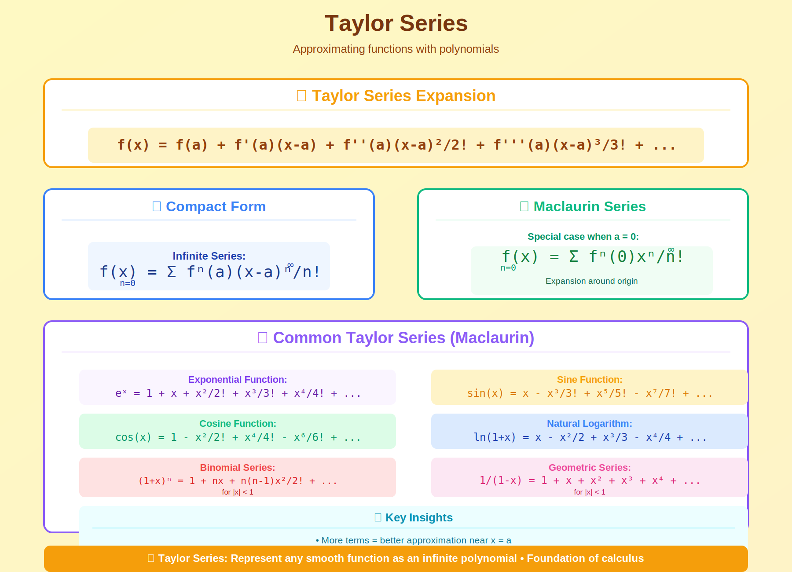

# Taylor Series

> **Approximate any smooth function with polynomials**

---

## 🎯 Visual Overview



*Caption: Taylor series approximates functions using derivatives at a single point. Adding more terms improves accuracy. This is fundamental to understanding gradients, Hessians, and optimization in ML.*

---

## 📂 Overview

Taylor series represent smooth functions as infinite polynomials. The first few terms often provide excellent approximations, enabling analysis of complex functions.

---

## 📐 Taylor Series Formula

```
f(x) = f(a) + f'(a)(x-a) + f''(a)(x-a)²/2! + f'''(a)(x-a)³/3! + ...

f(x) = Σₙ f⁽ⁿ⁾(a)(x-a)ⁿ / n!

Special case (a=0): Maclaurin Series
```

---

## 🔑 Important Series

| Function | Taylor Series (a=0) |
|----------|-------------------|
| eˣ | 1 + x + x²/2! + x³/3! + ... |
| sin(x) | x - x³/3! + x⁵/5! - ... |
| cos(x) | 1 - x²/2! + x⁴/4! - ... |
| ln(1+x) | x - x²/2 + x³/3 - ... |

---

## 🌍 ML Applications

| Application | How Taylor is Used |
|-------------|-------------------|
| **Gradient Descent** | First-order approximation |
| **Newton's Method** | Second-order (Hessian) |
| **Adam/BFGS** | Approximate 2nd-order |
| **Loss Landscapes** | Analyze local curvature |

---

## 💻 Code

```python
import numpy as np
from math import factorial

def taylor_exp(x, n_terms=10):
    """Taylor approximation of e^x around 0"""
    return sum(x**n / factorial(n) for n in range(n_terms))

def taylor_sin(x, n_terms=5):
    """Taylor approximation of sin(x) around 0"""
    result = 0
    for n in range(n_terms):
        result += ((-1)**n * x**(2*n+1)) / factorial(2*n+1)
    return result

# Compare
x = 1.0
print(f"e^1: exact={np.exp(1):.6f}, taylor={taylor_exp(1):.6f}")
print(f"sin(1): exact={np.sin(1):.6f}, taylor={taylor_sin(1):.6f}")
```


## 🔗 Where This Topic Is Used

| Application | Usage |
|-------------|-------|
| **Machine Learning** | Core concept for ML systems |
| **Deep Learning** | Foundation for neural networks |
| **Research** | Important for understanding papers |


## 📚 References

| Type | Resource | Link |
|------|----------|------|
| 📖 | Textbook | See parent folder |
| 🎥 | Video Lectures | YouTube/Coursera |
| 🇨🇳 | 中文资源 | 知乎/B站 |

---

⬅️ [Back: Calculus](../)

---

⬅️ [Back: Limits Continuity](../limits-continuity/)
