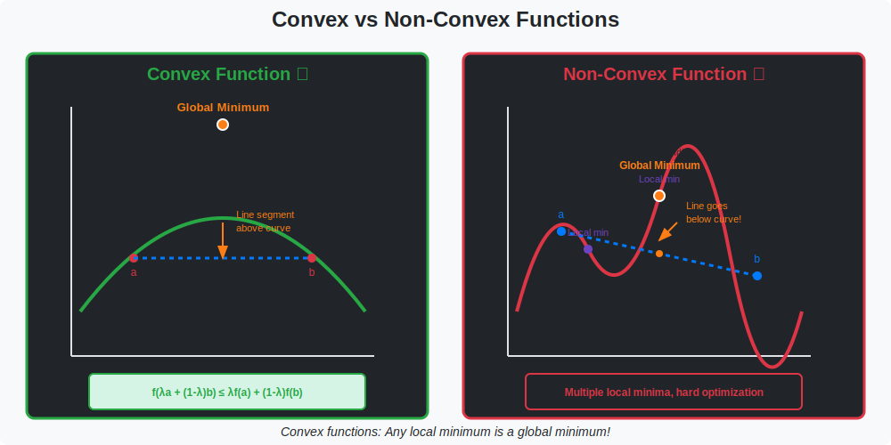

# Convex Optimization

> **When local minimum = global minimum**

---

## 🎯 Visual Overview



*Caption: Comparison of convex (left) and non-convex (right) functions. Convex functions have a single global minimum that gradient descent will always find. Non-convex functions (like neural network loss landscapes) have multiple local minima and saddle points.*

---

## 📐 Convex Set

```
A set C is convex if:
∀x, y ∈ C, ∀λ ∈ [0,1]: λx + (1-λ)y ∈ C

The line segment between any two points stays in C.
```

---

## 📐 Convex Function

```
f is convex if:
f(λx + (1-λ)y) ≤ λf(x) + (1-λ)f(y)

Equivalently (for smooth f):
• f(y) ≥ f(x) + ∇f(x)ᵀ(y-x)  (first-order)
• H = ∇²f ⪰ 0 (second-order)
```

---

## 🔥 Why Convexity Matters

```
Convex function:
• Every local minimum is global!
• Gradient descent converges
• Duality theory applies

Non-convex (deep learning):
• Many local minima/saddle points
• No global guarantees
• But often works anyway!
```

---

## 📊 Common Convex Functions

| Function | Domain |
|----------|--------|
| Linear | ℝⁿ |
| Quadratic (PSD) | ℝⁿ |
| Norms | ℝⁿ |
| Log-sum-exp | ℝⁿ |
| Cross-entropy | Δⁿ |


## 🔗 Where This Topic Is Used

| Application | Usage |
|-------------|-------|
| **Machine Learning** | Core concept for ML systems |
| **Deep Learning** | Foundation for neural networks |
| **Research** | Important for understanding papers |


## 📚 References

| Type | Resource | Link |
|------|----------|------|
| 📖 | Textbook | See parent folder |
| 🎥 | Video Lectures | YouTube/Coursera |
| 🇨🇳 | 中文资源 | 知乎/B站 |

---

⬅️ [Back: Optimization](../)

---

⬅️ [Back: Constrained](../constrained/) | ➡️ [Next: Duality](../duality/)
