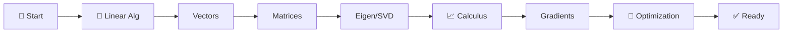
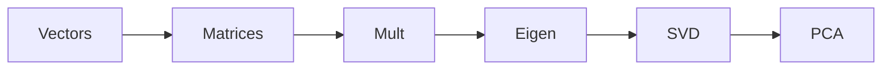
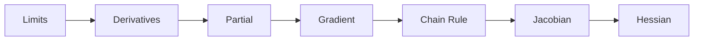
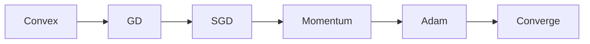
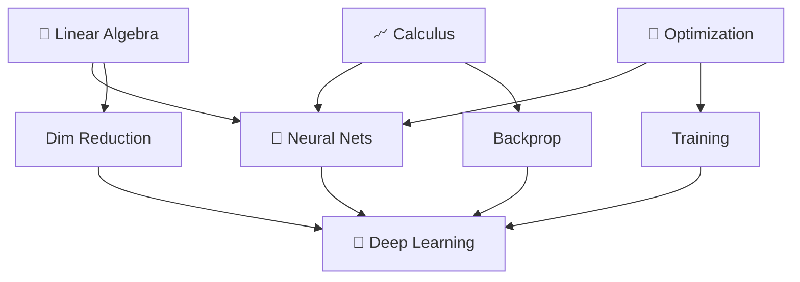
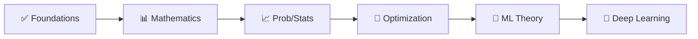

<!-- Animated Header -->
<p align="center">
  
</p>

<p align="center">
  
  
  
</p>


---

## 📊 Learning Path



## 🎯 What You'll Learn

> 💡 Every ML algorithm can be understood through **linear algebra, calculus, and optimization**.

<table>
<tr>
<td align="center">

### 📐 Linear Algebra


Vectors, Matrices, SVD, PCA

</td>
<td align="center">

### 📈 Calculus


Gradients, Chain Rule, Hessian

</td>
<td align="center">

### 🎯 Optimization


GD, SGD, Adam, Convergence

</td>
</tr>
</table>

---

## 📚 Main Topics

### 1️⃣ Linear Algebra

 



<details>
<summary><b>🔍 Core Concepts</b></summary>

- Vectors & Vector Spaces
- Matrix Operations & Properties
- Linear Transformations
- Eigenvalues & Eigenvectors
- Singular Value Decomposition (SVD)
- Principal Component Analysis (PCA)

</details>

<details>
<summary><b>🎯 Why It Matters</b></summary>

- Neural networks are matrix multiplications
- PCA for dimensionality reduction
- SVD for recommender systems
- Eigenvalues for stability analysis

</details>

<a href="./01-linear-algebra/README.md"></a>

---

### 2️⃣ Calculus

 



<details>
<summary><b>🔍 Core Concepts</b></summary>

- Derivatives & Partial Derivatives
- Gradient Vectors
- Chain Rule (backbone of backpropagation)
- Jacobian Matrices
- Hessian Matrices
- Taylor Series Approximation

</details>

<details>
<summary><b>🎯 Why It Matters</b></summary>

- Gradients are how neural networks learn
- Chain rule enables backpropagation
- Hessian for second-order optimization
- Taylor series for function approximation

</details>

<a href="./02-calculus/README.md"></a>

---

### 3️⃣ Optimization Theory

 



<details>
<summary><b>🔍 Core Concepts</b></summary>

- Convex vs Non-Convex Functions
- Gradient Descent Variants
- First-Order Methods
- Second-Order Methods (Newton)
- Convergence Guarantees

</details>

<details>
<summary><b>🎯 Why It Matters</b></summary>

- Training = Optimization
- Understand SGD, Adam, AdamW
- Know when optimization will work
- Debug training issues

</details>

<a href="./03-optimization/README.md"></a>

---

## 🔄 How These Connect



---

## 💡 Key Formulas

<table>
<tr>
<td>

### 📐 Linear Algebra
```
Matrix:    (AB)ᵀ = BᵀAᵀ
Eigen:     A = QΛQᵀ
SVD:       A = UΣVᵀ
```

</td>
<td>

### 📈 Calculus
```
Gradient:  ∇f = [∂f/∂xᵢ]ᵀ
Chain:     ∂z/∂x = ∂z/∂y · ∂y/∂x
Jacobian:  J = [∂fᵢ/∂xⱼ]
```

</td>
<td>

### 🎯 Optimization
```
GD:   θ ← θ - η∇L(θ)
Adam: θ ← θ - η·m̂/(√v̂+ε)
```

</td>
</tr>
</table>

---

## 🔗 Prerequisites & Next Steps



<p align="center">
  <a href="../01-foundations/README.md"></a>
  <a href="../03-probability-statistics/README.md"></a>
</p>

---

## 📚 Recommended Resources

| Type | Resource | Focus |
|:----:|----------|-------|
| 📘 | [Mathematics for ML](https://mml-book.github.io/) | Complete reference |
| 🎬 | [3Blue1Brown - Linear Algebra](https://www.youtube.com/playlist?list=PLZHQObOWTQDPD3MizzM2xVFitgF8hE_ab) | Visual intuition |
| 🎬 | [3Blue1Brown - Calculus](https://www.youtube.com/playlist?list=PLZHQObOWTQDMsr9K-rj53DwVRMYO3t5Yr) | Fundamentals |
| 🎓 | MIT 18.06 | Linear Algebra |

---

## 🗺️ Quick Navigation

| Previous | Current | Next |
|:--------:|:-------:|:----:|
| [🔢 Foundations](../01-foundations/README.md) | **📊 Mathematics** | [📈 Probability →](../03-probability-statistics/README.md) |

---

---


<p align="center">
  
</p>
