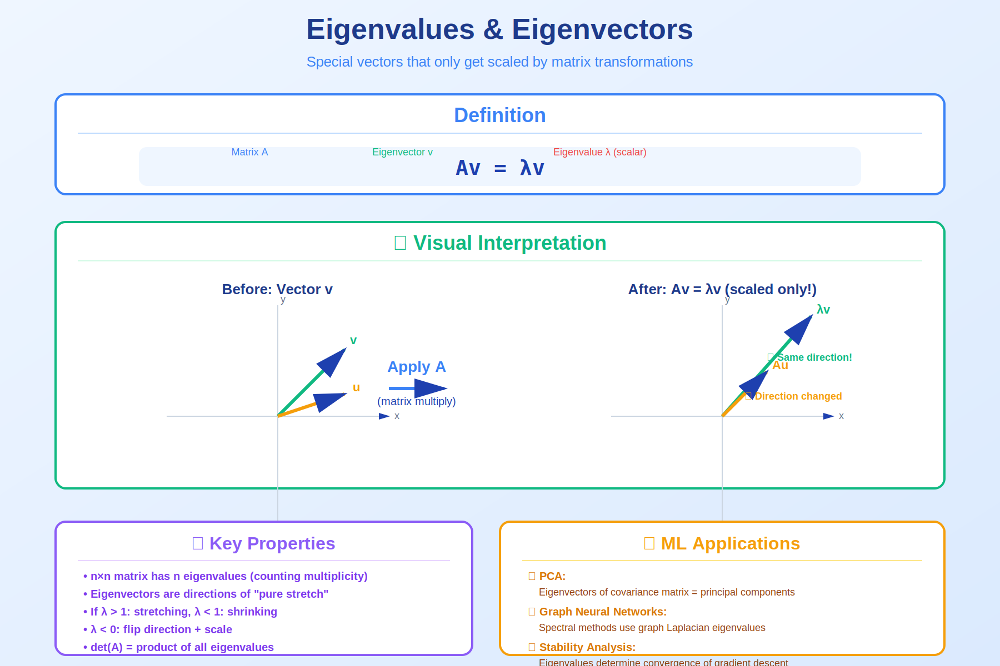

<!-- Animated Header -->
<p align="center">
  
</p>

<p align="center">
  
  
  
  
</p>


## ⚡ TL;DR

> **Advanced eigenvalue theory powers algorithms from PageRank to neural network stability analysis.** The spectral properties of matrices reveal deep structural information.

- 📐 **Gershgorin Discs**: Locate eigenvalues without computing them
- 🌐 **PageRank**: Dominant eigenvector of web graph
- 🧠 **RNN Stability**: Eigenvalues determine gradient flow
- 📊 **Spectral Clustering**: Graph Laplacian eigenvalues

---

## 📑 Table of Contents

1. [Spectral Properties](#1-spectral-properties)
2. [Gershgorin Circle Theorem](#2-gershgorin-circle-theorem)
3. [PageRank Algorithm](#3-pagerank-algorithm)
4. [RNN Gradient Stability](#4-rnn-gradient-stability)
5. [Spectral Graph Theory](#5-spectral-graph-theory)
6. [Code Implementation](#6-code-implementation)
7. [Resources](#-resources)

---

## 🎨 Visual Overview



```
+-----------------------------------------------------------------------------+
|                    EIGENVALUE APPLICATIONS IN ML                             |
+-----------------------------------------------------------------------------+
|                                                                              |
|   +---------------+   +---------------+   +---------------+                |
|   |   PAGERANK    |   |RNN STABILITY  |   |   SPECTRAL    |                |
|   |               |   |               |   |  CLUSTERING   |                |
|   |  Find dominant|   | Check if      |   |               |                |
|   |  eigenvector  |   | |λmax| < 1    |   | Use Laplacian |                |
|   |  of link      |   | for stable    |   | eigenvectors  |                |
|   |  matrix       |   | gradients     |   | for clustering|                |
|   +---------------+   +---------------+   +---------------+                |
|          ▲                   ▲                   ▲                          |
|          |                   |                   |                          |
|   +------+-------------------+-------------------+------+                  |
|   |              EIGENVALUE ANALYSIS                     |                  |
|   |                                                      |                  |
|   |   Av = λv                                           |                  |
|   |                                                      |                  |
|   |   Characteristic polynomial: det(A - λI) = 0        |                  |
|   |   Properties: tr(A) = Σλᵢ,  det(A) = Πλᵢ           |                  |
|   +------------------------------------------------------+                  |
|                                                                              |
+-----------------------------------------------------------------------------+
```

---

## 1. Spectral Properties

### 📐 Spectral Radius

**Definition**: $\rho(A) = \max\_i |\lambda\_i|$ (largest eigenvalue magnitude)

**Key Properties**:
```
1. ρ(A) ≤ ‖A‖ for any matrix norm
2. For normal matrices: ρ(A) = ‖A‖₂ (spectral norm)
3. limₖ→∞ Aᵏ = 0 iff ρ(A) < 1
4. Aᵏ bounded iff ρ(A) ≤ 1 (with equality only for semisimple λ)
```

### 📐 Cayley-Hamilton Theorem

**Theorem**: Every matrix satisfies its own characteristic polynomial.

$$
p_A(A) = 0 \text{ where } p_A(\lambda) = \det(A - \lambda I)
$$

**Example**:
```
A = [1  2]
    [3  4]

Characteristic polynomial:
p(λ) = λ² - 5λ - 2

Cayley-Hamilton says:
A² - 5A - 2I = 0

Verify:
A² = [7   10]
     [15  22]

A² - 5A - 2I = [7-5-2    10-10-0] = [0  0] ✓
               [15-15-0  22-20-2]   [0  0]
```

**Application**: Express $A^{-1}$ as polynomial in $A$:
```
From A² - 5A - 2I = 0:
  A² = 5A + 2I
  A·A = 5A + 2I
  A⁻¹ = (5I + 2A⁻¹)/A  ... multiply by A⁻¹:
  I = 5A⁻¹ + 2A⁻²
  A⁻¹ = (5I - A)/2  [using A² = 5A + 2I ⟹ A⁻¹ = (A-5I)/(-2)]

Actually: A⁻¹ = (-1/2)(A - 5I) = (5I - A)/2
```

---

## 2. Gershgorin Circle Theorem

### 📌 Theorem

Every eigenvalue of $A$ lies in at least one Gershgorin disc:

$$
D_i = \{z \in \mathbb{C} : |z - A_{ii}| \leq R_i\}
$$

where $R\_i = \sum\_{j \neq i} |A\_{ij}|$ (sum of off-diagonal elements in row $i$).

### 🔍 Proof

```
Let λ be an eigenvalue with eigenvector x, and let i be the index 
where |xᵢ| is maximum (|xᵢ| = maxⱼ |xⱼ|).

From Ax = λx, looking at row i:
  Σⱼ Aᵢⱼxⱼ = λxᵢ
  Aᵢᵢxᵢ + Σⱼ≠ᵢ Aᵢⱼxⱼ = λxᵢ
  (λ - Aᵢᵢ)xᵢ = Σⱼ≠ᵢ Aᵢⱼxⱼ

Taking absolute values:
  |λ - Aᵢᵢ| · |xᵢ| = |Σⱼ≠ᵢ Aᵢⱼxⱼ|
                    ≤ Σⱼ≠ᵢ |Aᵢⱼ| |xⱼ|
                    ≤ Σⱼ≠ᵢ |Aᵢⱼ| |xᵢ|  (since |xⱼ| ≤ |xᵢ|)
                    = Rᵢ · |xᵢ|

Since xᵢ ≠ 0:
  |λ - Aᵢᵢ| ≤ Rᵢ

Therefore λ ∈ Dᵢ.  ∎
```

### 💡 Example

```
A = [4  1   0]
    [0  5  -1]
    [1  1   6]

Gershgorin discs:
  D₁: center=4, radius=|1|+|0|=1    → λ ∈ [3, 5]
  D₂: center=5, radius=|0|+|-1|=1  → λ ∈ [4, 6]
  D₃: center=6, radius=|1|+|1|=2   → λ ∈ [4, 8]

All eigenvalues lie in the union [3, 8] ∩ [4, 6] ∩ [4, 8]

Actually computing: eigenvalues ≈ 3.6, 5.2, 6.2
All within predicted regions!
```

---

## 3. PageRank Algorithm

### 📌 The Problem

Rank web pages by importance using link structure.

### 📐 Mathematical Formulation

```
Web as directed graph:
  - Nodes: web pages
  - Edges: hyperlinks

Link matrix L:
  Lᵢⱼ = 1/outDegree(j)  if page j links to page i
  Lᵢⱼ = 0               otherwise

PageRank vector r satisfies:
  r = Lr  (eigenvector with eigenvalue 1)

Problem: L may not be column-stochastic (dead ends, spider traps)

Solution: Google matrix
  G = αL + (1-α)/n · 1·1ᵀ

where:
  α ≈ 0.85 (damping factor)
  1·1ᵀ/n = uniform probability matrix

PageRank = dominant eigenvector of G
```

### 🔍 Why Dominant Eigenvector?

```
G is a stochastic matrix (columns sum to 1)
By Perron-Frobenius theorem:
  1. Dominant eigenvalue = 1
  2. Corresponding eigenvector has all positive entries
  3. Power iteration converges: rₖ₊₁ = Grₖ → r*

Intuition:
  PageRank = stationary distribution of random web surfer
  who follows links with probability α
  and jumps to random page with probability 1-α
```

### 💻 Implementation

```python
import numpy as np

def pagerank(adjacency, damping=0.85, max_iter=100, tol=1e-6):
    """
    Compute PageRank using power iteration.
    
    adjacency: (n × n) adjacency matrix (Aᵢⱼ = 1 if j→i)
    """
    n = adjacency.shape[0]
    
    # Create column-stochastic matrix
    out_degree = adjacency.sum(axis=0)
    out_degree[out_degree == 0] = 1  # Handle dangling nodes
    L = adjacency / out_degree
    
    # Google matrix
    G = damping * L + (1 - damping) / n * np.ones((n, n))
    
    # Power iteration
    r = np.ones(n) / n
    for _ in range(max_iter):
        r_new = G @ r
        if np.linalg.norm(r_new - r) < tol:
            break
        r = r_new
    
    return r / r.sum()

# Example
A = np.array([
    [0, 1, 1, 0],
    [0, 0, 1, 0],
    [1, 0, 0, 1],
    [0, 0, 1, 0]
])
ranks = pagerank(A)
print(f"PageRanks: {ranks}")
print(f"Most important: Page {np.argmax(ranks) + 1}")
```

---

## 4. RNN Gradient Stability

### 📌 The Problem

In RNNs, gradients flow through time via:

$$
\frac{\partial h_t}{\partial h_0} = \prod_{k=1}^{t} W_h^T \text{diag}(\sigma'(z_k))
$$

### 📐 Eigenvalue Analysis

```
For simplicity, consider linear case (σ(x) = x):
  ∂hₜ/∂h₀ = (Wₕ)ᵗ

Behavior depends on eigenvalues of Wₕ:

Case 1: ρ(Wₕ) > 1
  At least one |λᵢ| > 1
  ⟹ (Wₕ)ᵗ grows exponentially
  ⟹ EXPLODING GRADIENTS

Case 2: ρ(Wₕ) < 1
  All |λᵢ| < 1
  ⟹ (Wₕ)ᵗ → 0 exponentially
  ⟹ VANISHING GRADIENTS

Case 3: ρ(Wₕ) = 1 with orthogonal Wₕ
  All |λᵢ| = 1
  ⟹ (Wₕ)ᵗ bounded
  ⟹ STABLE GRADIENTS
```

### 💻 Solution: Orthogonal Initialization

```python
import torch
import torch.nn as nn

def check_rnn_stability(W):
    """Check if RNN weight matrix will cause gradient issues."""
    eigenvalues = torch.linalg.eigvals(W)
    spectral_radius = torch.max(torch.abs(eigenvalues))
    
    if spectral_radius > 1.1:
        return "⚠️ Likely EXPLODING gradients"
    elif spectral_radius < 0.9:
        return "⚠️ Likely VANISHING gradients"
    else:
        return "✓ Gradients should be stable"

def orthogonal_init(shape):
    """Initialize weight matrix to be orthogonal (spectral radius = 1)."""
    flat_shape = (shape[0], np.prod(shape[1:]))
    a = np.random.normal(0, 1, flat_shape)
    u, _, v = np.linalg.svd(a, full_matrices=False)
    q = u if u.shape == flat_shape else v
    q = q.reshape(shape)
    return torch.tensor(q, dtype=torch.float32)

# Example
W = torch.randn(256, 256)
print(f"Random init: {check_rnn_stability(W)}")

W_orth = orthogonal_init((256, 256))
print(f"Orthogonal init: {check_rnn_stability(W_orth)}")
```

---

## 5. Spectral Graph Theory

### 📌 Graph Laplacian

For graph with adjacency matrix $A$ and degree matrix $D$:

$$
L = D - A \quad \text{(unnormalized)}
L_{sym} = I - D^{-1/2}AD^{-1/2} \quad \text{(normalized)}
$$

### 📐 Properties of Laplacian

```
1. L is symmetric positive semi-definite
   Proof: xᵀLx = xᵀDx - xᵀAx = Σᵢⱼ Aᵢⱼ(xᵢ - xⱼ)²/2 ≥ 0

2. Smallest eigenvalue = 0 with eigenvector 1 (all ones)
   L·1 = D·1 - A·1 = d - d = 0  (d = degree vector)

3. Number of zero eigenvalues = number of connected components

4. Second smallest eigenvalue (Fiedler value) measures connectivity
   λ₂ large → well connected
   λ₂ small → nearly disconnected
```

### 💻 Spectral Clustering

```python
from sklearn.cluster import KMeans

def spectral_clustering(adjacency, n_clusters):
    """
    Spectral clustering using normalized Laplacian.
    """
    n = adjacency.shape[0]
    
    # Degree matrix
    degrees = adjacency.sum(axis=1)
    D = np.diag(degrees)
    D_inv_sqrt = np.diag(1.0 / np.sqrt(degrees + 1e-10))
    
    # Normalized Laplacian
    L_sym = np.eye(n) - D_inv_sqrt @ adjacency @ D_inv_sqrt
    
    # Eigendecomposition
    eigenvalues, eigenvectors = np.linalg.eigh(L_sym)
    
    # Use first k eigenvectors (smallest eigenvalues)
    embedding = eigenvectors[:, :n_clusters]
    
    # Normalize rows
    embedding = embedding / (np.linalg.norm(embedding, axis=1, keepdims=True) + 1e-10)
    
    # K-means in embedding space
    kmeans = KMeans(n_clusters=n_clusters, random_state=42)
    labels = kmeans.fit_predict(embedding)
    
    return labels, eigenvalues

# Example: Two communities
n = 50
A = np.zeros((2*n, 2*n))
A[:n, :n] = (np.random.rand(n, n) < 0.3)  # Community 1
A[n:, n:] = (np.random.rand(n, n) < 0.3)  # Community 2
A[:n, n:] = (np.random.rand(n, n) < 0.02)  # Cross-community (sparse)
A = (A + A.T) / 2  # Symmetrize
np.fill_diagonal(A, 0)

labels, eigenvalues = spectral_clustering(A, n_clusters=2)
print(f"Fiedler value (λ₂): {eigenvalues[1]:.4f}")
print(f"Clustering accuracy: {np.mean(labels[:n] == labels[0]):.2%} / {np.mean(labels[n:] == labels[n]):.2%}")
```

---

## 6. Code Implementation

```python
import numpy as np
import matplotlib.pyplot as plt

def gershgorin_discs(A):
    """Compute and visualize Gershgorin discs."""
    n = A.shape[0]
    
    centers = np.diag(A)
    radii = np.sum(np.abs(A), axis=1) - np.abs(centers)
    
    # Plot discs
    fig, ax = plt.subplots(figsize=(8, 8))
    
    theta = np.linspace(0, 2*np.pi, 100)
    for i in range(n):
        x = centers[i] + radii[i] * np.cos(theta)
        y = radii[i] * np.sin(theta)
        ax.plot(x, y, 'b-', alpha=0.5)
        ax.fill(x, y, alpha=0.1)
    
    # Plot actual eigenvalues
    eigenvalues = np.linalg.eigvals(A)
    ax.scatter(eigenvalues.real, eigenvalues.imag, c='red', s=100, zorder=5, label='Eigenvalues')
    
    ax.set_xlabel('Real')
    ax.set_ylabel('Imaginary')
    ax.set_title('Gershgorin Discs')
    ax.legend()
    ax.set_aspect('equal')
    ax.grid(True)
    
    return centers, radii, eigenvalues

def cayley_hamilton_inverse(A):
    """
    Compute A⁻¹ using Cayley-Hamilton theorem.
    Only for 2×2 matrices in this implementation.
    """
    assert A.shape == (2, 2), "Only implemented for 2×2"
    
    trace = np.trace(A)
    det = np.linalg.det(A)
    
    # From A² - tr(A)·A + det(A)·I = 0:
    # A⁻¹ = (tr(A)·I - A) / det(A)
    A_inv = (trace * np.eye(2) - A) / det
    
    # Verify
    assert np.allclose(A @ A_inv, np.eye(2))
    
    return A_inv

# Demo
A = np.array([
    [4, 1, 0.5],
    [0.5, 5, 1],
    [1, 0.5, 6]
])

print("=== Gershgorin Discs ===")
centers, radii, eigenvalues = gershgorin_discs(A)
for i, (c, r, ev) in enumerate(zip(centers, radii, sorted(eigenvalues.real))):
    print(f"Disc {i+1}: center={c:.2f}, radius={r:.2f}")
print(f"Actual eigenvalues: {sorted(eigenvalues.real)}")
```

---

## 📚 Resources

| Type | Resource | Description |
|------|----------|-------------|
| 📄 | [PageRank Paper](http://ilpubs.stanford.edu:8090/422/1/1999-66.pdf) | Original Google |
| 📖 | [Spectral Graph Theory](https://mathweb.ucsd.edu/~fan/research/revised.html) | Chung |
| 🎥 | [Steve Brunton](https://www.youtube.com/c/Eigensteve) | Applications |

---

## 🗺️ Navigation

| ⬅️ Previous | 🏠 Home | ➡️ Next |
|:-----------:|:-------:|:-------:|
| [Eigen Theory](../03_eigen/README.md) | [Linear Algebra](../README.md) | [Matrix Factorization](../05_matrix_factorization/README.md) |

---


<p align="center">
  
</p>
