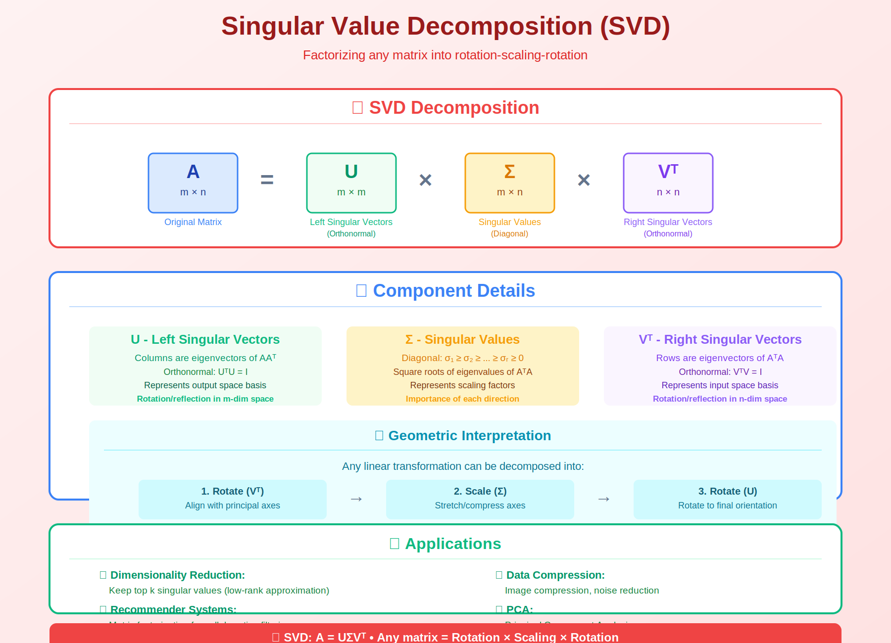

<!-- Animated Header -->
<p align="center">
  
</p>

<p align="center">
  
  
  
  
</p>


## ⚡ TL;DR

> **SVD is the Swiss Army knife of linear algebra.** It works for ANY matrix, provides optimal low-rank approximation, and powers LoRA, PCA, recommendation systems, and pseudoinverse computation.

- 📐 **Exists for any matrix**: $A = U\Sigma V^T$ (no restrictions!)

- 🎯 **Eckart-Young**: $A_k$ is the BEST rank-$k$ approximation

- 🔧 **LoRA**: Low-rank fine-tuning uses SVD insight

- 📊 **PCA**: Actually implemented via SVD (more stable)

---

## 📑 Table of Contents

1. [Complete Theory](#1-complete-theory)

2. [Existence Proof](#2-existence-proof)

3. [Eckart-Young Theorem](#3-eckart-young-theorem)

4. [Computing SVD](#4-computing-svd)

5. [Applications](#5-applications)

6. [Code Implementation](#6-code-implementation)

7. [Resources](#-resources)

---

## 🎨 Visual Overview



```
+-----------------------------------------------------------------------------+

|                    SINGULAR VALUE DECOMPOSITION                              |
+-----------------------------------------------------------------------------+
|                                                                              |
|      A          =        U        ×        Σ        ×        Vᵀ             |
|    (m×n)              (m×m)            (m×n)            (n×n)               |
|                                                                              |
|   +-------+       +-------+       +-------+       +-------+                |
|   |       |       |       |       |σ₁     |       |       |                |
|   | Input |   =   |Rotate |   ×   |  σ₂   |   ×   |Rotate |                |
|   |Matrix |       | in ℝᵐ |       |   ⋱   |       | in ℝⁿ |                |
|   |       |       |       |       |    σᵣ |       |       |                |
|   +-------+       +-------+       +-------+       +-------+                |
|                                                                              |
|   GEOMETRIC INTERPRETATION:                                                  |
|   ------------------------                                                   |
|   1. Vᵀ rotates input space (aligns with principal directions)             |
|   2. Σ scales along each axis (by singular values)                          |
|   3. U rotates output space (aligns with output directions)                 |
|                                                                              |
|   LOW-RANK APPROXIMATION:                                                    |
|   ------------------------                                                   |
|   Aₖ = Σᵢ₌₁ᵏ σᵢ uᵢ vᵢᵀ  (sum of k rank-1 matrices)                        |
|                                                                              |
|   Error: ‖A - Aₖ‖²_F = σ²ₖ₊₁ + σ²ₖ₊₂ + ... + σ²ᵣ                          |
|                                                                              |
+-----------------------------------------------------------------------------+

```

---

## 1. Complete Theory

### 📌 Theorem (SVD)

For **any** matrix $A \in \mathbb{R}^{m \times n}$, there exist:

```math
A = U\Sigma V^T

```

where:

- $U \in \mathbb{R}^{m \times m}$: orthogonal ($U^TU = UU^T = I$)

- $\Sigma \in \mathbb{R}^{m \times n}$: diagonal with $\sigma_1 \geq \sigma_2 \geq \cdots \geq \sigma_r > 0$

- $V \in \mathbb{R}^{n \times n}$: orthogonal ($V^TV = VV^T = I$)

- $r = \text{rank}(A)$: number of non-zero singular values

### 📐 Relationship to Eigendecomposition

```
AᵀA = (UΣVᵀ)ᵀ(UΣVᵀ)
    = VΣᵀUᵀUΣVᵀ
    = VΣᵀΣVᵀ
    = VΣ²Vᵀ  (eigendecomposition of AᵀA!)

Similarly:
AAᵀ = UΣ²Uᵀ  (eigendecomposition of AAᵀ!)

Therefore:
• Right singular vectors (V) = eigenvectors of AᵀA
• Left singular vectors (U) = eigenvectors of AAᵀ
• Singular values = √(eigenvalues of AᵀA) = √(eigenvalues of AAᵀ)

```

### 📐 Key Properties

| Property | Formula | Significance |
|----------|---------|--------------|
| Rank | $\text{rank}(A) = \#\{\sigma_i > 0\}$ | Count non-zero singular values |
| Frobenius norm | $\|A\|_F = \sqrt{\sum_i \sigma_i^2}$ | Total "energy" |
| Spectral norm | $\|A\|_2 = \sigma_1$ | Maximum stretching |
| Nuclear norm | $\|A\|_* = \sum_i \sigma_i$ | Low-rank regularization |
| Condition | $\kappa(A) = \sigma_1/\sigma_r$ | Numerical stability |
| Pseudoinverse | $A^+ = V\Sigma^+U^T$ | Generalized inverse |

---

## 2. Existence Proof

### 🔍 Complete Proof of SVD Existence

```
THEOREM: For any A ∈ ℝᵐˣⁿ, there exists SVD A = UΣVᵀ.

PROOF:

Step 1: Show AᵀA is symmetric positive semi-definite
----------------------------------------------------
(AᵀA)ᵀ = AᵀA  ✓ (symmetric)

For any x ∈ ℝⁿ:
  xᵀ(AᵀA)x = (Ax)ᵀ(Ax) = ‖Ax‖² ≥ 0  ✓ (PSD)

Step 2: Apply Spectral Theorem to AᵀA
----------------------------------------
By spectral theorem (AᵀA symmetric):
  AᵀA = VΛVᵀ

where:
  V = [v₁|v₂|...|vₙ] orthogonal (eigenvectors)
  Λ = diag(λ₁, λ₂, ..., λₙ) with λᵢ ≥ 0 (eigenvalues)

Reorder so λ₁ ≥ λ₂ ≥ ... ≥ λᵣ > 0 = λᵣ₊₁ = ... = λₙ
where r = rank(AᵀA) = rank(A).

Define: σᵢ = √λᵢ (singular values)

Step 3: Construct left singular vectors U
--------------------------------------------
For i = 1, ..., r (non-zero singular values):
  Define uᵢ = (1/σᵢ)Avᵢ

Verify orthonormality:
  uᵢᵀuⱼ = (1/σᵢσⱼ)(Avᵢ)ᵀ(Avⱼ)
        = (1/σᵢσⱼ)vᵢᵀAᵀAvⱼ
        = (1/σᵢσⱼ)vᵢᵀ(λⱼvⱼ)     (since AᵀAvⱼ = λⱼvⱼ)
        = (λⱼ/σᵢσⱼ)(vᵢᵀvⱼ)
        = (σⱼ²/σᵢσⱼ)δᵢⱼ        (since λⱼ = σⱼ² and vᵢᵀvⱼ = δᵢⱼ)
        = (σⱼ/σᵢ)δᵢⱼ
        = δᵢⱼ  ✓

For i = r+1, ..., m:
  Complete {u₁, ..., uᵣ} to an orthonormal basis of ℝᵐ
  (using Gram-Schmidt on any extension)

Step 4: Verify A = UΣVᵀ
------------------------
For j = 1, ..., r:
  By construction: uⱼ = (1/σⱼ)Avⱼ
  Therefore: Avⱼ = σⱼuⱼ

For j = r+1, ..., n:
  AᵀAvⱼ = λⱼvⱼ = 0·vⱼ = 0
  ‖Avⱼ‖² = vⱼᵀAᵀAvⱼ = 0
  Therefore: Avⱼ = 0 = 0·uⱼ

In matrix form:
  A[v₁|...|vₙ] = [Av₁|...|Avₙ]
               = [σ₁u₁|...|σᵣuᵣ|0|...|0]
               = [u₁|...|uₘ][σ₁ 0  ... 0  0 ... 0]
                            [0  σ₂ ... 0  0 ... 0]
                            [...           ⋱     ]
                            [0  0  ... σᵣ 0 ... 0]
                            [0  0  ... 0  0 ... 0]
                            [         ⋮          ]
  AV = UΣ
  A = UΣVᵀ  (since V is orthogonal, Vᵀ = V⁻¹)  ∎

```

---

## 3. Eckart-Young Theorem

### 📌 Theorem

The best rank-$k$ approximation to $A$ (in Frobenius or spectral norm) is:

```math
A_k = \sum_{i=1}^{k} \sigma_i \mathbf{u}_i \mathbf{v}_i^T

```

**Error**: $\|A - A_k\|_F^2 = \sum_{i=k+1}^{r} \sigma_i^2$

### 🔍 Proof

```
THEOREM: Among all rank-k matrices, Aₖ minimizes ‖A - B‖_F.

PROOF:

Step 1: Compute error for Aₖ
-----------------------------
  A - Aₖ = Σᵢ₌₁ʳ σᵢuᵢvᵢᵀ - Σᵢ₌₁ᵏ σᵢuᵢvᵢᵀ
         = Σᵢ₌ₖ₊₁ʳ σᵢuᵢvᵢᵀ

  ‖A - Aₖ‖²_F = ‖Σᵢ₌ₖ₊₁ʳ σᵢuᵢvᵢᵀ‖²_F

Since {uᵢvᵢᵀ} are orthonormal under Frobenius inner product:
  tr((uᵢvᵢᵀ)ᵀ(uⱼvⱼᵀ)) = tr(vᵢuᵢᵀuⱼvⱼᵀ) = tr(vᵢδᵢⱼvⱼᵀ) = δᵢⱼ

Therefore:
  ‖A - Aₖ‖²_F = Σᵢ₌ₖ₊₁ʳ σᵢ²

Step 2: Show no rank-k matrix does better
------------------------------------------
Let B be ANY rank-k matrix.
Since rank(B) = k, the null space of B has dimension n - k.
The space span{v₁, ..., vₖ₊₁} has dimension k + 1.

By dimension counting (Grassmann formula):
  dim(null(B) ∩ span{v₁,...,vₖ₊₁}) ≥ (n-k) + (k+1) - n = 1

So ∃ unit vector z ∈ span{v₁,...,vₖ₊₁} with Bz = 0.

Write z = Σᵢ₌₁ᵏ⁺¹ αᵢvᵢ with Σᵢαᵢ² = 1.

Then:
  ‖A - B‖²_F ≥ ‖(A - B)z‖²    (Frobenius ≥ spectral action)
             = ‖Az - Bz‖²
             = ‖Az‖²          (since Bz = 0)
             = ‖Σᵢ₌₁ᵏ⁺¹ αᵢσᵢuᵢ‖²  (since Avᵢ = σᵢuᵢ)
             = Σᵢ₌₁ᵏ⁺¹ αᵢ²σᵢ²
             ≥ σₖ₊₁² · Σᵢ₌₁ᵏ⁺¹ αᵢ²  (since σᵢ ≥ σₖ₊₁ for i ≤ k+1)
             = σₖ₊₁²

Step 3: Extend to full error bound
-----------------------------------
A more careful argument (applying the same technique iteratively)
shows:
  ‖A - B‖²_F ≥ Σᵢ₌ₖ₊₁ʳ σᵢ² = ‖A - Aₖ‖²_F

Therefore Aₖ is optimal.  ∎

```

---

## 4. Computing SVD

### 📐 Algorithms

**Method 1: Via Eigendecomposition**

```
1. Form AᵀA (n×n, symmetric)

2. Compute eigendecomposition: AᵀA = VΛVᵀ

3. Singular values: σᵢ = √λᵢ

4. Left singular vectors: uᵢ = Avᵢ/σᵢ

Complexity: O(mn² + n³)
Issue: Forms AᵀA explicitly → numerical issues

```

**Method 2: Golub-Kahan Bidiagonalization (Standard)**

```
1. Reduce A to bidiagonal form B via orthogonal transforms

2. Apply implicit QR to B to diagonalize

3. Accumulate transforms into U and V

Complexity: O(mn²) for m ≥ n
More numerically stable than eigendecomposition

```

**Method 3: Randomized SVD (for Large Matrices)**

```python
def randomized_svd(A, k, p=10, q=2):
    """
    Randomized SVD for computing top-k singular values/vectors.
    
    Parameters:
    - A: matrix (m × n)
    - k: target rank
    - p: oversampling (k + p random projections)
    - q: power iterations (for better accuracy)
    """
    m, n = A.shape
    
    # Step 1: Random projection
    Omega = np.random.randn(n, k + p)
    Y = A @ Omega
    
    # Step 2: Power iteration for accuracy
    for _ in range(q):
        Y = A @ (A.T @ Y)
    
    # Step 3: Orthonormalize
    Q, _ = np.linalg.qr(Y)
    
    # Step 4: Reduce to small problem
    B = Q.T @ A  # (k+p) × n
    
    # Step 5: SVD of small matrix
    U_B, S, Vt = np.linalg.svd(B, full_matrices=False)
    
    # Step 6: Recover left singular vectors
    U = Q @ U_B
    
    return U[:, :k], S[:k], Vt[:k, :]

```

---

## 5. Applications

### 🤖 Application 1: LoRA (Low-Rank Adaptation)

```python
import torch
import torch.nn as nn

class LoRALayer(nn.Module):
    """
    LoRA: Instead of fine-tuning W directly, learn low-rank update:
    W' = W + BA where B ∈ ℝᵈˣʳ, A ∈ ℝʳˣᵏ, r << min(d,k)
    
    Connection to SVD:
    - Fine-tuning update ΔW often has low intrinsic rank
    - SVD shows ΔW ≈ Σᵢσᵢuᵢvᵢᵀ decays quickly
    - LoRA approximates: ΔW ≈ BA ≈ Σᵢ₌₁ʳ σᵢuᵢvᵢᵀ
    """
    def __init__(self, in_features, out_features, rank=4, alpha=1.0):
        super().__init__()
        self.rank = rank
        self.scaling = alpha / rank
        
        # Frozen pre-trained weights
        self.W = nn.Parameter(torch.randn(out_features, in_features), 
                              requires_grad=False)
        
        # Trainable low-rank factors
        self.A = nn.Parameter(torch.randn(rank, in_features) * 0.01)
        self.B = nn.Parameter(torch.zeros(out_features, rank))
    
    def forward(self, x):
        return x @ self.W.T + self.scaling * (x @ self.A.T @ self.B.T)
    
    def merge_weights(self):
        """Merge LoRA into base weights (for inference)."""
        return self.W + self.scaling * (self.B @ self.A)

# Parameter comparison
d, k, r = 768, 768, 4
full_params = d * k  # 589,824
lora_params = d * r + r * k  # 6,144
print(f"Compression: {full_params / lora_params:.0f}×")  # 96×

```

### 🤖 Application 2: PCA via SVD

```python
def pca_via_svd(X, n_components):
    """
    PCA implemented via SVD (the standard method).
    
    Why SVD instead of eigendecomposition?
    - SVD of X directly (don't form XᵀX)
    - More numerically stable
    - Handles m ≠ n naturally
    
    Math:
    X = UΣVᵀ (SVD of centered X)
    XᵀX = VΣ²Vᵀ (covariance up to scaling)
    Principal components = columns of V
    Projected data = UΣ = XV
    """
    # Center the data
    mean = X.mean(axis=0)
    X_centered = X - mean
    
    # SVD (economy form)
    U, S, Vt = np.linalg.svd(X_centered, full_matrices=False)
    
    # Principal components = rows of Vt (columns of V)
    components = Vt[:n_components]
    
    # Projected data
    X_projected = U[:, :n_components] * S[:n_components]
    
    # Explained variance
    explained_var = S[:n_components]**2 / (len(X) - 1)
    explained_ratio = explained_var / explained_var.sum()
    
    return X_projected, components, explained_ratio

# Example
X = np.random.randn(1000, 100)
X_pca, components, var_ratio = pca_via_svd(X, n_components=10)
print(f"Variance explained: {var_ratio.sum():.1%}")

```

### 🤖 Application 3: Image Compression

```python
def compress_image_svd(image, k):
    """
    Compress grayscale image using rank-k SVD approximation.
    
    For RGB: apply to each channel separately.
    """
    U, S, Vt = np.linalg.svd(image, full_matrices=False)
    
    # Keep top-k components
    compressed = U[:, :k] @ np.diag(S[:k]) @ Vt[:k, :]
    
    # Compression metrics
    m, n = image.shape
    original_size = m * n
    compressed_size = m * k + k + k * n  # U_k + S_k + Vt_k
    compression_ratio = original_size / compressed_size
    
    # Reconstruction error
    error = np.linalg.norm(image - compressed) / np.linalg.norm(image)
    
    return compressed, compression_ratio, error

# Example with different ranks
image = np.random.rand(512, 512)  # Simulate grayscale image
for k in [5, 10, 20, 50, 100]:
    _, ratio, error = compress_image_svd(image, k)
    print(f"k={k:3d}: {ratio:.1f}× compression, {error:.2%} error")

```

### 🤖 Application 4: Pseudoinverse

```python
def pseudoinverse_svd(A, tol=1e-10):
    """
    Compute Moore-Penrose pseudoinverse via SVD.
    
    A⁺ = VΣ⁺Uᵀ where Σ⁺ᵢᵢ = 1/σᵢ if σᵢ > 0, else 0
    """
    U, S, Vt = np.linalg.svd(A, full_matrices=False)
    
    # Invert non-zero singular values
    S_inv = np.zeros_like(S)
    S_inv[S > tol] = 1.0 / S[S > tol]
    
    # A⁺ = V Σ⁺ Uᵀ
    A_pinv = Vt.T @ np.diag(S_inv) @ U.T
    
    return A_pinv

# Least squares solution
A = np.random.randn(5, 3)  # Overdetermined
b = np.random.randn(5)

A_pinv = pseudoinverse_svd(A)
x = A_pinv @ b

# Verify: x minimizes ||Ax - b||
print(f"Residual: {np.linalg.norm(A @ x - b):.6f}")
print(f"Via lstsq: {np.linalg.norm(A @ np.linalg.lstsq(A, b, rcond=None)[0] - b):.6f}")

```

---

## 6. Code Implementation

```python
import numpy as np
import torch

class SVDAnalysis:
    """Comprehensive SVD analysis toolkit."""
    
    def __init__(self, A):
        self.A = A
        self.U, self.S, self.Vt = np.linalg.svd(A, full_matrices=False)
        self.rank = np.sum(self.S > 1e-10)
    
    def low_rank_approximation(self, k):
        """Compute best rank-k approximation."""
        A_k = self.U[:, :k] @ np.diag(self.S[:k]) @ self.Vt[:k, :]
        error = np.sqrt(np.sum(self.S[k:]**2))
        return A_k, error
    
    def explained_variance(self, k):
        """Fraction of variance captured by top-k singular values."""
        return np.sum(self.S[:k]**2) / np.sum(self.S**2)
    
    def optimal_rank(self, threshold=0.95):
        """Find rank needed to capture threshold variance."""
        cumulative = np.cumsum(self.S**2) / np.sum(self.S**2)
        return np.searchsorted(cumulative, threshold) + 1
    
    def condition_number(self):
        """Compute condition number."""
        return self.S[0] / self.S[self.rank - 1]
    
    def pseudoinverse(self):
        """Compute Moore-Penrose pseudoinverse."""
        S_inv = np.zeros_like(self.S)
        S_inv[self.S > 1e-10] = 1.0 / self.S[self.S > 1e-10]
        return self.Vt.T @ np.diag(S_inv) @ self.U.T
    
    def nuclear_norm(self):
        """Compute nuclear norm (sum of singular values)."""
        return np.sum(self.S)
    
    def spectral_norm(self):
        """Compute spectral norm (max singular value)."""
        return self.S[0]
    
    def frobenius_norm(self):
        """Compute Frobenius norm (sqrt sum of squared singular values)."""
        return np.sqrt(np.sum(self.S**2))

# Demo
A = np.random.randn(100, 50)
svd = SVDAnalysis(A)

print("=== SVD Analysis ===")
print(f"Matrix shape: {A.shape}")
print(f"Rank: {svd.rank}")
print(f"Condition number: {svd.condition_number():.2f}")
print(f"Frobenius norm: {svd.frobenius_norm():.2f}")
print(f"Spectral norm: {svd.spectral_norm():.2f}")
print(f"Nuclear norm: {svd.nuclear_norm():.2f}")

print("\n=== Low-Rank Approximation ===")
for k in [1, 5, 10, 25]:
    A_k, error = svd.low_rank_approximation(k)
    var = svd.explained_variance(k)
    print(f"k={k:2d}: error={error:.4f}, variance={var:.2%}")

print(f"\nRank for 95% variance: {svd.optimal_rank(0.95)}")

```

---

## 📚 Resources

| Type | Resource | Description |
|------|----------|-------------|
| 📖 | [Matrix Computations](https://www.cs.cornell.edu/cv/GVL4/golubandvanloan.htm) | Golub & Van Loan Ch.2 |
| 📄 | [LoRA Paper](https://arxiv.org/abs/2106.09685) | Low-rank adaptation |
| 🎥 | [Steve Brunton SVD](https://www.youtube.com/watch?v=nbBvuuNVfco) | Visual explanation |
| 📄 | [Randomized SVD](https://arxiv.org/abs/0909.4061) | Halko et al. |

---

## 🗺️ Navigation

| ⬅️ Previous | 🏠 Home | ➡️ Next |
|:-----------:|:-------:|:-------:|
| [Matrix Properties](../06_matrix_properties/README.md) | [Linear Algebra](../README.md) | [Transformations](../08_transformations/README.md) |

---


<p align="center">
  
</p>
