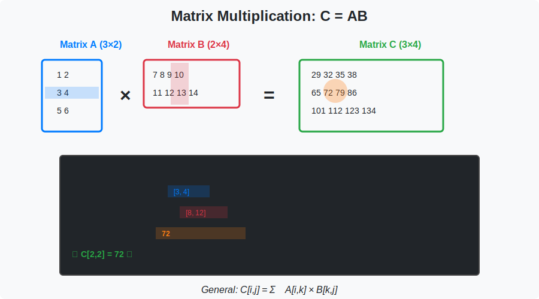

<!-- Animated Header -->
<p align="center">
  
</p>

<p align="center">
  
  
  
  
</p>


## ⚡ TL;DR

> **Vectors and matrices are the fundamental data structures of ML.** Every image is a matrix, every embedding is a vector, every batch is a tensor.

- 🔢 **Vectors**: Ordered lists of numbers — embeddings, features, gradients
- 📊 **Matrices**: 2D arrays — weight matrices, attention scores, images
- 📏 **Norms**: Measure size — L1 (sparsity), L2 (Euclidean), Frobenius
- 🔗 **Operations**: Dot product, matrix multiply, transpose, inverse

---

## 📑 Table of Contents

1. [Vectors: Definition and Operations](#1-vectors-definition-and-operations)
2. [Dot Product](#2-dot-product-complete-theory)
3. [Vector Norms](#3-vector-norms)
4. [Matrix Operations](#4-matrix-operations)
5. [Matrix Norms](#5-matrix-norms)
6. [Special Matrices](#6-special-matrices)
7. [Trace and Determinant](#7-trace-and-determinant)
8. [Code Implementation](#8-code-implementation)
9. [ML Applications](#9-ml-applications)
10. [Resources](#-resources)

---

## 🎨 Visual Overview



```
+-----------------------------------------------------------------------------+
|                    VECTORS AND MATRICES IN ML                                |
+-----------------------------------------------------------------------------+
|                                                                              |
|   VECTOR (1D)                 MATRIX (2D)                 TENSOR (ND)       |
|   -----------                 -----------                 -----------       |
|   [x₁]                        [a₁₁  a₁₂  a₁₃]            Batch of matrices  |
|   [x₂]   Word embedding       [a₂₁  a₂₂  a₂₃]  Image    [B, H, W, C]       |
|   [x₃]   Feature vector       [a₃₁  a₃₂  a₃₃]  Weights                     |
|   [ ⋮ ]   Gradient                                                          |
|   [xₙ]                                                                       |
|                                                                              |
|   KEY OPERATIONS                                                             |
|   --------------                                                             |
|   • Dot product: x·y = Σᵢ xᵢyᵢ           → Attention scores, similarity    |
|   • Matrix mult: (AB)ᵢⱼ = Σₖ AᵢₖBₖⱼ     → Neural network layers           |
|   • Norms: ‖x‖₂ = √(Σᵢ xᵢ²)             → Regularization, normalization   |
|   • Transpose: (Aᵀ)ᵢⱼ = Aⱼᵢ             → Backpropagation                 |
|                                                                              |
+-----------------------------------------------------------------------------+
```

---

## 1. Vectors: Definition and Operations

### 📌 Definition

A **vector** $\mathbf{x} \in \mathbb{R}^n$ is an ordered list of $n$ real numbers:

```math
\mathbf{x} = \begin{bmatrix} x_1 \\ x_2 \\ \vdots \\ x_n \end{bmatrix}
```

### 📐 Vector Operations

| Operation | Notation | Definition | Example |
|-----------|----------|------------|---------|
| Addition | $\mathbf{x} + \mathbf{y}$ | $[x\_1+y\_1, \ldots, x\_n+y\_n]^T$ | $[1,2]+[3,4]=[4,6]$ |
| Scalar mult | $\alpha\mathbf{x}$ | $[\alpha x\_1, \ldots, \alpha x\_n]^T$ | $2[1,2]=[2,4]$ |
| Dot product | $\mathbf{x} \cdot \mathbf{y}$ | $\sum\_i x\_i y\_i$ | $[1,2]\cdot[3,4]=11$ |
| Outer product | $\mathbf{x}\mathbf{y}^T$ | $[x\_i y\_j]$ matrix | Rank-1 matrix |
| Hadamard | $\mathbf{x} \odot \mathbf{y}$ | $[x\_1 y\_1, \ldots, x\_n y\_n]^T$ | Element-wise |

---

## 2. Dot Product: Complete Theory

### 📌 Definition

```math
\mathbf{x} \cdot \mathbf{y} = \mathbf{x}^T\mathbf{y} = \sum_{i=1}^{n} x_i y_i = \|\mathbf{x}\| \|\mathbf{y}\| \cos\theta
```

### 🔍 Proof: Geometric Formula

```
Goal: Prove x·y = ‖x‖·‖y‖·cos(θ)

Step 1: Start with the Law of Cosines
        In the triangle formed by x, y, and x-y:
        ‖x - y‖² = ‖x‖² + ‖y‖² - 2‖x‖‖y‖cos(θ)

Step 2: Expand ‖x - y‖² algebraically
        ‖x - y‖² = (x - y)ᵀ(x - y)
                 = xᵀx - 2xᵀy + yᵀy
                 = ‖x‖² - 2(xᵀy) + ‖y‖²

Step 3: Equate the two expressions
        ‖x‖² - 2(xᵀy) + ‖y‖² = ‖x‖² + ‖y‖² - 2‖x‖‖y‖cos(θ)

Step 4: Simplify
        -2(xᵀy) = -2‖x‖‖y‖cos(θ)
        xᵀy = ‖x‖‖y‖cos(θ)  ∎
```

### 🔍 Cauchy-Schwarz Inequality

**Theorem**: $|\mathbf{x} \cdot \mathbf{y}| \leq \|\mathbf{x}\| \|\mathbf{y}\|$

**Proof**:
```
Step 1: For any real t, consider f(t) = ‖x + ty‖² ≥ 0

Step 2: Expand
        f(t) = (x + ty)ᵀ(x + ty)
             = xᵀx + 2t(xᵀy) + t²(yᵀy)
             = ‖x‖² + 2t(xᵀy) + t²‖y‖²

Step 3: This is a quadratic in t: at² + bt + c ≥ 0 where
        a = ‖y‖², b = 2(xᵀy), c = ‖x‖²

Step 4: For a quadratic to be non-negative, discriminant ≤ 0
        b² - 4ac ≤ 0
        4(xᵀy)² - 4‖y‖²‖x‖² ≤ 0
        (xᵀy)² ≤ ‖x‖²‖y‖²
        |xᵀy| ≤ ‖x‖‖y‖  ∎

Equality holds iff x and y are linearly dependent (parallel).
```

### 💡 Examples

**Example 1**: Orthogonality
```
x = [1, 0, 1]
y = [0, 1, 0]

x·y = 1×0 + 0×1 + 1×0 = 0

Since x·y = 0, vectors x and y are orthogonal.
```

**Example 2**: Projection
```
Project x = [3, 4] onto y = [1, 0]

proj_y(x) = (x·y / ‖y‖²) × y
          = (3×1 + 4×0) / (1² + 0²) × [1, 0]
          = 3 × [1, 0]
          = [3, 0]
```

**Example 3**: Angle Between Vectors
```
x = [1, 1]
y = [1, 0]

cos(θ) = (x·y) / (‖x‖‖y‖)
       = (1×1 + 1×0) / (√2 × 1)
       = 1/√2

θ = arccos(1/√2) = 45°
```

---

## 3. Vector Norms

### 📌 Definition

A **norm** $\|\cdot\|$ is a function satisfying:

1. **Non-negativity**: $\|\mathbf{x}\| \geq 0$, with $\|\mathbf{x}\| = 0 \Leftrightarrow \mathbf{x} = \mathbf{0}$
2. **Homogeneity**: $\|\alpha\mathbf{x}\| = |\alpha| \|\mathbf{x}\|$
3. **Triangle inequality**: $\|\mathbf{x} + \mathbf{y}\| \leq \|\mathbf{x}\| + \|\mathbf{y}\|$

### 📊 Common Norms

| Norm | Formula | Unit Ball | ML Application |
|------|---------|-----------|----------------|
| $L^0$ (pseudo) | $\sum\_i \mathbf{1}\_{x\_i \neq 0}$ | Coordinate axes | Sparsity (non-convex!) |
| $L^1$ (Manhattan) | $\sum\_i |x\_i|$ | Diamond | LASSO, sparsity |
| $L^2$ (Euclidean) | $\sqrt{\sum\_i x\_i^2}$ | Circle | Weight decay, distance |
| $L^\infty$ (Max) | $\max\_i |x\_i|$ | Square | Adversarial robustness |
| $L^p$ | $(\sum\_i |x\_i|^p)^{1/p}$ | Superellipse | Generalized |

### 🔍 Proof: Triangle Inequality for L² Norm

```
Goal: Prove ‖x + y‖₂ ≤ ‖x‖₂ + ‖y‖₂

Step 1: Square both sides (valid since norms are non-negative)
        ‖x + y‖² ≤ (‖x‖ + ‖y‖)²

Step 2: Expand left side
        ‖x + y‖² = (x + y)ᵀ(x + y)
                 = xᵀx + 2xᵀy + yᵀy
                 = ‖x‖² + 2(xᵀy) + ‖y‖²

Step 3: Expand right side
        (‖x‖ + ‖y‖)² = ‖x‖² + 2‖x‖‖y‖ + ‖y‖²

Step 4: Need to show:
        ‖x‖² + 2(xᵀy) + ‖y‖² ≤ ‖x‖² + 2‖x‖‖y‖ + ‖y‖²
        ⟺ xᵀy ≤ ‖x‖‖y‖

Step 5: This follows from Cauchy-Schwarz!  ∎
```

### 📐 L1 vs L2 Regularization

```
L1 Regularization (LASSO):
  Loss = MSE + λ‖w‖₁
  Gradient: ∂‖w‖₁/∂wᵢ = sign(wᵢ)
  Effect: Drives weights to exactly 0 (sparsity)

L2 Regularization (Ridge/Weight Decay):
  Loss = MSE + λ‖w‖₂²
  Gradient: ∂‖w‖₂²/∂wᵢ = 2wᵢ
  Effect: Shrinks weights toward 0 (but not exactly 0)

+----------------------------------------------------------+
|  Why L1 produces sparsity but L2 doesn't:                |
|                                                          |
|  L1 gradient = constant (±λ) regardless of |wᵢ|         |
|  → Small weights get same push toward 0 as large ones   |
|  → Eventually reach exactly 0                           |
|                                                          |
|  L2 gradient = proportional to wᵢ                        |
|  → Small weights get small push toward 0                |
|  → Approach 0 asymptotically, never reach it            |
+----------------------------------------------------------+
```

---

## 4. Matrix Operations

### 📌 Matrix Multiplication

**Definition**: For $A \in \mathbb{R}^{m \times n}$ and $B \in \mathbb{R}^{n \times p}$:

```math
(AB)_{ij} = \sum_{k=1}^{n} A_{ik}B_{kj}
```

**Dimensions**: $(m \times n) \cdot (n \times p) = (m \times p)$

### 🔍 Three Interpretations

**1. Row-Column Dot Products**
```
(AB)ᵢⱼ = (row i of A) · (column j of B)
       = Σₖ AᵢₖBₖⱼ
```

**2. Linear Combination of Columns**
```
Each column of AB is a linear combination of columns of A:
(AB):,ⱼ = b₁ⱼ·A:,₁ + b₂ⱼ·A:,₂ + ... + bₙⱼ·A:,ₙ
```

**3. Sum of Outer Products**
```
AB = Σₖ A:,ₖ ⊗ Bₖ,:
   = (column 1 of A)(row 1 of B) + (column 2 of A)(row 2 of B) + ...
   = sum of n rank-1 matrices
```

### 📐 Key Properties

| Property | Formula | Proof |
|----------|---------|-------|
| Associativity | $(AB)C = A(BC)$ | Expand and verify |
| Distributivity | $A(B+C) = AB + AC$ | Linearity |
| **NOT** Commutative | $AB \neq BA$ | Counterexample below |
| Transpose | $(AB)^T = B^T A^T$ | $(AB)^T\_{ij} = (AB)\_{ji} = \sum\_k A\_{jk}B\_{ki}$ |
| Inverse | $(AB)^{-1} = B^{-1}A^{-1}$ | $(AB)(B^{-1}A^{-1}) = I$ |

### 🔍 Proof: Matrix Multiplication is NOT Commutative

```
Counterexample:

A = [1  0]    B = [0  1]
    [0  0]        [0  0]

AB = [0  1]    BA = [0  0]
     [0  0]         [0  0]

AB ≠ BA  ∎

Geometric intuition:
  A projects onto x-axis, B rotates by 90°
  "Project then rotate" ≠ "Rotate then project"
```

---

## 5. Matrix Norms

### 📊 Common Matrix Norms

| Norm | Formula | Computation | ML Use |
|------|---------|-------------|--------|
| Frobenius | $\|A\|\_F = \sqrt{\sum\_{ij} A\_{ij}^2}$ | $= \sqrt{\text{tr}(A^TA)} = \sqrt{\sum\_i \sigma\_i^2}$ | Weight decay |
| Spectral | $\|A\|\_2 = \sigma\_{\max}(A)$ | Largest singular value | Lipschitz |
| Nuclear | $\|A\|\_* = \sum\_i \sigma\_i$ | Sum of singular values | Low-rank |
| Max | $\|A\|\_{\max} = \max\_{ij} |A\_{ij}|$ | Largest entry | — |

### 🔍 Proof: Frobenius Norm = SVD Connection

```
Theorem: ‖A‖²_F = Σᵢ σᵢ²

Proof:
Step 1: Express in terms of trace
        ‖A‖²_F = Σᵢⱼ A²ᵢⱼ = tr(AᵀA)

Step 2: Use SVD: A = UΣVᵀ
        AᵀA = (UΣVᵀ)ᵀ(UΣVᵀ)
            = VΣᵀUᵀUΣVᵀ
            = VΣ²Vᵀ

Step 3: Apply cyclic property of trace
        tr(AᵀA) = tr(VΣ²Vᵀ)
                = tr(Σ²VᵀV)    (cyclic: tr(XY) = tr(YX))
                = tr(Σ²)        (since VᵀV = I)
                = Σᵢ σᵢ²  ∎
```

### 🔍 Submultiplicativity

**Theorem**: $\|AB\|\_F \leq \|A\|\_F \|B\|\_F$

```
Proof:
‖AB‖²_F = Σⱼ ‖(AB):,ⱼ‖²
        = Σⱼ ‖A·B:,ⱼ‖²
        ≤ Σⱼ ‖A‖²₂ · ‖B:,ⱼ‖²    (submult of spectral norm)
        ≤ Σⱼ ‖A‖²_F · ‖B:,ⱼ‖²   (since ‖A‖₂ ≤ ‖A‖_F)
        = ‖A‖²_F · Σⱼ ‖B:,ⱼ‖²
        = ‖A‖²_F · ‖B‖²_F  ∎
```

---

## 6. Special Matrices

### 📊 Matrix Types

| Type | Definition | Properties |
|------|------------|------------|
| **Symmetric** | $A = A^T$ | Real eigenvalues, orthogonal eigenvectors |
| **Orthogonal** | $Q^TQ = I$ | Preserves lengths and angles |
| **Diagonal** | $D\_{ij} = 0$ for $i \neq j$ | $D^n$ = diag of powers |
| **Positive Definite** | $\mathbf{x}^TA\mathbf{x} > 0$ | All eigenvalues > 0 |
| **Sparse** | Most entries = 0 | Efficient storage |

### 🔍 Orthogonal Matrices: Key Properties

```
Q is orthogonal means QᵀQ = QQᵀ = I

Property 1: Q⁻¹ = Qᵀ  (inverse is just transpose!)

Property 2: Preserves lengths
  ‖Qx‖² = (Qx)ᵀ(Qx) = xᵀQᵀQx = xᵀIx = ‖x‖²

Property 3: Preserves dot products
  (Qx)ᵀ(Qy) = xᵀQᵀQy = xᵀy

Property 4: det(Q) = ±1
  det(QᵀQ) = det(I)
  det(Qᵀ)det(Q) = 1
  det(Q)² = 1
  det(Q) = ±1

Examples: Rotation matrices, reflection matrices, permutation matrices
```

---

## 7. Trace and Determinant

### 📌 Trace

```math
\text{tr}(A) = \sum_{i=1}^{n} A_{ii}
```

### Key Properties

| Property | Formula | Proof |
|----------|---------|-------|
| Linearity | $\text{tr}(A+B) = \text{tr}(A) + \text{tr}(B)$ | Sum of sums |
| Cyclic | $\text{tr}(ABC) = \text{tr}(BCA) = \text{tr}(CAB)$ | Index manipulation |
| Transpose | $\text{tr}(A) = \text{tr}(A^T)$ | Diagonal unchanged |
| Eigenvalues | $\text{tr}(A) = \sum\_i \lambda\_i$ | Coefficients of char. poly |

### 🔍 Proof: Cyclic Property

```
tr(AB) = Σᵢ(AB)ᵢᵢ = Σᵢ Σⱼ AᵢⱼBⱼᵢ

tr(BA) = Σⱼ(BA)ⱼⱼ = Σⱼ Σᵢ BⱼᵢAᵢⱼ

Same terms, just summed in different order!

tr(AB) = tr(BA)  ∎

For three matrices:
tr(ABC) = tr((AB)C) = tr(C(AB)) = tr(CAB)  ∎
```

### 📌 Determinant

```math
\det(A) = \sum_{\sigma \in S_n} \text{sgn}(\sigma) \prod_{i=1}^{n} A_{i,\sigma(i)}
```

### Key Properties

| Property | Formula |
|----------|---------|
| Multiplicative | $\det(AB) = \det(A)\det(B)$ |
| Transpose | $\det(A^T) = \det(A)$ |
| Inverse | $\det(A^{-1}) = 1/\det(A)$ |
| Eigenvalues | $\det(A) = \prod\_i \lambda\_i$ |

### 🔍 Geometric Interpretation

```
|det(A)| = volume scaling factor

For 2×2 matrix A = [a b]:
                   [c d]

  det(A) = ad - bc

  • If det(A) > 0: Preserves orientation
  • If det(A) < 0: Reverses orientation (reflection)
  • If det(A) = 0: Collapses to lower dimension (singular)
```

---

## 8. Code Implementation

```python
import numpy as np
import torch

# =============================================================================
# VECTOR OPERATIONS
# =============================================================================

def dot_product(x, y):
    """Compute dot product x·y"""
    return np.dot(x, y)  # or x @ y

def outer_product(x, y):
    """Compute outer product xyᵀ (rank-1 matrix)"""
    return np.outer(x, y)

def projection(x, y):
    """Project x onto y"""
    return (np.dot(x, y) / np.dot(y, y)) * y

def angle_between(x, y):
    """Compute angle between vectors (in radians)"""
    cos_theta = np.dot(x, y) / (np.linalg.norm(x) * np.linalg.norm(y))
    return np.arccos(np.clip(cos_theta, -1, 1))

# =============================================================================
# NORMS
# =============================================================================

def vector_norms(x):
    """Compute various vector norms"""
    return {
        'L0': np.sum(x != 0),
        'L1': np.linalg.norm(x, ord=1),
        'L2': np.linalg.norm(x, ord=2),
        'Linf': np.linalg.norm(x, ord=np.inf),
    }

def matrix_norms(A):
    """Compute various matrix norms"""
    U, S, Vh = np.linalg.svd(A)
    return {
        'Frobenius': np.linalg.norm(A, 'fro'),
        'Spectral': np.linalg.norm(A, 2),
        'Nuclear': np.sum(S),
        'Max': np.max(np.abs(A)),
    }

# =============================================================================
# MATRIX OPERATIONS
# =============================================================================

def verify_transpose_product(A, B):
    """Verify (AB)ᵀ = BᵀAᵀ"""
    AB_transpose = (A @ B).T
    Bt_At = B.T @ A.T
    return np.allclose(AB_transpose, Bt_At)

def efficient_trace_product(A, B):
    """Compute tr(AB) without forming AB"""
    # tr(AB) = Σᵢⱼ AᵢⱼBⱼᵢ = Σᵢⱼ AᵢⱼBᵀᵢⱼ
    return np.sum(A * B.T)  # O(n²) instead of O(n³)

def is_orthogonal(Q, tol=1e-10):
    """Check if matrix is orthogonal"""
    n = Q.shape[0]
    return np.allclose(Q @ Q.T, np.eye(n), atol=tol)

def is_positive_definite(A, tol=1e-10):
    """Check if symmetric matrix is positive definite"""
    if not np.allclose(A, A.T):
        return False
    eigenvalues = np.linalg.eigvalsh(A)
    return np.all(eigenvalues > tol)

# =============================================================================
# DEMONSTRATIONS
# =============================================================================

if __name__ == "__main__":
    # Vector examples
    x = np.array([1.0, 2.0, 3.0])
    y = np.array([4.0, 5.0, 6.0])
    
    print("=== Vector Operations ===")
    print(f"x·y = {dot_product(x, y)}")
    print(f"Angle = {np.degrees(angle_between(x, y)):.2f}°")
    print(f"Norms of x: {vector_norms(x)}")
    
    # Matrix examples
    A = np.random.randn(3, 4)
    B = np.random.randn(4, 5)
    
    print("\n=== Matrix Operations ===")
    print(f"A shape: {A.shape}, B shape: {B.shape}")
    print(f"AB shape: {(A @ B).shape}")
    print(f"(AB)ᵀ = BᵀAᵀ? {verify_transpose_product(A, B)}")
    
    # Trace efficiency
    C = np.random.randn(100, 100)
    D = np.random.randn(100, 100)
    tr_slow = np.trace(C @ D)
    tr_fast = efficient_trace_product(C, D)
    print(f"\ntr(CD) slow vs fast match: {np.isclose(tr_slow, tr_fast)}")
    
    # Special matrices
    print("\n=== Special Matrices ===")
    Q, _ = np.linalg.qr(np.random.randn(3, 3))
    print(f"Q is orthogonal: {is_orthogonal(Q)}")
    
    PD = C @ C.T + 0.1 * np.eye(100)
    print(f"PD is positive definite: {is_positive_definite(PD)}")
```

### PyTorch Implementation

```python
import torch
import torch.nn as nn

class VectorOperations:
    """GPU-accelerated vector operations"""
    
    @staticmethod
    def dot_product(x, y):
        return torch.dot(x, y)
    
    @staticmethod
    def cosine_similarity(x, y):
        return torch.dot(x, y) / (torch.norm(x) * torch.norm(y))
    
    @staticmethod
    def batch_dot_product(X, Y):
        """Dot product for batches: [B, D] × [B, D] → [B]"""
        return torch.sum(X * Y, dim=-1)

class NormLayers(nn.Module):
    """Normalization using norms"""
    
    def __init__(self, dim):
        super().__init__()
        self.dim = dim
    
    def l2_normalize(self, x):
        """Normalize to unit L2 norm"""
        return x / (torch.norm(x, dim=-1, keepdim=True) + 1e-8)
    
    def batch_norm_manual(self, x, gamma, beta, eps=1e-5):
        """Manual batch norm implementation"""
        mean = x.mean(dim=0)
        var = x.var(dim=0, unbiased=False)
        x_norm = (x - mean) / torch.sqrt(var + eps)
        return gamma * x_norm + beta

# Efficient batched operations
def attention_scores(Q, K):
    """
    Compute attention scores using batched dot products
    Q: [B, H, T, D]
    K: [B, H, T, D]
    Returns: [B, H, T, T]
    """
    d_k = Q.size(-1)
    scores = torch.matmul(Q, K.transpose(-2, -1)) / (d_k ** 0.5)
    return scores
```

---

## 9. ML Applications

### 🤖 Application 1: Layer Normalization

```python
def layer_norm(x, gamma, beta, eps=1e-5):
    """
    Layer normalization uses norms to stabilize activations.
    
    x: [B, T, D] input
    gamma, beta: [D] learnable parameters
    """
    # Compute mean and variance over last dimension
    mean = x.mean(dim=-1, keepdim=True)
    var = x.var(dim=-1, keepdim=True, unbiased=False)
    
    # Normalize
    x_norm = (x - mean) / torch.sqrt(var + eps)
    
    # Scale and shift
    return gamma * x_norm + beta
```

### 🤖 Application 2: Cosine Similarity for Retrieval

```python
def cosine_similarity_search(query, database):
    """
    Find most similar vectors using cosine similarity.
    
    query: [D] single query vector
    database: [N, D] database of N vectors
    """
    # Normalize
    query_norm = query / torch.norm(query)
    db_norm = database / torch.norm(database, dim=1, keepdim=True)
    
    # Cosine similarities = dot products of normalized vectors
    similarities = db_norm @ query_norm
    
    # Top-k retrieval
    top_k_scores, top_k_indices = torch.topk(similarities, k=10)
    
    return top_k_indices, top_k_scores
```

### 🤖 Application 3: Weight Decay Regularization

```python
def weight_decay_loss(model, lambda_l2=0.01):
    """
    L2 regularization = minimizing Frobenius norm of weights
    """
    l2_penalty = 0
    for param in model.parameters():
        l2_penalty += torch.norm(param, p='fro') ** 2
    
    return lambda_l2 * l2_penalty

# In practice, use optimizer's weight_decay parameter:
# optimizer = torch.optim.AdamW(model.parameters(), weight_decay=0.01)
```

---

## 📚 Resources

| Type | Resource | Description |
|------|----------|-------------|
| 🎥 | [3Blue1Brown: Linear Algebra](https://www.youtube.com/playlist?list=PLZHQObOWTQDPD3MizzM2xVFitgF8hE_ab) | Visual intuition |
| 📖 | [MIT 18.06](https://ocw.mit.edu/courses/18-06-linear-algebra-spring-2010/) | Strang's course |
| 📖 | NumPy Documentation | [numpy.org](https://numpy.org/doc/stable/) |

---

## 🗺️ Navigation

| ⬅️ Previous | 🏠 Home | ➡️ Next |
|:-----------:|:-------:|:-------:|
| [Transformations](../08_transformations/README.md) | [Linear Algebra](../README.md) | [Vector Spaces](../10_vector_spaces/README.md) |

---


<p align="center">
  
</p>
