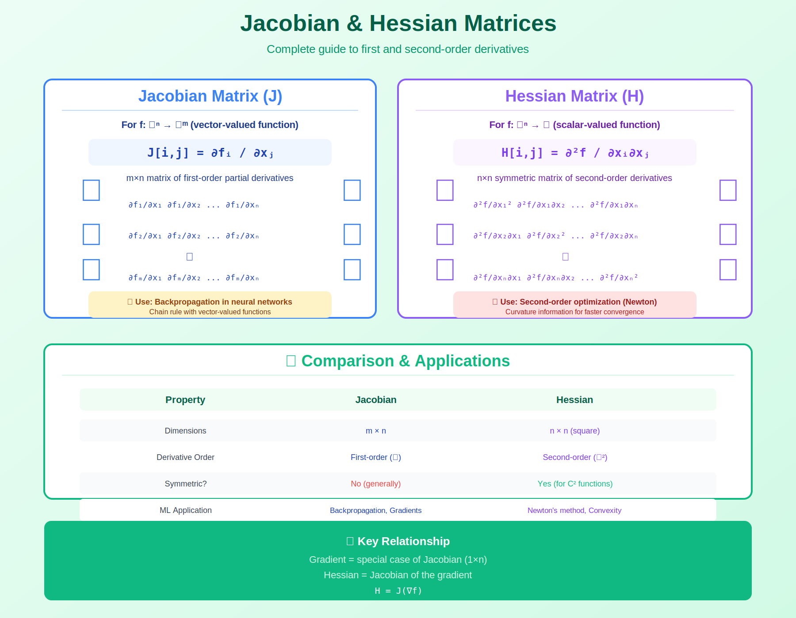

<!-- Animated Header -->
<p align="center">
  
</p>

<p align="center">
  
  
  
  
</p>


## ⚡ TL;DR

> **These are the fundamental derivatives of multivariable calculus.** Gradients point to steepest ascent, Jacobians linearize vector functions, Hessians capture curvature.

- 📐 **Gradient** ($\nabla f$): Direction of steepest increase for scalar functions
- 📊 **Jacobian** ($J$): Matrix of all partial derivatives for vector functions
- 🔄 **Hessian** ($H$): Matrix of second derivatives, captures curvature

---

## 📑 Table of Contents

1. [Gradient](#1-gradient)
2. [Jacobian Matrix](#2-jacobian-matrix)
3. [Hessian Matrix](#3-hessian-matrix)
4. [Relationships](#4-relationships-between-them)
5. [Matrix Calculus Identities](#5-matrix-calculus-identities)
6. [Code Implementation](#6-code-implementation)
7. [ML Applications](#7-ml-applications)
8. [Resources](#-resources)

---

## 🎨 Visual Overview



```
+-----------------------------------------------------------------------------+
|                    GRADIENT / JACOBIAN / HESSIAN                             |
+-----------------------------------------------------------------------------+
|                                                                              |
|   FUNCTION TYPE           DERIVATIVE TYPE         DIMENSION                 |
|   -------------           ---------------         ---------                 |
|                                                                              |
|   f: ℝ → ℝ                f'(x)                   Scalar                    |
|   (scalar → scalar)       (derivative)                                       |
|                                                                              |
|   f: ℝⁿ → ℝ               ∇f(x)                   Vector (n×1)              |
|   (vector → scalar)       (GRADIENT)              Points to steepest ascent |
|                                                                              |
|   f: ℝⁿ → ℝᵐ              J(x)                    Matrix (m×n)              |
|   (vector → vector)       (JACOBIAN)              Row i = ∇fᵢ               |
|                                                                              |
|   f: ℝⁿ → ℝ               H(x) = ∇²f(x)           Matrix (n×n)              |
|   (second derivative)     (HESSIAN)               Symmetric, curvature      |
|                                                                              |
|   GRADIENT DESCENT: θ ← θ - α∇L(θ)                                          |
|   NEWTON'S METHOD: θ ← θ - H⁻¹∇L(θ)                                         |
|                                                                              |
+-----------------------------------------------------------------------------+

```

---

## 1. Gradient

### 📌 Definition

For $f: \mathbb{R}^n \to \mathbb{R}$:

```math
\nabla f(\mathbf{x}) = \begin{bmatrix} \frac{\partial f}{\partial x_1} \\ \frac{\partial f}{\partial x_2} \\ \vdots \\ \frac{\partial f}{\partial x_n} \end{bmatrix}

```

### 📐 Key Properties

| Property | Formula | Interpretation |
|----------|---------|----------------|
| Direction | $\nabla f / \|\nabla f\|$ | Steepest ascent direction |
| Magnitude | $\|\nabla f\|$ | Rate of maximum increase |
| Level sets | $\nabla f \perp$ level curves | Perpendicular to contours |
| Critical point | $\nabla f = 0$ | Local extremum or saddle |

### 🔍 Proof: Gradient Points to Steepest Ascent

```
Goal: Show that ∇f is the direction of maximum rate of change.

Step 1: Directional derivative in direction u (unit vector):
        Dᵤf = lim_{h→0} [f(x + hu) - f(x)] / h
            = ∇f · u  (by chain rule)
            = ‖∇f‖ ‖u‖ cos(θ)
            = ‖∇f‖ cos(θ)  (since ‖u‖ = 1)

Step 2: Maximum rate of change
        Dᵤf is maximized when cos(θ) = 1, i.e., θ = 0
        This means u points in same direction as ∇f

Step 3: Value of maximum rate
        max Dᵤf = ‖∇f‖ · 1 = ‖∇f‖

Therefore: ∇f points in direction of steepest ascent
           with rate of increase = ‖∇f‖  ∎

```

### 💡 Examples

**Example 1**: Quadratic Function

```
f(x, y) = x² + 4y²

∂f/∂x = 2x
∂f/∂y = 8y

∇f = [2x, 8y]ᵀ

At (1, 2):
  ∇f = [2, 16]ᵀ
  Direction of steepest ascent: [2, 16]/‖[2, 16]‖
  Rate of increase: √(4 + 256) = √260 ≈ 16.1

```

**Example 2**: Cross-Entropy Loss

```
L = -Σᵢ yᵢ log(pᵢ)  where pᵢ = softmax(zᵢ)

∂L/∂zⱼ = pⱼ - yⱼ  (the famous softmax gradient!)

Proof:
  For softmax: pⱼ = e^zⱼ / Σₖ e^zₖ
  
  ∂pⱼ/∂zₖ = pⱼ(δⱼₖ - pₖ)  where δⱼₖ is Kronecker delta
  
  ∂L/∂zⱼ = -Σᵢ yᵢ (1/pᵢ) ∂pᵢ/∂zⱼ
         = -Σᵢ yᵢ (1/pᵢ) pᵢ(δᵢⱼ - pⱼ)
         = -Σᵢ yᵢ(δᵢⱼ - pⱼ)
         = -yⱼ + pⱼΣᵢyᵢ
         = -yⱼ + pⱼ  (since Σᵢyᵢ = 1 for one-hot)
         = pⱼ - yⱼ  ∎

```

---

## 2. Jacobian Matrix

### 📌 Definition

For $\mathbf{f}: \mathbb{R}^n \to \mathbb{R}^m$:

```math
J = \begin{bmatrix} \nabla f_1^T \\ \nabla f_2^T \\ \vdots \\ \nabla f_m^T \end{bmatrix} = \begin{bmatrix} \frac{\partial f_1}{\partial x_1} & \cdots & \frac{\partial f_1}{\partial x_n} \\ \vdots & \ddots & \vdots \\ \frac{\partial f_m}{\partial x_1} & \cdots & \frac{\partial f_m}{\partial x_n} \end{bmatrix}

```

**Key**: Row $i$ = gradient of $f\_i$, Column $j$ = sensitivity to $x\_j$

### 📐 Linear Approximation

```math
\mathbf{f}(\mathbf{x} + \delta) \approx \mathbf{f}(\mathbf{x}) + J(\mathbf{x}) \cdot \delta

```

The Jacobian is the **best linear approximation** to $\mathbf{f}$ near $\mathbf{x}$.

### 🔍 Chain Rule with Jacobians

For $\mathbf{h} = \mathbf{f} \circ \mathbf{g}$:

```math
J_{\mathbf{h}} = J_{\mathbf{f}} \cdot J_{\mathbf{g}}

```

This is why backpropagation multiplies Jacobians!

### 💡 Examples

**Example 1**: Basic Jacobian

```
f: ℝ² → ℝ³
f(x, y) = [x²y, xy², x+y]

J = [∂f₁/∂x  ∂f₁/∂y]   [2xy   x² ]
    [∂f₂/∂x  ∂f₂/∂y] = [y²    2xy]
    [∂f₃/∂x  ∂f₃/∂y]   [1     1  ]

At (1, 2):
J = [4   1]
    [4   4]
    [1   1]

```

**Example 2**: Neural Network Layer

```
Layer: h = σ(Wx + b)  where σ is element-wise activation

∂h/∂x = diag(σ'(Wx + b)) · W

Jacobian = D · W  where D = diagonal matrix of activation derivatives

For ReLU: D = diag(1[Wx+b > 0])
For sigmoid: D = diag(σ(z)(1-σ(z)))

```

### 📐 Jacobian Determinant

For square Jacobian ($m = n$):

```math
\det(J) = \text{local volume scaling factor}

```

**Applications**:
- Normalizing flows: $p(x) = p(f^{-1}(x)) \cdot |\det(J\_{f^{-1}})|$
- Change of variables in integration

---

## 3. Hessian Matrix

### 📌 Definition

For $f: \mathbb{R}^n \to \mathbb{R}$:

```math
H = \nabla^2 f = \begin{bmatrix} \frac{\partial^2 f}{\partial x_1^2} & \frac{\partial^2 f}{\partial x_1 \partial x_2} & \cdots & \frac{\partial^2 f}{\partial x_1 \partial x_n} \\ \frac{\partial^2 f}{\partial x_2 \partial x_1} & \frac{\partial^2 f}{\partial x_2^2} & \cdots & \frac{\partial^2 f}{\partial x_2 \partial x_n} \\ \vdots & \vdots & \ddots & \vdots \\ \frac{\partial^2 f}{\partial x_n \partial x_1} & \frac{\partial^2 f}{\partial x_n \partial x_2} & \cdots & \frac{\partial^2 f}{\partial x_n^2} \end{bmatrix}

```

**Key**: $H$ is symmetric for $C^2$ functions (Schwarz's theorem)

### 📐 Taylor Expansion (Quadratic Approximation)

```math
f(\mathbf{x} + \delta) \approx f(\mathbf{x}) + \nabla f(\mathbf{x})^T \delta + \frac{1}{2} \delta^T H(\mathbf{x}) \delta

```

### 📐 Critical Point Classification

At a critical point where $\nabla f = 0$:

| Hessian Property | Point Type |
|------------------|------------|
| $H \succ 0$ (positive definite) | **Local minimum** |
| $H \prec 0$ (negative definite) | **Local maximum** |
| $H$ indefinite | **Saddle point** |
| $H$ singular | Inconclusive (higher order needed) |

### 🔍 Proof: Positive Definite Hessian ⟹ Local Minimum

```
Proof:

Step 1: Taylor expansion at critical point x* where ∇f(x*) = 0
        f(x* + δ) = f(x*) + ∇f(x*)ᵀδ + ½δᵀH(x*)δ + O(‖δ‖³)
                  = f(x*) + 0 + ½δᵀHδ + O(‖δ‖³)
                  = f(x*) + ½δᵀHδ + O(‖δ‖³)

Step 2: If H ≻ 0, then δᵀHδ > 0 for all δ ≠ 0
        Let λ_min > 0 be smallest eigenvalue of H
        Then: δᵀHδ ≥ λ_min ‖δ‖²

Step 3: For small enough ‖δ‖:
        ½δᵀHδ dominates O(‖δ‖³)
        So: f(x* + δ) > f(x*) for all small δ ≠ 0

Step 4: This means x* is a local minimum.  ∎

```

### 💡 Examples

**Example 1**: Quadratic Function

```
f(x, y) = x² + 3xy + 2y²

∇f = [2x + 3y, 3x + 4y]ᵀ

H = [∂²f/∂x²     ∂²f/∂x∂y]   [2  3]
    [∂²f/∂y∂x   ∂²f/∂y²  ] = [3  4]

Eigenvalues of H: 
  λ = (6 ± √(36-4·(-1)))/2 = (6 ± √40)/2 ≈ 6.16, -0.16

H is indefinite (one positive, one negative eigenvalue)
→ The origin is a SADDLE POINT

```

**Example 2**: Condition Number

```
f(x, y) = x² + 100y²  (ill-conditioned)

H = [2    0 ]
    [0   200]

Condition number: κ = λ_max/λ_min = 200/2 = 100

This means gradient descent will be slow!
- Fast convergence along x (low curvature)
- Slow convergence along y (high curvature)

```

---

## 4. Relationships Between Them

```
+-----------------------------------------------------------------+
|                     DERIVATIVE HIERARCHY                         |
+-----------------------------------------------------------------+
|                                                                  |
|   f: ℝⁿ → ℝ          f: ℝⁿ → ℝᵐ                                 |
|                                                                  |
|   ∇f ∈ ℝⁿ            J ∈ ℝᵐˣⁿ                                   |
|   (gradient)         (Jacobian)                                  |
|       |                  |                                       |
|       |                  |                                       |
|       ▼                  ▼                                       |
|   H = ∇(∇f) ∈ ℝⁿˣⁿ   ∂J/∂x = tensor                            |
|   (Hessian)           (3rd order)                                |
|                                                                  |
|   KEY RELATIONSHIPS:                                             |
|   -----------------                                              |
|   • H = Jacobian of gradient: H = J(∇f)                          |
|   • Gradient = transpose of single-row Jacobian                  |
|   • For scalar loss L: ∂L/∂x = (J^T) @ (∂L/∂f)                  |
|                                                                  |
+-----------------------------------------------------------------+

```

---

## 5. Matrix Calculus Identities

### 📊 Essential Identities

| Expression | Gradient / Derivative |
|------------|----------------------|
| $f = \mathbf{a}^T\mathbf{x}$ | $\nabla\_x f = \mathbf{a}$ |
| $f = \mathbf{x}^T\mathbf{x}$ | $\nabla\_x f = 2\mathbf{x}$ |
| $f = \mathbf{x}^T A \mathbf{x}$ | $\nabla\_x f = (A + A^T)\mathbf{x}$, $= 2A\mathbf{x}$ if symmetric |
| $f = \|A\mathbf{x} - \mathbf{b}\|^2$ | $\nabla\_x f = 2A^T(A\mathbf{x} - \mathbf{b})$ |
| $f = \text{tr}(AB)$ | $\nabla\_A f = B^T$ |
| $f = \log \det(A)$ | $\nabla\_A f = A^{-T}$ |

### 🔍 Derivation: Gradient of $\|\mathbf{Ax} - \mathbf{b}\|^2$

```
f(x) = ‖Ax - b‖² = (Ax - b)ᵀ(Ax - b)

Step 1: Expand
        f = xᵀAᵀAx - 2xᵀAᵀb + bᵀb

Step 2: Take gradient
        ∇f = 2AᵀAx - 2Aᵀb + 0
           = 2Aᵀ(Ax - b)

Step 3: Set to zero for least squares solution
        0 = Aᵀ(Ax - b)
        AᵀAx = Aᵀb
        x = (AᵀA)⁻¹Aᵀb  (normal equations)

```

---

## 6. Code Implementation

```python
import torch
import numpy as np
from torch.autograd.functional import jacobian, hessian

# ============================================================
# GRADIENT COMPUTATION
# ============================================================

def compute_gradient(f, x):
    """Compute gradient of scalar function f at point x."""
    x = x.clone().requires_grad_(True)
    y = f(x)
    y.backward()
    return x.grad

# Example: Gradient of loss
def mse_loss(params):
    # Simulated prediction and target
    pred = params @ torch.randn(3, 1)
    target = torch.ones(3, 1)
    return ((pred - target) ** 2).mean()

params = torch.randn(3, 3)
grad = compute_gradient(mse_loss, params)
print(f"Gradient shape: {grad.shape}")

# ============================================================
# JACOBIAN COMPUTATION
# ============================================================

def neural_layer(x):
    """Example: Linear layer followed by ReLU."""
    W = torch.randn(5, 3)
    return torch.relu(x @ W.T)

x = torch.randn(3)
J = jacobian(neural_layer, x)
print(f"Jacobian shape: {J.shape}")  # (5, 3)

# Verify Jacobian numerically
def numerical_jacobian(f, x, eps=1e-5):
    n = len(x)
    m = len(f(x))
    J = torch.zeros(m, n)
    for i in range(n):
        x_plus = x.clone()
        x_plus[i] += eps
        x_minus = x.clone()
        x_minus[i] -= eps
        J[:, i] = (f(x_plus) - f(x_minus)) / (2 * eps)
    return J

# ============================================================
# HESSIAN COMPUTATION
# ============================================================

def quadratic(x):
    """Example: Quadratic function x^T A x + b^T x."""
    A = torch.tensor([[2., 1.], [1., 3.]])
    b = torch.tensor([1., 2.])
    return x @ A @ x + b @ x

x = torch.tensor([1., 1.])
H = hessian(quadratic, x)
print(f"Hessian:\n{H}")

# Analyze critical point
eigenvalues = torch.linalg.eigvalsh(H)
print(f"Eigenvalues: {eigenvalues}")
if torch.all(eigenvalues > 0):
    print("Positive definite → Local minimum exists")
elif torch.all(eigenvalues < 0):
    print("Negative definite → Local maximum exists")
else:
    print("Indefinite → Saddle point")

# ============================================================
# OPTIMIZATION USING GRADIENTS
# ============================================================

def gradient_descent(f, x0, lr=0.01, n_steps=100):
    """Basic gradient descent."""
    x = x0.clone().requires_grad_(True)
    history = [x.detach().clone()]
    
    for _ in range(n_steps):
        loss = f(x)
        loss.backward()
        
        with torch.no_grad():
            x -= lr * x.grad
            x.grad.zero_()
        
        history.append(x.detach().clone())
    
    return x.detach(), history

def newtons_method(f, x0, n_steps=10):
    """Newton's method using Hessian."""
    x = x0.clone()
    
    for _ in range(n_steps):
        # Compute gradient and Hessian
        x_req = x.clone().requires_grad_(True)
        grad = torch.autograd.grad(f(x_req), x_req, create_graph=True)[0]
        H = hessian(f, x)
        
        # Newton update: x = x - H⁻¹∇f
        with torch.no_grad():
            x = x - torch.linalg.solve(H, grad)
    
    return x

# Example: Minimize Rosenbrock function
def rosenbrock(x):
    return (1 - x[0])**2 + 100 * (x[1] - x[0]**2)**2

x0 = torch.tensor([-1., 1.])
x_opt, history = gradient_descent(rosenbrock, x0, lr=0.001, n_steps=10000)
print(f"GD solution: {x_opt}")  # Should approach [1, 1]

```

---

## 7. ML Applications

### 🤖 Gradient Descent

```python
# The fundamental training loop
for batch in dataloader:
    # Forward
    loss = model(batch)
    
    # Compute gradients (via chain rule)
    loss.backward()  # ∇L(θ) computed
    
    # Update parameters
    optimizer.step()  # θ ← θ - α∇L(θ)
    optimizer.zero_grad()

```

### 🤖 Newton's Method (Second-Order)

```python
# Uses Hessian for faster convergence
# Update: θ ← θ - H⁻¹∇L

# Impractical for deep learning (H is n×n where n = millions)
# Approximations: L-BFGS, K-FAC, Adam (diagonal Hessian)

```

### 🤖 Normalizing Flows

```python
# Change of variables requires Jacobian determinant
# p(x) = p(f⁻¹(x)) · |det(J_{f⁻¹}(x))|

def log_prob_flow(z, flow_layers):
    log_prob = standard_normal_log_prob(z)
    x = z
    for layer in flow_layers:
        x, log_det_J = layer.forward_with_log_det(x)
        log_prob -= log_det_J  # Subtract because inverse
    return x, log_prob

```

---

## 📚 Resources

| Type | Resource | Description |
|------|----------|-------------|
| 🎥 | [3Blue1Brown: Gradient](https://www.youtube.com/watch?v=tIpKfDc295M) | Visual intuition |
| 📖 | [Matrix Cookbook](https://www.math.uwaterloo.ca/~hwolkowi/matrixcookbook.pdf) | Identity reference |
| 🎥 | [Khan Academy Multivariable](https://www.khanacademy.org/math/multivariable-calculus) | Complete course |

---

## 🗺️ Navigation

| ⬅️ Previous | 🏠 Home | ➡️ Next |
|:-----------:|:-------:|:-------:|
| [Derivatives](../02_derivatives/README.md) | [Calculus](../README.md) | [Integration](../04_integration/README.md) |

---


<p align="center">
  
</p>
