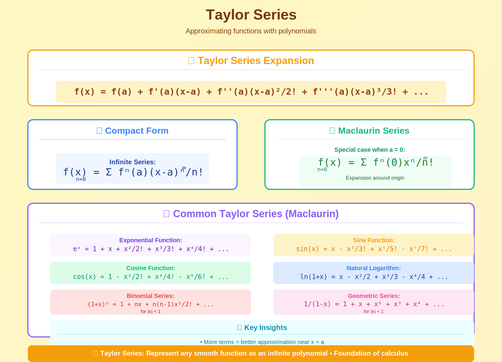

<!-- Animated Header -->
<p align="center">
  
</p>

<p align="center">
  
  
  
</p>


---

## 🎯 Visual Overview



*Caption: Taylor series approximates functions using derivatives at a single point. Adding more terms improves accuracy. This is fundamental to understanding gradients, Hessians, and optimization in ML.*

---

## 📂 Overview

Taylor series represent smooth functions as infinite polynomials. The first few terms often provide excellent approximations, enabling analysis of complex functions. In ML, Taylor expansions underpin gradient descent, Newton's method, and loss landscape analysis.

---

## 📐 Taylor Series: Formal Definition

### Definition

**Taylor Series:** If $f$ is infinitely differentiable at $a$, its Taylor series is:

```math
f(x) = \sum_{n=0}^{\infty} \frac{f^{(n)}(a)}{n!}(x-a)^n = f(a) + f'(a)(x-a) + \frac{f''(a)}{2!}(x-a)^2 + \frac{f'''(a)}{3!}(x-a)^3 + \cdots
```

**Maclaurin Series:** Taylor series centered at $a = 0$:

```math
f(x) = \sum_{n=0}^{\infty} \frac{f^{(n)}(0)}{n!}x^n
```

### Taylor's Theorem with Remainder

**Theorem:** If $f$ has $n+1$ continuous derivatives on $[a, x]$, then:

```math
f(x) = \sum_{k=0}^{n} \frac{f^{(k)}(a)}{k!}(x-a)^k + R_n(x)
```

where the remainder $R_n(x)$ can be expressed as:

**Lagrange Form:**

```math
R_n(x) = \frac{f^{(n+1)}(c)}{(n+1)!}(x-a)^{n+1}
```

for some $c$ between $a$ and $x$.

**Integral Form:**

```math
R_n(x) = \frac{1}{n!}\int_a^x (x-t)^n f^{(n+1)}(t) \, dt
```

---

## 📊 Derivation and Proof

### Why Does Taylor Series Work?

**Key Insight:** We want to find coefficients $c_0, c_1, c_2, \ldots$ such that:

```math
f(x) = c_0 + c_1(x-a) + c_2(x-a)^2 + c_3(x-a)^3 + \cdots
```

**Derivation:**
```
Step 1: At x = a
f(a) = c₀ + 0 + 0 + ... = c₀
Therefore: c₀ = f(a)

Step 2: Differentiate once
f'(x) = c₁ + 2c₂(x-a) + 3c₃(x-a)² + ...
f'(a) = c₁
Therefore: c₁ = f'(a)

Step 3: Differentiate twice
f''(x) = 2c₂ + 6c₃(x-a) + 12c₄(x-a)² + ...
f''(a) = 2c₂
Therefore: c₂ = f''(a)/2!

Step 4: Differentiate n times
f⁽ⁿ⁾(a) = n! · cₙ
Therefore: cₙ = f⁽ⁿ⁾(a)/n!

This proves the Taylor series formula! ✓
```

### Proof of Taylor's Theorem (Remainder)

**Proof using integration by parts:**
```
Start with: f(x) - f(a) = ∫ₐˣ f'(t) dt

Integration by parts with u = f'(t), dv = dt:
But let's use u = f'(t), dv = d(-(x-t))

∫ₐˣ f'(t) dt = [-f'(t)(x-t)]ₐˣ + ∫ₐˣ f''(t)(x-t) dt
             = f'(a)(x-a) + ∫ₐˣ f''(t)(x-t) dt

Apply integration by parts again to the integral:
∫ₐˣ f''(t)(x-t) dt = f''(a)(x-a)²/2 + ∫ₐˣ f'''(t)(x-t)²/2 dt

Continuing this pattern:
f(x) = f(a) + f'(a)(x-a) + f''(a)(x-a)²/2! + ... + f⁽ⁿ⁾(a)(x-a)ⁿ/n! + Rₙ(x)

where Rₙ(x) = (1/n!) ∫ₐˣ f⁽ⁿ⁺¹⁾(t)(x-t)ⁿ dt ✓
```

---

## 🔑 Important Taylor Series

### Exponential Function

```math
e^x = \sum_{n=0}^{\infty} \frac{x^n}{n!} = 1 + x + \frac{x^2}{2!} + \frac{x^3}{3!} + \cdots
```

**Proof:**
```
f(x) = eˣ
f'(x) = eˣ
f''(x) = eˣ
f⁽ⁿ⁾(x) = eˣ

At x = 0: f⁽ⁿ⁾(0) = e⁰ = 1 for all n

Taylor series: eˣ = Σₙ (1/n!) xⁿ = 1 + x + x²/2! + x³/3! + ... ✓

Radius of convergence: ∞ (converges for all x)
```

### Sine and Cosine

```math
\sin(x) = \sum_{n=0}^{\infty} \frac{(-1)^n x^{2n+1}}{(2n+1)!} = x - \frac{x^3}{3!} + \frac{x^5}{5!} - \cdots
\cos(x) = \sum_{n=0}^{\infty} \frac{(-1)^n x^{2n}}{(2n)!} = 1 - \frac{x^2}{2!} + \frac{x^4}{4!} - \cdots
```

**Proof for sin(x):**
```
f(x) = sin(x)
f'(x) = cos(x)
f''(x) = -sin(x)
f'''(x) = -cos(x)
f⁽⁴⁾(x) = sin(x)  [pattern repeats]

At x = 0:
f(0) = 0, f'(0) = 1, f''(0) = 0, f'''(0) = -1, f⁽⁴⁾(0) = 0, ...

Only odd powers survive:
sin(x) = x - x³/3! + x⁵/5! - x⁷/7! + ... ✓
```

### Natural Logarithm

```math
\ln(1+x) = \sum_{n=1}^{\infty} \frac{(-1)^{n+1} x^n}{n} = x - \frac{x^2}{2} + \frac{x^3}{3} - \cdots
```

**Radius of convergence:** $-1 < x \leq 1$

### Geometric Series

```math
\frac{1}{1-x} = \sum_{n=0}^{\infty} x^n = 1 + x + x^2 + x^3 + \cdots
```

**Radius of convergence:** $|x| < 1$

---

## 🎯 Multivariate Taylor Expansion

### Second-Order Expansion (Critical for ML)

For $f: \mathbb{R}^n \to \mathbb{R}$, the Taylor expansion around $a$ is:

```math
f(x) = f(a) + \nabla f(a)^T (x-a) + \frac{1}{2}(x-a)^T H_f(a) (x-a) + O(\|x-a\|^3)
```

where:
- $\nabla f(a)$ is the gradient (vector of first derivatives)
- $H_f(a)$ is the Hessian (matrix of second derivatives)

**Component form:**
```
f(x) ≈ f(a) + Σᵢ (∂f/∂xᵢ)|ₐ (xᵢ - aᵢ) + (1/2) Σᵢⱼ (∂²f/∂xᵢ∂xⱼ)|ₐ (xᵢ - aᵢ)(xⱼ - aⱼ)
```

### Gradient Descent Justification

**Why gradient descent works:**
```
First-order Taylor approximation:
f(x + Δx) ≈ f(x) + ∇f(x)ᵀ Δx

To decrease f, we want: ∇f(x)ᵀ Δx < 0

The direction that maximizes decrease:
Δx = -η ∇f(x)  (negative gradient)

Then: ∇f(x)ᵀ Δx = -η ||∇f(x)||² < 0 ✓

This proves gradient descent always decreases f locally!
```

### Newton's Method Justification

**Why Newton's method uses the Hessian:**
```
Second-order Taylor approximation:
f(x + Δx) ≈ f(x) + ∇f(x)ᵀ Δx + (1/2) Δxᵀ H Δx

To find minimum, take derivative w.r.t. Δx and set to 0:
∂/∂(Δx) [f(x) + ∇f(x)ᵀ Δx + (1/2) Δxᵀ H Δx] = 0
∇f(x) + H Δx = 0
Δx = -H⁻¹ ∇f(x)

This is the Newton step! It uses curvature information
to take larger steps in flat directions.
```

---

## 🔬 Applications in Machine Learning

### 1. Loss Landscape Analysis

**Characterizing Critical Points:**
```
At a critical point x* where ∇f(x*) = 0:

f(x* + Δx) ≈ f(x*) + (1/2) Δxᵀ H Δx

The nature of x* depends on H:
- All eigenvalues > 0 → Local minimum
- All eigenvalues < 0 → Local maximum  
- Mixed signs → Saddle point

For neural networks, most critical points are saddle points!
```

### 2. Learning Rate Bounds

**Maximum stable learning rate:**
```
For gradient descent on f(x):
x_{t+1} = x_t - η ∇f(x_t)

Using Taylor expansion of f around minimum x*:
f(x) ≈ f(x*) + (1/2)(x-x*)ᵀ H (x-x*)

Convergence requires: η < 2/λ_max(H)

where λ_max is the largest eigenvalue of H.
This explains why large learning rates cause divergence!
```

### 3. Second-Order Optimization

**Adam approximates second-order:**
```
Adam update: Δx = -α * m / (√v + ε)

where m ≈ ∇f (momentum) and v ≈ (∇f)² (adaptive scaling)

This approximates: Δx ∝ -H⁻¹ ∇f

by scaling each dimension by its curvature estimate.
```

### 4. Softmax Temperature Scaling

**Taylor expansion of softmax:**
```
softmax(z/T)ᵢ = exp(zᵢ/T) / Σⱼ exp(zⱼ/T)

For large T (high temperature):
exp(z/T) ≈ 1 + z/T

softmax → uniform distribution

For small T (low temperature):
softmax → one-hot (argmax)

This explains temperature in knowledge distillation!
```

---

## 📊 Convergence and Error Analysis

### Radius of Convergence

**Definition:** The radius of convergence $R$ is the largest value such that the series converges for $|x - a| < R$.

**Ratio Test:**

```math
R = \lim_{n \to \infty} \left| \frac{a_n}{a_{n+1}} \right|
```

**Examples:**
```
eˣ: R = lim |n!/(n+1)!| = lim 1/(n+1) = 0⁻¹ = ∞
sin(x): R = ∞
ln(1+x): R = 1
1/(1-x): R = 1
```

### Approximation Error

**Lagrange Error Bound:**
```
|Rₙ(x)| ≤ M |x-a|ⁿ⁺¹ / (n+1)!

where M = max|f⁽ⁿ⁺¹⁾(t)| for t between a and x

Example: For eˣ with a=0, x=1:
f⁽ⁿ⁺¹⁾(t) = eᵗ ≤ e for t ∈ [0,1]

|Rₙ(1)| ≤ e · 1ⁿ⁺¹ / (n+1)! = e/(n+1)!

For n=10: |R₁₀| ≤ e/11! ≈ 6.8 × 10⁻⁸
```

---

## 💻 Code Examples

### Taylor Series Implementations

```python
import numpy as np
from math import factorial
import matplotlib.pyplot as plt

def taylor_exp(x, n_terms=10):
    """
    Taylor approximation of e^x around 0
    
    e^x = Σₙ xⁿ/n! = 1 + x + x²/2! + x³/3! + ...
    """
    return sum(x**n / factorial(n) for n in range(n_terms))

def taylor_sin(x, n_terms=5):
    """
    Taylor approximation of sin(x) around 0
    
    sin(x) = x - x³/3! + x⁵/5! - x⁷/7! + ...
    """
    result = 0
    for n in range(n_terms):
        result += ((-1)**n * x**(2*n+1)) / factorial(2*n+1)
    return result

def taylor_cos(x, n_terms=5):
    """
    Taylor approximation of cos(x) around 0
    
    cos(x) = 1 - x²/2! + x⁴/4! - x⁶/6! + ...
    """
    result = 0
    for n in range(n_terms):
        result += ((-1)**n * x**(2*n)) / factorial(2*n)
    return result

def taylor_ln(x, n_terms=20):
    """
    Taylor approximation of ln(1+x) around 0
    
    ln(1+x) = x - x²/2 + x³/3 - x⁴/4 + ...
    
    Valid for -1 < x ≤ 1
    """
    if x <= -1 or x > 1:
        raise ValueError("x must be in (-1, 1]")
    result = 0
    for n in range(1, n_terms + 1):
        result += ((-1)**(n+1) * x**n) / n
    return result

# Test accuracy
x = 1.0
print("Accuracy comparison at x = 1.0:")
print(f"e^1: exact={np.exp(1):.10f}")
for n in [5, 10, 15]:
    approx = taylor_exp(1, n)
    error = abs(np.exp(1) - approx)
    print(f"      taylor({n} terms)={approx:.10f}, error={error:.2e}")

print(f"\nsin(1): exact={np.sin(1):.10f}")
for n in [3, 5, 7]:
    approx = taylor_sin(1, n)
    error = abs(np.sin(1) - approx)
    print(f"        taylor({n} terms)={approx:.10f}, error={error:.2e}")
```

### Multivariate Taylor Expansion

```python
import numpy as np
import torch

def quadratic_approximation(f, x0, delta=1e-5):
    """
    Compute 2nd-order Taylor approximation of f at x0
    
    f(x) ≈ f(x0) + ∇f(x0)ᵀ(x-x0) + (1/2)(x-x0)ᵀH(x-x0)
    
    Returns: f(x0), gradient, hessian
    """
    x0 = np.array(x0, dtype=float)
    n = len(x0)
    
    # Function value
    f0 = f(x0)
    
    # Gradient via finite differences
    grad = np.zeros(n)
    for i in range(n):
        x_plus = x0.copy()
        x_minus = x0.copy()
        x_plus[i] += delta
        x_minus[i] -= delta
        grad[i] = (f(x_plus) - f(x_minus)) / (2 * delta)
    
    # Hessian via finite differences
    hess = np.zeros((n, n))
    for i in range(n):
        for j in range(n):
            x_pp = x0.copy()
            x_pm = x0.copy()
            x_mp = x0.copy()
            x_mm = x0.copy()
            
            x_pp[i] += delta; x_pp[j] += delta
            x_pm[i] += delta; x_pm[j] -= delta
            x_mp[i] -= delta; x_mp[j] += delta
            x_mm[i] -= delta; x_mm[j] -= delta
            
            hess[i, j] = (f(x_pp) - f(x_pm) - f(x_mp) + f(x_mm)) / (4 * delta**2)
    
    return f0, grad, hess

# Example: Rosenbrock function
def rosenbrock(x):
    """f(x,y) = (1-x)² + 100(y-x²)²"""
    return (1 - x[0])**2 + 100 * (x[1] - x[0]**2)**2

x0 = np.array([0.0, 0.0])
f0, grad, hess = quadratic_approximation(rosenbrock, x0)

print("Rosenbrock at (0, 0):")
print(f"f(x0) = {f0}")
print(f"∇f(x0) = {grad}")
print(f"H(x0) = \n{hess}")

# Eigenvalues tell us about curvature
eigenvalues = np.linalg.eigvalsh(hess)
print(f"Eigenvalues of H: {eigenvalues}")
print(f"Condition number: {max(eigenvalues)/min(eigenvalues):.1f}")
```

### PyTorch Automatic Taylor Expansion

```python
import torch

def compute_taylor_terms(f, x0, order=2):
    """
    Compute Taylor expansion terms using automatic differentiation
    """
    x = torch.tensor(x0, requires_grad=True, dtype=torch.float64)
    
    # Function value
    y = f(x)
    f0 = y.item()
    
    # First derivative
    grad1 = torch.autograd.grad(y, x, create_graph=True)[0]
    f1 = grad1.item()
    
    if order >= 2:

        # Second derivative
        grad2 = torch.autograd.grad(grad1, x, create_graph=True)[0]
        f2 = grad2.item()
    
    if order >= 3:

        # Third derivative
        grad3 = torch.autograd.grad(grad2, x, create_graph=True)[0]
        f3 = grad3.item()
    
    return f0, f1, f2, f3 if order >= 3 else (f0, f1, f2)

# Example: e^x at x=0
f = lambda x: torch.exp(x)
terms = compute_taylor_terms(f, 0.0, order=3)
print(f"Taylor coefficients of e^x at 0:")
print(f"f(0) = {terms[0]}, f'(0) = {terms[1]}, f''(0) = {terms[2]}, f'''(0) = {terms[3]}")

# Should all be 1.0
```

### Newton's Method Implementation

```python
import numpy as np

def newtons_method(f, grad_f, hess_f, x0, tol=1e-8, max_iter=100):
    """
    Newton's method for optimization
    
    Uses second-order Taylor expansion:
    x_{n+1} = x_n - H⁻¹ ∇f
    """
    x = np.array(x0, dtype=float)
    
    for i in range(max_iter):
        g = grad_f(x)
        H = hess_f(x)
        
        # Newton step: Δx = -H⁻¹ g
        try:
            delta = np.linalg.solve(H, -g)
        except np.linalg.LinAlgError:
            print("Singular Hessian, using gradient descent step")
            delta = -0.01 * g
        
        x = x + delta
        
        if np.linalg.norm(g) < tol:
            print(f"Converged in {i+1} iterations")
            return x
    
    print(f"Max iterations reached")
    return x

# Example: Minimize (x-2)² + (y-3)²
def f(x): 
    return (x[0] - 2)**2 + (x[1] - 3)**2

def grad_f(x):
    return np.array([2*(x[0] - 2), 2*(x[1] - 3)])

def hess_f(x):
    return np.array([[2, 0], [0, 2]])

x_opt = newtons_method(f, grad_f, hess_f, [0.0, 0.0])
print(f"Optimal x: {x_opt}")  # Should be [2, 3]
```

---

## 🔗 Where This Topic Is Used

| Application | Taylor Order | Usage |
|-------------|--------------|-------|
| **Gradient Descent** | 1st order | $x \leftarrow x - \eta \nabla f$ |
| **Newton's Method** | 2nd order | $x \leftarrow x - H^{-1} \nabla f$ |
| **BFGS/L-BFGS** | Quasi-2nd order | Approximate Hessian |
| **Natural Gradient** | 2nd order | Fisher information matrix |
| **Loss Curvature** | 2nd order | Sharpness analysis |
| **Activation Functions** | Various | GELU ≈ 0.5x(1 + tanh(...)) |

---

## 📚 Key Theorems Summary

| Theorem | Statement | Importance |
|---------|-----------|------------|
| **Taylor's Theorem** | $f(x) = \sum \frac{f^{(n)}(a)}{n!}(x-a)^n + R_n$ | Foundation |
| **Lagrange Remainder** | $R_n = \frac{f^{(n+1)}(c)}{(n+1)!}(x-a)^{n+1}$ | Error bounds |
| **Convergence** | $R \to \infty$ for $e^x$, $\sin x$, $\cos x$ | Global validity |
| **Multivariate** | $f(x) \approx f(a) + \nabla f^T(x-a) + \frac{1}{2}(x-a)^T H(x-a)$ | Optimization |

---

## 📚 References

| Type | Resource | Link |
|------|----------|------|
| 📖 | Calculus (Stewart) | Ch. 11: Infinite Sequences and Series |
| 📖 | Numerical Optimization | Nocedal & Wright |
| 🎥 | 3Blue1Brown: Taylor Series | [YouTube](https://www.youtube.com/watch?v=3d6DsjIBzJ4) |
| 📄 | Why Momentum Really Works | Goh, 2017 |

---

## 🗺️ Navigation

| ⬅️ Previous | 🏠 Home | ➡️ Next |
|:-----------:|:-------:|:-------:|
| [Limits & Continuity](../05_limits_continuity/README.md) | [Calculus](../README.md) | [Optimization](../../03_optimization/README.md) |

---


<p align="center">
  
</p>
