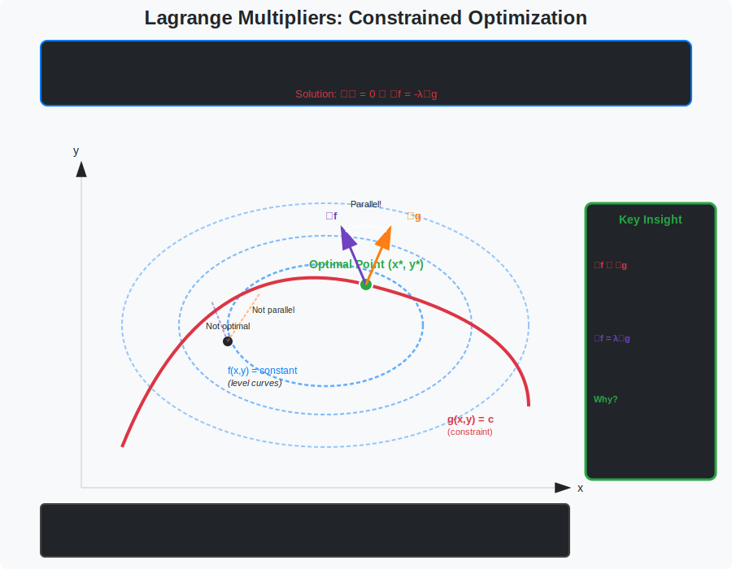

<!-- Animated Header -->
<p align="center">
  
</p>

<p align="center">
  
  
  
  
</p>


## ⚡ TL;DR

> **Constrained optimization is essential for SVMs, max-entropy models, and safe RL.** The KKT conditions are necessary (and often sufficient) for optimality.

- 📐 **Lagrange Multipliers**: Handle equality constraints $h(x) = 0$
- 🔒 **KKT Conditions**: Handle inequality constraints $g(x) \leq 0$
- ⚖️ **Duality**: Convert hard primal problems to easier dual problems
- 🤖 **Applications**: SVM, constrained RL, portfolio optimization

---

## 📑 Table of Contents

1. [Problem Formulation](#1-problem-formulation)
2. [Lagrange Multipliers](#2-lagrange-multipliers)
3. [KKT Conditions](#3-kkt-conditions-complete-theory)
4. [Duality](#4-duality)
5. [SVM Derivation](#5-svm-derivation-via-lagrangian)
6. [Code Implementation](#6-code-implementation)
7. [Resources](#-resources)

---

## 🎨 Visual Overview



```
┌─────────────────────────────────────────────────────────────────────────────┐
│                    CONSTRAINED OPTIMIZATION                                  │
├─────────────────────────────────────────────────────────────────────────────┤
│                                                                              │
│   EQUALITY CONSTRAINED:            INEQUALITY CONSTRAINED:                  │
│   ─────────────────────            ────────────────────────                 │
│                                                                              │
│   min f(x)                         min f(x)                                 │
│   s.t. h(x) = 0                    s.t. g(x) ≤ 0                            │
│                                                                              │
│   ∇f parallel to ∇h               At optimum, either:                      │
│   at optimum                       • g(x*) < 0 (inactive, μ=0)             │
│                                    • g(x*) = 0 (active, μ≥0)               │
│                                                                              │
│        ↗ ∇f                        ┌─────────────┐                          │
│       /                            │  Feasible   │                          │
│      *───→ ∇h                      │  Region     │ ← constraint             │
│      │  optimum on                 │      *      │   g(x) ≤ 0              │
│      │  constraint                 │   optimum   │                          │
│      │                             └─────────────┘                          │
│                                                                              │
│   LAGRANGIAN: L(x,λ,μ) = f(x) + λᵀh(x) + μᵀg(x)                            │
│                                                                              │
└─────────────────────────────────────────────────────────────────────────────┘
```

---

## 1. Problem Formulation

### 📌 General Constrained Problem

$$\begin{align}
\min_{\mathbf{x}} \quad & f(\mathbf{x}) \\
\text{s.t.} \quad & g_i(\mathbf{x}) \leq 0, \quad i = 1, \ldots, m \quad \text{(inequality)} \\
& h_j(\mathbf{x}) = 0, \quad j = 1, \ldots, p \quad \text{(equality)}
\end{align}$$

### 📐 The Lagrangian

$$\mathcal{L}(\mathbf{x}, \boldsymbol{\mu}, \boldsymbol{\lambda}) = f(\mathbf{x}) + \sum_{i=1}^{m} \mu_i g_i(\mathbf{x}) + \sum_{j=1}^{p} \lambda_j h_j(\mathbf{x})$$

where:
- $\mu_i \geq 0$: multipliers for inequality constraints
- $\lambda_j$: multipliers for equality constraints (can be any sign)

---

## 2. Lagrange Multipliers

### 📌 Problem (Equality Only)

$$\min f(\mathbf{x}) \quad \text{s.t.} \quad h(\mathbf{x}) = 0$$

### 📐 Theorem

At a local minimum $\mathbf{x}^*$ with $\nabla h(\mathbf{x}^*) \neq 0$, there exists $\lambda^*$ such that:

$$\nabla f(\mathbf{x}^*) + \lambda^* \nabla h(\mathbf{x}^*) = 0$$

### 🔍 Proof (Geometric Argument)

```
Step 1: At optimum x*, we're on the constraint surface h(x) = 0

Step 2: ∇h is perpendicular to the constraint surface
        (It points in the direction of steepest increase of h)

Step 3: If ∇f were not parallel to ∇h, we could move along the constraint
        in a direction that decreases f (contradiction!)

        More precisely: Let v be tangent to h(x) = 0, so ∇h·v = 0
        
        If ∇f·v ≠ 0, we can move along v to decrease f while staying on constraint

Step 4: Therefore ∇f must be parallel to ∇h at optimum:
        ∇f = -λ∇h for some scalar λ
        
        Equivalently: ∇f + λ∇h = 0  ∎
```

### 💡 Examples

**Example 1**: Minimize Distance to Plane
```
Minimize f(x,y,z) = x² + y² + z²
Subject to: x + y + z = 3

Lagrangian: L = x² + y² + z² + λ(x + y + z - 3)

Conditions:
∂L/∂x = 2x + λ = 0  →  x = -λ/2
∂L/∂y = 2y + λ = 0  →  y = -λ/2
∂L/∂z = 2z + λ = 0  →  z = -λ/2
∂L/∂λ = x + y + z - 3 = 0

Substitute: -3λ/2 = 3  →  λ = -2

Solution: x = y = z = 1, minimum distance = √3
```

**Example 2**: Max Entropy Distribution
```
Maximize H(p) = -Σᵢ pᵢ log(pᵢ)
Subject to: Σᵢ pᵢ = 1

Lagrangian: L = -Σᵢ pᵢ log(pᵢ) + λ(Σᵢ pᵢ - 1)

∂L/∂pᵢ = -log(pᵢ) - 1 + λ = 0
log(pᵢ) = λ - 1
pᵢ = e^(λ-1) = constant!

With constraint: n·e^(λ-1) = 1  →  pᵢ = 1/n

The uniform distribution maximizes entropy!
```

---

## 3. KKT Conditions (Complete Theory)

### 📌 The Four Conditions

For the constrained problem with both equality and inequality constraints, the **Karush-Kuhn-Tucker conditions** are:

**1. Stationarity**:
$$\nabla f(\mathbf{x}^*) + \sum_i \mu_i^* \nabla g_i(\mathbf{x}^*) + \sum_j \lambda_j^* \nabla h_j(\mathbf{x}^*) = 0$$

**2. Primal Feasibility**:
$$g_i(\mathbf{x}^*) \leq 0, \quad h_j(\mathbf{x}^*) = 0$$

**3. Dual Feasibility**:
$$\mu_i^* \geq 0$$

**4. Complementary Slackness**:
$$\mu_i^* g_i(\mathbf{x}^*) = 0 \quad \forall i$$

### 🔍 Understanding Complementary Slackness

```
μᵢ · gᵢ(x*) = 0 means ONE of two cases:

Case A: gᵢ(x*) < 0 (constraint is SLACK, not binding)
        Then μᵢ = 0 (constraint has no influence)

Case B: gᵢ(x*) = 0 (constraint is ACTIVE, binding)
        Then μᵢ ≥ 0 (constraint is pushing on solution)

Intuition: 
  "You only pay for constraints that are actually restricting you"
```

### 📐 When are KKT Sufficient?

KKT conditions are **necessary** for local optimality (under constraint qualification).

They are **sufficient** for global optimality when:
- $f$ is convex
- $g_i$ are convex
- $h_j$ are affine

### 💡 Example: KKT Step by Step

```
Minimize f(x) = (x - 2)²
Subject to: x ≥ 1  (equivalently: g(x) = 1 - x ≤ 0)

Lagrangian: L = (x - 2)² + μ(1 - x)

KKT conditions:
1. Stationarity: ∂L/∂x = 2(x-2) - μ = 0
2. Primal feasibility: 1 - x ≤ 0  →  x ≥ 1
3. Dual feasibility: μ ≥ 0
4. Complementary slackness: μ(1 - x) = 0

Case A: μ = 0 (inactive constraint)
  From (1): 2(x-2) = 0  →  x = 2
  Check (2): 2 ≥ 1 ✓
  Solution: x* = 2, f* = 0

Case B: 1 - x = 0 (active constraint)
  x = 1
  From (1): μ = 2(1-2) = -2 < 0  ✗ violates (3)
  No solution in this case

Final answer: x* = 2, unconstrained optimum is feasible!
```

---

## 4. Duality

### 📐 Lagrangian Dual Problem

The **dual function**:
$$g(\boldsymbol{\mu}, \boldsymbol{\lambda}) = \inf_{\mathbf{x}} \mathcal{L}(\mathbf{x}, \boldsymbol{\mu}, \boldsymbol{\lambda})$$

The **dual problem**:
$$\max_{\boldsymbol{\mu} \geq 0, \boldsymbol{\lambda}} g(\boldsymbol{\mu}, \boldsymbol{\lambda})$$

### 📐 Weak Duality

For any feasible primal $\mathbf{x}$ and dual $(\boldsymbol{\mu}, \boldsymbol{\lambda})$:

$$g(\boldsymbol{\mu}, \boldsymbol{\lambda}) \leq f(\mathbf{x})$$

**Proof**:
```
g(μ, λ) = inf_x L(x, μ, λ)
        ≤ L(x*, μ, λ)  for any feasible x*
        = f(x*) + Σᵢ μᵢgᵢ(x*) + Σⱼ λⱼhⱼ(x*)
        ≤ f(x*)  (since μᵢ ≥ 0, gᵢ(x*) ≤ 0, hⱼ(x*) = 0)  ∎
```

### 📐 Strong Duality

Under **Slater's condition** (exists strictly feasible point), the duality gap is zero:

$$p^* = d^* \quad \text{(optimal values are equal)}$$

---

## 5. SVM Derivation via Lagrangian

### 📐 Hard-Margin SVM

```
Primal Problem:
  min_{w,b} ½‖w‖²
  s.t. yᵢ(w·xᵢ + b) ≥ 1  for all i

Lagrangian:
  L(w, b, α) = ½‖w‖² - Σᵢ αᵢ[yᵢ(w·xᵢ + b) - 1]

KKT conditions:
1. ∂L/∂w = w - Σᵢ αᵢyᵢxᵢ = 0  →  w = Σᵢ αᵢyᵢxᵢ
2. ∂L/∂b = -Σᵢ αᵢyᵢ = 0
3. αᵢ ≥ 0
4. αᵢ[yᵢ(w·xᵢ + b) - 1] = 0

Dual Problem (substitute w):
  max_α Σᵢ αᵢ - ½ Σᵢⱼ αᵢαⱼyᵢyⱼ(xᵢ·xⱼ)
  s.t. αᵢ ≥ 0, Σᵢ αᵢyᵢ = 0

Key insight from complementary slackness:
  αᵢ > 0 only when yᵢ(w·xᵢ + b) = 1 (support vectors!)
```

---

## 6. Code Implementation

```python
import numpy as np
from scipy.optimize import minimize

def constrained_optimization_example():
    """
    Solve: min f(x,y) = (x-1)² + (y-2)²
           s.t. x + y ≤ 2
                x ≥ 0
                y ≥ 0
    """
    
    def objective(X):
        x, y = X
        return (x - 1)**2 + (y - 2)**2
    
    def gradient(X):
        x, y = X
        return np.array([2*(x-1), 2*(y-2)])
    
    # Inequality constraints: g(x) <= 0 form
    constraints = [
        {'type': 'ineq', 'fun': lambda X: 2 - X[0] - X[1]},  # x + y <= 2
        {'type': 'ineq', 'fun': lambda X: X[0]},              # x >= 0
        {'type': 'ineq', 'fun': lambda X: X[1]},              # y >= 0
    ]
    
    result = minimize(
        objective,
        x0=[0.5, 0.5],
        jac=gradient,
        constraints=constraints,
        method='SLSQP'
    )
    
    print(f"Optimal solution: x={result.x[0]:.4f}, y={result.x[1]:.4f}")
    print(f"Optimal value: {result.fun:.4f}")
    print(f"Active constraints: x+y={sum(result.x):.4f}")
    
    return result

def lagrangian_method_manual():
    """
    Manually solve using Lagrangian for equality constraint.
    
    min x² + y²
    s.t. x + y = 1
    """
    # System: ∇L = 0
    # 2x + λ = 0
    # 2y + λ = 0
    # x + y - 1 = 0
    
    # From equations: x = y = -λ/2
    # Substitute: -λ = 1, so λ = -1
    # Therefore: x = y = 0.5
    
    x_opt, y_opt = 0.5, 0.5
    lambda_opt = -1
    
    # Verify KKT
    grad_f = np.array([2*x_opt, 2*y_opt])
    grad_h = np.array([1, 1])
    stationarity = grad_f + lambda_opt * grad_h
    
    print(f"Solution: ({x_opt}, {y_opt})")
    print(f"Lagrange multiplier: λ = {lambda_opt}")
    print(f"Stationarity check (should be 0): {stationarity}")

def kkt_verification(x, mu, f, g, grad_f, grad_g):
    """
    Verify KKT conditions for a solution.
    """
    print("=" * 40)
    print("KKT Conditions Check")
    print("=" * 40)
    
    # 1. Stationarity
    stationarity = grad_f(x)
    for i, (m, gg) in enumerate(zip(mu, grad_g)):
        stationarity = stationarity + m * gg(x)
    print(f"1. Stationarity: ∇L = {stationarity}")
    print(f"   (Should be ≈ 0)")
    
    # 2. Primal feasibility
    print(f"2. Primal feasibility:")
    for i, gi in enumerate(g):
        print(f"   g_{i}(x) = {gi(x):.6f} <= 0? {gi(x) <= 1e-6}")
    
    # 3. Dual feasibility
    print(f"3. Dual feasibility:")
    for i, m in enumerate(mu):
        print(f"   μ_{i} = {m:.6f} >= 0? {m >= -1e-6}")
    
    # 4. Complementary slackness
    print(f"4. Complementary slackness:")
    for i, (m, gi) in enumerate(zip(mu, g)):
        cs = m * gi(x)
        print(f"   μ_{i} · g_{i}(x) = {cs:.6f} = 0? {abs(cs) < 1e-6}")

# Run examples
constrained_optimization_example()
print("\n")
lagrangian_method_manual()
```

### SVM Implementation

```python
import numpy as np
from scipy.optimize import minimize

def svm_dual(X, y):
    """
    Solve SVM dual problem:
    max Σαᵢ - ½ΣΣ αᵢαⱼyᵢyⱼ(xᵢ·xⱼ)
    s.t. αᵢ ≥ 0, Σαᵢyᵢ = 0
    """
    n = len(y)
    
    # Gram matrix
    K = X @ X.T
    
    def objective(alpha):
        return -np.sum(alpha) + 0.5 * np.sum(alpha.reshape(-1,1) * alpha * y.reshape(-1,1) * y * K)
    
    def gradient(alpha):
        return -np.ones(n) + alpha * y * (K @ (alpha * y))
    
    # Constraints
    constraints = [
        {'type': 'eq', 'fun': lambda a: np.dot(a, y)}  # Σαᵢyᵢ = 0
    ]
    bounds = [(0, None) for _ in range(n)]  # αᵢ ≥ 0
    
    result = minimize(
        objective,
        x0=np.zeros(n),
        jac=gradient,
        method='SLSQP',
        bounds=bounds,
        constraints=constraints
    )
    
    alpha = result.x
    
    # Recover w from w = Σαᵢyᵢxᵢ
    w = np.sum(alpha.reshape(-1,1) * y.reshape(-1,1) * X, axis=0)
    
    # Find support vectors
    sv_idx = alpha > 1e-5
    
    # Recover b from any support vector
    b = y[sv_idx][0] - np.dot(w, X[sv_idx][0])
    
    return w, b, alpha

# Example usage
X = np.array([[1, 2], [2, 3], [3, 3], [2, 1], [3, 2]])
y = np.array([1, 1, 1, -1, -1])

w, b, alpha = svm_dual(X, y)
print(f"w = {w}")
print(f"b = {b}")
print(f"Support vector alphas: {alpha[alpha > 1e-5]}")
```

---

## 📚 Resources

| Type | Resource | Description |
|------|----------|-------------|
| 📖 | [Convex Optimization](https://web.stanford.edu/~boyd/cvxbook/) | Boyd & Vandenberghe Ch 5 |
| 📖 | Numerical Optimization | Nocedal & Wright Ch 12 |
| 🎥 | [Stanford EE364A](https://www.youtube.com/playlist?list=PL3940DD956CDF0622) | Boyd's lectures |

---

## 🗺️ Navigation

| ⬅️ Previous | 🏠 Home | ➡️ Next |
|:-----------:|:-------:|:-------:|
| [Basics](../01_basics/README.md) | [Optimization](../README.md) | [Convex](../03_convex/README.md) |

---


<p align="center">
  
</p>
