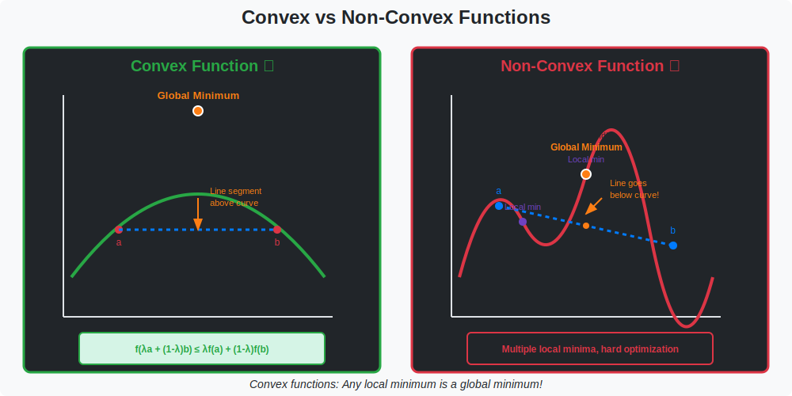

<!-- Animated Header -->
<p align="center">
  
</p>

<p align="center">
  
  
  
  
</p>


## ⚡ TL;DR

> **Convexity is the dividing line between easy and hard optimization.** Convex problems have global guarantees; non-convex problems (like deep learning) do not—but often work anyway.

- 📐 **Convex Set**: Line segment between any two points stays inside

- 📈 **Convex Function**: Lies below any chord; local min = global min

- ✅ **Why It Matters**: Gradient descent finds global optimum for convex problems

- 🧠 **Deep Learning**: Non-convex, but landscape is "benign" in practice

---

## 📑 Table of Contents

1. [Convex Sets](#1-convex-sets)
2. [Convex Functions](#2-convex-functions)
3. [Conditions for Convexity](#3-conditions-for-convexity)
4. [Operations Preserving Convexity](#4-operations-preserving-convexity)
5. [Strong Convexity](#5-strong-convexity)
6. [Convex Optimization Problems](#6-convex-optimization-problems)
7. [Code Examples](#7-code-examples)
8. [Resources](#-resources)

---

## 🎨 Visual Overview



```
+-----------------------------------------------------------------------------+

|                    CONVEX vs NON-CONVEX                                      |
+-----------------------------------------------------------------------------+
|                                                                              |
|   CONVEX FUNCTION:                 NON-CONVEX FUNCTION:                     |
|   ----------------                 --------------------                     |
|                                                                              |
|        ∪                                ∼∼∼                                 |
|       / \                              /   \  /\                            |
|      /   \                            /     \/  \                           |
|     *     \                          *   local   *                          |
|   global   \                       global  min  local                       |
|   minimum   \                      min          min                         |
|                                                                              |
|   GUARANTEES:                      NO GUARANTEES:                           |
|   • Local min = Global min         • Many local minima                      |
|   • GD converges to optimum        • May get stuck                          |
|   • Duality theory works           • Need heuristics                        |
|                                                                              |
|   +===================================================================+     |
|   |  CONVEXITY TEST:                                                   |     |
|   |  f(λx + (1-λ)y) ≤ λf(x) + (1-λ)f(y) for all x,y and λ∈[0,1]      |     |
|   +===================================================================+     |
|                                                                              |
+-----------------------------------------------------------------------------+

```

---

## 1. Convex Sets

### 📌 Definition

A set $C$ is **convex** if for all $\mathbf{x}, \mathbf{y} \in C$ and $\lambda \in [0, 1]$:

```math
\lambda \mathbf{x} + (1 - \lambda) \mathbf{y} \in C

```

*The line segment between any two points in $C$ lies entirely within $C$.*

### 📊 Examples

| Set | Convex? | Why? |
|-----|---------|------|
| Line/plane | ✅ Yes | Affine sets are convex |
| Ball $\{x: \|x\| \leq r\}$ | ✅ Yes | All norm balls |
| Halfspace $\{x: a^Tx \leq b\}$ | ✅ Yes | Building block |
| Polyhedron | ✅ Yes | Intersection of halfspaces |
| $\{(x,y): xy \geq 1, x > 0\}$ | ✅ Yes | Hyperbolic region |
| $\{(x,y): x^2 + y^2 \geq 1\}$ | ❌ No | Exterior of circle |

### 📐 Operations Preserving Convexity of Sets

| Operation | Result |
|-----------|--------|
| Intersection | $C\_1 \cap C\_2$ is convex |
| Affine image | $f(C) = \{Ax + b: x \in C\}$ is convex |
| Affine preimage | $f^{-1}(C) = \{x: Ax + b \in C\}$ is convex |
| Sum | $C\_1 + C\_2 = \{x + y: x \in C\_1, y \in C\_2\}$ is convex |

---

## 2. Convex Functions

### 📌 Definition

A function $f: \mathbb{R}^n \to \mathbb{R}$ is **convex** if its domain is convex and for all $\mathbf{x}, \mathbf{y}$ in the domain and $\lambda \in [0, 1]$:

```math
f(\lambda \mathbf{x} + (1 - \lambda) \mathbf{y}) \leq \lambda f(\mathbf{x}) + (1 - \lambda) f(\mathbf{y})

```

*The function lies below (or on) the chord between any two points.*

### 📐 Geometric Interpretation

```
     f(x)     chord
       |      ╱
       |    ╱
       |  ╱  ← f lies below chord
       |╱____╲
      ╱  f    ╲  
     x         y
     
Chord: λf(x) + (1-λ)f(y)
Function: f(λx + (1-λ)y)

Convex: function ≤ chord everywhere

```

### 📊 Common Convex Functions

| Function | Formula | Domain |
|----------|---------|--------|
| Linear | $a^Tx + b$ | $\mathbb{R}^n$ |
| Affine | $Ax + b$ | $\mathbb{R}^n$ |
| Quadratic (PSD) | $x^TAx + b^Tx + c$ | $\mathbb{R}^n$ (if $A \succeq 0$) |
| Norms | $\|x\|\_p$ | $\mathbb{R}^n$ |
| Max | $\max(x\_1, \ldots, x\_n)$ | $\mathbb{R}^n$ |
| Log-sum-exp | $\log(\sum\_i e^{x\_i})$ | $\mathbb{R}^n$ |
| Negative entropy | $\sum\_i x\_i \log x\_i$ | $\mathbb{R}^n\_{++}$ |
| Log determinant | $-\log \det(X)$ | $\mathbb{S}^n\_{++}$ |

---

## 3. Conditions for Convexity

### 📌 First-Order Condition

For differentiable $f$, convexity is equivalent to:

```math
f(\mathbf{y}) \geq f(\mathbf{x}) + \nabla f(\mathbf{x})^T (\mathbf{y} - \mathbf{x}) \quad \forall \mathbf{x}, \mathbf{y}

```

*The function lies above all its tangent planes.*

### 📌 Second-Order Condition

For twice-differentiable $f$, convexity is equivalent to:

```math
\nabla^2 f(\mathbf{x}) \succeq 0 \quad \forall \mathbf{x}

```

*The Hessian is positive semidefinite everywhere.*

### 🔍 Proof: Second-Order Condition

```
Proof (⟹): Assume f is convex. We show H = ∇²f ⪰ 0.

Step 1: Take Taylor expansion
        f(x + tv) = f(x) + t∇f(x)ᵀv + ½t²vᵀHv + o(t²)

Step 2: By convexity (first-order condition at x toward x+tv):
        f(x + tv) ≥ f(x) + ∇f(x)ᵀ(tv)

Step 3: Combine:
        f(x) + t∇f(x)ᵀv + ½t²vᵀHv + o(t²) ≥ f(x) + t∇f(x)ᵀv
        ½t²vᵀHv + o(t²) ≥ 0

Step 4: Divide by t² and let t → 0:
        ½vᵀHv ≥ 0 for all v
        Therefore H ⪰ 0  ∎

```

### 💡 Example: Checking Convexity

```
f(x, y) = x² + 2xy + 3y²

Hessian:
H = [∂²f/∂x²    ∂²f/∂x∂y]   [2  2]
    [∂²f/∂y∂x   ∂²f/∂y² ] = [2  6]

Check positive semidefinite:
• Eigenvalues: det(H - λI) = 0
  (2-λ)(6-λ) - 4 = 0
  λ² - 8λ + 8 = 0
  λ = (8 ± √32)/2 = 4 ± 2√2
  λ₁ ≈ 6.83, λ₂ ≈ 1.17

Both eigenvalues positive → H ≻ 0 (positive definite)
→ f is strictly convex ✓

```

---

## 4. Operations Preserving Convexity

### 📊 Function Operations

| Operation | Condition | Result |
|-----------|-----------|--------|
| Non-negative sum | $\alpha\_i \geq 0$ | $\sum\_i \alpha\_i f\_i$ is convex |
| Composition with affine | $g$ convex | $g(Ax + b)$ is convex |
| Pointwise max | $f\_i$ convex | $\max\_i f\_i(x)$ is convex |
| Supremum | $f(x, y)$ convex in $x$ | $\sup\_y f(x, y)$ is convex in $x$ |
| Perspective | $f$ convex | $tf(x/t)$ is convex for $t > 0$ |

### 💡 Example: Softmax is Log-Sum-Exp

```
log-sum-exp is convex (can verify via Hessian)

Softmax loss = log(Σⱼ exp(zⱼ)) - z_y

This is convex in z! (sum of convex functions)

That's why logistic regression is a convex problem.

```

---

## 5. Strong Convexity

### 📌 Definition

$f$ is **$\mu$-strongly convex** if:

```math
f(\mathbf{y}) \geq f(\mathbf{x}) + \nabla f(\mathbf{x})^T(\mathbf{y} - \mathbf{x}) + \frac{\mu}{2}\|\mathbf{y} - \mathbf{x}\|^2

```

Equivalently: $\nabla^2 f \succeq \mu I$ (Hessian has minimum eigenvalue $\geq \mu$)

### 📐 Why Strong Convexity Matters

| Property | Convex | Strongly Convex ($\mu > 0$) |
|----------|--------|---------------------------|
| Unique minimum | Maybe | ✅ Yes |
| GD convergence | $O(1/k)$ | $O((1-\mu/L)^k)$ (linear) |
| Condition number | May be $\infty$ | $\kappa = L/\mu < \infty$ |

### 💡 Example

```
f(x) = x² is μ-strongly convex with μ = 2

Proof: ∇²f = 2 ≥ 2 = μ ✓

f(x) = |x| is convex but NOT strongly convex
(Hessian is 0 at x=0)

```

---

## 6. Convex Optimization Problems

### 📌 Standard Form

```math
\begin{align}
\min_{\mathbf{x}} \quad & f(\mathbf{x}) \\
\text{s.t.} \quad & g_i(\mathbf{x}) \leq 0, \quad i = 1, \ldots, m \\
& A\mathbf{x} = \mathbf{b}
\end{align}

```

where $f$ and all $g\_i$ are convex.

### 📐 Key Theorem

> **For convex optimization problems, any local minimum is a global minimum.**

### 🔍 Proof

```
Proof by contradiction:

Assume x* is local minimum but not global.
Let x' be global minimum with f(x') < f(x*).

By convexity, for any λ ∈ (0, 1):
f(λx' + (1-λ)x*) ≤ λf(x') + (1-λ)f(x*)
                 < λf(x*) + (1-λ)f(x*)
                 = f(x*)

So points arbitrarily close to x* (small 1-λ) have lower function value.
This contradicts x* being a local minimum!  ∎

```

### 📊 ML Examples

| Problem | Convex? | Notes |
|---------|---------|-------|
| Linear regression | ✅ Yes | Quadratic loss |
| Logistic regression | ✅ Yes | Log-loss is convex |
| SVM (primal) | ✅ Yes | Hinge loss + L2 |
| LASSO | ✅ Yes | But non-smooth |
| Neural network | ❌ No | Many local minima |
| Matrix factorization | ❌ No | Bilinear |

---

## 7. Code Examples

```python
import numpy as np
import torch

# ============================================================
# CHECKING CONVEXITY
# ============================================================

def is_convex_numerically(f, x, y, n_samples=100):
    """
    Check convexity numerically by testing the definition.
    """
    for _ in range(n_samples):
        lam = np.random.uniform(0, 1)
        midpoint = lam * x + (1 - lam) * y
        
        # Convexity: f(midpoint) <= lam*f(x) + (1-lam)*f(y)
        if f(midpoint) > lam * f(x) + (1 - lam) * f(y) + 1e-10:
            return False
    return True

def is_hessian_psd(f, x, eps=1e-5):
    """
    Check if Hessian is positive semidefinite at point x.
    """
    x_tensor = torch.tensor(x, dtype=torch.float64, requires_grad=True)
    
    # Compute Hessian
    H = torch.autograd.functional.hessian(f, x_tensor)
    
    # Check eigenvalues
    eigenvalues = torch.linalg.eigvalsh(H)
    return torch.all(eigenvalues >= -eps).item()

# Example usage
def quadratic(x):
    A = torch.tensor([[2., 1.], [1., 3.]], dtype=torch.float64)
    return x @ A @ x

x = torch.tensor([1., 1.], dtype=torch.float64)
print(f"Is quadratic convex at x? {is_hessian_psd(quadratic, x)}")

# ============================================================
# CONVEX OPTIMIZATION WITH CVXPY
# ============================================================

# pip install cvxpy
import cvxpy as cp

def lasso_regression(X, y, lam=1.0):
    """
    Solve LASSO: min ||Xw - y||² + λ||w||₁
    """
    n, d = X.shape
    w = cp.Variable(d)
    
    objective = cp.Minimize(
        cp.sum_squares(X @ w - y) + lam * cp.norm1(w)
    )
    
    problem = cp.Problem(objective)
    problem.solve()
    
    return w.value

def svm_primal(X, y, C=1.0):
    """
    Solve primal SVM: min ½||w||² + C·Σmax(0, 1 - yᵢ(w·xᵢ + b))
    """
    n, d = X.shape
    w = cp.Variable(d)
    b = cp.Variable()
    xi = cp.Variable(n)  # Slack variables
    
    objective = cp.Minimize(
        0.5 * cp.sum_squares(w) + C * cp.sum(xi)
    )
    
    constraints = [
        cp.multiply(y, X @ w + b) >= 1 - xi,
        xi >= 0
    ]
    
    problem = cp.Problem(objective, constraints)
    problem.solve()
    
    return w.value, b.value

# ============================================================
# GRADIENT DESCENT ON CONVEX FUNCTIONS
# ============================================================

def gradient_descent_convex(f, grad_f, x0, lr=0.01, n_steps=1000, tol=1e-8):
    """
    Gradient descent with convergence guarantee for convex f.
    
    For L-smooth convex f, lr <= 1/L guarantees convergence.
    """
    x = x0.copy()
    history = [f(x)]
    
    for k in range(n_steps):
        g = grad_f(x)
        x = x - lr * g
        history.append(f(x))
        
        # Check convergence
        if np.linalg.norm(g) < tol:
            print(f"Converged at step {k+1}")
            break
    
    return x, history

# Example: Minimize f(x) = ||Ax - b||²
A = np.random.randn(100, 10)
b = np.random.randn(100)

f = lambda x: np.sum((A @ x - b)**2)
grad_f = lambda x: 2 * A.T @ (A @ x - b)

# Compute Lipschitz constant L = 2*λ_max(AᵀA)
L = 2 * np.linalg.eigvalsh(A.T @ A).max()
lr = 1 / L  # Optimal step size

x0 = np.zeros(10)
x_opt, history = gradient_descent_convex(f, grad_f, x0, lr=lr)

print(f"Optimal x found with residual: {f(x_opt):.6f}")

```

---

## 📚 Resources

| Type | Resource | Description |
|------|----------|-------------|
| 📖 | [Convex Optimization](https://web.stanford.edu/~boyd/cvxbook/) | Boyd & Vandenberghe (free!) |
| 🎥 | [Stanford EE364A](https://www.youtube.com/playlist?list=PL3940DD956CDF0622) | Boyd's lectures |
| 📖 | [CVXPY Documentation](https://www.cvxpy.org/) | Python solver |

---

## 🗺️ Navigation

| ⬅️ Previous | 🏠 Home | ➡️ Next |
|:-----------:|:-------:|:-------:|
| [Constrained](../02_constrained/README.md) | [Optimization](../README.md) | [Duality](../04_duality/README.md) |

---


<p align="center">
  
</p>
