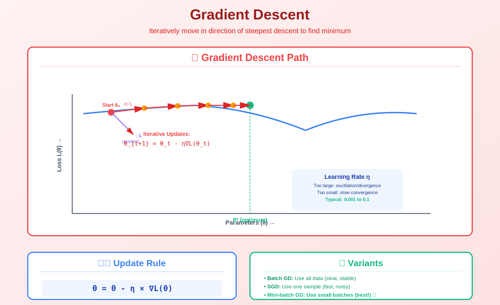

<!-- Animated Header -->
<p align="center">
  
</p>

<p align="center">
  
  
  
  
</p>


## ⚡ TL;DR

> **First-order methods use only gradients (first derivatives) to optimize.** They're the workhorse of machine learning, from logistic regression to training GPT-4.

- 📐 **Gradient Descent**: $\theta \leftarrow \theta - \eta \nabla f(\theta)$
- 🚀 **Momentum**: Accelerate along consistent directions
- ⚡ **Nesterov**: "Look ahead" for faster convergence
- 📊 **Convergence**: $O(1/k)$ for convex, $O((1-\mu/L)^k)$ for strongly convex

---

## 📑 Table of Contents

1. [Gradient Descent](#1-gradient-descent)
2. [Convergence Analysis](#2-convergence-analysis)
3. [Momentum](#3-momentum)
4. [Nesterov Accelerated Gradient](#4-nesterov-accelerated-gradient)
5. [Learning Rate Selection](#5-learning-rate-selection)
6. [Proximal Methods](#6-proximal-methods)
7. [Code Implementation](#7-code-implementation)
8. [Resources](#-resources)

---

## 🎨 Visual Overview



```
┌─────────────────────────────────────────────────────────────────────────────┐
│                    GRADIENT DESCENT VISUALIZATION                            │
├─────────────────────────────────────────────────────────────────────────────┤
│                                                                              │
│   Loss Landscape:                  Convergence:                              │
│                                                                              │
│       ┌───────────────┐            Loss                                      │
│      ╱                 ╲             │                                       │
│     ╱   x₀──→x₁         ╲            │\                                      │
│    ╱       ╲              ╲          │ \                                     │
│   ╱         ╲──→x₂         ╲         │  \___                                 │
│  ╱              ╲           ╲        │      \_____                           │
│ ╱                ╲──→x*      ╲       │____________\_________                 │
│                   (minimum)          └────────────────────── Iterations      │
│                                                                              │
│   GRADIENT DESCENT:                 MOMENTUM:                                │
│   ─────────────────                 ─────────────                            │
│   θ ← θ - η∇f(θ)                   v ← βv + ∇f(θ)                           │
│                                    θ ← θ - ηv                                │
│   Follows steepest descent         Accelerates along                         │
│                                    consistent directions                     │
│                                                                              │
│   ╔═══════════════════════════════════════════════════════════════════╗     │
│   ║  KEY INSIGHT: Learning rate η is the most important hyperparameter ║     │
│   ║  Too large → diverge | Too small → slow | Just right → converge   ║     │
│   ╚═══════════════════════════════════════════════════════════════════╝     │
│                                                                              │
└─────────────────────────────────────────────────────────────────────────────┘
```

---

## 1. Gradient Descent

### 📌 Algorithm

$$\theta_{k+1} = \theta_k - \eta \nabla f(\theta_k)$$

where:
- $\eta$ = learning rate (step size)
- $\nabla f(\theta_k)$ = gradient at current point

### 🔍 Why It Works: Steepest Descent

```
Goal: Find direction d that decreases f(x) most rapidly

Taylor expansion:
f(x + εd) ≈ f(x) + ε∇f(x)ᵀd

To minimize f(x + εd), we want to minimize ∇f(x)ᵀd

By Cauchy-Schwarz:
∇f(x)ᵀd ≥ -‖∇f(x)‖ · ‖d‖

Minimum achieved when d = -∇f(x)/‖∇f(x)‖

So the direction of steepest descent is -∇f(x)!
```

### 📐 Assumptions

For convergence analysis, we typically assume:

**L-smoothness**: $\|\nabla f(x) - \nabla f(y)\| \leq L\|x - y\|$
- Gradient doesn't change too fast
- Equivalent: Hessian eigenvalues bounded by $L$

**μ-strong convexity** (optional): $f(y) \geq f(x) + \nabla f(x)^T(y-x) + \frac{\mu}{2}\|y-x\|^2$
- Function curves upward at least as fast as $\frac{\mu}{2}\|x\|^2$

---

## 2. Convergence Analysis

### 📊 Convergence Rates

| Assumption | Rate | To reach $\epsilon$ accuracy |
|------------|------|------------------------------|
| Convex, L-smooth | $O(1/k)$ | $O(1/\epsilon)$ steps |
| μ-strongly convex, L-smooth | $O((1-\mu/L)^k)$ | $O(\kappa \log(1/\epsilon))$ steps |
| Non-convex, L-smooth | $\min_k \|\nabla f\|^2 = O(1/k)$ | $O(1/\epsilon^2)$ steps |

where $\kappa = L/\mu$ is the **condition number**.

### 🔍 Proof: Convergence for Smooth Convex Functions

```
Theorem: For L-smooth convex f with step size η = 1/L:
         f(x_k) - f(x*) ≤ ‖x₀ - x*‖² / (2ηk)

Proof sketch:

Step 1: Descent lemma (from L-smoothness)
        f(x_{k+1}) ≤ f(x_k) + ∇f(x_k)ᵀ(x_{k+1} - x_k) + (L/2)‖x_{k+1} - x_k‖²
        
        With x_{k+1} = x_k - η∇f(x_k):
        f(x_{k+1}) ≤ f(x_k) - η(1 - Lη/2)‖∇f(x_k)‖²

Step 2: With η = 1/L:
        f(x_{k+1}) ≤ f(x_k) - (1/2L)‖∇f(x_k)‖²

Step 3: By convexity: f(x_k) - f(x*) ≤ ∇f(x_k)ᵀ(x_k - x*)
        So: ‖∇f(x_k)‖ ≥ (f(x_k) - f(x*)) / ‖x_k - x*‖

Step 4: Telescope and bound to get O(1/k) rate  ∎
```

### 📐 Condition Number Intuition

```
κ = L/μ = (max curvature) / (min curvature)

Geometric interpretation:
• Low κ (well-conditioned): Nearly circular level sets
  → GD converges quickly, same rate in all directions
  
• High κ (ill-conditioned): Elongated elliptical level sets
  → GD oscillates, slow convergence

Example: f(x,y) = x² + 100y²
  L = 200, μ = 2, κ = 100
  GD will oscillate along y, move slowly along x
```

---

## 3. Momentum

### 📌 Algorithm

$$\begin{align}
v_{k+1} &= \beta v_k + \nabla f(\theta_k) \\
\theta_{k+1} &= \theta_k - \eta v_{k+1}
\end{align}$$

where $\beta \in [0, 1)$ is the momentum coefficient (typically 0.9).

### 💡 Intuition: Ball Rolling Downhill

```
Momentum = "velocity" that accumulates over time

Physical analogy:
  • θ = position of ball
  • v = velocity
  • ∇f = force (gravity)
  • β = friction (1-β = damping)

The ball:
1. Builds up speed in consistent gradient directions
2. Averages out oscillations
3. Can "roll through" small local minima

Effect on ill-conditioned problems:
  Without momentum: ↓↗↓↗↓↗ (oscillates)
  With momentum:    ────────→ (smooth path)
```

### 📐 Equivalent Forms

```
Standard (heavy ball):
  v = βv + ∇f(θ)
  θ = θ - ηv

PyTorch-style:
  v = βv + ∇f(θ)
  θ = θ - ηv

Dampened:
  v = βv + (1-β)∇f(θ)
  θ = θ - ηv

All equivalent with rescaling of η and β
```

---

## 4. Nesterov Accelerated Gradient

### 📌 Algorithm

$$\begin{align}
v_{k+1} &= \beta v_k + \nabla f(\theta_k - \eta \beta v_k) \quad \text{(gradient at lookahead)} \\
\theta_{k+1} &= \theta_k - \eta v_{k+1}
\end{align}$$

Alternative form:
$$\begin{align}
y_k &= \theta_k + \beta(\theta_k - \theta_{k-1}) \\
\theta_{k+1} &= y_k - \eta \nabla f(y_k)
\end{align}$$

### 💡 Intuition: "Look Ahead"

```
HEAVY BALL MOMENTUM:
  Evaluate gradient at current position
  Then move with momentum
  
  θ ──∇f(θ)──→ θ - ηv

NESTEROV:
  First, see where momentum would take us
  Then evaluate gradient there
  
  θ ──(predict)──→ θ - ηβv ──∇f(·)──→ θ - ηv

Why better?
  • Corrects "overshooting" before it happens
  • Uses more up-to-date gradient information
  • Achieves optimal O(1/k²) rate for smooth convex functions
```

### 📊 Convergence

| Method | Smooth Convex | Smooth Strongly Convex |
|--------|---------------|------------------------|
| GD | $O(1/k)$ | $O((1-\mu/L)^k)$ |
| Heavy ball | $O(1/k)$ | $O((1-\sqrt{\mu/L})^k)$ |
| Nesterov | $O(1/k^2)$ | $O((1-\sqrt{\mu/L})^k)$ |

Nesterov achieves **optimal** rate for first-order methods!

---

## 5. Learning Rate Selection

### 📐 Theory

For L-smooth functions, convergence guaranteed if:
$$\eta \leq \frac{1}{L}$$

For optimal convergence in strongly convex case:
$$\eta = \frac{1}{L}$$

### 📊 Practical Guidelines

| Situation | Learning Rate | Notes |
|-----------|---------------|-------|
| Convex | $1/L$ | Compute or estimate $L$ |
| Deep learning | 0.001 - 0.1 | Start with 0.001 for Adam |
| Fine-tuning | 1e-5 - 1e-4 | Much smaller than pre-training |
| Unstable training | Reduce by 10× | If loss explodes |

### 💻 Learning Rate Schedules

```python
# Step decay
def step_decay(epoch, initial_lr=0.1, drop=0.5, epochs_drop=30):
    return initial_lr * (drop ** (epoch // epochs_drop))

# Cosine annealing
def cosine_annealing(epoch, initial_lr=0.1, T_max=100):
    return initial_lr * (1 + np.cos(np.pi * epoch / T_max)) / 2

# Warmup + decay
def warmup_cosine(step, warmup_steps=1000, total_steps=10000, initial_lr=0.001):
    if step < warmup_steps:
        return initial_lr * step / warmup_steps
    progress = (step - warmup_steps) / (total_steps - warmup_steps)
    return initial_lr * (1 + np.cos(np.pi * progress)) / 2
```

---

## 6. Proximal Methods

### 📌 Problem: Non-Smooth Objectives

For $f(\theta) = g(\theta) + h(\theta)$ where $g$ is smooth and $h$ is non-smooth (e.g., L1 penalty):

### 📐 Proximal Gradient Descent

$$\theta_{k+1} = \text{prox}_{\eta h}(\theta_k - \eta \nabla g(\theta_k))$$

where the proximal operator is:
$$\text{prox}_{\eta h}(x) = \arg\min_z \left( h(z) + \frac{1}{2\eta}\|z - x\|^2 \right)$$

### 💡 Example: LASSO (L1 Regularization)

```
f(θ) = ½‖Xθ - y‖² + λ‖θ‖₁
      \_____g_____/   \_h_/

Proximal operator for L1 (soft thresholding):
prox_{ηλ‖·‖₁}(x) = sign(x) · max(|x| - ηλ, 0)

Algorithm (ISTA):
  θ = soft_threshold(θ - η·Xᵀ(Xθ - y), ηλ)
```

---

## 7. Code Implementation

```python
import numpy as np
import torch

# ============================================================
# GRADIENT DESCENT IMPLEMENTATIONS
# ============================================================

def gradient_descent(grad_f, x0, lr=0.01, n_steps=1000, tol=1e-8):
    """Standard gradient descent."""
    x = x0.copy()
    history = []
    
    for k in range(n_steps):
        g = grad_f(x)
        history.append({'x': x.copy(), 'grad_norm': np.linalg.norm(g)})
        
        if np.linalg.norm(g) < tol:
            print(f"Converged at step {k}")
            break
        
        x = x - lr * g
    
    return x, history

def momentum_gd(grad_f, x0, lr=0.01, beta=0.9, n_steps=1000):
    """Gradient descent with momentum."""
    x = x0.copy()
    v = np.zeros_like(x)
    history = []
    
    for k in range(n_steps):
        g = grad_f(x)
        history.append({'x': x.copy(), 'grad_norm': np.linalg.norm(g)})
        
        v = beta * v + g
        x = x - lr * v
    
    return x, history

def nesterov_gd(grad_f, x0, lr=0.01, beta=0.9, n_steps=1000):
    """Nesterov accelerated gradient descent."""
    x = x0.copy()
    v = np.zeros_like(x)
    history = []
    
    for k in range(n_steps):
        # Lookahead point
        x_lookahead = x - lr * beta * v
        
        # Gradient at lookahead
        g = grad_f(x_lookahead)
        history.append({'x': x.copy(), 'grad_norm': np.linalg.norm(g)})
        
        v = beta * v + g
        x = x - lr * v
    
    return x, history

# ============================================================
# PROXIMAL GRADIENT (ISTA)
# ============================================================

def soft_threshold(x, threshold):
    """Soft thresholding operator (proximal for L1)."""
    return np.sign(x) * np.maximum(np.abs(x) - threshold, 0)

def ista(X, y, lam=0.1, lr=None, n_steps=1000):
    """
    ISTA for LASSO: min ½‖Xθ - y‖² + λ‖θ‖₁
    """
    n, d = X.shape
    theta = np.zeros(d)
    
    # Lipschitz constant for smooth part
    L = np.linalg.eigvalsh(X.T @ X).max()
    if lr is None:
        lr = 1 / L
    
    for k in range(n_steps):
        # Gradient step for smooth part
        grad = X.T @ (X @ theta - y)
        z = theta - lr * grad
        
        # Proximal step for L1
        theta = soft_threshold(z, lr * lam)
    
    return theta

# ============================================================
# COMPARISON EXAMPLE
# ============================================================

def compare_methods():
    """Compare GD, Momentum, and Nesterov on ill-conditioned problem."""
    
    # Ill-conditioned quadratic: f(x) = x₁² + 100x₂²
    A = np.diag([1, 100])
    f = lambda x: 0.5 * x @ A @ x
    grad_f = lambda x: A @ x
    
    x0 = np.array([10.0, 10.0])
    lr = 0.01  # Safe for L=100
    n_steps = 500
    
    # Run all methods
    x_gd, hist_gd = gradient_descent(grad_f, x0, lr=lr, n_steps=n_steps)
    x_mom, hist_mom = momentum_gd(grad_f, x0, lr=lr, beta=0.9, n_steps=n_steps)
    x_nes, hist_nes = nesterov_gd(grad_f, x0, lr=lr, beta=0.9, n_steps=n_steps)
    
    print(f"GD final x: {x_gd}, f(x): {f(x_gd):.6f}")
    print(f"Momentum final x: {x_mom}, f(x): {f(x_mom):.6f}")
    print(f"Nesterov final x: {x_nes}, f(x): {f(x_nes):.6f}")
    
    return hist_gd, hist_mom, hist_nes

# ============================================================
# PYTORCH EXAMPLE
# ============================================================

def pytorch_optimizers():
    """Using PyTorch optimizers."""
    
    # Simple quadratic
    x = torch.tensor([10.0, 10.0], requires_grad=True)
    A = torch.diag(torch.tensor([1.0, 100.0]))
    
    def loss_fn():
        return 0.5 * x @ A @ x
    
    # SGD with momentum
    optimizer = torch.optim.SGD([x], lr=0.01, momentum=0.9, nesterov=True)
    
    for i in range(100):
        optimizer.zero_grad()
        loss = loss_fn()
        loss.backward()
        optimizer.step()
        
        if i % 20 == 0:
            print(f"Step {i}: x = {x.data.numpy()}, loss = {loss.item():.6f}")

# Run examples
if __name__ == "__main__":
    compare_methods()
    pytorch_optimizers()
```

---

## 📚 Resources

| Type | Resource | Description |
|------|----------|-------------|
| 📖 | [Convex Optimization](https://web.stanford.edu/~boyd/cvxbook/) | Boyd & Vandenberghe Ch 9 |
| 📄 | [Nesterov's Original Paper](https://link.springer.com/article/10.1007/BF01589116) | Accelerated methods |
| 🎥 | [Stanford EE364A](https://www.youtube.com/playlist?list=PL3940DD956CDF0622) | Boyd's lectures |

---

## 🗺️ Navigation

| ⬅️ Previous | 🏠 Home | ➡️ Next |
|:-----------:|:-------:|:-------:|
| [Duality](../04_duality/README.md) | [Optimization](../README.md) | [Second Order](../06_second_order/README.md) |

---


<p align="center">
  
</p>
