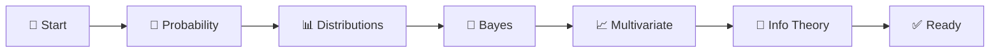
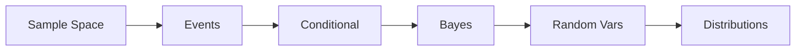
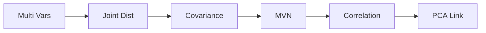
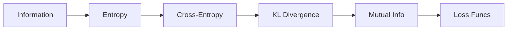
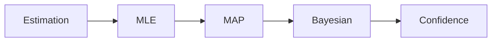
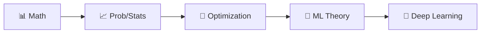

<!-- Animated Header -->
<p align="center">
  
</p>

<p align="center">
  
  
  
</p>


---

## 📊 Learning Path



## 🎯 What You'll Learn

> 💡 Machine learning is fundamentally about **learning from uncertain data**.

<table>
<tr>
<td align="center">

### 🎲 Probability
Bayes, Distributions

</td>
<td align="center">

### 📡 Information Theory
Entropy, KL Divergence

</td>
<td align="center">

### 📊 Estimation
MLE, MAP, Bayesian

</td>
</tr>
</table>

---

## 📚 Main Topics

### 1️⃣ Probability Theory

 



**Core:** Bayes' Theorem, Gaussian, Bernoulli, Expectation, Variance

<a href="./01-probability/README.md"></a>

---

### 2️⃣ Multivariate Statistics




**Core:** Joint Distributions, Covariance Matrix, Multivariate Gaussian

<a href="./02-multivariate/README.md"></a>

---

### 3️⃣ Information Theory

 



> 🔥 **Cross-entropy is THE loss function** for classification

**Core:** Entropy H(X), Cross-Entropy, KL Divergence (VAE, RLHF)

<a href="./03-information-theory/README.md"></a>

---

### 4️⃣ Statistical Estimation




**Core:** MLE (Training), MAP (Regularization), Bayesian Inference

<a href="./04-estimation/README.md"></a>

---

## 💡 Key Formulas

<table>
<tr>
<td>

### 🎲 Probability
```
Bayes: P(A|B) = P(B|A)P(A)/P(B)
E[X] = Σ x·p(x)
Var(X) = E[(X - E[X])²]
```

</td>
<td>

### 📡 Information Theory
```
H(X) = -Σ p(x)log p(x)
H(p,q) = -Σ p(x)log q(x)
KL(p||q) = Σ p(x)log[p(x)/q(x)]
```

</td>
</tr>
</table>

---

## 🔗 ML Applications

| Concept | Application | Used In |
|:-------:|-------------|---------|
| 🔮 **Bayes** | Posterior inference | Bayesian NN |
| 📊 **Entropy** | Decision trees | ID3, C4.5 |
| 📈 **Cross-Entropy** | Classification | All classifiers |
| 🔀 **KL Divergence** | Variational inference | VAE, RLHF |

---

## 🔗 Prerequisites & Next Steps



<p align="center">
  <a href="../02-mathematics/README.md"></a>
  <a href="../04-optimization/README.md"></a>
</p>

---

## 📚 Recommended Resources

| Type | Resource | Focus |
|:----:|----------|-------|
| 📘 | [Pattern Recognition & ML](https://www.microsoft.com/en-us/research/uploads/prod/2006/01/Bishop-Pattern-Recognition-and-Machine-Learning-2006.pdf) | Bishop's classic |
| 📘 | [Information Theory](http://www.inference.org.uk/itprnn/book.pdf) | David MacKay |
| 🎓 | [MIT 6.041](https://ocw.mit.edu/courses/6-041-probabilistic-systems-analysis-and-applied-probability-fall-2010/) | Probability |

---

## 🗺️ Quick Navigation

| Previous | Current | Next |
|:--------:|:-------:|:----:|
| [📊 Mathematics](../02-mathematics/README.md) | **📈 Probability** | [🎯 Optimization →](../04-optimization/README.md) |

---

---


<p align="center">
  
</p>
