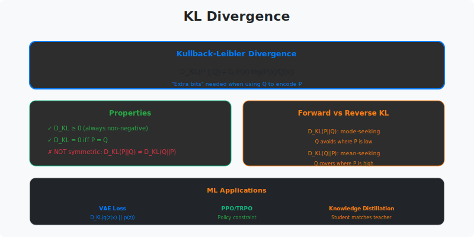

<!-- Animated Header -->
<p align="center">
  
</p>

<p align="center">
  
  
  
</p>


---

## 🎯 Visual Overview



*Caption: KL(P||Q) = Σ P(x) log(P(x)/Q(x)) measures how Q differs from P. Non-symmetric: KL(P||Q) ≠ KL(Q||P). Zero iff P=Q. Appears in VAE loss, variational inference, and information-theoretic bounds.*

---

## 📂 Overview

KL divergence is the standard measure of distribution similarity in ML. It's the extra bits needed to encode P using Q's code, and drives many modern generative models.

---

## 📐 Mathematical Definition

### KL Divergence Formula

```
Discrete:
    D_KL(P || Q) = Σ_x P(x) log(P(x) / Q(x))
                 = Σ_x P(x) log P(x) - Σ_x P(x) log Q(x)
                 = -H(P) + H(P, Q)
                 = H(P, Q) - H(P)
                 
Continuous:
    D_KL(P || Q) = ∫ p(x) log(p(x) / q(x)) dx
```

### Key Properties

```
1. Non-negativity: D_KL(P || Q) ≥ 0  (Gibbs' inequality)
2. Zero iff equal: D_KL(P || Q) = 0 ⟺ P = Q
3. Non-symmetric: D_KL(P || Q) ≠ D_KL(Q || P) generally
4. Not a metric: Doesn't satisfy triangle inequality
```

### Interpretation

```
D_KL(P || Q) = Extra bits needed to encode samples from P
               using code optimized for Q
               
If Q is a good approximation of P → low KL
If Q is poor approximation → high KL
```

---

## 📊 Forward vs Reverse KL

| Aspect | D_KL(P \|\| Q) | D_KL(Q \|\| P) |
|--------|---------------|---------------|
| Name | Forward KL | Reverse KL |
| Used in | Variational inference | Expectation propagation |
| Behavior | Zero-forcing | Zero-avoiding |
| Q fits | All of P's modes | Some of P's modes |
| When Q too narrow | High penalty | Low penalty |

```
True distribution P is bimodal:

Forward KL (D_KL(P||Q)):
    Q spreads to cover both modes (moment matching)
    May place mass between modes
    
    P: ⋀  ⋀     Q: ___/‾‾‾\___
       Mode matching
       
Reverse KL (D_KL(Q||P)):
    Q focuses on one mode (mode seeking)
    Avoids regions where P(x)=0
    
    P: ⋀  ⋀     Q: ⋀
       One mode only
```

---

## 🌍 ML Applications

### 1. VAE (Variational Autoencoder)

```
ELBO = E_q[log p(x|z)] - D_KL(q(z|x) || p(z))
                          +---- Regularization ----+

Push q(z|x) towards prior p(z) = N(0, I)
```

### 2. Variational Inference

```
Approximate posterior p(θ|D) with q(θ):

q* = argmin_q D_KL(q(θ) || p(θ|D))
   = argmax_q ELBO(q)
```

### 3. Knowledge Distillation

```
Student learns from teacher:

L_distill = D_KL(p_teacher || p_student)

Soft targets transfer "dark knowledge"
```

### 4. Policy Optimization (RL)

```
TRPO/PPO constraint:
    D_KL(π_old || π_new) ≤ δ
    
Ensure policy doesn't change too much
```

---

## 💻 Code Examples

### Computing KL Divergence

```python
import numpy as np
import torch
import torch.nn.functional as F

def kl_divergence_discrete(p, q, eps=1e-10):
    """
    KL(P || Q) for discrete distributions
    p, q: probability arrays (sum to 1)
    """
    p = np.clip(p, eps, 1)
    q = np.clip(q, eps, 1)
    return np.sum(p * np.log(p / q))

# Example
p = np.array([0.4, 0.3, 0.3])  # True distribution
q = np.array([0.33, 0.33, 0.34])  # Approximation

kl_pq = kl_divergence_discrete(p, q)
kl_qp = kl_divergence_discrete(q, p)
print(f"KL(P||Q) = {kl_pq:.4f}")
print(f"KL(Q||P) = {kl_qp:.4f}")  # Different! (asymmetric)
```

### KL for Gaussians (Closed Form)

```python
import torch
import torch.distributions as D

def kl_gaussian(mu1, logvar1, mu2=None, logvar2=None):
    """
    KL(N(μ₁,σ₁²) || N(μ₂,σ₂²))
    
    If mu2, logvar2 are None, uses standard normal N(0,1)
    """
    if mu2 is None:
        # KL(q || p) where p = N(0, I)
        # = -0.5 * Σ(1 + log(σ²) - μ² - σ²)
        return -0.5 * torch.sum(1 + logvar1 - mu1.pow(2) - logvar1.exp())
    else:
        # General case
        var1 = logvar1.exp()
        var2 = logvar2.exp()
        return 0.5 * torch.sum(
            logvar2 - logvar1 + var1/var2 + (mu1-mu2).pow(2)/var2 - 1
        )

# Example: VAE latent regularization
mu = torch.randn(32, 64)  # Batch of 32, latent dim 64
logvar = torch.randn(32, 64)
kl_loss = kl_gaussian(mu, logvar)  # KL to standard normal
```

### PyTorch KL Divergence

```python
import torch.nn.functional as F

# For log-probabilities
log_p = F.log_softmax(logits_p, dim=-1)
log_q = F.log_softmax(logits_q, dim=-1)

# KL(P || Q) where inputs are log-probs
kl = F.kl_div(log_q, log_p.exp(), reduction='batchmean')

# Or using distributions
p = torch.distributions.Categorical(logits=logits_p)
q = torch.distributions.Categorical(logits=logits_q)
kl = torch.distributions.kl_divergence(p, q)
```

### Knowledge Distillation

```python
def distillation_loss(student_logits, teacher_logits, temperature=2.0):
    """
    Knowledge distillation: KL(teacher || student) with temperature
    """
    # Soft targets with temperature
    soft_teacher = F.softmax(teacher_logits / temperature, dim=-1)
    log_soft_student = F.log_softmax(student_logits / temperature, dim=-1)
    
    # KL divergence
    kl = F.kl_div(log_soft_student, soft_teacher, reduction='batchmean')
    
    # Scale by T² (standard practice)
    return kl * (temperature ** 2)
```

---

## 📐 DETAILED MATHEMATICAL PROOFS

### 1. Gibbs' Inequality: D_KL(P||Q) ≥ 0

**Theorem:** For any distributions P and Q, D_KL(P||Q) ≥ 0, with equality iff P = Q.

**Proof:**

**Method 1: Jensen's Inequality**

```
Step 1: Define D_KL
D_KL(P||Q) = Σₓ P(x) log(P(x)/Q(x))
           = 𝔼_P[log(P(x)/Q(x))]

Step 2: Use log concavity
log is a strictly concave function, so -log is strictly convex.

By Jensen's inequality for convex functions:
𝔼[φ(X)] ≥ φ(𝔼[X])   (with equality iff X is constant)

Step 3: Apply Jensen
-D_KL(P||Q) = 𝔼_P[-log(P(x)/Q(x))]
            = 𝔼_P[log(Q(x)/P(x))]
            ≤ log(𝔼_P[Q(x)/P(x)])          (Jensen)
            = log(Σₓ P(x) · Q(x)/P(x))
            = log(Σₓ Q(x))
            = log(1)                        (Q is a distribution)
            = 0

Therefore: D_KL(P||Q) ≥ 0

Step 4: Equality condition
Equality iff Q(x)/P(x) is constant for all x where P(x) > 0
⟹ Q(x) = c·P(x) for all x
Since both are distributions: c = 1
⟹ P = Q
```

**Method 2: Direct calculation**

```
Let r(x) = Q(x)/P(x)

D_KL(P||Q) = -Σₓ P(x) log r(x)
           ≥ -log(Σₓ P(x)r(x))             (Jensen)
           = -log(Σₓ Q(x))
           = -log(1)
           = 0  ∎
```

---

### 2. KL Divergence for Gaussians (Closed Form)

**Problem:** Compute D_KL(N(μ₁, Σ₁) || N(μ₂, Σ₂))

**Theorem:**
```
D_KL(N(μ₁,Σ₁) || N(μ₂,Σ₂)) = 1/2 [tr(Σ₂⁻¹Σ₁) + (μ₂-μ₁)ᵀΣ₂⁻¹(μ₂-μ₁) - d + log(det(Σ₂)/det(Σ₁))]
```

**Proof:**

```
Step 1: Write out D_KL definition
D_KL(p₁||p₂) = ∫ p₁(x) log(p₁(x)/p₂(x)) dx
             = 𝔼_{x~p₁}[log p₁(x) - log p₂(x)]
             = 𝔼[log p₁(x)] - 𝔼[log p₂(x)]

Step 2: Gaussian log-likelihood
log p(x) = -1/2[(x-μ)ᵀΣ⁻¹(x-μ) + log|Σ| + d·log(2π)]

Step 3: Compute 𝔼[log p₁(x)] where x ~ N(μ₁, Σ₁)
𝔼[log p₁(x)] = 𝔼[-1/2[(x-μ₁)ᵀΣ₁⁻¹(x-μ₁) + log|Σ₁| + d·log(2π)]]
             = -1/2[tr(Σ₁⁻¹Σ₁) + log|Σ₁| + d·log(2π)]
             = -1/2[d + log|Σ₁| + d·log(2π)]

Step 4: Compute 𝔼[log p₂(x)] where x ~ N(μ₁, Σ₁)
𝔼[log p₂(x)] = 𝔼[-1/2[(x-μ₂)ᵀΣ₂⁻¹(x-μ₂) + log|Σ₂| + d·log(2π)]]

For the quadratic term:
𝔼[(x-μ₂)ᵀΣ₂⁻¹(x-μ₂)] = 𝔼[xᵀΣ₂⁻¹x] - 2μ₂ᵀΣ₂⁻¹𝔼[x] + μ₂ᵀΣ₂⁻¹μ₂

Since x ~ N(μ₁, Σ₁):
𝔼[x] = μ₁
𝔼[xᵀΣ₂⁻¹x] = tr(Σ₂⁻¹𝔼[xxᵀ])
           = tr(Σ₂⁻¹(Σ₁ + μ₁μ₁ᵀ))
           = tr(Σ₂⁻¹Σ₁) + μ₁ᵀΣ₂⁻¹μ₁

Therefore:
𝔼[(x-μ₂)ᵀΣ₂⁻¹(x-μ₂)] = tr(Σ₂⁻¹Σ₁) + μ₁ᵀΣ₂⁻¹μ₁ - 2μ₂ᵀΣ₂⁻¹μ₁ + μ₂ᵀΣ₂⁻¹μ₂
                      = tr(Σ₂⁻¹Σ₁) + (μ₁-μ₂)ᵀΣ₂⁻¹(μ₁-μ₂)

So:
𝔼[log p₂(x)] = -1/2[tr(Σ₂⁻¹Σ₁) + (μ₁-μ₂)ᵀΣ₂⁻¹(μ₁-μ₂) + log|Σ₂| + d·log(2π)]

Step 5: Compute D_KL
D_KL = 𝔼[log p₁(x)] - 𝔼[log p₂(x)]
     = -1/2[d + log|Σ₁|] + 1/2[tr(Σ₂⁻¹Σ₁) + (μ₁-μ₂)ᵀΣ₂⁻¹(μ₁-μ₂) + log|Σ₂|]
     = 1/2[tr(Σ₂⁻¹Σ₁) + (μ₂-μ₁)ᵀΣ₂⁻¹(μ₂-μ₁) - d + log(|Σ₂|/|Σ₁|)]  ∎
```

**Special case: D_KL(N(μ, Σ) || N(0, I))**

```
Σ₂ = I, μ₂ = 0:

D_KL = 1/2[tr(Σ) + μᵀμ - d - log|Σ|]
     = 1/2[tr(Σ) + ||μ||² - d - log|Σ|]

If Σ = diag(σ₁², ..., σₐ²):
D_KL = 1/2 Σᵢ[σᵢ² + μᵢ² - 1 - log(σᵢ²)]
```

This is the KL term in VAE loss!

---

### 3. Information-Theoretic Interpretation

**KL as expected log-likelihood ratio:**

```
D_KL(P||Q) = 𝔼_P[log(P(x)/Q(x))]

Interpretation:
For x ~ P, we expect log P(x) to be larger than log Q(x) by D_KL(P||Q).

In coding theory:
- Optimal code for P: uses -log P(x) bits
- Using code for Q: uses -log Q(x) bits
- Extra bits needed: log(P(x)/Q(x))
- Expected extra bits: D_KL(P||Q)
```

**KL as information gain:**

```
D_KL(P||Q) = H(P, Q) - H(P)

H(P):      Entropy of P (inherent uncertainty)
H(P, Q):   Cross-entropy (coding cost using Q)
D_KL:      Extra cost of using wrong distribution Q
```

---

### 4. Forward vs Reverse KL: Mathematical Analysis

**Forward KL: D_KL(P||Q)**
```
= Σₓ P(x) log(P(x)/Q(x))

Behavior when P(x) > 0 but Q(x) ≈ 0:
  log(P(x)/Q(x)) → ∞
  Heavily penalized!
  → Q must cover all of P (zero-forcing)
  → Q spreads to cover all modes
```

**Reverse KL: D_KL(Q||P)**
```
= Σₓ Q(x) log(Q(x)/P(x))

Behavior when Q(x) > 0 but P(x) ≈ 0:
  log(Q(x)/P(x)) → ∞
  Heavily penalized!
  → Q avoids regions where P is small (zero-avoiding)
  → Q concentrates on one mode
```

**Example: Bimodal P**

```
P(x) = 0.5·N(-2, 1) + 0.5·N(2, 1)  (two modes)
Q(x) = N(μ, σ²)                     (single Gaussian)

Minimizing D_KL(P||Q):
  Q* ≈ N(0, σ²) with large σ
  Covers both modes, mass between them

Minimizing D_KL(Q||P):
  Q* ≈ N(-2, 1) or N(2, 1)
  Picks one mode, ignores the other
```

**Code to visualize:**

```python
import numpy as np
import matplotlib.pyplot as plt
from scipy.stats import norm
from scipy.optimize import minimize

def bimodal_p(x):
    """True distribution: mixture of two Gaussians"""
    return 0.5 * norm.pdf(x, -2, 1) + 0.5 * norm.pdf(x, 2, 1)

def gaussian_q(x, mu, sigma):
    """Approximate distribution: single Gaussian"""
    return norm.pdf(x, mu, sigma)

def forward_kl(params):
    """D_KL(P||Q): minimize this"""
    mu, log_sigma = params
    sigma = np.exp(log_sigma)
    x = np.linspace(-6, 6, 1000)
    p = bimodal_p(x)
    q = gaussian_q(x, mu, sigma) + 1e-10
    return np.trapz(p * np.log(p / q), x)

def reverse_kl(params):
    """D_KL(Q||P): minimize this"""
    mu, log_sigma = params
    sigma = np.exp(log_sigma)
    x = np.linspace(-6, 6, 1000)
    p = bimodal_p(x) + 1e-10
    q = gaussian_q(x, mu, sigma)
    return np.trapz(q * np.log(q / p), x)

# Optimize
result_forward = minimize(forward_kl, [0, 0], method='BFGS')
result_reverse = minimize(reverse_kl, [-2, 0], method='BFGS')

print("Forward KL (P||Q): Q spreads to cover both modes")
print(f"  μ = {result_forward.x[0]:.2f}, σ = {np.exp(result_forward.x[1]):.2f}")

print("\nReverse KL (Q||P): Q concentrates on one mode")
print(f"  μ = {result_reverse.x[0]:.2f}, σ = {np.exp(result_reverse.x[1]):.2f}")
```

---

### 5. VAE Loss Derivation

**Goal:** Maximize log p(x) (data likelihood)

**Problem:** p(x) = ∫ p(x|z)p(z) dz is intractable

**Solution:** Variational inference with q(z|x)

```
Step 1: Write log p(x)
log p(x) = log ∫ p(x,z) dz
         = log ∫ p(x,z) · q(z|x)/q(z|x) dz
         = log 𝔼_q[p(x,z)/q(z|x)]

Step 2: Apply Jensen's inequality
log 𝔼[X] ≥ 𝔼[log X]  (log is concave)

log p(x) ≥ 𝔼_q[log p(x,z)/q(z|x)]
         = 𝔼_q[log p(x|z)] + 𝔼_q[log p(z)/q(z|x)]
         = 𝔼_q[log p(x|z)] - 𝔼_q[log q(z|x)/p(z)]
         = 𝔼_q[log p(x|z)] - D_KL(q(z|x) || p(z))

This is the ELBO (Evidence Lower Bound)!

Step 3: Gap analysis
log p(x) - ELBO = D_KL(q(z|x) || p(z|x)) ≥ 0

So: log p(x) = ELBO + D_KL(q(z|x) || p(z|x))

Maximizing ELBO ⟺ Minimizing D_KL(q(z|x) || p(z|x))
```

**VAE objective:**
```
L = 𝔼_q[log p(x|z)] - D_KL(q(z|x) || p(z))
    +----------+       +--------------+
    Reconstruction     Regularization
    (decoder)          (KL to prior)

If q(z|x) = N(μ(x), Σ(x)) and p(z) = N(0, I):
D_KL = 1/2 Σᵢ[μᵢ² + σᵢ² - 1 - log σᵢ²]
```

---

### 6. Research Papers Using KL Divergence

| Paper | Year | How KL is Used | Equation |
|-------|------|----------------|----------|
| **VAE** (Kingma & Welling) | 2013 | Regularize latent | L = 𝔼[log p(x\|z)] - D_KL(q\|\|p) |
| **β-VAE** (Higgins et al.) | 2017 | Weighted regularization | L = 𝔼[log p(x\|z)] - βD_KL(q\|\|p) |
| **TRPO** (Schulman et al.) | 2015 | Constrain policy | D_KL(π_old\|\|π_new) ≤ δ |
| **PPO** (Schulman et al.) | 2017 | Penalty term | L - β·D_KL(π_old\|\|π_new) |
| **RLHF** (Ouyang et al.) | 2022 | Prevent model drift | L - β·D_KL(π_θ\|\|π_ref) |
| **Distillation** (Hinton et al.) | 2015 | Transfer knowledge | L = D_KL(p_teacher\|\|p_student) |

---

### 7. Practical Tips for Research Papers

**When you see KL in a paper:**

1. **Check the direction!**
   ```
   D_KL(P||Q) vs D_KL(Q||P)
   
   Forward: Mode-covering (variational inference)
   Reverse: Mode-seeking (expectation propagation)
   ```

2. **Look for approximations:**
   ```
   Exact KL (Gaussians):      Closed form ✓
   Approximate KL (general):  Monte Carlo estimation
                             D_KL ≈ (1/N) Σᵢ log(p(xᵢ)/q(xᵢ))
   ```

3. **Temperature scaling:**
   ```
   Knowledge distillation often uses:
   D_KL(softmax(z_teacher/T) || softmax(z_student/T))
   
   T > 1: Softens distributions, more information transfer
   ```

4. **KL vs Cross-Entropy:**
   ```
   In classification (P = true labels, Q = predictions):
   
   Minimizing H(P, Q) = Minimizing D_KL(P||Q) + H(P)
   
   Since H(P) is constant (one-hot labels), they're equivalent!
   ```

---

## 🔗 Related Quantities

## 📚 Resources

| Type | Title | Link |
|------|-------|------|
| 📖 | Entropy | [../entropy/](../entropy/) |
| 📖 | Cross-Entropy | [../cross-entropy/](../cross-entropy/) |
| 📖 | Mutual Information | [../mutual-information/](../mutual-information/) |
| 📄 | Cover & Thomas Ch. 2 | [Information Theory Book](https://www.wiley.com/en-us/Elements+of+Information+Theory%2C+2nd+Edition-p-9780471241959) |
| 🇨🇳 | KL散度详解 | [知乎](https://zhuanlan.zhihu.com/p/22464760) |
| 🇨🇳 | KL散度与交叉熵 | [CSDN](https://blog.csdn.net/qq_37466121/article/details/89287585) |
| 🇨🇳 | 信息论-KL散度 | [B站](https://www.bilibili.com/video/BV1VW411M7PW) |
| 🇨🇳 | VAE中的KL散度 | [机器之心](https://www.jiqizhixin.com/articles/2018-12-24-2) |
| 🇨🇳 | 知识蒸馏原理 | [PaperWeekly](https://www.paperweekly.site/papers/notes/2367)

---

## 🔗 Where KL Divergence Is Used

| Application | How It's Applied |
|-------------|------------------|
| **VAE Training** | Regularize latent to match prior: KL(q(z\|x) \|\| p(z)) |
| **Knowledge Distillation** | Transfer knowledge: KL(p_teacher \|\| p_student) |
| **PPO/TRPO** | Constrain policy updates: KL(π_old \|\| π_new) ≤ δ |
| **RLHF** | Penalty: KL(π_θ \|\| π_ref) prevents drift from base model |
| **Variational Inference** | Approximate intractable posteriors |
| **Generative Models** | GAN discriminator estimates f-divergence |
| **Information Bottleneck** | Compression vs prediction tradeoff |

---

⬅️ [Back: Entropy](../02_entropy/) | ➡️ [Next: Mutual Information](../04_mutual_information/)

---


<p align="center">
  
</p>
