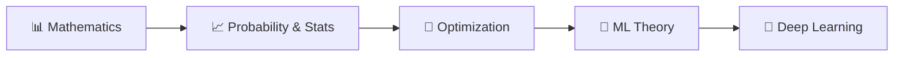

<!-- Animated Header -->
<p align="center">
  
</p>

<p align="center">
  
  
  
</p>


---

## 📊 Learning Path


---

## 🎯 What You'll Learn

> 💡 Machine learning is fundamentally about **learning from uncertain data**.

| Module | Topics | ML Applications |
|--------|--------|-----------------|
| 🎲 **Probability** | Bayes, Distributions, Expectation | Likelihood, priors, posteriors |
| 📈 **Multivariate** | Covariance, MVN, Exp Family | VAE, PCA, Gaussian Processes |
| 📡 **Information Theory** | Entropy, KL, Cross-Entropy | Loss functions, VAE, distillation |
| 📊 **Estimation** | MLE, MAP, Bayesian | Training, regularization |

---

## 🗺️ Complete Folder Structure

### 📁 [01_probability/](./01_probability/) - Probability Theory

| Folder | Topic | Key Concepts |
|--------|-------|--------------|
| [01_bayes/](./01_probability/01_bayes/) | Bayesian Inference | Posterior, conjugate priors, MCMC |
| [02_bayes_theorem/](./01_probability/02_bayes_theorem/) | Bayes' Theorem | $P(\theta\|D) \propto P(D\|\theta)P(\theta)$ |
| [03_conditional/](./01_probability/03_conditional/) | Conditional Probability | Chain rule, independence |
| [04_distributions/](./01_probability/04_distributions/) | Distributions | Bernoulli, Gaussian, Poisson |
| [05_expectation/](./01_probability/05_expectation/) | Expectation & Moments | $E[X]$, $\text{Var}(X)$, skewness |
| [06_limit_theorems/](./01_probability/06_limit_theorems/) | Limit Theorems | LLN, CLT, concentration |
| [07_random_variables/](./01_probability/07_random_variables/) | Random Variables | PMF, PDF, CDF |
| [08_spaces/](./01_probability/08_spaces/) | Sample Spaces | $\Omega$, σ-algebra, events |

---

### 📁 [02_multivariate/](./02_multivariate/) - Multivariate Statistics

| Folder | Topic | Key Concepts |
|--------|-------|--------------|
| [01_covariance/](./02_multivariate/01_covariance/) | Covariance Matrix | $\Sigma$, correlation, PSD |
| [02_exponential_family/](./02_multivariate/02_exponential_family/) | Exponential Family | GLMs, sufficient statistics |
| [03_gaussian/](./02_multivariate/03_gaussian/) | Multivariate Gaussian | $\mathcal{N}(\boldsymbol{\mu}, \boldsymbol{\Sigma})$, conditionals |
| [04_random_vectors/](./02_multivariate/04_random_vectors/) | Random Vectors | Joint, marginal, conditional |

---

### 📁 [03_information_theory/](./03_information_theory/) - Information Theory

| Folder | Topic | Key Concepts |
|--------|-------|--------------|
| [01_cross_entropy/](./03_information_theory/01_cross_entropy/) | 🔥 Cross-Entropy | Classification loss |
| [02_entropy/](./03_information_theory/02_entropy/) | Shannon Entropy | $H(X) = -\sum p(x)\log p(x)$ |
| [03_kl_divergence/](./03_information_theory/03_kl_divergence/) | KL Divergence | VAE, distillation, RLHF |
| [04_mutual_information/](./03_information_theory/04_mutual_information/) | Mutual Information | InfoNCE, contrastive learning |

---

### 📁 [04_estimation/](./04_estimation/) - Statistical Estimation

| Folder | Topic | Key Concepts |
|--------|-------|--------------|
| [01_bayesian/](./04_estimation/01_bayesian/) | Bayesian Estimation | Full posterior $P(\theta\|D)$ |
| [02_map/](./04_estimation/02_map/) | MAP Estimation | Regularization = prior |
| [03_mle/](./04_estimation/03_mle/) | MLE | Training = maximize likelihood |

---

## 📐 Key Formulas

### Bayes' Theorem

$$P(\theta|D) = \frac{P(D|\theta) \cdot P(\theta)}{P(D)} = \frac{\text{Likelihood} \times \text{Prior}}{\text{Evidence}}$$

### Multivariate Gaussian

$$p(\mathbf{x}) = (2\pi)^{-d/2} |\boldsymbol{\Sigma}|^{-1/2} \exp\left(-\frac{1}{2}(\mathbf{x}-\boldsymbol{\mu})^\top\boldsymbol{\Sigma}^{-1}(\mathbf{x}-\boldsymbol{\mu})\right)$$

### Cross-Entropy & KL Divergence

$$H(p,q) = -\sum_x p(x)\log q(x) = H(p) + D_{KL}(p \| q)$$

### MLE = Training

$$\theta_{MLE} = \arg\max_\theta P(D|\theta) = \arg\min_\theta \left[-\sum_i \log P(y_i|x_i;\theta)\right]$$

---

## 💡 Key Formulas Summary

<table>
<tr>
<td>

### 🎲 Probability

```
Bayes: P(A|B) = P(B|A)P(A)/P(B)
E[X] = Σ x·p(x)
Var(X) = E[X²] - (E[X])²

```

</td>
<td>

### 📡 Information Theory

```
H(X) = -Σ p(x)log p(x)
H(p,q) = -Σ p(x)log q(x)
KL(p||q) = Σ p(x)log[p(x)/q(x)]

```

</td>
</tr>
<tr>
<td>

### 📈 Multivariate

```
Cov(X,Y) = E[(X-μₓ)(Y-μᵧ)]
Σ = E[(X-μ)(X-μ)ᵀ]
X|Y ~ N(μ₁|₂, Σ₁|₂)

```

</td>
<td>

### 📊 Estimation

```
MLE: θ* = argmax P(D|θ)
MAP: θ* = argmax P(D|θ)P(θ)
Bayesian: P(θ|D) = P(D|θ)P(θ)/P(D)

```

</td>
</tr>
</table>

---

## 🔗 ML Applications

| Concept | Application | Used In |
|:-------:|-------------|---------|
| 🔮 **Bayes** | Posterior inference | Bayesian NN, GP |
| 📊 **Entropy** | Decision trees, exploration | ID3, SAC |
| 📈 **Cross-Entropy** | Classification loss | All classifiers |
| 🔀 **KL Divergence** | Variational inference | VAE, RLHF, DPO |
| 📉 **MLE** | Training neural networks | All deep learning |
| 📐 **Covariance** | Dimensionality reduction | PCA, whitening |

---

## 💻 Quick Code Examples

```python
import numpy as np
import torch
import torch.nn.functional as F

# Bayes' Theorem: Medical diagnosis
prior = 0.01  # P(disease)
sensitivity = 0.95  # P(positive|disease)
specificity = 0.99  # P(negative|no disease)
p_positive = sensitivity * prior + (1 - specificity) * (1 - prior)
posterior = (sensitivity * prior) / p_positive  # P(disease|positive)

# Cross-Entropy Loss (classification)
logits = torch.randn(32, 10)
labels = torch.randint(0, 10, (32,))
loss = F.cross_entropy(logits, labels)  # = -log P(y|x)

# VAE KL Loss
def vae_kl(mu, log_var):
    return -0.5 * torch.sum(1 + log_var - mu.pow(2) - log_var.exp())

# MLE for Gaussian
data = np.random.randn(1000)
mu_mle = data.mean()      # Sample mean
sigma_mle = data.std()     # Sample std

```

---

## 🔗 Prerequisites & Next Steps



---

## 📚 Recommended Resources

| Type | Resource | Focus |
|:----:|----------|-------|
| 📘 | [Pattern Recognition & ML (Bishop)](https://www.microsoft.com/en-us/research/uploads/prod/2006/01/Bishop-Pattern-Recognition-and-Machine-Learning-2006.pdf) | Probability for ML |
| 📘 | [Information Theory (MacKay)](http://www.inference.org.uk/itprnn/book.pdf) | Info theory fundamentals |
| 🎓 | [MIT 6.041](https://ocw.mit.edu/courses/6-041-probabilistic-systems-analysis-and-applied-probability-fall-2010/) | Probability |
| 🎓 | [Stats 110 (Harvard)](https://www.youtube.com/playlist?list=PL2SOU6wwxB0uwwH80KTQ6ht66KWxbzTIo) | Probability |
| 🇨🇳 | [概率统计-知乎专栏](https://zhuanlan.zhihu.com/p/25110450) | 概率基础 |
| 🇨🇳 | [信息论入门](https://zhuanlan.zhihu.com/p/35379531) | 信息论 |

---

## 🗺️ Navigation

| Previous | Current | Next |
|:--------:|:-------:|:----:|
| [📊 Mathematics](../02_mathematics/) | **📈 Probability & Statistics** | [🎯 Optimization](../04_optimization/) |

---


<p align="center">
  
</p>
