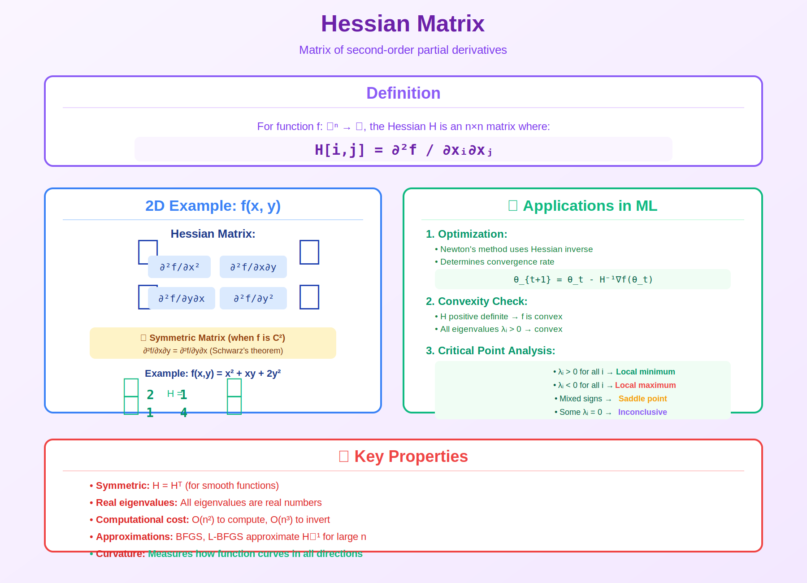

<!-- Animated Header -->
<p align="center">
  
</p>

<p align="center">
  
  
</p>

---

# Hessian Matrix

> **Curvature information for faster optimization**



---

## 📖 What is the Hessian?

The Hessian is a matrix of **second partial derivatives**. It tells us about the **curvature** of the function.

```
+---------------------------------------------------------+
|                                                         |
|   For f(x₁, x₂, ..., xₙ):                              |
|                                                         |
|         + ∂²f/∂x₁²    ∂²f/∂x₁∂x₂  ...  ∂²f/∂x₁∂xₙ +   |
|         | ∂²f/∂x₂∂x₁  ∂²f/∂x₂²    ...  ∂²f/∂x₂∂xₙ |   |
|   H =   |     ⋮           ⋮        ⋱       ⋮      |   |
|         | ∂²f/∂xₙ∂x₁  ∂²f/∂xₙ∂x₂  ...  ∂²f/∂xₙ²   |   |
|         +                                          +   |
|                                                         |
|   Size: n × n matrix (symmetric!)                       |
|                                                         |
+---------------------------------------------------------+
```

---

## 🎯 Visual Intuition

```
Hessian tells us the SHAPE of the bowl:

    Positive Definite         Negative Definite        Indefinite
    (H ≻ 0, all λ > 0)        (H ≺ 0, all λ < 0)       (mixed λ)
    
         ╲___╱                    ╱‾‾‾╲                  ╲__╱‾╲
          \•/                     \•/                      •
        MINIMUM                 MAXIMUM               SADDLE POINT
        
    "Bowl up"                "Bowl down"             "Saddle"
```

---

## 📐 Example: f(x, y) = x² + 3y²

**Step 1: First Derivatives**
```
∂f/∂x = 2x
∂f/∂y = 6y
```

**Step 2: Second Derivatives**
```
∂²f/∂x² = 2       (how ∂f/∂x changes with x)
∂²f/∂y² = 6       (how ∂f/∂y changes with y)
∂²f/∂x∂y = 0      (how ∂f/∂x changes with y)
∂²f/∂y∂x = 0      (how ∂f/∂y changes with x)
```

**Step 3: Hessian Matrix**
```
      +     +
H =   | 2  0 |
      | 0  6 |
      +     +
```

**Step 4: Analyze Eigenvalues**
```
λ₁ = 2 > 0
λ₂ = 6 > 0

Both positive → MINIMUM at (0,0) ✓
```

---

## 🌍 Where Hessian Is Used

| Application | How | Why |
|-------------|-----|-----|
| **Newton's Method** | x_{k+1} = x_k - H⁻¹∇f | Faster convergence |
| **Loss Landscape Analysis** | Eigenvalues of H | Sharp vs flat minima |
| **Fisher Information** | Expected Hessian | Natural gradient |
| **Laplacian** | Trace of H | Image processing |
| **Mode Connectivity** | Hessian along path | Understanding DL |

---

## 📊 Classifying Critical Points

| Hessian Eigenvalues | Type | Example |
|---------------------|------|---------|
| All λ > 0 | Local minimum | Bottom of bowl |
| All λ < 0 | Local maximum | Top of hill |
| Mixed signs | Saddle point | Horse saddle |
| Some λ = 0 | Degenerate | Needs more analysis |

---

## 💻 Computing Hessian in Code

### PyTorch
```python
import torch
from torch.autograd.functional import hessian

def f(x):
    return x[0]**2 + 3*x[1]**2

x = torch.tensor([1.0, 1.0])
H = hessian(f, x)
print(f"Hessian:\n{H}")
# [[2., 0.],
#  [0., 6.]]
```

### JAX
```python
import jax
import jax.numpy as jnp

def f(x):
    return x[0]**2 + 3*x[1]**2

hess_f = jax.hessian(f)
x = jnp.array([1.0, 1.0])
print(f"Hessian:\n{hess_f(x)}")
```

---

## ⚠️ Why We Often Avoid Hessian

| Problem | Details | Solution |
|---------|---------|----------|
| **Storage** | O(n²) memory | Too big for neural nets |
| **Computation** | O(n²) to compute | Too slow |
| **Inversion** | O(n³) to invert | Even slower |

**Solution: Quasi-Newton methods (BFGS, L-BFGS)** approximate H using only gradient info!

---

## 🔗 Connection to Optimization

```
Taylor Expansion (2nd order):

f(x + Δx) ≈ f(x) + ∇f(x)ᵀΔx + ½ΔxᵀHΔx
            -----  ----------  --------
            value   linear      quadratic
                    term        term (curvature)

Newton's method minimizes this quadratic approximation!
```

---

## 📚 Resources

| Type | Title | Link |
|------|-------|------|
| 📖 | Numerical Optimization Ch.2 | [Springer](https://link.springer.com/book/10.1007/978-0-387-40065-5) |
| 🎥 | Hessian Visualized | [YouTube](https://www.youtube.com/watch?v=LbBcuZukCAw) |
| 🇨🇳 | 知乎 - Hessian矩阵 | [知乎](https://zhuanlan.zhihu.com/p/37688632) |

---

---

⬅️ [Back: Gradients](./gradients.md)

---

<p align="center">
  
</p>
