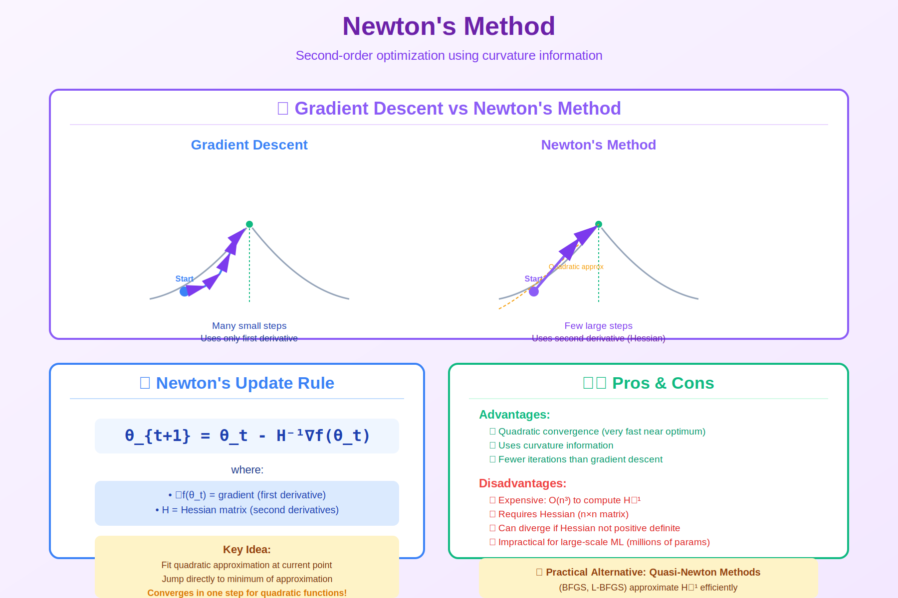

# Newton's Method

> **Second-order optimization for blazing fast convergence**

## 🎯 Visual Overview



*Caption: Newton's method uses quadratic approximation: θ ← θ - H⁻¹∇f. Quadratic convergence (error² each step). O(n³) cost → use Quasi-Newton (BFGS, L-BFGS) for large problems.*

---

## 📂 Topics in This Folder

| File | Topic | Level |
|------|-------|-------|

---

## 🎯 The Core Idea

```
+---------------------------------------------------------+
|                                                         |
|   Gradient Descent: Linear approximation               |
|   f(x + Δx) ≈ f(x) + ∇f(x)ᵀΔx                          |
|                                                         |
|   Newton's Method: Quadratic approximation             |
|   f(x + Δx) ≈ f(x) + ∇f(x)ᵀΔx + ½ΔxᵀHΔx               |
|                                                         |
|   Why better? Captures curvature!                       |
|                                                         |
+---------------------------------------------------------+
```

---

## 📐 The Algorithm

```
Newton Step:

+---------------------------------------------------------+
|                                                         |
|   x_{k+1} = x_k - H(x_k)⁻¹ ∇f(x_k)                     |
|                                                         |
|   where:                                                |
|   • H = Hessian (matrix of second derivatives)          |
|   • ∇f = gradient (vector of first derivatives)        |
|                                                         |
|   No learning rate needed!                              |
|   (The Hessian provides natural step size)              |
|                                                         |
+---------------------------------------------------------+
```

---

## 🎯 Visual: Why It's Faster

```
Gradient Descent:              Newton's Method:
(Linear approx)                (Quadratic approx)

    ╲                               ╲
     ╲   function                    ╲   function
      ╲_____•_____                    ╲__•__╱
           ╱╲                            |
          ╱  ╲ tangent line              | perfect step!
         ╱    ╲                          ↓
                                         • minimum

Takes many small steps           Takes one big accurate step
```

---

## 📊 Convergence Comparison

| Method | Convergence | Per-Step Cost | Memory |
|--------|-------------|---------------|--------|
| **Gradient Descent** | O(1/k) | O(n) | O(n) |
| **Newton** | O(log log(1/ε)) | O(n³) | O(n²) |
| **L-BFGS** | Superlinear | O(n) | O(mn) |

```
Newton converges QUADRATICALLY:

If error at step k is ε,
error at step k+1 is ε²!

Example:
Step 1: error = 0.1
Step 2: error = 0.01
Step 3: error = 0.0001
Step 4: error = 0.00000001

4 steps to machine precision!
```

---

## 🌍 Where Newton's Method Is Used

| Application | Why Newton? | Details |
|-------------|-------------|---------|
| **L-BFGS** | Approximates Newton | Scipy default |
| **Logistic Regression** | Small scale, convex | Sklearn uses Newton |
| **Scientific Computing** | Need precision | Physics simulations |
| **Trust Region (RL)** | TRPO uses Newton | Constrained optimization |
| **Interior Point** | LP/QP solvers | Gurobi, MOSEK |

---

## ⚠️ The Problem: Hessian is Expensive!

```
For n parameters:

Hessian:
• Storage: O(n²) memory
• Compute: O(n²) operations  
• Invert: O(n³) operations

For GPT (1.7T params): Impossible!

Solution: Quasi-Newton methods (BFGS, L-BFGS)
• Approximate Hessian using gradients only
• O(n) per step, O(n) memory (L-BFGS)
```

---

## 💻 Implementation

### NumPy (Full Newton)
```python
import numpy as np

def newton_method(f, grad_f, hess_f, x0, max_iter=100, tol=1e-8):
    x = x0.copy()
    
    for i in range(max_iter):
        g = grad_f(x)
        H = hess_f(x)
        
        # Newton step: Δx = -H⁻¹g
        delta_x = np.linalg.solve(H, -g)
        x = x + delta_x
        
        if np.linalg.norm(g) < tol:
            print(f"Converged in {i+1} iterations")
            break
    
    return x

# Example: f(x,y) = x² + 2y²
def grad_f(x):
    return np.array([2*x[0], 4*x[1]])

def hess_f(x):
    return np.array([[2, 0], [0, 4]])

x_opt = newton_method(None, grad_f, hess_f, np.array([10.0, 10.0]))
print(f"Optimal: {x_opt}")  # [0, 0] in 1 iteration!
```

### SciPy (L-BFGS)
```python
from scipy.optimize import minimize

def f(x):
    return (1-x[0])**2 + 100*(x[1]-x[0]**2)**2

result = minimize(f, [0, 0], method='L-BFGS-B')
print(f"Optimal: {result.x}")
print(f"Iterations: {result.nit}")
```

---

## 📊 When to Use What

| Scenario | Method | Why |
|----------|--------|-----|
| n < 1000 | Newton | Fast, accurate |
| n < 100000 | L-BFGS | Practical Newton |
| n > 100000 | SGD/Adam | Only option |
| Non-convex DL | Adam | Handles saddles |
| Convex ML | L-BFGS | Guaranteed optimal |

---

## 📚 Resources

| Type | Title | Link |
|------|-------|------|
| 📖 | Nocedal Ch.3 | [Springer](https://link.springer.com/book/10.1007/978-0-387-40065-5) |
| 📄 | L-BFGS Paper | [ACM](https://dl.acm.org/doi/10.1145/279232.279236) |
| 🎥 | Newton's Method | [YouTube](https://www.youtube.com/watch?v=sDv4f4s2SB8) |
| 🇨🇳 | 知乎 牛顿法 | [知乎](https://zhuanlan.zhihu.com/p/37588590) |
| 🇨🇳 | CSDN L-BFGS | [CSDN](https://blog.csdn.net/google19890102/article/details/46404501) |

---

⬅️ [Back: Basic Methods](../)

