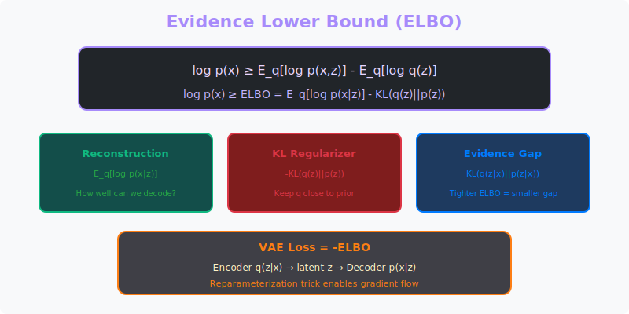

<!-- Animated Header -->
<p align="center">
  
</p>

<p align="center">
  
  
</p>

---


# ELBO (Evidence Lower Bound)

> The optimization objective for Variational Inference

## 🎯 Visual Overview



*Caption: ELBO = E_q[log p(x|z)] - KL(q(z)||p(z)). Reconstruction term + regularization. Maximizing ELBO ≈ maximizing log p(x). Used in VAE, diffusion models, Bayesian neural networks.*

---

## 📂 Subtopics

| File | Topic |
|------|-------|
| [diffusion.md](./diffusion.md) | ELBO in Diffusion Models |

---

## 🎯 What is ELBO?

```
Problem: We want to maximize log p(x) (log-likelihood)
         But it's intractable!

Solution: Maximize a lower bound instead = ELBO

+-----------------------------------------------------+
|                                                     |
|   log p(x) = ELBO + KL(q || p)                     |
|                                                     |
|   Since KL ≥ 0, we have:                           |
|                                                     |
|   log p(x) ≥ ELBO                                  |
|                                                     |
|   Maximizing ELBO ≈ Maximizing log p(x)            |
|                                                     |
+-----------------------------------------------------+
```

---

## 📐 Formula

```
ELBO = E_q(z|x)[log p(x|z)] - KL(q(z|x) || p(z))
       ---------------------   ------------------
       Reconstruction term      Regularization term
       
       "How well can we         "Stay close to 
        reconstruct x?"          the prior p(z)"
```

---

## 🌍 Where ELBO is Used

| Model | How ELBO is Used | Paper |
|-------|------------------|-------|
| **VAE** | Main training objective | [Kingma 2013](https://arxiv.org/abs/1312.6114) |
| **Diffusion Models** | Variational bound on likelihood | [DDPM 2020](https://arxiv.org/abs/2006.11239) |
| **Bayesian NN** | Approximate posterior | [Weight Uncertainty](https://arxiv.org/abs/1505.05424) |
| **LLM Fine-tuning** | RLHF uses variational methods | [InstructGPT](https://arxiv.org/abs/2203.02155) |
| **Normalizing Flows** | Tighter ELBO with flows | [Rezende 2015](https://arxiv.org/abs/1505.05770) |

---

## 🔗 Connection to Optimization

```
ELBO is convex in certain parameterizations!

For exponential family:
• ELBO is concave in natural parameters
• Can use convex optimization tools
• Coordinate ascent works well

For neural networks:
• Non-convex in weights
• Use SGD/Adam
• Local optima issues
```

---

## 📊 ELBO Decomposition

```
log p(x) = ELBO + KL

Three ways to write ELBO:

1. ELBO = E_q[log p(x,z)] - E_q[log q(z)]

2. ELBO = E_q[log p(x|z)] - KL(q(z|x) || p(z))

3. ELBO = log p(x) - KL(q(z|x) || p(z|x))
```

---

## 📚 Resources

| Type | Title | Link |
|------|-------|------|
| 📄 Paper | VAE Original | [arXiv:1312.6114](https://arxiv.org/abs/1312.6114) |
| 📄 Paper | DDPM (Diffusion) | [arXiv:2006.11239](https://arxiv.org/abs/2006.11239) |
| 📄 Tutorial | VI Tutorial | [arXiv:1601.00670](https://arxiv.org/abs/1601.00670) |
| 🇨🇳 知乎 | ELBO推导详解 | [知乎](https://zhuanlan.zhihu.com/p/22464760) |
| 🇨🇳 CSDN | 变分推断入门 | [CSDN](https://blog.csdn.net/aws3217150/article/details/57072827) |

---

⬅️ [Back: Convex Optimization](../)

---

<p align="center">
  
</p>
