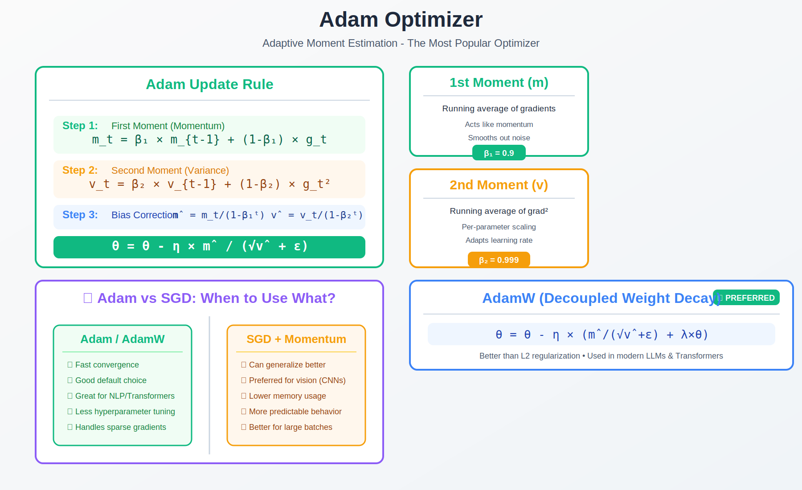

<!-- Animated Header -->
<p align="center">
  
</p>

<p align="center">
  
  
</p>

---


# Adam Optimizer

> **The default optimizer for deep learning**

## 🎯 Visual Overview



*Caption: Adam = Adaptive Moment Estimation. Combines momentum (m) and RMSprop (v) with bias correction. Default: β₁=0.9, β₂=0.999. AdamW decouples weight decay for transformers.*

---

## 📂 Topics in This Folder

| File | Topic | Used In |
|------|-------|---------|

---

## 🎯 What is Adam?

Adam = **Ada**ptive **M**oment Estimation

It combines:
1. **Momentum** (first moment) - Smooth out gradients
2. **RMSprop** (second moment) - Adaptive learning rate

```
+---------------------------------------------------------+
|                                                         |
|   SGD          + Momentum      + Adaptive LR   = Adam   |
|   ---             ---              ---            ---   |
|   Basic       Accelerate       Per-parameter    Best    |
|   update      through          learning rate    of all  |
|               ravines                                   |
|                                                         |
+---------------------------------------------------------+
```

---

## 📐 The Algorithm

```
Initialize: m₀ = 0, v₀ = 0, t = 0

For each step:
+---------------------------------------------------------+
|                                                         |
|   1. t = t + 1                                          |
|                                                         |
|   2. g_t = ∇L(θ_t)              # Get gradient         |
|                                                         |
|   3. m_t = β₁·m_{t-1} + (1-β₁)·g_t    # Momentum       |
|                                                         |
|   4. v_t = β₂·v_{t-1} + (1-β₂)·g_t²   # Adaptive       |
|                                                         |
|   5. m̂_t = m_t / (1 - β₁ᵗ)           # Bias correct   |
|      v̂_t = v_t / (1 - β₂ᵗ)                             |
|                                                         |
|   6. θ_t = θ_{t-1} - α·m̂_t/(√v̂_t + ε)  # Update       |
|                                                         |
+---------------------------------------------------------+
```

---

## 🔢 Default Hyperparameters

| Parameter | Default | Meaning |
|-----------|---------|---------|
| **α** (lr) | 0.001 | Learning rate |
| **β₁** | 0.9 | First moment decay (momentum) |
| **β₂** | 0.999 | Second moment decay (adaptive) |
| **ε** | 10⁻⁸ | Numerical stability |

---

## 🌍 Where Adam Is Used

| Model | Year | Notes |
|-------|------|-------|
| **GPT-2/3/4** | 2019+ | With warmup + decay |
| **BERT** | 2018 | AdamW variant |
| **Stable Diffusion** | 2022 | Default optimizer |
| **Transformers** | 2017+ | Almost universal |
| **Most deep learning** | - | Default choice |

---

## 💻 Code Examples

### PyTorch
```python
import torch.optim as optim

# Standard Adam
optimizer = optim.Adam(
    model.parameters(),
    lr=0.001,
    betas=(0.9, 0.999),
    eps=1e-8
)

# AdamW (for transformers)
optimizer = optim.AdamW(
    model.parameters(),
    lr=1e-4,
    weight_decay=0.01
)

# Training loop
for epoch in range(epochs):
    for batch in dataloader:
        loss = model(batch)
        optimizer.zero_grad()
        loss.backward()
        optimizer.step()
```

### With Learning Rate Schedule (GPT-style)
```python
from transformers import get_linear_schedule_with_warmup

optimizer = optim.AdamW(model.parameters(), lr=5e-5)
scheduler = get_linear_schedule_with_warmup(
    optimizer,
    num_warmup_steps=1000,
    num_training_steps=100000
)

# In training loop:
optimizer.step()
scheduler.step()
```

---

## 📊 Adam vs Others


| Optimizer | Pros | Cons |
|-----------|------|------|
| **SGD** | Simple, good generalization | Slow, needs tuning |
| **Momentum** | Faster than SGD | Still needs LR tuning |
| **Adam** | Fast, little tuning | May generalize worse |
| **AdamW** | Best for transformers | Slightly more complex |

---

## ⚠️ When NOT to Use Adam

| Situation | Better Choice | Why |
|-----------|---------------|-----|
| CNNs (ResNet) | SGD + Momentum | Better generalization |
| Very large batch | LAMB, LARS | Scales better |
| Simple convex | L-BFGS | Faster convergence |
| RL (some cases) | RMSprop | Historical reasons |

---

## 📐 DETAILED MATHEMATICAL THEORY

### 1. Adam Algorithm: Complete Derivation

**Full Algorithm:**

```
Initialize:
  m₀ = 0  (first moment vector)
  v₀ = 0  (second moment vector)
  t = 0   (timestep)

Hyperparameters:
  α = 0.001    (learning rate)
  β₁ = 0.9     (exponential decay for 1st moment)
  β₂ = 0.999   (exponential decay for 2nd moment)
  ε = 10⁻⁸     (numerical stability)

For each iteration:
+---------------------------------------------------------+
|                                                         |
|  1. t ← t + 1                                           |
|                                                         |
|  2. gₜ ← ∇L(θₜ₋₁)              # Get gradient           |
|                                                         |
|  3. mₜ ← β₁·mₜ₋₁ + (1-β₁)·gₜ   # Update 1st moment     |
|                                                         |
|  4. vₜ ← β₂·vₜ₋₁ + (1-β₂)·gₜ²  # Update 2nd moment     |
|                                                         |
|  5. m̂ₜ ← mₜ/(1 - β₁ᵗ)          # Bias correction       |
|     v̂ₜ ← vₜ/(1 - β₂ᵗ)                                  |
|                                                         |
|  6. θₜ ← θₜ₋₁ - α·m̂ₜ/(√v̂ₜ + ε)  # Parameter update    |
|                                                         |
+---------------------------------------------------------+
```

---

### 2. Building Blocks: From SGD to Adam

**Component 1: Exponential Moving Average (Momentum)**

```
First moment: mₜ = β₁·mₜ₋₁ + (1-β₁)·gₜ

Expansion:
  mₜ = (1-β₁) Σᵢ₌₀^{t-1} β₁^i · gₜ₋ᵢ
  
  = (1-β₁)[gₜ + β₁·gₜ₋₁ + β₁²·gₜ₋₂ + ...]

Effective window:
  w = 1/(1-β₁)
  
  β₁ = 0.9  → w = 10  gradients
  β₁ = 0.99 → w = 100 gradients

Effect: Smooths noisy gradients (like momentum)
```

**Component 2: Adaptive Learning Rate (RMSprop)**

```
Second moment: vₜ = β₂·vₜ₋₁ + (1-β₂)·gₜ²

Expansion:
  vₜ = (1-β₂) Σᵢ₌₀^{t-1} β₂^i · gₜ₋ᵢ²
  
  ≈ E[gₜ²]  (exponential moving average of squared gradients)

Effective window:
  w = 1/(1-β₂)
  
  β₂ = 0.999 → w = 1000 gradients (long memory!)

Update:
  θₜ = θₜ₋₁ - α·gₜ/√(vₜ + ε)
  
  Effect: Larger steps for parameters with small gradients
          Smaller steps for parameters with large gradients
```

**Component 3: Bias Correction**

```
Problem: Initial estimates are biased toward 0

  m₀ = 0, then m₁ = (1-β₁)·g₁
  
  But we want: E[m₁] = E[g₁]
  
  Actually: E[m₁] = (1-β₁)·E[g₁] ≠ E[g₁]  (biased!)

Solution: Divide by (1 - β₁ᵗ)
  
  m̂ₜ = mₜ/(1 - β₁ᵗ)
  
  E[m̂ₜ] = E[mₜ]/(1 - β₁ᵗ)
        = (1 - β₁ᵗ)·E[gₜ]/(1 - β₁ᵗ)
        = E[gₜ]  ✓ (unbiased!)

As t → ∞: (1 - β₁ᵗ) → 1, so correction vanishes
```

**Putting It Together: Adam Update**

```
θₜ = θₜ₋₁ - α · [mₜ/(1-β₁ᵗ)] / √[vₜ/(1-β₂ᵗ) + ε]

   = θₜ₋₁ - α · [mₜ·√(1-β₂ᵗ)] / [√vₜ·(1-β₁ᵗ) + ε']

where ε' = ε·(1-β₁ᵗ)/√(1-β₂ᵗ)

Interpretation:
  • Numerator: Bias-corrected momentum
  • Denominator: Bias-corrected RMS of gradients
  • Result: Adaptive per-parameter learning rates
```

---

### 3. Why Bias Correction Matters: Quantitative Analysis

**Without Bias Correction:**

```
Early iterations (t=1):
  m₁ = (1-β₁)·g₁ = 0.1·g₁   (with β₁=0.9)
  v₁ = (1-β₂)·g₁² = 0.001·g₁²  (with β₂=0.999)
  
  Update: θ₁ = θ₀ - α·(0.1·g₁)/√(0.001·g₁² + ε)
            ≈ θ₀ - α·(0.1·g₁)/(0.032·|g₁|)
            = θ₀ - 3.16·α·sign(g₁)
  
  Problem: Step size 3× too large in early iterations!
```

**With Bias Correction:**

```
Early iterations (t=1):
  m̂₁ = m₁/(1-β₁¹) = 0.1·g₁/0.1 = g₁
  v̂₁ = v₁/(1-β₂¹) = 0.001·g₁²/0.001 = g₁²
  
  Update: θ₁ = θ₀ - α·g₁/√(g₁² + ε)
            ≈ θ₀ - α·sign(g₁)
  
  Correct behavior! Step size ≈ α as expected
```

**Convergence of Bias:**

```
Bias factor: bₜ = 1 - β₁ᵗ

  t=1:    b₁ = 0.1      (10% of true value without correction)
  t=10:   b₁₀ = 0.651   (65%)
  t=100:  b₁₀₀ = 0.9999 (essentially 1)

After ~20-30 iterations, bias correction has minimal effect
```

---

### 4. Convergence Analysis: Adam Theory

**Theorem (Reddi et al., 2018): Adam May Not Converge**

```
Counterexample: Simple online learning problem
  gₜ = +C  if t mod 3 ∈ {1, 2}
  gₜ = -2C otherwise
  
  Average gradient: E[gₜ] = 0
  
  But Adam converges to wrong point!

Problem: Adaptive learning rate can cause non-convergence
         when gradient variance is high
```

**AMSGrad Fix:**

```
Modification: Use maximum of past v̂ₜ

  vₜ = β₂·vₜ₋₁ + (1-β₂)·gₜ²
  v̂ₜ = max(v̂ₜ₋₁, vₜ/(1-β₂ᵗ))  # Max with previous!
  θₜ = θₜ₋₁ - α·m̂ₜ/√(v̂ₜ + ε)

Effect: Ensures learning rate never increases
Result: Provable convergence (under standard assumptions)

Practical note: AMSGrad rarely better than Adam empirically
```

**Convergence Rate (Under Assumptions):**

```
For convex f with bounded gradients:
  E[f(θₜ) - f(θ*)] = O(1/√T)

For non-convex f:
  (1/T) Σₜ E[||∇f(θₜ)||²] = O(1/√T)
  
  Interpretation: Finds stationary point in O(1/ε²) iterations

Similar to SGD, but often faster in practice due to adaptivity
```

---

### 5. AdamW: Decoupling Weight Decay

**Problem with Adam + L2 Regularization:**

```
Standard L2 regularization:
  L_reg(θ) = L(θ) + (λ/2)||θ||²
  
  Gradient: ∇L_reg = ∇L + λ·θ
  
  Adam applies to total gradient:
    mₜ = β₁·mₜ₋₁ + (1-β₁)(∇L + λ·θ)
    vₜ = β₂·vₜ₋₁ + (1-β₂)(∇L + λ·θ)²
    
  Problem: Weight decay gets scaled by adaptive learning rate!
           Not equivalent to L2 regularization
```

**AdamW Solution (Loshchilov & Hutter, 2019):**

```
Decouple weight decay from gradient:
  
  mₜ = β₁·mₜ₋₁ + (1-β₁)·∇L(θₜ)  (no λ·θ!)
  vₜ = β₂·vₜ₋₁ + (1-β₂)·(∇L(θₜ))²
  m̂ₜ = mₜ/(1 - β₁ᵗ)
  v̂ₜ = vₜ/(1 - β₂ᵗ)
  
  θₜ = (1 - α·λ)·θₜ₋₁ - α·m̂ₜ/(√v̂ₜ + ε)
       ↑
       Decoupled weight decay!

Effect: Weight decay independent of learning rate and adaptivity
Result: Much better for transformer training
```

**Why AdamW Works Better:**

```
Adam + L2:
  Step in θᵢ ∝ α/(√vᵢ + ε)
  
  Parameters with large gradients: Small adaptive LR
  → Weight decay also reduced for these parameters
  → Uneven regularization!

AdamW:
  Weight decay: (1 - α·λ) for ALL parameters
  → Even regularization across all parameters
  → Better generalization

Empirical result (BERT, GPT):
  AdamW consistently outperforms Adam + L2
```

---

### 6. Per-Parameter Learning Rates: The Key Insight

**Motivation: Different Parameters Need Different Learning Rates**

```
Consider neural network:
  θ = [W₁, b₁, W₂, b₂, ...]
  
  Typical gradient magnitudes:
    ||∇W₁|| = 0.1
    ||∇b₁|| = 0.001
    ||∇W₂|| = 10.0
  
  With fixed LR α = 0.01:
    Δb₁ = 0.00001  (too small!)
    ΔW₂ = 0.1       (too large!)
```

**Adam's Adaptive Scaling:**

```
For parameter θᵢ:
  
  Effective learning rate: α_eff,i = α/√(vᵢ + ε)
  
  where vᵢ ≈ RMS of past gradients for θᵢ

Effect:
  Large typical gradients → Large √vᵢ → Small α_eff
  Small typical gradients → Small √vᵢ → Large α_eff
  
  Automatically balances learning rates!
```

**Mathematical Justification:**

```
Diagonal preconditioning interpretation:
  
  Adam update: θₜ = θₜ₋₁ - α·mₜ/√vₜ
  
  Equivalent to: θₜ = θₜ₋₁ - α·Vₜ⁻¹/²·mₜ
  
  where Vₜ = diag(vₜ) (diagonal preconditioner)

Compare to Newton's method:
  θₜ = θₜ₋₁ - α·H⁻¹·∇f
  
  where H = Hessian (full matrix, expensive!)

Adam approximates Newton with diagonal Hessian!
  Vₜ ≈ diag(H)  (diagonal of Hessian)
  
  Cost: O(n) instead of O(n³) for full Newton
```

---

### 7. Warmup: Why Transformers Need It

**Problem: Large Initial Updates**

```
At t=1 with random initialization:
  Gradients can be very large: ||g₁|| = O(100)
  
  Bias correction amplifies:
    m̂₁ = g₁/(1-β₁) = 10·g₁  (with β₁=0.9)
  
  Even with small α = 0.001:
    ||Δθ₁|| = α·||m̂₁||/√v̂₁ can be huge
    
  Result: Training instability, NaN loss
```

**Linear Warmup Solution:**

```
For first T_warmup steps:
  
  α(t) = α_max · min(t/T_warmup, 1)
  
  Example (T_warmup = 1000):
    t=1:    α = 0.001·(1/1000)   = 0.000001
    t=500:  α = 0.001·(500/1000) = 0.0005
    t=1000: α = 0.001·(1000/1000) = 0.001
    t>1000: α = 0.001 (or decay schedule)

Effect: Start with tiny LR, gradually increase
Result: Stable training from start
```

**Why Transformers Especially Need Warmup:**

```
Transformers have:
  1. LayerNorm after embedding → Normalized activations
  2. Random init with std = 0.02 → Small weights
  3. But position embeddings added → Large initial gradients
  
  Combination → Very large gradients initially
  
  Without warmup: Embedding gradients destroy initialization
  With warmup: Gradual adaptation to data statistics
```

**Typical Schedule (BERT/GPT):**

```
Total steps: T = 100,000
Warmup: T_warmup = 10,000 (10% of training)

Schedule:
  t ≤ 10k:    α(t) = α_max · (t/10k)              (warmup)
  t > 10k:    α(t) = α_max · √(10k/t)             (decay)
  
  or
  
  t > 10k:    α(t) = α_max · (T-t)/(T-T_warmup)   (linear decay)
```

---

### 8. Adam Variants: A Zoo of Optimizers

**RMSprop (Hinton, 2012):**
```
No momentum, just adaptive LR:
  
  vₜ = β₂·vₜ₋₁ + (1-β₂)·gₜ²
  θₜ = θₜ₋₁ - α·gₜ/√(vₜ + ε)
  
  Used in: Early RNNs, some RL
```

**AdaGrad (Duchi et al., 2011):**
```
Sum all past gradients (no exponential decay):
  
  vₜ = vₜ₋₁ + gₜ²
  θₜ = θₜ₋₁ - α·gₜ/√(vₜ + ε)
  
  Problem: vₜ grows unbounded → learning rate → 0
  Good for: Sparse gradients (NLP with count features)
```

**AdamW (Loshchilov & Hutter, 2019):**
```
Adam + decoupled weight decay (covered above)
  
  Default for: Transformers (BERT, GPT, etc.)
```

**Nadam (Dozat, 2016):**
```
Adam + Nesterov momentum:
  
  mₜ = β₁·mₜ₋₁ + (1-β₁)·gₜ
  θₜ = θₜ₋₁ - α·(β₁·m̂ₜ + (1-β₁)·gₜ/(1-β₁ᵗ))/√(v̂ₜ + ε)
  
  Slightly better than Adam in some cases
```

**RAdam (Liu et al., 2020):**
```
Rectified Adam: Better bias correction
  
  Adapts learning rate based on variance estimate quality
  Claims to avoid need for warmup (debated)
```

**LAMB (You et al., 2020):**
```
Layer-wise Adaptive Moments:
  
  For each layer l:
    θₜ⁽ˡ⁾ = θₜ₋₁⁽ˡ⁾ - η · (||θₜ₋₁⁽ˡ⁾||/||mₜ⁽ˡ⁾/√vₜ⁽ˡ⁾||) · (mₜ⁽ˡ⁾/√vₜ⁽ˡ⁾)
  
  Effect: Layer-wise learning rate adaptation
  Used for: Very large batch training (batch 64k+)
  Application: BERT trained in 76 minutes!
```

---

### 9. Hyperparameter Sensitivity Analysis

**Learning Rate α:**

```
Most important hyperparameter!

Typical ranges:
  • Transformers: 1e-4 to 5e-4
  • CNNs: 3e-4 to 1e-3
  • Small models: 1e-3 (default)

Sensitivity: HIGH
  • 2× too large → Training diverges
  • 2× too small → Very slow convergence

Tuning strategy:
  1. Try default (1e-3)
  2. If unstable, reduce by 3× (3e-4)
  3. If too slow, increase by 3× (3e-3)
  4. Fine-tune within ±30%
```

**β₁ (First Moment Decay):**

```
Default: 0.9
Range: [0.8, 0.99]

Sensitivity: LOW to MEDIUM
  • Larger β₁ → Smoother updates, more momentum
  • Smaller β₁ → More responsive to recent gradients

Typical adjustments:
  • Noisy gradients: β₁ = 0.95 (more smoothing)
  • Need responsiveness: β₁ = 0.85 (less smoothing)
  
Most people never change this!
```

**β₂ (Second Moment Decay):**

```
Default: 0.999
Range: [0.99, 0.9999]

Sensitivity: VERY LOW
  • β₂ controls how long to remember gradient magnitudes
  • 0.999 → average over ~1000 steps
  • 0.99 → average over ~100 steps

When to change:
  • Short training (<1000 steps): β₂ = 0.99
  • Very long training (>100k steps): β₂ = 0.9999
  • Sparse gradients: β₂ = 0.98
  
99% of users: Keep default 0.999
```

**ε (Numerical Stability):**

```
Default: 1e-8
Range: [1e-7, 1e-8]

Sensitivity: VERY LOW (almost never matters)
  
Only matters when:
  • Some parameters have zero gradient for long time
  • Mixed precision training (fp16): Use ε = 1e-7

Advice: Forget this parameter exists
```

---

### 10. Adam vs SGD: The Great Debate

**Empirical Observations:**

```
Adam wins:
  ✓ Transformers (BERT, GPT, T5)
  ✓ GANs (StyleGAN, DCGAN)
  ✓ Diffusion models
  ✓ RNNs, LSTMs
  ✓ Reinforcement learning
  ✓ Less hyperparameter tuning needed

SGD+Momentum wins:
  ✓ ResNet on ImageNet
  ✓ Some CNNs (better generalization)
  ✓ When batch size is small
  ✓ Transfer learning (fine-tuning)

Tie:
  ≈ Small fully connected networks
  ≈ Logistic regression
  ≈ Simple problems
```

**Why the Difference?**

```
Theory (Wilson et al., 2017):
  Adam finds sharper minima → worse generalization
  SGD finds flatter minima → better generalization
  
  But: For transformers, Adam's adaptivity crucial
       Position/token embeddings need different LRs

Practice:
  • Adam: "Works out of the box"
  • SGD: Needs careful LR tuning, but can be better

Recommendation:
  1. Try Adam first (default α=1e-3)
  2. If not good enough, try SGD+Momentum
  3. Tune LR carefully for SGD
  4. For transformers: Always AdamW
```

---

### 11. Common Pitfalls and Solutions

**1. Forgetting Weight Decay:**
```
Problem: Adam without weight decay → overfitting

Solution:
  optimizer = torch.optim.AdamW(params, lr=1e-4, weight_decay=0.01)
  
  NOT:
  optimizer = torch.optim.Adam(params, lr=1e-4, weight_decay=0.01)
```

**2. No Learning Rate Schedule:**
```
Problem: Constant LR → suboptimal final performance

Solution: Add cosine annealing or linear decay
  scheduler = torch.optim.lr_scheduler.CosineAnnealingLR(...)
```

**3. Wrong Warmup:**
```
Problem: Start with full LR → NaN loss

Solution: Always warmup for transformers
  for step in range(warmup_steps):
      lr = max_lr * step / warmup_steps
      for param_group in optimizer.param_groups:
          param_group['lr'] = lr
```

**4. Batch Size Scaling:**
```
Problem: Increase batch size, keep same LR → worse results

Linear scaling rule (Goyal et al.):
  batch=256, lr=1e-4  →  batch=1024, lr=4e-4
  
  But: Only works up to certain batch size (∼2048)
```

---

### 12. Code: Manual Implementation

```python
import numpy as np

class Adam:
    def __init__(self, params, lr=1e-3, betas=(0.9, 0.999), eps=1e-8, weight_decay=0):
        self.params = list(params)
        self.lr = lr
        self.beta1, self.beta2 = betas
        self.eps = eps
        self.weight_decay = weight_decay
        
        # Initialize moments
        self.m = [np.zeros_like(p) for p in self.params]
        self.v = [np.zeros_like(p) for p in self.params]
        self.t = 0
    
    def step(self, gradients):
        self.t += 1
        
        for i, (param, grad) in enumerate(zip(self.params, gradients)):
            # Add weight decay to gradient (L2 regularization)
            if self.weight_decay != 0:
                grad = grad + self.weight_decay * param
            
            # Update biased first moment estimate
            self.m[i] = self.beta1 * self.m[i] + (1 - self.beta1) * grad
            
            # Update biased second raw moment estimate
            self.v[i] = self.beta2 * self.v[i] + (1 - self.beta2) * (grad ** 2)
            
            # Compute bias-corrected first moment estimate
            m_hat = self.m[i] / (1 - self.beta1 ** self.t)
            
            # Compute bias-corrected second raw moment estimate
            v_hat = self.v[i] / (1 - self.beta2 ** self.t)
            
            # Update parameters
            param -= self.lr * m_hat / (np.sqrt(v_hat) + self.eps)

# Usage example
params = [np.random.randn(100, 50), np.random.randn(50)]
optimizer = Adam(params, lr=1e-3, betas=(0.9, 0.999))

for epoch in range(1000):
    grads = compute_gradients(params)  # Your gradient computation
    optimizer.step(grads)
```

---

## 📚 Resources

| Type | Title | Link |
|------|-------|------|
| 📄 | Original Adam Paper | [arXiv](https://arxiv.org/abs/1412.6980) |
| 📄 | AdamW Paper | [arXiv](https://arxiv.org/abs/1711.05101) |
| 🎥 | Adam Explained | [YouTube](https://www.youtube.com/watch?v=JXQT_vxqwIs) |
| 🇨🇳 | 知乎 Adam详解 | [知乎](https://zhuanlan.zhihu.com/p/32230623) |
| 🇨🇳 | CSDN Adam原理 | [CSDN](https://blog.csdn.net/willduan1/article/details/78070086) |

---

⬅️ [Back: Machine Learning](../) | ➡️ [Next: SGD](../sgd/)


---

<p align="center">
  
</p>
