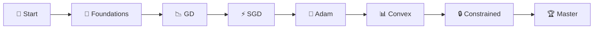
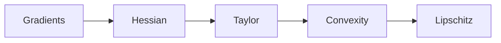
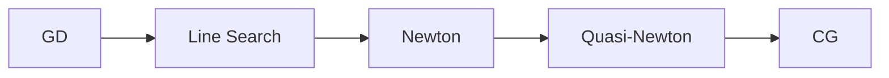
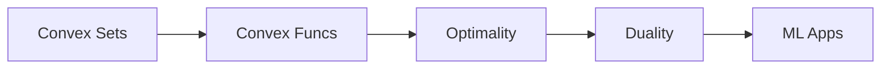
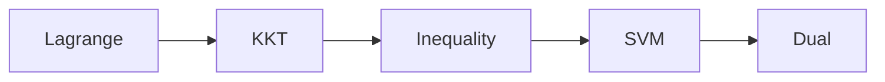
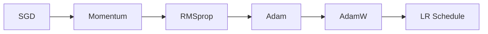
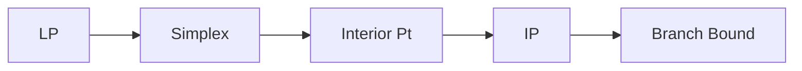
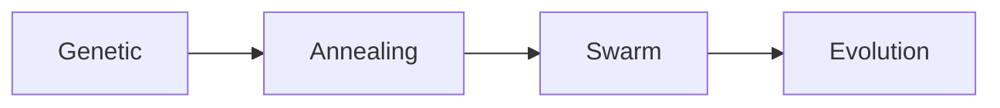
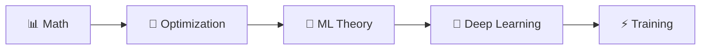

<p align="center">
  
</p>

<p align="center">
  
  
  
</p>

<p align="center">
  <a href="#-main-topics"></a>
  <a href="../05-ml-theory/README.md"></a>
</p>

---

**✍️ Author:** [Gaurav Goswami](https://github.com/Gaurav14cs17) • **📅 Updated:** December 2024

---

## 📊 Learning Path



## 🎯 What You'll Learn

> 💡 **Training = Optimization.** Every neural network learns by minimizing a loss function.

<table>
<tr>
<td align="center">

### 📉 Gradient Descent
Foundation of learning

</td>
<td align="center">

### 🚀 Adam
Default optimizer (90%)

</td>
<td align="center">

### 🔒 Constrained
KKT, SVM derivation

</td>
</tr>
</table>

---

## 📚 Main Topics

### 1️⃣ Foundations




**Core:** Gradients, Hessian, Taylor Series, Convexity

<a href="./01-foundations/README.md"></a>

---

### 2️⃣ Basic Methods




**Core:** GD: θ ← θ - η∇L(θ), Newton's Method, BFGS

<a href="./02-basic-methods/README.md"></a>

---

### 3️⃣ Convex Optimization




**Core:** Convex Functions, First-Order Optimality, Duality

<a href="./04-convex-optimization/README.md"></a>

---

### 4️⃣ Constrained Optimization




**Core:** Lagrange Multipliers, KKT Conditions, SVM Derivation

<a href="./05-constrained-optimization/README.md"></a>

---

### 5️⃣ ML Optimizers ⭐⭐⭐

 



> ⭐ **Adam is the default optimizer for 90% of models**

| Optimizer | Speed | Best For |
|:---------:|:-----:|----------|
| SGD | Slow | Simple, regularization |
| Momentum | Medium | Convex problems |
| **Adam** | **Fast** | **Default choice** ⭐ |
| AdamW | Fast | Transformers, LLMs |

<a href="./08-machine-learning/README.md"></a>

---

### 6️⃣ Linear & Integer Programming




<a href="./06-linear-programming/README.md"></a>
<a href="./07-integer-programming/README.md"></a>

---

### 7️⃣ Metaheuristics




<a href="./09-metaheuristics/README.md"></a>

---

## 💡 Key Algorithms

<table>
<tr>
<td>

### 📉 Gradient Descent
```python
θ ← θ - η∇L(θ)
```

</td>
<td>

### 🏃 Momentum
```python
v ← βv + ∇L(θ)
θ ← θ - ηv
```

</td>
<td>

### 🚀 Adam
```python
m ← β₁m + (1-β₁)∇L
v ← β₂v + (1-β₂)(∇L)²
θ ← θ - η·m̂/(√v̂+ε)
```

</td>
</tr>
</table>

---

## 🔗 Prerequisites & Next Steps



<p align="center">
  <a href="../02-mathematics/README.md"></a>
  <a href="../05-ml-theory/README.md"></a>
</p>

---

## 📚 Recommended Resources

| Type | Resource | Focus |
|:----:|----------|-------|
| 📘 | [Convex Optimization](https://web.stanford.edu/~boyd/cvxbook/) | Boyd & Vandenberghe |
| 📄 | [Adam Paper](https://arxiv.org/abs/1412.6980) | Original Adam |
| 📄 | [AdamW Paper](https://arxiv.org/abs/1711.05101) | Weight decay fix |

---

## 🗺️ Quick Navigation

| Previous | Current | Next |
|:--------:|:-------:|:----:|
| [📈 Probability](../03-probability-statistics/README.md) | **🎯 Optimization** | [🧬 ML Theory →](../05-ml-theory/README.md) |

---

<p align="center">
  
</p>
