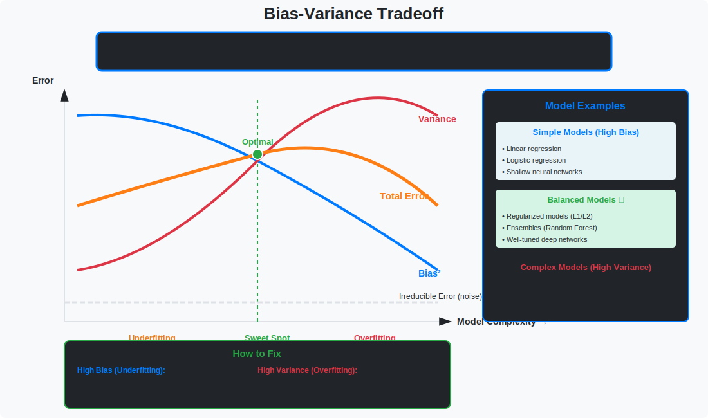

<!-- Animated Header -->
<p align="center">
  
</p>

<p align="center">
  
  
</p>

---


# Bias-Variance Tradeoff

> **The fundamental tradeoff in machine learning**

---

## 🎯 Visual Overview



*Caption: The bias-variance tradeoff shows how model complexity affects generalization. Simple models (left) have high bias and underfit, while complex models (right) have high variance and overfit. The optimal model balances both to minimize total error.*

---

## 📂 Overview

The bias-variance tradeoff is the most fundamental concept in ML theory. It explains why more complex models don't always perform better and provides the theoretical foundation for regularization.

---

## 📐 Mathematical Decomposition

### Expected Prediction Error

```
E[(y - f̂(x))²] = Bias²(f̂) + Var(f̂) + σ²

Where:
    y = f(x) + ε,  ε ~ N(0, σ²)   (true model + noise)
    f̂(x) = learned model
    
    Bias²(f̂) = (E[f̂(x)] - f(x))²   ← Systematic error
    Var(f̂) = E[(f̂(x) - E[f̂(x)])²] ← Sensitivity to training data
    σ² = Irreducible noise         ← Cannot reduce this
```

### Derivation

```
E[(y - f̂)²] = E[(y - f + f - E[f̂] + E[f̂] - f̂)²]

Expanding and using E[ε] = 0:

= E[(f - E[f̂])²]     ← Bias²
+ E[(f̂ - E[f̂])²]    ← Variance  
+ E[ε²]               ← Noise (σ²)
+ cross terms = 0
```

---

## 📊 The Tradeoff

```
Error
  ↑
  |   \                      /
  |    \    Total Error    /
  |     \                 /
  |      \_______________/
  |       \     ╱╲      /
  |        \   ╱  ╲    /
  |         \ ╱    ╲  / Variance
  |    Bias ╱       ╲/
  |        ╱----------
  +----------------------------> Model Complexity
       Simple              Complex
       (underfit)          (overfit)
```

| Model Complexity | Bias | Variance | Total Error |
|-----------------|------|----------|-------------|
| **Too simple** | High | Low | High (underfit) |
| **Optimal** | Medium | Medium | **Lowest** |
| **Too complex** | Low | High | High (overfit) |

---

## 🔑 Key Insights

### Bias (Underfitting)

```
High Bias = Model is too simple

Examples:
- Linear model for quadratic data
- Shallow network for complex patterns
- Few features for multi-factor problem

Symptoms:
- High training error
- High test error
- Train ≈ Test error
```

### Variance (Overfitting)

```
High Variance = Model is too sensitive

Examples:
- High-degree polynomial
- Deep network without regularization
- k-NN with k=1

Symptoms:
- Low training error
- High test error
- Train << Test error
```

---

## 💻 Code Examples

### Demonstrating Bias-Variance

```python
import numpy as np
import matplotlib.pyplot as plt
from sklearn.preprocessing import PolynomialFeatures
from sklearn.linear_model import LinearRegression
from sklearn.pipeline import make_pipeline

# True function
def true_function(x):
    return np.sin(2 * np.pi * x)

# Generate data
np.random.seed(42)
n_samples = 30
X = np.random.rand(n_samples)
y = true_function(X) + 0.3 * np.random.randn(n_samples)

# Fit models of different complexity
degrees = [1, 4, 15]
n_bootstrap = 100

fig, axes = plt.subplots(1, 3, figsize=(15, 4))
X_test = np.linspace(0, 1, 100)

for ax, degree in zip(axes, degrees):
    # Bootstrap predictions
    predictions = []
    for _ in range(n_bootstrap):
        # Resample
        idx = np.random.choice(n_samples, n_samples, replace=True)
        X_boot, y_boot = X[idx], y[idx]
        
        # Fit model
        model = make_pipeline(PolynomialFeatures(degree), LinearRegression())
        model.fit(X_boot.reshape(-1, 1), y_boot)
        pred = model.predict(X_test.reshape(-1, 1))
        predictions.append(pred)
    
    predictions = np.array(predictions)
    mean_pred = predictions.mean(axis=0)
    
    # Compute bias and variance
    bias_sq = (mean_pred - true_function(X_test)) ** 2
    variance = predictions.var(axis=0)
    
    # Plot
    for pred in predictions[:20]:
        ax.plot(X_test, pred, alpha=0.1, color='blue')
    ax.plot(X_test, mean_pred, 'b-', linewidth=2, label='Mean prediction')
    ax.plot(X_test, true_function(X_test), 'r--', label='True function')
    ax.scatter(X, y, color='black', s=20)
    ax.set_title(f'Degree {degree}\nBias²={bias_sq.mean():.3f}, Var={variance.mean():.3f}')
    ax.legend()

plt.tight_layout()
plt.show()
```

### Bias-Variance Decomposition

```python
def bias_variance_decomposition(model_class, X_train, y_train, X_test, y_test, 
                                  n_bootstrap=100, **model_params):
    """
    Compute bias-variance decomposition via bootstrap
    """
    n_test = len(X_test)
    predictions = np.zeros((n_bootstrap, n_test))
    
    for i in range(n_bootstrap):
        # Bootstrap sample
        idx = np.random.choice(len(X_train), len(X_train), replace=True)
        X_boot, y_boot = X_train[idx], y_train[idx]
        
        # Fit and predict
        model = model_class(**model_params)
        model.fit(X_boot, y_boot)
        predictions[i] = model.predict(X_test)
    
    # Main predictions
    mean_pred = predictions.mean(axis=0)
    
    # Bias² = (E[f̂] - f)²
    bias_squared = (mean_pred - y_test) ** 2
    
    # Variance = E[(f̂ - E[f̂])²]
    variance = predictions.var(axis=0)
    
    # Expected error ≈ Bias² + Variance (ignoring irreducible noise)
    expected_error = bias_squared + variance
    
    return {
        'bias_squared': bias_squared.mean(),
        'variance': variance.mean(),
        'expected_error': expected_error.mean()
    }

# Usage
from sklearn.tree import DecisionTreeRegressor

results = {}
for max_depth in [1, 3, 5, 10, None]:
    result = bias_variance_decomposition(
        DecisionTreeRegressor,
        X_train, y_train, X_test, y_test,
        max_depth=max_depth
    )
    results[max_depth] = result
    print(f"Depth {max_depth}: Bias²={result['bias_squared']:.4f}, "
          f"Var={result['variance']:.4f}, Total={result['expected_error']:.4f}")
```

### Cross-Validation for Model Selection

```python
from sklearn.model_selection import cross_val_score
import numpy as np

def find_optimal_complexity(X, y, model_class, param_name, param_values, cv=5):
    """
    Find optimal model complexity using cross-validation
    """
    train_scores = []
    val_scores = []
    
    for param in param_values:
        model = model_class(**{param_name: param})
        
        # Training score
        model.fit(X, y)
        train_scores.append(model.score(X, y))
        
        # Validation score (CV)
        cv_scores = cross_val_score(model, X, y, cv=cv)
        val_scores.append(cv_scores.mean())
    
    # Plot
    plt.figure(figsize=(10, 6))
    plt.plot(param_values, train_scores, 'b-', label='Training score')
    plt.plot(param_values, val_scores, 'r-', label='Validation score')
    plt.axvline(param_values[np.argmax(val_scores)], color='g', linestyle='--',
                label=f'Optimal {param_name}')
    plt.xlabel(param_name)
    plt.ylabel('Score')
    plt.legend()
    plt.title('Bias-Variance Tradeoff via Cross-Validation')
    plt.show()
    
    return param_values[np.argmax(val_scores)]
```

---

## 🔗 Reducing Bias and Variance

| Strategy | Reduces | How |
|----------|---------|-----|
| **More features** | Bias | Increase model capacity |
| **Complex model** | Bias | Better fit to data |
| **More data** | Variance | Better generalization |
| **Regularization** | Variance | Constrain model |
| **Ensemble** | Variance | Average predictions |
| **Dropout** | Variance | Implicit ensemble |

---

## 📚 References

| Type | Title | Link |
|------|-------|------|
| 📖 | Overfitting | [../overfitting/](../overfitting/) |
| 📖 | Regularization | [../regularization/](../regularization/) |
| 📖 | VC Dimension | [../vc-dimension/](../vc-dimension/) |
| 📄 | ESL Ch. 7 | [StatLearn](https://hastie.su.domains/ElemStatLearn/) |
| 🇨🇳 | 偏差方差权衡详解 | [知乎](https://zhuanlan.zhihu.com/p/38853908) |
| 🇨🇳 | 偏差与方差的数学推导 | [CSDN](https://blog.csdn.net/qq_37466121/article/details/88744606) |
| 🇨🇳 | 机器学习理论基础 | [B站](https://www.bilibili.com/video/BV164411b7dx) |
| 🇨🇳 | 过拟合与欠拟合 | [机器之心](https://www.jiqizhixin.com/articles/2018-11-20-6)


## 🔗 Where This Topic Is Used

| Application | Usage |
|-------------|-------|
| **Machine Learning** | Core concept for ML systems |
| **Deep Learning** | Foundation for neural networks |
| **Research** | Important for understanding papers |

---

⬅️ [Back: Generalization](../)

---

➡️ [Next: Complexity](../complexity/)

---

<p align="center">
  
</p>
