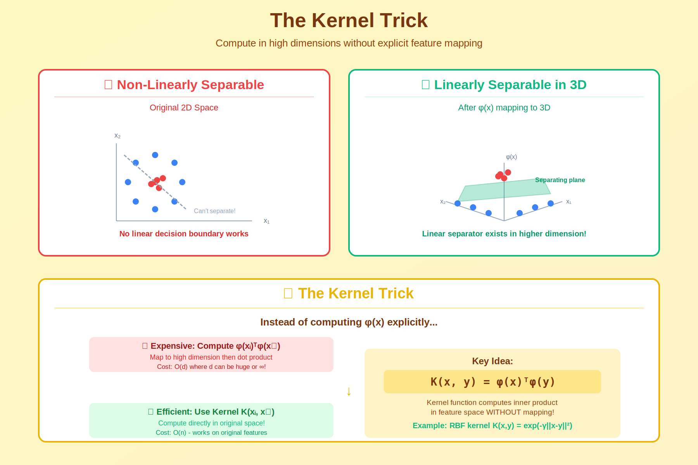

<!-- Animated Header -->
<p align="center">
  
</p>

<p align="center">
  
  
</p>

---


# 🎯 The Kernel Trick

> **Computing in infinite dimensions without the computational cost**



---

## 🎯 Core Concept

The **kernel trick** allows algorithms to operate in high (even infinite) dimensional feature spaces without explicitly computing the transformation. Instead of computing φ(x) then φ(x)ᵀφ(y), we directly compute k(x,y) = φ(x)ᵀφ(y).

---

## 📐 Mathematical Foundation

### The Trick

```
Standard approach:
1. Transform: x → φ(x) ∈ ℝᴰ  (D could be huge!)
2. Compute: φ(x)ᵀφ(y)  (expensive!)

Kernel trick:
k(x, y) = φ(x)ᵀφ(y)  (compute directly, cheap!)
```

### Mercer's Theorem

```
A function k(x, y) is a valid kernel if and only if:

For any finite set of points {x₁, ..., xₙ}
The Gram matrix K where Kᵢⱼ = k(xᵢ, xⱼ)
Is positive semi-definite

Then ∃ feature map φ such that k(x,y) = φ(x)ᵀφ(y)
```

---

## 📊 Common Kernels

| Kernel | Formula | Feature Space Dim |
|--------|---------|-------------------|
| **Linear** | k(x,y) = xᵀy | d (original) |
| **Polynomial** | k(x,y) = (xᵀy + c)ᵈ | O(nᵈ) |
| **RBF/Gaussian** | k(x,y) = exp(-γ\|\|x-y\|\|²) | ∞ |
| **Laplacian** | k(x,y) = exp(-γ\|\|x-y\|\|₁) | ∞ |
| **Sigmoid** | k(x,y) = tanh(αxᵀy + c) | ~ neural net |

---

## 💡 Example: Polynomial Kernel

```python
import numpy as np

# Original space: x ∈ ℝ²
x = np.array([x₁, x₂])
y = np.array([y₁, y₂])

# Explicit mapping: φ(x) = [x₁², √2x₁x₂, x₂²]
# Dimension: 2 → 3

# Direct computation:
phi_x = np.array([x[0]**2, np.sqrt(2)*x[0]*x[1], x[1]**2])
phi_y = np.array([y[0]**2, np.sqrt(2)*y[0]*y[1], y[1]**2])
inner_product = np.dot(phi_x, phi_y)

# Kernel trick (same result, much faster!):
k = (np.dot(x, y))**2

assert np.isclose(inner_product, k)
```

---

## 🌍 Applications

| Method | How Kernel Used |
|--------|-----------------|
| **SVM** | Decision: sign(Σαᵢyᵢk(x, xᵢ)) |
| **Kernel PCA** | Eigendecomposition of K |
| **Gaussian Processes** | Covariance function |
| **Kernel Ridge Regression** | (K + λI)⁻¹y |
| **Kernel k-means** | Distance: \|\|φ(x)-μ\|\|² via k |

---

## 💻 Implementation

```python
import numpy as np
from sklearn.metrics.pairwise import rbf_kernel, polynomial_kernel

# RBF kernel
def rbf_kernel_manual(X, Y, gamma=1.0):
    """
    K[i,j] = exp(-gamma * ||x_i - y_j||^2)
    
    Implicitly maps to infinite-dimensional space!
    """
    # Efficient computation using: ||x-y||² = ||x||² + ||y||² - 2x·y
    X_sq = np.sum(X**2, axis=1).reshape(-1, 1)
    Y_sq = np.sum(Y**2, axis=1).reshape(1, -1)
    sq_dists = X_sq + Y_sq - 2 * X @ Y.T
    return np.exp(-gamma * sq_dists)

# Usage
X = np.random.randn(100, 50)
K = rbf_kernel(X, gamma=0.1)
print(f"Gram matrix: {K.shape}")  # (100, 100)
print(f"Is PSD: {np.all(np.linalg.eigvals(K) >= -1e-10)}")  # True
```

---

## 🔑 Why It Matters

### Computational Advantage
```
Without kernel trick:
- Map n points to D dimensions: O(nD)
- Compute all inner products: O(n²D)
- If D = ∞, impossible!

With kernel trick:
- Compute kernel matrix: O(n²d)
- where d = original dimension
- Works even when D = ∞!
```

### Enables Non-linear Learning
```
Linear methods in feature space = Non-linear in input space

Example: Linear SVM with RBF kernel
→ Non-linear decision boundary
→ Can separate complex patterns
```

---

## 📖 Detailed Content

[→ Kernel Trick Deep Dive](./kernel-trick.md)

---

## 📚 Resources

### Papers
- **Mercer (1909)** - Mercer's theorem
- **Aizerman et al. (1964)** - Potential functions method
- **Schölkopf et al. (1998)** - Kernel PCA

### Books
- **Learning with Kernels** - Schölkopf & Smola
- **Kernel Methods for Pattern Analysis** - Shawe-Taylor & Cristianini

---

⬅️ [Back: Kernel Methods](../)

---

⬅️ [Back: Gaussian Processes](../gaussian-processes/) | ➡️ [Next: Kernels](../kernels/)

---

<p align="center">
  
</p>
