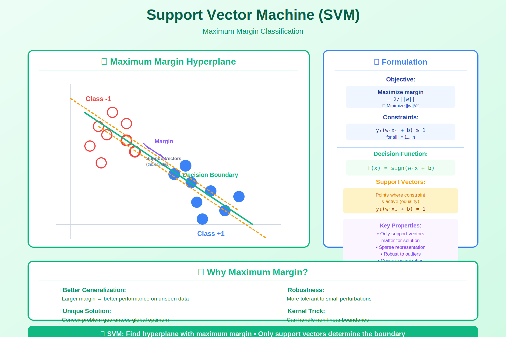

<!-- Animated Header -->
<p align="center">
  
</p>

<p align="center">
  
  
</p>

---


# Support Vector Machines (SVM)

> **Maximum margin classification**

---

## 🎯 Visual Overview



*Caption: SVM finds the hyperplane that maximizes the margin between classes. Support vectors (circled points) are the data points closest to the decision boundary. The kernel trick enables non-linear decision boundaries by mapping data to higher dimensions.*

---

## 📂 Topics in This Folder

| File | Topic | Application |
|------|-------|-------------|

---

## 🎯 The Key Insight

```
Find the hyperplane that MAXIMIZES the margin to nearest points

        ○ ○                    ○ ○
       ○ ○ ○                  ○ ○ ○
      ○ ○ ○ ○      -->       ○ ○ ○ ○
         |                      | ← Maximum margin!
     ● ● |                   ● ●|
    ● ● ●| ●                ● ● |● ●
   ● ● ● |                 ● ● ●|
        Any                  Optimal
     hyperplane             hyperplane
```

---

## 📐 Formulation

### Primal (Hard Margin)

```
minimize    ½||w||²
subject to  yᵢ(wᵀxᵢ + b) ≥ 1   for all i

Margin = 2/||w||, so minimizing ||w|| maximizes margin
```

### Dual (Enables Kernel Trick!)

```
maximize    Σᵢαᵢ - ½ΣᵢΣⱼαᵢαⱼyᵢyⱼxᵢᵀxⱼ
subject to  αᵢ ≥ 0,  Σᵢαᵢyᵢ = 0

Key: Only depends on inner products xᵢᵀxⱼ!
Replace with K(xᵢ, xⱼ) for non-linear SVM
```

---

## 💻 Code Example

```python
from sklearn.svm import SVC
import numpy as np

# Data
X = np.random.randn(100, 2)
y = (X[:, 0] + X[:, 1] > 0).astype(int) * 2 - 1

# Linear SVM
svm_linear = SVC(kernel='linear', C=1.0)
svm_linear.fit(X, y)

# RBF kernel SVM (non-linear)
svm_rbf = SVC(kernel='rbf', C=1.0, gamma='scale')
svm_rbf.fit(X, y)

# Support vectors are the points near the margin
print(f"Support vectors: {len(svm_rbf.support_vectors_)}")
```

---

## 📚 Resources

| Type | Title | Link |
|------|-------|------|
| 📄 | Original SVM Paper | Cortes & Vapnik 1995 |
| 🎥 | SVM Explained | MIT OpenCourseWare |


## 🔗 Where This Topic Is Used

| Application | Usage |
|-------------|-------|
| **Machine Learning** | Core concept for ML systems |
| **Deep Learning** | Foundation for neural networks |
| **Research** | Important for understanding papers |

---

⬅️ [Back: Kernel Methods](../)

---

⬅️ [Back: Rkhs](../rkhs/)

---

<p align="center">
  
</p>
