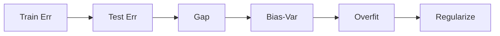
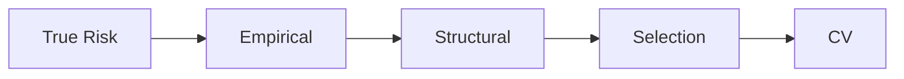
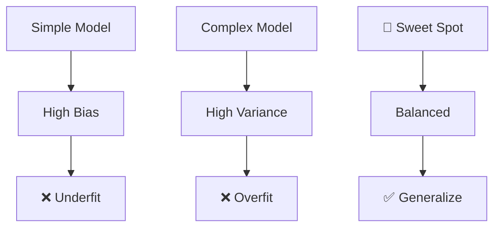
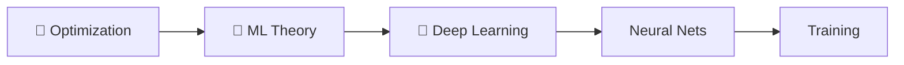

<!-- Animated Header -->
<p align="center">
  
</p>

<p align="center">
  
  
  
</p>


---

## 📊 Learning Path


## 🎯 What You'll Learn

> 💡 ML Theory explains **why algorithms work** and when they fail.

<table>
<tr>
<td align="center">

### 📊 Generalization
⭐ **THE GOAL**

</td>
<td align="center">

### ⚖️ Bias-Variance
Model selection

</td>
<td align="center">

### 🎯 Kernels
SVM, Feature spaces

</td>
</tr>
</table>

---

## 📚 Main Topics

### 1️⃣ Learning Frameworks


**Core:** ERM, PAC Learning, Sample Complexity, No Free Lunch

<a href="./01-learning-frameworks/README.md"></a>

---

### 2️⃣ Generalization ⭐⭐⭐

 



> ⭐ **GENERALIZATION IS THE GOAL** - This is why ML works

| Concept | Impact |
|---------|--------|
| Bias-Variance | Model complexity choice |
| VC Dimension | Capacity measure |
| Regularization | L1, L2, Dropout |

<a href="./02-generalization/README.md"></a>

---

### 3️⃣ Kernel Methods


**Core:** Kernel Trick, RBF/Polynomial Kernels, SVM, Gaussian Processes

<a href="./03-kernel-methods/README.md"></a>

---

### 4️⃣ Risk Minimization




**Core:** True vs Empirical Risk, Cross-Validation, Model Selection

<a href="./05-risk-minimization/README.md"></a>

---

## 🔄 Bias-Variance Tradeoff



### Key Equation
```
Expected Test Error = Bias² + Variance + Irreducible Error
```

---

## 💡 Key Concepts

<table>
<tr>
<td>

### 📊 Generalization Bound
```
P(|R_true - R_emp| > ε) ≤ δ
n ≥ O((VC_dim + log(1/δ))/ε²)
```

</td>
<td>

### ⚖️ Bias-Variance
```
E[(y - ŷ)²] = Bias² + Var + σ²
```

</td>
<td>

### 🎯 SVM
```
min  ½||w||²
s.t. yᵢ(w·xᵢ + b) ≥ 1
```

</td>
</tr>
</table>

---

## 🔗 Prerequisites & Next Steps



<p align="center">
  <a href="../04-optimization/README.md"></a>
  <a href="../06-deep-learning/README.md"></a>
</p>

---

## 📚 Recommended Resources

| Type | Resource | Focus |
|:----:|----------|-------|
| 📘 | [Understanding ML](https://www.cs.huji.ac.il/~shais/UnderstandingMachineLearning/) | Theory foundations |
| 🎓 | [Caltech CS156](https://work.caltech.edu/telecourse.html) | ML Theory |
| 📄 | [SVM Tutorial](https://www.microsoft.com/en-us/research/wp-content/uploads/2016/02/tr-98-04.pdf) | Burges (1998) |

---

## 🗺️ Quick Navigation

| Previous | Current | Next |
|:--------:|:-------:|:----:|
| [🎯 Optimization](../04-optimization/README.md) | **🧬 ML Theory** | [🚀 Deep Learning →](../06-deep-learning/README.md) |

---

---


<p align="center">
  
</p>
