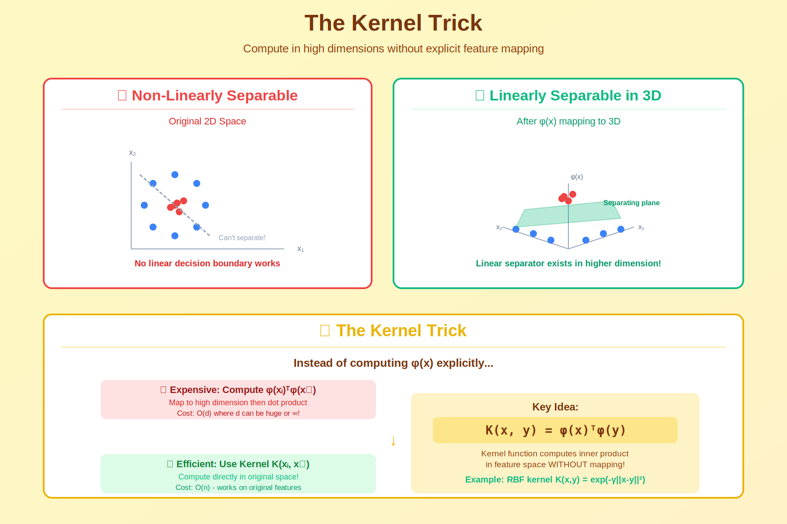

<!-- Navigation -->
<p align="center">
  <a href="../02_kernels/">⬅️ Prev: Kernels</a> &nbsp;&nbsp;|&nbsp;&nbsp;
  <a href="../">📚 Kernel Methods</a> &nbsp;&nbsp;|&nbsp;&nbsp;
  <a href="../04_rkhs/">Next: RKHS ➡️</a>
</p>

---

<!-- Animated Header -->
<p align="center">
  
</p>

<p align="center">
  
  
  
</p>


---

## 🎯 Visual Overview



*Caption: The kernel trick allows computing dot products in high (even infinite) dimensional feature spaces without explicitly computing the transformation φ(x). This enables linear methods to learn non-linear boundaries.*

---

## 📂 Overview

The **kernel trick** is one of the most elegant ideas in machine learning. It allows algorithms that depend only on inner products to operate in high-dimensional (even infinite-dimensional) feature spaces without ever explicitly computing the feature transformation.

---

## 📐 Core Mathematical Concept

### The Problem

Many algorithms require computing inner products in feature space:

```math
\langle \phi(x), \phi(y) \rangle_{\mathcal{H}}

```

If \(\phi: \mathcal{X} \to \mathcal{H}\) maps to a high-dimensional space \(\mathcal{H}\), direct computation is expensive or impossible.

### The Solution: Kernel Functions

**Definition:** A kernel is a function \(k: \mathcal{X} \times \mathcal{X} \to \mathbb{R}\) such that:

```math
k(x, y) = \langle \phi(x), \phi(y) \rangle_{\mathcal{H}}

```

for some feature map \(\phi\) and inner product space \(\mathcal{H}\).

**The Trick:** Compute \(k(x, y)\) directly without explicitly computing \(\phi(x)\) or \(\phi(y)\)!

---

## 📐 Mercer's Theorem

### Positive Semi-Definite Kernels

**Definition:** A kernel \(k\) is **positive semi-definite (PSD)** if for any finite set \(\{x_1, \ldots, x_n\} \subset \mathcal{X}\), the Gram matrix:

```math
K_{ij} = k(x_i, x_j)

```

is positive semi-definite: \(\forall \alpha \in \mathbb{R}^n: \alpha^\top K \alpha \geq 0\).

### Mercer's Theorem

**Theorem (Mercer, 1909):** A symmetric function \(k: \mathcal{X} \times \mathcal{X} \to \mathbb{R}\) is a valid kernel if and only if it is positive semi-definite.

**Equivalently:** \(k\) is a valid kernel iff there exists a feature map \(\phi\) and an inner product space \(\mathcal{H}\) such that:

```math
k(x, y) = \langle \phi(x), \phi(y) \rangle_{\mathcal{H}}

```

### Proof Sketch (Finite Case)

Given PSD kernel \(k\) and points \(\{x_1, \ldots, x_n\}\):

1. Form Gram matrix \(K\) with \(K_{ij} = k(x_i, x_j)\)

2. Since \(K\) is PSD, eigendecompose: \(K = V\Lambda V^\top\) with \(\lambda_i \geq 0\)

3. Define \(\phi(x_i) = \sqrt{\Lambda} V^\top e_i\)

4. Then \(\langle\phi(x_i), \phi(x_j)\rangle = e_i^\top V \Lambda V^\top e_j = K_{ij} = k(x_i, x_j)\) ✓

---

## 📊 Common Kernels

### Linear Kernel

```math
k(x, y) = x^\top y

```

**Feature map:** \(\phi(x) = x\) (identity)

**Use case:** Linear relationships, already separable data

### Polynomial Kernel

```math
k(x, y) = (x^\top y + c)^d

```

**Feature map:** Contains all monomials up to degree \(d\)

**Example (d=2, c=1 in \(\mathbb{R}^2\)):**

For \(x = [x_1, x_2]^\top\):

```math
k(x, y) = (x_1 y_1 + x_2 y_2 + 1)^2
= x_1^2 y_1^2 + 2x_1 x_2 y_1 y_2 + x_2^2 y_2^2 + 2x_1 y_1 + 2x_2 y_2 + 1

```

Implicit feature map:

```math
\phi(x) = [x_1^2, \sqrt{2}x_1 x_2, x_2^2, \sqrt{2}x_1, \sqrt{2}x_2, 1]^\top

```

**Verification:**

```math
\phi(x)^\top \phi(y) = x_1^2 y_1^2 + 2x_1 x_2 y_1 y_2 + x_2^2 y_2^2 + 2x_1 y_1 + 2x_2 y_2 + 1 = k(x, y) \checkmark

```

### Gaussian (RBF) Kernel

```math
k(x, y) = \exp\left(-\gamma \|x - y\|^2\right) = \exp\left(-\frac{\|x - y\|^2}{2\sigma^2}\right)

```

**Feature map dimension:** Infinite!

**Proof of Infinite Dimensionality:**

Using Taylor expansion of exponential:

```math
e^{-\gamma\|x-y\|^2} = e^{-\gamma\|x\|^2} e^{-\gamma\|y\|^2} e^{2\gamma x^\top y}
= e^{-\gamma\|x\|^2} e^{-\gamma\|y\|^2} \sum_{n=0}^{\infty} \frac{(2\gamma x^\top y)^n}{n!}

```

Each term in the series corresponds to polynomial features of increasing degree.

### Laplacian Kernel

```math
k(x, y) = \exp(-\gamma \|x - y\|_1)

```

**Properties:** More robust to outliers than RBF, infinite-dimensional feature space.

---

## 📐 Kernel Properties and Operations

### Closure Properties

If \(k_1, k_2\) are valid kernels, then so are:

| Operation | Formula | Proof |
|-----------|---------|-------|
| **Sum** | \(k = k_1 + k_2\) | \(\phi = [\phi_1; \phi_2]\) |
| **Product** | \(k = k_1 \cdot k_2\) | \(\phi = \phi_1 \otimes \phi_2\) |
| **Scaling** | \(k = c \cdot k_1, c > 0\) | \(\phi = \sqrt{c}\phi_1\) |
| **Polynomial** | \(k = (k_1)^d\) | Repeated tensor product |
| **Exponential** | \(k = e^{k_1}\) | Taylor series |

### Gram Matrix Properties

For Gram matrix \(K\) with \(K_{ij} = k(x_i, x_j)\):

- \(K\) is symmetric: \(K = K^\top\)

- \(K\) is PSD: all eigenvalues \(\geq 0\)

- \(K\) determines the kernel (up to feature map choice)

---

## 💡 The Representer Theorem

### Statement

**Theorem:** Consider the optimization problem:

```math
\min_{f \in \mathcal{H}_k} \left[\sum_{i=1}^n L(y_i, f(x_i)) + \lambda \|f\|_{\mathcal{H}_k}^2\right]

```

where \(\mathcal{H}_k\) is the RKHS induced by kernel \(k\).

**Then the optimal solution has the form:**

```math
f^*(x) = \sum_{i=1}^n \alpha_i k(x, x_i)

```

### Proof Sketch

1. Decompose \(f = f_\parallel + f_\perp\) where \(f_\parallel \in \text{span}\{k(\cdot, x_i)\}_{i=1}^n\)

2. By reproducing property: \(f(x_i) = \langle f, k(\cdot, x_i)\rangle = f_\parallel(x_i)\)

3. Loss term depends only on \(f_\parallel\)

4. Regularizer: \(\|f\|^2 = \|f_\parallel\|^2 + \|f_\perp\|^2 \geq \|f_\parallel\|^2\)

5. Optimal \(f_\perp = 0\), so \(f^* = f_\parallel = \sum_i \alpha_i k(\cdot, x_i)\)

### Implication

**Kernelized algorithms need only store \(n\) coefficients \(\alpha_i\), not infinite-dimensional weights!**

---

## 💻 Code Implementation

```python
import numpy as np
from sklearn.metrics.pairwise import rbf_kernel, polynomial_kernel

# ============================================================
# Manual Kernel Implementations
# ============================================================

def linear_kernel(X, Y=None):
    """Linear kernel: k(x,y) = x·y"""
    if Y is None:
        Y = X
    return X @ Y.T

def polynomial_kernel_manual(X, Y=None, degree=3, gamma=1, coef0=1):
    """
    Polynomial kernel: k(x,y) = (γ·x·y + c)^d
    
    Implicit feature map contains all monomials up to degree d.
    """
    if Y is None:
        Y = X
    return (gamma * (X @ Y.T) + coef0) ** degree

def rbf_kernel_manual(X, Y=None, gamma=1.0):
    """
    RBF/Gaussian kernel: k(x,y) = exp(-γ||x-y||²)
    
    Maps to infinite-dimensional feature space!
    Uses the identity: ||x-y||² = ||x||² + ||y||² - 2x·y
    """
    if Y is None:
        Y = X
    
    X_sq = np.sum(X**2, axis=1).reshape(-1, 1)
    Y_sq = np.sum(Y**2, axis=1).reshape(1, -1)
    sq_dists = X_sq + Y_sq - 2 * X @ Y.T
    
    return np.exp(-gamma * sq_dists)

def laplacian_kernel(X, Y=None, gamma=1.0):
    """Laplacian kernel: k(x,y) = exp(-γ||x-y||₁)"""
    if Y is None:
        Y = X
    
    # Compute L1 distances
    dists = np.sum(np.abs(X[:, np.newaxis, :] - Y[np.newaxis, :, :]), axis=2)
    
    return np.exp(-gamma * dists)

# ============================================================
# Verify Polynomial Kernel Feature Map
# ============================================================

def verify_polynomial_kernel_2d():
    """
    Verify that polynomial kernel equals inner product of explicit features.
    
    For d=2, c=1: k(x,y) = (x·y + 1)²
    Feature map: φ(x) = [x₁², √2·x₁x₂, x₂², √2·x₁, √2·x₂, 1]
    """
    x = np.array([2.0, 3.0])
    y = np.array([1.0, 4.0])
    
    # Kernel computation
    k_value = (np.dot(x, y) + 1) ** 2
    
    # Explicit feature map
    def phi(v):
        return np.array([
            v[0]**2,
            np.sqrt(2) * v[0] * v[1],
            v[1]**2,
            np.sqrt(2) * v[0],
            np.sqrt(2) * v[1],
            1.0
        ])
    
    phi_x = phi(x)
    phi_y = phi(y)
    inner_product = np.dot(phi_x, phi_y)
    
    print(f"x = {x}, y = {y}")
    print(f"Kernel k(x,y) = (x·y + 1)² = {k_value}")
    print(f"φ(x)·φ(y) = {inner_product}")
    print(f"Equal: {np.isclose(k_value, inner_product)}")
    
    return np.isclose(k_value, inner_product)

# ============================================================
# Kernel SVM from Scratch
# ============================================================

class KernelSVM:
    """
    Support Vector Machine using the kernel trick.
    
    Dual optimization:
        max Σᵢ αᵢ - ½ Σᵢⱼ αᵢαⱼyᵢyⱼk(xᵢ,xⱼ)
        s.t. αᵢ ≥ 0, Σᵢ αᵢyᵢ = 0
    
    Decision function:
        f(x) = sign(Σᵢ αᵢyᵢk(x,xᵢ) + b)
    """
    
    def __init__(self, kernel='rbf', C=1.0, gamma=1.0, degree=3):
        self.kernel = kernel
        self.C = C
        self.gamma = gamma
        self.degree = degree
        
    def _compute_kernel(self, X, Y=None):
        if self.kernel == 'linear':
            return linear_kernel(X, Y)
        elif self.kernel == 'rbf':
            return rbf_kernel_manual(X, Y, self.gamma)
        elif self.kernel == 'poly':
            return polynomial_kernel_manual(X, Y, self.degree)
        else:
            raise ValueError(f"Unknown kernel: {self.kernel}")
    
    def fit(self, X, y):
        """Fit SVM using simplified SMO algorithm."""
        n = len(X)
        self.X_train = X
        self.y_train = y
        
        # Compute Gram matrix
        K = self._compute_kernel(X)
        
        # Initialize alphas
        self.alpha = np.zeros(n)
        
        # Simplified SMO (gradient ascent on dual)
        for _ in range(1000):
            for i in range(n):
                # Compute gradient for alpha_i
                grad = 1 - y[i] * np.sum(self.alpha * y * K[i])
                
                # Update with projection to [0, C]
                self.alpha[i] = np.clip(self.alpha[i] + 0.01 * grad, 0, self.C)
        
        # Find support vectors
        self.support_idx = np.where(self.alpha > 1e-5)[0]
        
        # Compute bias using support vectors
        if len(self.support_idx) > 0:
            s = self.support_idx[0]
            self.b = y[s] - np.sum(self.alpha * y * K[s])
        else:
            self.b = 0
        
        return self
    
    def decision_function(self, X):
        """Compute decision function: Σᵢ αᵢyᵢk(x,xᵢ) + b"""
        K = self._compute_kernel(X, self.X_train)
        return K @ (self.alpha * self.y_train) + self.b
    
    def predict(self, X):
        return np.sign(self.decision_function(X))

# ============================================================
# Kernel PCA
# ============================================================

class KernelPCA:
    """
    PCA in kernel feature space.
    
    Instead of: eigendecomposition of X·Xᵀ
    We do: eigendecomposition of K (Gram matrix)
    """
    
    def __init__(self, n_components=2, kernel='rbf', gamma=1.0):
        self.n_components = n_components
        self.kernel = kernel
        self.gamma = gamma
        
    def fit_transform(self, X):
        n = len(X)
        self.X_train = X
        
        # Compute kernel matrix
        if self.kernel == 'rbf':
            K = rbf_kernel_manual(X, gamma=self.gamma)
        else:
            K = linear_kernel(X)
        
        # Center the kernel matrix
        # K_centered = (I - 1/n 11ᵀ) K (I - 1/n 11ᵀ)
        one_n = np.ones((n, n)) / n
        K_centered = K - one_n @ K - K @ one_n + one_n @ K @ one_n
        
        # Eigendecomposition
        eigenvalues, eigenvectors = np.linalg.eigh(K_centered)
        
        # Sort by decreasing eigenvalue
        idx = np.argsort(eigenvalues)[::-1]
        eigenvalues = eigenvalues[idx]
        eigenvectors = eigenvectors[:, idx]
        
        # Select top components and normalize
        self.alpha = eigenvectors[:, :self.n_components]
        self.lambdas = eigenvalues[:self.n_components]
        
        # Project (α scaled by 1/sqrt(λ))
        return self.alpha * np.sqrt(np.maximum(self.lambdas, 1e-10))

# ============================================================
# Example Usage
# ============================================================

if __name__ == "__main__":
    # Verify polynomial kernel
    print("=== Polynomial Kernel Verification ===")
    verify_polynomial_kernel_2d()
    
    # Generate XOR-like data (not linearly separable)
    print("\n=== Kernel SVM on XOR Problem ===")
    np.random.seed(42)
    n = 100
    X = np.random.randn(n, 2)
    y = np.sign(X[:, 0] * X[:, 1])  # XOR pattern
    
    # Linear kernel (will fail)
    svm_linear = KernelSVM(kernel='linear', C=1.0)
    svm_linear.fit(X, y)
    acc_linear = np.mean(svm_linear.predict(X) == y)
    
    # RBF kernel (will succeed)
    svm_rbf = KernelSVM(kernel='rbf', C=1.0, gamma=1.0)
    svm_rbf.fit(X, y)
    acc_rbf = np.mean(svm_rbf.predict(X) == y)
    
    print(f"Linear kernel accuracy: {acc_linear:.2%}")
    print(f"RBF kernel accuracy: {acc_rbf:.2%}")
    print(f"Number of support vectors: {len(svm_rbf.support_idx)}")

```

---

## 🌍 Applications

| Method | How Kernel is Used |
|--------|-------------------|
| **SVM** | Decision: \(\text{sign}\left(\sum_i \alpha_i y_i k(x, x_i) + b\right)\) |
| **Kernel PCA** | Eigendecomposition of Gram matrix \(K\) |
| **Gaussian Processes** | Kernel = covariance function |
| **Kernel Ridge Regression** | Solution: \(\alpha = (K + \lambda I)^{-1} y\) |
| **Kernel k-Means** | Distance in feature space via kernels |

---

## 📚 References

| Type | Title | Link |
|------|-------|------|
| 📄 | Mercer (1909) | Original theorem |
| 📖 | Learning with Kernels | Schölkopf & Smola |
| 📖 | Kernel Methods for Pattern Analysis | Shawe-Taylor & Cristianini |
| 📄 | Kernel PCA | [Schölkopf et al., 1998](https://www.mitpressjournals.org/doi/10.1162/089976698300017467) |

---

⬅️ [Back: Kernels](../02_kernels/) | ➡️ [Next: RKHS](../04_rkhs/)

---


<!-- Navigation -->
<p align="center">
  <a href="../02_kernels/">⬅️ Prev: Kernels</a> &nbsp;&nbsp;|&nbsp;&nbsp;
  <a href="../">📚 Kernel Methods</a> &nbsp;&nbsp;|&nbsp;&nbsp;
  <a href="../04_rkhs/">Next: RKHS ➡️</a>
</p>

<p align="center">
  
</p>
