<!-- Animated Header -->
<p align="center">
  
</p>

<p align="center">
  
  
  
</p>


---

## 📂 Overview

**Machine Learning Theory** provides the mathematical foundations for understanding why ML algorithms work, when they fail, and how to design better systems. This section covers the core theoretical concepts with rigorous mathematical treatments.

---

## 🎯 Learning Path

```mermaid
flowchart LR
    A[📚 Learning Frameworks] --> B[📈 Generalization]
    B --> C[🛡️ Regularization]
    C --> D[🎯 Kernel Methods]
    D --> E[⚖️ Risk Minimization]
    E --> F[🏆 Advanced Topics]
```



---

## 📚 Topics

| Folder | Topic | Key Concepts |
|--------|-------|--------------|
| [01_learning_frameworks/](./01_learning_frameworks/) | Learning Frameworks | Supervised, Self-Supervised, Unsupervised |
| [01_learning_theory/](./01_learning_theory/) | Learning Theory | PAC Learning, VC Dimension |
| [02_generalization/](./02_generalization/) | Generalization | Bias-Variance, Overfitting, Regularization |
| [03_kernel_methods/](./03_kernel_methods/) | Kernel Methods | Kernels, SVM, RKHS, Gaussian Processes |
| [03_svm/](./03_svm/) | Support Vector Machines | Maximum Margin, Dual Formulation |
| [04_regularization/](./04_regularization/) | Regularization | L1, L2, Elastic Net, Dropout |
| [04_representation/](./04_representation/) | Representation Learning | Embeddings, Feature Learning, Transfer |
| [05_evaluation_metrics/](./05_evaluation_metrics/) | Evaluation Metrics | Precision, Recall, ROC, AUC |
| [05_risk_minimization/](./05_risk_minimization/) | Risk Minimization | ERM, PAC, Structural Risk |
| [06_ensemble_methods/](./06_ensemble_methods/) | Ensemble Methods | Bagging, Boosting, Stacking |
| [07_clustering/](./07_clustering/) | Clustering | K-Means, GMM, Spectral, DBSCAN |
| [08_model_selection/](./08_model_selection/) | Model Selection | Cross-Validation, AIC, BIC |
| [09_hyperparameter_tuning/](./09_hyperparameter_tuning/) | Hyperparameter Tuning | Grid, Random, Bayesian, Hyperband |
| [10_interpretability/](./10_interpretability/) | Interpretability | SHAP, LIME, Integrated Gradients |
| [11_adversarial_robustness/](./11_adversarial_robustness/) | Adversarial Robustness | FGSM, PGD, Adversarial Training |
| [12_model_calibration/](./12_model_calibration/) | Model Calibration | Temperature Scaling, ECE |

---

## 📐 Core Mathematical Concepts

### Empirical Risk Minimization

```math
\hat{h} = \arg\min_{h \in \mathcal{H}} \frac{1}{n}\sum_{i=1}^n \ell(h(x_i), y_i)
```

### Generalization Bound (VC Theory)

With probability ≥ 1 - δ:

```math
R(h) \leq \hat{R}(h) + \sqrt{\frac{d(\log(2n/d) + 1) + \log(4/\delta)}{n}}
```

where d is the VC dimension.

### Bias-Variance Decomposition

```math
\mathbb{E}[(y - \hat{f}(x))^2] = \text{Bias}^2 + \text{Variance} + \sigma^2
```

### PAC Learning

A concept class is PAC-learnable if with m ≥ poly(1/ε, 1/δ) samples:

```math
\Pr[R(h) \leq \varepsilon] \geq 1 - \delta
```

---

## 🔄 Bias-Variance Tradeoff

```mermaid
flowchart TD
    A[Simple Model] --> B[High Bias]
    B --> C[❌ Underfit]
    D[Complex Model] --> E[High Variance]
    E --> F[❌ Overfit]
    G[🎯 Sweet Spot] --> H[Balanced]
    H --> I[✅ Generalize]
```



---

## 📊 Key Formulas

| Concept | Formula |
|---------|---------|
| **Generalization Bound** | R(h) ≤ R̂(h) + O(√(VC/n)) |
| **Bias-Variance** | E[(y - ŷ)²] = Bias² + Var + σ² |
| **SVM Primal** | min ½\|\|w\|\|² s.t. yᵢ(w·xᵢ + b) ≥ 1 |
| **Regularization** | L = Loss(θ) + λ\|\|θ\|\|² |

---

## 📚 References

| Type | Title | Link |
|------|-------|------|
| 📖 | Understanding ML | [Shalev-Shwartz & Ben-David](https://www.cs.huji.ac.il/~shais/UnderstandingMachineLearning/) |
| 📖 | Foundations of ML | [Mohri et al.](https://cs.nyu.edu/~mohri/mlbook/) |
| 📖 | ESL | [Hastie et al.](https://hastie.su.domains/ElemStatLearn/) |
| 📖 | Learning with Kernels | [Schölkopf & Smola](https://mitpress.mit.edu/9780262536578/) |

---


<p align="center">
  
</p>
