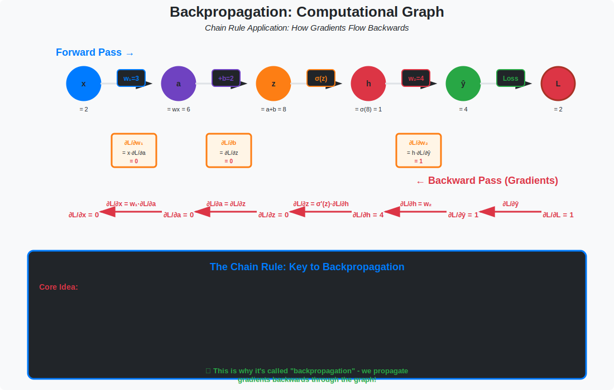

# 🔄 Backpropagation

> **How neural networks learn**

---

## 🎯 Visual Overview



*Caption: Backpropagation uses the chain rule to compute gradients through a computational graph. Forward pass (blue) computes activations; backward pass (red) propagates gradients. This is the foundation of training every neural network.*

---

## 📂 Topics

| Folder | Topic | Key Concepts |
|--------|-------|--------------|
| [autodiff/](./autodiff/) | Automatic differentiation | Forward, reverse mode |
| [computational-graph/](./computational-graph/) | DAG representation | PyTorch autograd |
| [gradient-flow/](./gradient-flow/) | Gradient problems | Vanishing, exploding |

---

## 📐 The Algorithm

```
Forward pass: Compute loss
    x → h₁ → h₂ → ... → ŷ → L

Backward pass: Compute gradients (chain rule!)
    ∂L/∂W₁ ← ∂L/∂h₁ ← ∂L/∂h₂ ← ... ← ∂L/∂ŷ ← ∂L/∂L

Update: Gradient descent
    W ← W - α · ∂L/∂W
```

---

## 🔑 Chain Rule

```
∂L/∂Wₗ = ∂L/∂hₗ · ∂hₗ/∂Wₗ

Where:
∂L/∂hₗ = ∂L/∂hₗ₊₁ · ∂hₗ₊₁/∂hₗ  (recursive!)
```

---

## 📐 DETAILED MATHEMATICAL DERIVATION

### 1. Complete Backpropagation Derivation

**Problem:** 2-layer neural network
```
Input: x ∈ ℝⁿ
Layer 1: h = σ(W₁x + b₁)     where σ(z) = max(0, z)  (ReLU)
Layer 2: ŷ = W₂h + b₂
Loss: L = 1/2||ŷ - y||²
```

**Goal:** Compute ∂L/∂W₁, ∂L/∂b₁, ∂L/∂W₂, ∂L/∂b₂

---

**Step 1: Forward pass (compute all activations)**

```python
# Forward pass
z₁ = W₁x + b₁        # Pre-activation layer 1
h = ReLU(z₁)          # Activation layer 1
z₂ = W₂h + b₂        # Pre-activation layer 2
ŷ = z₂                # Output (linear)
L = 1/2 * ||ŷ - y||²  # Loss
```

**Step 2: Backward pass (compute gradients)**

**2.1: Gradient at output**
```
∂L/∂ŷ = ŷ - y                    [shape: m × 1]

Why? 
L = 1/2 Σᵢ(ŷᵢ - yᵢ)²
∂L/∂ŷᵢ = ŷᵢ - yᵢ
```

**2.2: Gradient of W₂**
```
∂L/∂W₂ = ∂L/∂ŷ · ∂ŷ/∂W₂
       = (ŷ - y) · hᵀ            [shape: m × n]

Detailed:
ŷⱼ = Σₖ W₂ⱼₖhₖ + b₂ⱼ
∂ŷⱼ/∂W₂ⱼₖ = hₖ
∂L/∂W₂ⱼₖ = (ŷⱼ - yⱼ) · hₖ
```

**2.3: Gradient of b₂**
```
∂L/∂b₂ = ∂L/∂ŷ · ∂ŷ/∂b₂
       = ŷ - y                   [shape: m × 1]

Why?
ŷⱼ = Σₖ W₂ⱼₖhₖ + b₂ⱼ
∂ŷⱼ/∂b₂ⱼ = 1
```

**2.4: Gradient of h (chain rule!)**
```
∂L/∂h = ∂L/∂ŷ · ∂ŷ/∂h
      = W₂ᵀ(ŷ - y)              [shape: n × 1]

Detailed:
ŷⱼ = Σₖ W₂ⱼₖhₖ + b₂ⱼ
∂ŷⱼ/∂hₖ = W₂ⱼₖ
∂L/∂hₖ = Σⱼ ∂L/∂ŷⱼ · ∂ŷⱼ/∂hₖ
       = Σⱼ (ŷⱼ - yⱼ) · W₂ⱼₖ
       = [W₂ᵀ(ŷ - y)]ₖ
```

**2.5: Gradient of z₁ (through ReLU)**
```
∂L/∂z₁ = ∂L/∂h · ∂h/∂z₁
       = ∂L/∂h ⊙ 𝟙{z₁ > 0}      [shape: n × 1]

Why?
h = ReLU(z₁) = max(0, z₁)
∂h/∂z₁ = { 1 if z₁ > 0
         { 0 if z₁ ≤ 0

⊙ denotes element-wise multiplication
```

**2.6: Gradient of W₁**
```
∂L/∂W₁ = ∂L/∂z₁ · ∂z₁/∂W₁
       = ∂L/∂z₁ · xᵀ             [shape: n × d]

Detailed:
z₁ᵢ = Σₖ W₁ᵢₖxₖ + b₁ᵢ
∂z₁ᵢ/∂W₁ᵢₖ = xₖ
∂L/∂W₁ᵢₖ = ∂L/∂z₁ᵢ · xₖ
```

**2.7: Gradient of b₁**
```
∂L/∂b₁ = ∂L/∂z₁ · ∂z₁/∂b₁
       = ∂L/∂z₁                  [shape: n × 1]
```

---

### 2. Complete Implementation with All Steps

```python
import numpy as np

def relu(z):
    """ReLU activation"""
    return np.maximum(0, z)

def relu_derivative(z):
    """ReLU derivative"""
    return (z > 0).astype(float)

def forward_pass(x, W1, b1, W2, b2, y):
    """
    Forward pass with detailed intermediate values
    Returns: all intermediate values + loss
    """
    # Layer 1
    z1 = W1 @ x + b1          # Pre-activation [n × 1]
    h = relu(z1)               # Activation [n × 1]
    
    # Layer 2
    z2 = W2 @ h + b2          # Pre-activation [m × 1]
    y_pred = z2                # Output [m × 1]
    
    # Loss
    loss = 0.5 * np.sum((y_pred - y)**2)
    
    # Cache for backward pass
    cache = {
        'x': x, 'z1': z1, 'h': h, 'z2': z2,
        'y_pred': y_pred, 'y': y,
        'W1': W1, 'b1': b1, 'W2': W2, 'b2': b2
    }
    
    return y_pred, loss, cache

def backward_pass(cache):
    """
    Backward pass: compute all gradients
    """
    # Extract from cache
    x = cache['x']
    z1 = cache['z1']
    h = cache['h']
    y_pred = cache['y_pred']
    y = cache['y']
    W2 = cache['W2']
    
    # === BACKWARD PASS ===
    
    # Step 1: Gradient at output
    dL_dy_pred = y_pred - y                    # [m × 1]
    print(f"∂L/∂ŷ shape: {dL_dy_pred.shape}")
    
    # Step 2: Gradient of W2
    dL_dW2 = dL_dy_pred @ h.T                  # [m × n]
    print(f"∂L/∂W₂ shape: {dL_dW2.shape}")
    
    # Step 3: Gradient of b2
    dL_db2 = dL_dy_pred                        # [m × 1]
    print(f"∂L/∂b₂ shape: {dL_db2.shape}")
    
    # Step 4: Gradient of h (backprop through W2)
    dL_dh = W2.T @ dL_dy_pred                  # [n × 1]
    print(f"∂L/∂h shape: {dL_dh.shape}")
    
    # Step 5: Gradient of z1 (backprop through ReLU)
    dL_dz1 = dL_dh * relu_derivative(z1)       # [n × 1]
    print(f"∂L/∂z₁ shape: {dL_dz1.shape}")
    
    # Step 6: Gradient of W1
    dL_dW1 = dL_dz1 @ x.T                      # [n × d]
    print(f"∂L/∂W₁ shape: {dL_dW1.shape}")
    
    # Step 7: Gradient of b1
    dL_db1 = dL_dz1                            # [n × 1]
    print(f"∂L/∂b₁ shape: {dL_db1.shape}")
    
    gradients = {
        'dW1': dL_dW1,
        'db1': dL_db1,
        'dW2': dL_dW2,
        'db2': dL_db2
    }
    
    return gradients

# Example usage
print("="*60)
print("BACKPROPAGATION DETAILED EXAMPLE")
print("="*60)

# Setup
np.random.seed(42)
d, n, m = 2, 3, 1  # Input dim, hidden dim, output dim

W1 = np.random.randn(n, d) * 0.1
b1 = np.zeros((n, 1))
W2 = np.random.randn(m, n) * 0.1
b2 = np.zeros((m, 1))

x = np.array([[1.0], [2.0]])  # Input
y = np.array([[3.0]])          # Target

print(f"\nInput x: {x.T}")
print(f"Target y: {y.T}")
print(f"\nW₁ shape: {W1.shape}, b₁ shape: {b1.shape}")
print(f"W₂ shape: {W2.shape}, b₂ shape: {b2.shape}")

# Forward pass
y_pred, loss, cache = forward_pass(x, W1, b1, W2, b2, y)
print(f"\nForward pass:")
print(f"  Prediction: {y_pred.T}")
print(f"  Loss: {loss:.6f}")

# Backward pass
print(f"\nBackward pass (computing gradients):")
gradients = backward_pass(cache)

print(f"\nGradient magnitudes:")
for name, grad in gradients.items():
    print(f"  {name}: ||∇|| = {np.linalg.norm(grad):.6f}")
```

---

### 3. Matrix Dimensions Cheat Sheet

For batch processing (B samples):

```
Notation:
  B = batch size
  d = input dimension
  n = hidden dimension
  m = output dimension

Forward pass:
  X ∈ ℝ^(d×B)      Input batch
  W₁ ∈ ℝ^(n×d)     Layer 1 weights
  b₁ ∈ ℝ^(n×1)     Layer 1 bias (broadcast)
  Z₁ = W₁X + b₁    [n × B]
  H = σ(Z₁)        [n × B]
  W₂ ∈ ℝ^(m×n)     Layer 2 weights
  b₂ ∈ ℝ^(m×1)     Layer 2 bias
  Z₂ = W₂H + b₂    [m × B]
  Ŷ = Z₂           [m × B]
  L = ||Ŷ - Y||²/2B [scalar]

Backward pass:
  ∂L/∂Ŷ ∈ ℝ^(m×B)         = (Ŷ - Y)/B
  ∂L/∂W₂ ∈ ℝ^(m×n)        = (∂L/∂Ŷ) · Hᵀ
  ∂L/∂b₂ ∈ ℝ^(m×1)        = (∂L/∂Ŷ) · 𝟙  (sum over batch)
  ∂L/∂H ∈ ℝ^(n×B)         = W₂ᵀ · (∂L/∂Ŷ)
  ∂L/∂Z₁ ∈ ℝ^(n×B)        = (∂L/∂H) ⊙ σ'(Z₁)
  ∂L/∂W₁ ∈ ℝ^(n×d)        = (∂L/∂Z₁) · Xᵀ
  ∂L/∂b₁ ∈ ℝ^(n×1)        = (∂L/∂Z₁) · 𝟙
```

**Memory tip:** Output gradient @ Input_transpose = Weight gradient

---

### 4. Common Activation Functions & Derivatives

| Activation | Formula | Derivative | Notes |
|------------|---------|------------|-------|
| **ReLU** | max(0, z) | 𝟙{z>0} | Dead neurons if z ≤ 0 always |
| **Leaky ReLU** | max(αz, z) | 𝟙{z>0} + α·𝟙{z≤0} | α = 0.01 typical |
| **Sigmoid** | σ(z) = 1/(1+e⁻ᶻ) | σ(z)(1-σ(z)) | Saturates → vanishing grad |
| **Tanh** | tanh(z) | 1 - tanh²(z) | Centered at 0 |
| **GELU** | z·Φ(z) | Φ(z) + z·φ(z) | Used in BERT, GPT |
| **Softmax** | eᶻⁱ/Σⱼeᶻʲ | sᵢ(δᵢⱼ - sⱼ) | For classification |

**GELU derivation** (used in Transformers):
```
GELU(x) = x · Φ(x)    where Φ(x) = P(X ≤ x), X ~ N(0,1)

Approximation:
GELU(x) ≈ 0.5x(1 + tanh(√(2/π)(x + 0.044715x³)))

Derivative:
GELU'(x) = Φ(x) + x·φ(x)    where φ(x) = e^(-x²/2)/√(2π)
```

---

### 5. Vanishing/Exploding Gradients

**Problem:** In deep networks (L layers):
```
∂L/∂W₁ = ∂L/∂hₗ · ∂hₗ/∂hₗ₋₁ · ... · ∂h₂/∂h₁ · ∂h₁/∂W₁

Product of L terms!
```

**Vanishing:** If each ∂hₗ/∂hₗ₋₁ < 1:
```
||∂L/∂W₁|| ≈ (0.5)^L → 0  as L → ∞

Early layers don't learn!
```

**Exploding:** If each ∂hₗ/∂hₗ₋₁ > 1:
```
||∂L/∂W₁|| ≈ (2)^L → ∞  as L → ∞

Gradient overflow (NaN)!
```

**Solutions:**

1. **Residual connections** (ResNet):
```
h_{l+1} = σ(W_l h_l) + h_l    (skip connection)

∂h_{l+1}/∂h_l = ∂σ/∂h_l + I

Gradient can flow directly through identity!
```

2. **Layer normalization:**
```
h_norm = (h - μ)/σ

Keeps activations in reasonable range
→ Gradients don't explode/vanish
```

3. **Gradient clipping:**
```python
if ||g|| > threshold:
    g = g * (threshold / ||g||)
```

4. **Careful initialization** (Xavier/He):
```
Xavier:  W ~ N(0, 2/(n_in + n_out))
He:      W ~ N(0, 2/n_in)  # For ReLU

Keeps variance of activations constant across layers
```

---

### 6. Computational Graph Perspective

```
Computational graph for z = f(x, y) = x·y + sin(x):

         x ──┬──→ [×] ───→ [+] ──→ z
             │      ↑       ↑
             │      │       │
             └──→ [sin]  ───┘
                    ↑
         y ─────────┘

Forward pass: Compute z (left to right)
Backward pass: Compute ∂z/∂x, ∂z/∂y (right to left)

Chain rule automatically applied!
```

**Example: ∂z/∂x**
```
z = x·y + sin(x)

∂z/∂x = ∂/∂x(x·y) + ∂/∂x(sin(x))
      = y + cos(x)

Graph perspective:
∂z/∂x = ∂z/∂(x·y) · ∂(x·y)/∂x + ∂z/∂sin(x) · ∂sin(x)/∂x
      = 1 · y + 1 · cos(x)
      = y + cos(x)  ✓
```

---

### 7. Research Paper Connection: Transformers

**Attention mechanism backpropagation:**

From "Attention is All You Need" (Vaswani et al., 2017):

```
Forward:
  Q = X·W_Q    K = X·W_K    V = X·W_V
  scores = Q·Kᵀ / √d_k
  weights = softmax(scores)
  output = weights · V

Backward (gradients):
  ∂L/∂V = weightsᵀ · ∂L/∂output
  ∂L/∂weights = ∂L/∂output · Vᵀ
  ∂L/∂scores = softmax'(scores) · ∂L/∂weights
  ∂L/∂Q = (∂L/∂scores · Kᵀ) / √d_k
  ∂L/∂K = (∂L/∂scores)ᵀ · Q / √d_k
  ∂L/∂W_Q = Xᵀ · ∂L/∂Q
  ∂L/∂W_K = Xᵀ · ∂L/∂K
  ∂L/∂W_V = Xᵀ · ∂L/∂V
```

**Softmax gradient** (critical for attention):
```
If y = softmax(z), then:
∂yᵢ/∂zⱼ = yᵢ(δᵢⱼ - yⱼ)

In matrix form:
∂y/∂z = diag(y) - y·yᵀ

For backprop:
∂L/∂z = ∂L/∂y · (diag(y) - y·yᵀ)
```

---

##  8. Numerical Gradient Checking

**Always verify your backprop implementation!**

```python
def numerical_gradient(f, x, eps=1e-5):
    """
    Compute gradient numerically using finite differences
    
    (f(x + ε) - f(x - ε)) / (2ε) ≈ f'(x)
    """
    grad = np.zeros_like(x)
    
    for i in range(x.size):
        x_plus = x.copy()
        x_plus.flat[i] += eps
        
        x_minus = x.copy()
        x_minus.flat[i] -= eps
        
        grad.flat[i] = (f(x_plus) - f(x_minus)) / (2 * eps)
    
    return grad

def check_gradient(analytical_grad, numerical_grad):
    """
    Compare analytical and numerical gradients
    """
    diff = np.linalg.norm(analytical_grad - numerical_grad)
    sum_norm = np.linalg.norm(analytical_grad) + np.linalg.norm(numerical_grad)
    relative_error = diff / (sum_norm + 1e-8)
    
    print(f"Relative error: {relative_error:.2e}")
    
    if relative_error < 1e-7:
        print("✓ Gradient is correct!")
    elif relative_error < 1e-4:
        print("⚠ Gradient might be correct (borderline)")
    else:
        print("✗ Gradient is WRONG!")
    
    return relative_error

# Example
def f(W1):
    y_pred, loss, _ = forward_pass(x, W1, b1, W2, b2, y)
    return loss

analytical = gradients['dW1']
numerical = numerical_gradient(f, W1)
check_gradient(analytical, numerical)
```

---

## 💻 Code

```python
import torch

x = torch.randn(10, requires_grad=True)
y = x ** 2
loss = y.sum()

loss.backward()  # Computes all gradients!
print(x.grad)    # ∂loss/∂x = 2x
```

---

## 🔗 Where This Topic Is Used

| Topic | How Backprop Is Used |
|-------|---------------------|
| **Every Neural Network** | Training = forward + backward pass |
| **PyTorch autograd** | Automatic backprop implementation |
| **Transformer Training** | GPT/BERT learn via backprop |
| **CNN Training** | Image models learn via backprop |
| **Fine-tuning** | Backprop through pretrained model |
| **LoRA** | Backprop through low-rank adapters |
| **Diffusion Training** | Score matching via backprop |
| **RLHF** | Policy gradient + backprop |
| **Neural Architecture Search** | Differentiable NAS uses backprop |
| **Physics-Informed NNs** | Backprop through physics constraints |

### Prerequisite For

```
Backpropagation --> Training any neural network
               --> Understanding gradient flow
               --> Debugging training issues
               --> Custom layer implementation
```

### Concepts Built On Backprop

| Concept | How It Uses Backprop |
|---------|---------------------|
| Gradient Clipping | Modify gradients from backprop |
| Gradient Checkpointing | Trade compute for memory in backprop |
| Mixed Precision | FP16 forward, FP32 backward |
| Second-order methods | Use Hessian (backprop of backprop) |

---

## 📚 References

| Type | Title | Link |
|------|-------|------|
| 🎥 | Karpathy: micrograd | [YouTube](https://www.youtube.com/watch?v=VMj-3S1tku0) |
| 📖 | Deep Learning Book Ch. 6 | [Book](https://www.deeplearningbook.org/contents/mlp.html) |
| 📖 | PyTorch Autograd | [Docs](https://pytorch.org/docs/stable/autograd.html) |
| 🇨🇳 | 反向传播详解 | [知乎](https://zhuanlan.zhihu.com/p/25081671) |
| 🇨🇳 | 手写反向传播 | [B站](https://www.bilibili.com/video/BV1Le4y1s7HH) |
| 🇨🇳 | 计算图与自动微分 | [CSDN](https://blog.csdn.net/qq_37466121/article/details/88661776) |

---


⬅️ [Back: 01-Neural Networks](../01-neural-networks/) | ➡️ [Next: 03-Architectures](../03-architectures/)

