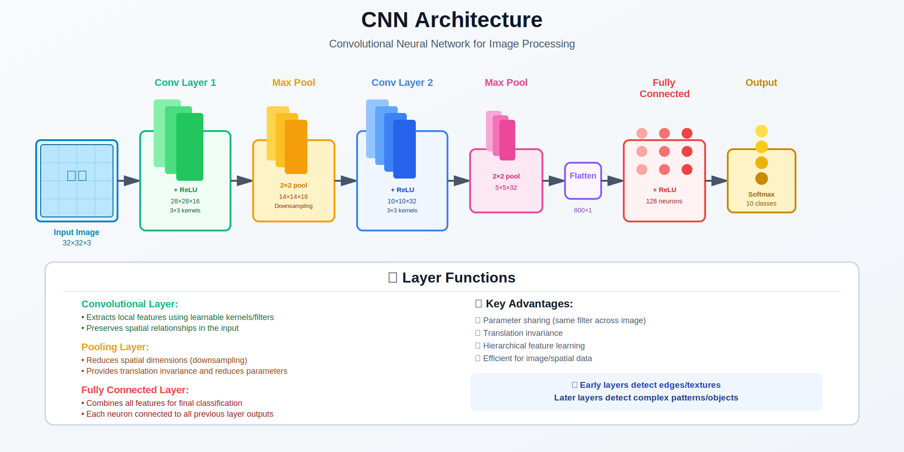

# CNN (Convolutional Neural Networks)

> **The architecture for computer vision**

---

## 🎯 Visual Overview



*Caption: Complete CNN architecture showing input image flowing through convolutional layers (feature extraction), pooling layers (downsampling), and fully connected layers (classification). The diagram illustrates how spatial features are progressively extracted and transformed into class predictions. This architecture is the foundation for computer vision tasks.*

---

## 📐 Key Operations

| Operation | Purpose |
|-----------|---------|
| **Convolution** | Local feature extraction |
| **Pooling** | Downsampling |
| **Stride** | Skip positions |
| **Padding** | Preserve spatial size |

---

## 🔑 Convolution

```
Output[i,j] = Σₘ Σₙ Input[i+m, j+n] × Kernel[m, n]

Properties:
• Translation equivariance
• Parameter sharing
• Local connectivity
```

---

## 🏗️ Famous Architectures

| Architecture | Year | Innovation |
|--------------|------|------------|
| **LeNet** | 1998 | First CNN |
| **AlexNet** | 2012 | Deep + GPU |
| **VGG** | 2014 | Very deep |
| **ResNet** | 2015 | Skip connections |
| **EfficientNet** | 2019 | Scaling |
| **ViT** | 2020 | Pure attention |

---

## 💻 Code

```python
import torch.nn as nn

cnn = nn.Sequential(
    nn.Conv2d(3, 64, kernel_size=3, padding=1),
    nn.ReLU(),
    nn.MaxPool2d(2),
    nn.Conv2d(64, 128, kernel_size=3, padding=1),
    nn.ReLU(),
    nn.MaxPool2d(2),
    nn.Flatten(),
    nn.Linear(128 * 8 * 8, 10)
)
```

---

## 🔗 Where This Topic Is Used

| Topic | How CNN Is Used |
|-------|-----------------|
| **ResNet** | Deep CNN with skip connections |
| **U-Net** | CNN encoder-decoder (diffusion, segmentation) |
| **YOLO** | CNN for object detection |
| **EfficientNet** | Scaled CNN architecture |
| **CLIP (image encoder)** | CNN or ViT for visual features |
| **Stable Diffusion** | U-Net backbone (CNN + attention) |
| **Face Recognition** | CNN for face embeddings |
| **Medical Imaging** | CNN for diagnosis |
| **Autonomous Driving** | CNN for perception |

### CNN Components Used In

| Component | Used By |
|-----------|---------|
| **Convolution** | All CNNs, U-Net in diffusion |
| **Pooling** | Downsampling in vision models |
| **ResNet blocks** | U-Net, backbone networks |
| **Depthwise Conv** | MobileNet, efficient models |

### Prerequisite For

```
CNN --> Object detection (YOLO, Faster R-CNN)
   --> Semantic segmentation (U-Net)
   --> Diffusion models (U-Net backbone)
   --> Vision encoders (CLIP)
   --> Medical image analysis
```

---

## 📚 References

| Type | Title | Link |
|------|-------|------|
| 📄 | AlexNet Paper | [NeurIPS 2012](https://papers.nips.cc/paper/2012/hash/c399862d3b9d6b76c8436e924a68c45b-Abstract.html) |
| 📄 | ResNet Paper | [arXiv](https://arxiv.org/abs/1512.03385) |
| 🎓 | Stanford CS231n | [Course](http://cs231n.stanford.edu/) |
| 🇨🇳 | CNN详解 | [知乎](https://zhuanlan.zhihu.com/p/25249694) |
| 🇨🇳 | 卷积神经网络原理 | [CSDN](https://blog.csdn.net/qq_37466121/article/details/88619088) |
| 🇨🇳 | CS231n中文 | [B站](https://www.bilibili.com/video/BV1nJ411z7fe) |

---

⬅️ [Back: Architectures](../)

---

➡️ [Next: Diffusion](../diffusion/)
