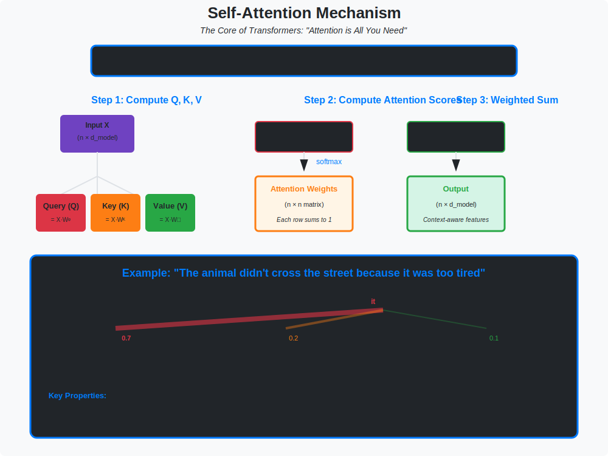

# 🔥 Transformer Architecture

> **The architecture that powers modern AI**

---

## 🎯 Visual Overview



*Caption: The self-attention mechanism computing Query-Key-Value (QKV) attention. Each token computes attention weights over all other tokens, enabling the model to capture long-range dependencies. This is the core innovation behind GPT, BERT, LLaMA, and all modern language models.*


---

## 📂 Topics in This Folder

| File | Topic | Application |
|------|-------|-------------|
| [self-attention.md](./self-attention.md) | QKV attention mechanism | Core innovation |
| [positional-encoding.md](./positional-encoding.md) | Position information | Sequence order |

---

## 🎯 The Architecture

```
+-------------------------------------------------------------+
|                         Transformer                          |
+-------------------------------------------------------------+
|                                                              |
|  Input: "The cat sat"    →    [Embed + Pos Encoding]        |
|                                       |                      |
|  +------------------------------------v----------------+    |
|  |              Transformer Block (× N)                 |    |
|  +-----------------------------------------------------+    |
|  |  +---------------------------------------------+    |    |
|  |  |         Multi-Head Self-Attention           |    |    |
|  |  +----------------------+----------------------+    |    |
|  |                         | + Residual                 |    |
|  |                   Layer Norm                         |    |
|  |                         |                            |    |
|  |  +----------------------v----------------------+    |    |
|  |  |            Feed-Forward Network              |    |    |
|  |  |         Linear → GELU → Linear               |    |    |
|  |  +----------------------+----------------------+    |    |
|  |                         | + Residual                 |    |
|  |                   Layer Norm                         |    |
|  +-------------------------+---------------------------+    |
|                            |                                 |
|      ▼      |
|                       [Output]                               |
|                                                              |
+-------------------------------------------------------------+
```

---

## 📐 Mathematical Foundations

### Self-Attention
```
Attention(Q, K, V) = softmax(QKᵀ / √dₖ) V

Where:
• Q = XWQ (queries)
• K = XWK (keys)  
• V = XWV (values)
• dₖ = dimension of keys
```

### Multi-Head Attention
```
MultiHead(X) = Concat(head₁,...,headₕ) Wᴼ

headᵢ = Attention(XWᵢQ, XWᵢK, XWᵢV)
```

### Positional Encoding
```
PE(pos, 2i) = sin(pos / 10000^(2i/d))
PE(pos, 2i+1) = cos(pos / 10000^(2i/d))
```

---

## 🔥 Self-Attention: The Core

```
Attention(Q, K, V) = softmax(QKᵀ/√d_k) · V

Step by step:
1. Compute similarity: QKᵀ         (n × n matrix)
2. Scale:              QKᵀ/√d_k    (prevent large values)
3. Normalize:          softmax()   (attention weights)
4. Aggregate:          × V         (weighted sum)

Why it works:
• Every token can attend to every other token
• Learns which tokens are relevant
• No recurrence → parallelizable!
```

---

## 🌍 Models Using Transformers

| Model | Type | Parameters | Application |
|-------|------|------------|-------------|
| **GPT-4** | Decoder-only | ~1T? | Chat, reasoning |
| **LLaMA** | Decoder-only | 7B-70B | Open source LLM |
| **BERT** | Encoder-only | 110M-340M | NLU tasks |
| **T5** | Encoder-decoder | 60M-11B | Seq2seq |
| **ViT** | Encoder | 86M-632M | Vision |
| **Stable Diffusion** | Cross-attention | 1B | Image generation |

---

## 💻 Code Example

```python
import torch
import torch.nn as nn
import math

class SelfAttention(nn.Module):
    def __init__(self, d_model, n_heads):
        super().__init__()
        self.d_k = d_model // n_heads
        self.n_heads = n_heads
        
        self.W_q = nn.Linear(d_model, d_model)
        self.W_k = nn.Linear(d_model, d_model)
        self.W_v = nn.Linear(d_model, d_model)
        self.W_o = nn.Linear(d_model, d_model)
    
    def forward(self, x, mask=None):
        B, T, C = x.shape
        
        # Project to Q, K, V
        Q = self.W_q(x).view(B, T, self.n_heads, self.d_k).transpose(1, 2)
        K = self.W_k(x).view(B, T, self.n_heads, self.d_k).transpose(1, 2)
        V = self.W_v(x).view(B, T, self.n_heads, self.d_k).transpose(1, 2)
        
        # Attention: softmax(QK^T / sqrt(d_k)) V
        scores = (Q @ K.transpose(-2, -1)) / math.sqrt(self.d_k)
        if mask is not None:
            scores = scores.masked_fill(mask == 0, float('-inf'))
        attn = torch.softmax(scores, dim=-1)
        
        # Aggregate and project
        out = (attn @ V).transpose(1, 2).contiguous().view(B, T, C)
        return self.W_o(out)
```

---

## 📊 Complexity

```
Attention complexity: O(n² · d)
• n = sequence length
• d = embedding dimension

For long sequences (n = 8192):
• Quadratic in n → expensive!
• Solutions: Flash Attention, Linear Attention, Sparse Attention
```

---

## 📐 DETAILED MATHEMATICAL DERIVATIONS

### 1. Attention Mechanism: Complete Derivation

**Problem:** Given input sequence X ∈ ℝ^(n×d), compute contextualized representations.

**Step-by-step derivation:**

```
Step 1: Project inputs to Query, Key, Value spaces
Q = XWQ    where WQ ∈ ℝ^(d×d_k)   (queries: "what I'm looking for")
K = XWK    where WK ∈ ℝ^(d×d_k)   (keys: "what I contain")
V = XWV    where WV ∈ ℝ^(d×d_v)   (values: "what I output")

Dimensions:
  X: (n × d)       n = sequence length, d = model dimension
  Q: (n × d_k)     d_k = key/query dimension
  K: (n × d_k)
  V: (n × d_v)     d_v = value dimension

Step 2: Compute attention scores (similarity matrix)
scores = QKᵀ    ∈ ℝ^(n×n)

scores[i,j] = dot product between query_i and key_j
            = Σₖ Q[i,k] · K[j,k]
            = similarity of token i to token j

Step 3: Scale by √d_k (prevent saturation)
scaled_scores = QKᵀ / √d_k

Why scale? As d_k increases:
  Var(QKᵀ) ≈ d_k · Var(q) · Var(k)
  
If Var(q) = Var(k) = 1:
  Var(QKᵀ) ≈ d_k
  
Scaling by √d_k normalizes variance to ≈1
→ Prevents softmax saturation (all weights → 0 or 1)

Step 4: Apply softmax (get attention weights)
A = softmax(QKᵀ / √d_k)    ∈ ℝ^(n×n)

A[i,j] = exp(scores[i,j]) / Σₖ exp(scores[i,k])

Properties:
  • Each row sums to 1: Σⱼ A[i,j] = 1
  • All non-negative: A[i,j] ≥ 0
  • Interprets as probability: "token i attends to token j with weight A[i,j]"

Step 5: Compute weighted sum of values
output = A · V    ∈ ℝ^(n×d_v)

output[i] = Σⱼ A[i,j] · V[j]
          = weighted average of all value vectors
          = contextualized representation of token i
```

**Full formula:**
```
Attention(Q, K, V) = softmax(QKᵀ / √d_k) · V
```

---

### 2. Why Attention Works: Intuition

**Example sentence:** "The animal didn't cross the street because it was too tired"

```
Query from "it" will compute high scores with:
  • "animal" (high similarity) → high attention weight
  • "street" (low similarity) → low attention weight

Result: "it" aggregates information primarily from "animal"
→ Model understands "it" refers to "animal"

Mathematically:
If Q[it] ≈ K[animal]:
  QKᵀ[it, animal] = large
  After softmax: A[it, animal] ≈ 1
  output[it] ≈ V[animal]
```

---

### 3. Multi-Head Attention: Complete Derivation

**Problem:** Single attention may not capture all relationships

**Solution:** Use H parallel attention heads

```
Step 1: Split into H heads
For each head h = 1,...,H:
  W_h^Q ∈ ℝ^(d×d_k)    where d_k = d/H
  W_h^K ∈ ℝ^(d×d_k)
  W_h^V ∈ ℝ^(d×d_v)    where d_v = d/H

Step 2: Compute attention for each head
head_h = Attention(XW_h^Q, XW_h^K, XW_h^V)
       = softmax((XW_h^Q)(XW_h^K)ᵀ / √d_k) · (XW_h^V)
       
Shape: head_h ∈ ℝ^(n×d_v)

Step 3: Concatenate all heads
concat = [head_1 ; head_2 ; ... ; head_H]    ∈ ℝ^(n×H·d_v)

Step 4: Project back to d dimensions
output = concat · W^O    where W^O ∈ ℝ^(H·d_v × d)

Final: output ∈ ℝ^(n×d)
```

**Why multiple heads?**

```
Different heads can capture different relationships:
  • Head 1: Syntactic (subject-verb agreement)
  • Head 2: Semantic (word meanings)
  • Head 3: Coreference (pronoun resolution)
  • Head 4: Long-range dependencies
  
Each head specializes through training!
```

---

### 4. Masked Self-Attention (for GPT/decoder)

**Problem:** During generation, token i shouldn't see tokens j > i

**Solution:** Add mask before softmax

```
Step 1: Compute scores as usual
scores = QKᵀ / √d_k    ∈ ℝ^(n×n)

Step 2: Create causal mask
mask = [[1, 0, 0, 0],      (upper triangular = 0)
        [1, 1, 0, 0],
        [1, 1, 1, 0],
        [1, 1, 1, 1]]

Step 3: Apply mask (set masked positions to -∞)
masked_scores = scores + (1 - mask) · (-∞)
              = [[scores[0,0],    -∞,         -∞,         -∞     ],
                 [scores[1,0], scores[1,1],    -∞,         -∞     ],
                 [scores[2,0], scores[2,1], scores[2,2],    -∞     ],
                 [scores[3,0], scores[3,1], scores[3,2], scores[3,3]]]

Step 4: Softmax (exp(-∞) = 0)
A = softmax(masked_scores)

Result: A[i,j] = 0 for j > i (future tokens don't affect past)
```

**Implementation:**
```python
def causal_self_attention(Q, K, V):
    """
    GPT-style causal self-attention
    """
    n = Q.shape[1]
    
    # Compute attention scores
    scores = (Q @ K.transpose(-2, -1)) / math.sqrt(Q.shape[-1])
    
    # Create causal mask
    mask = torch.tril(torch.ones(n, n)).view(1, 1, n, n)
    
    # Apply mask
    scores = scores.masked_fill(mask == 0, float('-inf'))
    
    # Softmax + aggregate
    attn = torch.softmax(scores, dim=-1)
    return attn @ V
```

---

### 5. Positional Encoding: Why We Need It

**Problem:** Attention is permutation-invariant!

```
Attention(X) for X = [[v₁], [v₂], [v₃]]
and 
Attention(X') for X' = [[v₃], [v₁], [v₂]]

Give SAME output (just permuted)!

But for language: "Dog bites man" ≠ "Man bites dog"
Order matters!
```

**Solution:** Add position information to inputs

```
X_pos = X + PE(pos)

Where PE(pos, 2i) = sin(pos / 10000^(2i/d))
      PE(pos, 2i+1) = cos(pos / 10000^(2i/d))
```

**Why this formula?**

```
Step 1: Wavelength spectrum
For dimension i, wavelength = 2π · 10000^(2i/d)
  • Low i: Short wavelength (high frequency)
  • High i: Long wavelength (low frequency)

Step 2: Relative position encoding
sin(α + β) = sin(α)cos(β) + cos(α)sin(β)

PE(pos + k) can be expressed as linear function of PE(pos)!
→ Model can learn to attend to relative positions

Step 3: Unique encoding
For any position pos and dimension i:
  [sin(pos/λᵢ), cos(pos/λᵢ)] is unique
→ No two positions have same encoding
```

**Modern alternatives:**

```
1. Learned positional embeddings (BERT):
   PE[pos] = learnable vector

2. Rotary Position Encoding (RoPE) (LLaMA):
   Rotate Q and K by position-dependent angles
   
3. ALiBi (Attention with Linear Biases):
   Add linear bias to attention scores: scores[i,j] -= m·|i-j|
```

---

### 6. Computational Complexity Analysis

**Standard Attention:**

```
Given: X ∈ ℝ^(n×d), WQ, WK, WV ∈ ℝ^(d×d)

Step 1: QKV projections
  Q = XWQ: O(n·d²)
  K = XWK: O(n·d²)
  V = XWV: O(n·d²)
  Total: O(3n·d²) = O(n·d²)

Step 2: Attention scores
  QKᵀ: O(n²·d)    ← BOTTLENECK for long sequences!

Step 3: Softmax
  O(n²)

Step 4: Weighted sum
  A·V: O(n²·d)

Total: O(n·d² + n²·d)

For typical models (d = 512-4096, n = 512-8192):
  n·d² dominates for small n (parameter-bound)
  n²·d dominates for large n (sequence-bound)
```

**Memory complexity:**

```
Attention matrix A: O(n²)

For n = 8192:
  A requires 8192² = 67M entries
  At FP16 (2 bytes): 134 MB per layer per head!
  
GPT-3 has 96 layers × 96 heads:
  ≈ 1.2 TB just for attention matrices!
```

---

### 7. Flash Attention: How It Reduces Memory

**Problem:** Standard attention materializes full O(n²) matrix

**Key insight:** Reorder operations to avoid storing A

```
Standard:
  1. Compute all of A = softmax(QKᵀ/√d)    [O(n²) memory]
  2. Compute output = A·V                  [O(n²) memory]

Flash Attention:
  1. Tile Q, K, V into blocks
  2. For each block:
     a. Load Q_block, K_block, V_block from HBM to SRAM
     b. Compute local attention for this block
     c. Update running sum (online softmax)
     d. Write output block back to HBM
  3. Never materialize full A matrix!

Memory: O(n²/B) where B = block size
Complexity: Still O(n²·d), but IO-efficient
```

**Speedup:** 2-4x faster due to memory hierarchy optimization!

---

### 8. Attention Gradients (for Backpropagation)

**Forward:**
```
A = softmax(S)    where S = QKᵀ/√d_k
output = A·V
```

**Backward:** Given ∂L/∂output, compute ∂L/∂Q, ∂L/∂K, ∂L/∂V

```
Step 1: Gradient of V
∂L/∂V = Aᵀ · ∂L/∂output    [shape: n×d_v]

Step 2: Gradient of A
∂L/∂A = ∂L/∂output · Vᵀ    [shape: n×n]

Step 3: Gradient through softmax
Softmax gradient (for row i):
∂Aᵢ/∂Sᵢ = diag(Aᵢ) - Aᵢ·Aᵢᵀ

∂L/∂S = ∂L/∂A ⊙ A - A·(∂L/∂A ⊙ A)ᵀ
      = A ⊙ (∂L/∂A - (∂L/∂A ⊙ A)·1)

Step 4: Gradient through scaling
∂L/∂(QKᵀ) = ∂L/∂S / √d_k

Step 5: Gradient of Q and K
∂L/∂Q = ∂L/∂(QKᵀ) · K    [shape: n×d_k]
∂L/∂K = ∂L/∂(QKᵀ)ᵀ · Q    [shape: n×d_k]
```

**Implementation:**
```python
class AttentionFunction(torch.autograd.Function):
    @staticmethod
    def forward(ctx, Q, K, V):
        d_k = Q.shape[-1]
        scores = (Q @ K.transpose(-2, -1)) / math.sqrt(d_k)
        A = torch.softmax(scores, dim=-1)
        output = A @ V
        
        ctx.save_for_backward(Q, K, V, A)
        ctx.d_k = d_k
        return output
    
    @staticmethod
    def backward(ctx, grad_output):
        Q, K, V, A = ctx.saved_tensors
        d_k = ctx.d_k
        
        # Gradient of V
        grad_V = A.transpose(-2, -1) @ grad_output
        
        # Gradient of A
        grad_A = grad_output @ V.transpose(-2, -1)
        
        # Gradient through softmax
        sum_term = (grad_A * A).sum(dim=-1, keepdim=True)
        grad_S = A * (grad_A - sum_term)
        
        # Gradient through scaling
        grad_scores = grad_S / math.sqrt(d_k)
        
        # Gradients of Q and K
        grad_Q = grad_scores @ K
        grad_K = grad_scores.transpose(-2, -1) @ Q
        
        return grad_Q, grad_K, grad_V
```

---

### 9. Research Paper Implementations

**From "Attention Is All You Need" (Vaswani et al., 2017):**

```python
def scaled_dot_product_attention(q, k, v, mask=None):
    """
    Original transformer attention from the paper
    
    Args:
        q, k, v: (batch, heads, seq_len, d_k)
        mask: (batch, 1, 1, seq_len) or (batch, 1, seq_len, seq_len)
    """
    d_k = q.size(-1)
    
    # MatMul + Scale
    scores = torch.matmul(q, k.transpose(-2, -1)) / math.sqrt(d_k)
    
    # Mask (optional)
    if mask is not None:
        scores = scores.masked_fill(mask == 0, -1e9)
    
    # Softmax
    attn = F.softmax(scores, dim=-1)
    
    # MatMul
    output = torch.matmul(attn, v)
    
    return output, attn
```

**GPT-2 implementation details:**

```python
class GPT2Attention(nn.Module):
    def __init__(self, config):
        super().__init__()
        self.embed_dim = config.n_embd
        self.num_heads = config.n_head
        self.head_dim = self.embed_dim // self.num_heads
        
        # Single matrix for Q, K, V (efficiency)
        self.c_attn = nn.Linear(self.embed_dim, 3 * self.embed_dim)
        self.c_proj = nn.Linear(self.embed_dim, self.embed_dim)
        
        # Causal mask (registered as buffer, not a parameter)
        self.register_buffer("bias", torch.tril(
            torch.ones(config.block_size, config.block_size)
        ).view(1, 1, config.block_size, config.block_size))
    
    def forward(self, x):
        B, T, C = x.size()
        
        # Calculate Q, K, V in one go
        q, k, v = self.c_attn(x).split(self.embed_dim, dim=2)
        
        # Reshape for multi-head
        q = q.view(B, T, self.num_heads, self.head_dim).transpose(1, 2)
        k = k.view(B, T, self.num_heads, self.head_dim).transpose(1, 2)
        v = v.view(B, T, self.num_heads, self.head_dim).transpose(1, 2)
        
        # Attention
        att = (q @ k.transpose(-2, -1)) * (1.0 / math.sqrt(k.size(-1)))
        att = att.masked_fill(self.bias[:,:,:T,:T] == 0, float('-inf'))
        att = F.softmax(att, dim=-1)
        y = att @ v
        
        # Reassemble all head outputs side by side
        y = y.transpose(1, 2).contiguous().view(B, T, C)
        
        # Output projection
        y = self.c_proj(y)
        return y
```

---

### 10. Tips for Reading Transformer Papers

**Key things to look for:**

1. **Attention variant:**
   ```
   • Self-attention (GPT, BERT)
   • Cross-attention (T5, Diffusion)
   • Sparse attention (Longformer, BigBird)
   • Linear attention (Performer, Linformer)
   ```

2. **Position encoding:**
   ```
   • Sinusoidal (original Transformer)
   • Learned (BERT)
   • RoPE (LLaMA, GPT-Neo)
   • ALiBi (BLOOM, MPT)
   • None (some vision transformers)
   ```

3. **Normalization placement:**
   ```
   • Post-norm: X + SubLayer(LayerNorm(X))  [original]
   • Pre-norm: X + SubLayer(LayerNorm(X))   [GPT-2, modern]
   ```

4. **Architectural details:**
   ```
   • Number of layers: 12 (BERT-base), 24 (BERT-large), 96 (GPT-3)
   • Hidden size (d_model): 512-12288
   • Number of heads: 8-96
   • FFN size: Usually 4×d_model
   ```

5. **Training tricks:**
   ```
   • Warmup schedule
   • Gradient clipping
   • Dropout rates
   • Mixed precision training
   • Activation checkpointing
   ```

---

## 📚 Resources

## 🔗 Where This Topic Is Used

| Topic | How Transformer Is Used |
|-------|------------------------|
| **GPT / LLaMA** | Decoder-only transformer |
| **BERT** | Encoder-only transformer |
| **T5** | Encoder-decoder transformer |
| **ViT** | Vision transformer (patches → tokens) |
| **Whisper** | Audio → text transformer |
| **CLIP** | Image + text transformers |
| **Stable Diffusion** | Cross-attention in U-Net |
| **DALL-E** | Text-to-image transformer |
| **Mixtral** | Transformer + MoE |
| **Flash Attention** | Optimized transformer attention |

### Transformer Components Used In

| Component | Used By |
|-----------|---------|
| **Self-Attention** | All language models |
| **Cross-Attention** | Diffusion, encoder-decoder |
| **Multi-Head** | Better representations |
| **Positional Encoding** | Sequence order (RoPE, ALiBi) |
| **LayerNorm** | Transformer stability |
| **FFN** | Feature transformation |

### Prerequisite For

```
Transformer --> All LLMs (GPT, Claude, LLaMA)
           --> Vision Transformers
           --> Diffusion models (cross-attention)
           --> Multimodal models (CLIP, Flamingo)
           --> Flash Attention (optimization)
```

---


⬅️ [Back: Architectures](../)

---

⬅️ [Back: Rnn](../rnn/)
