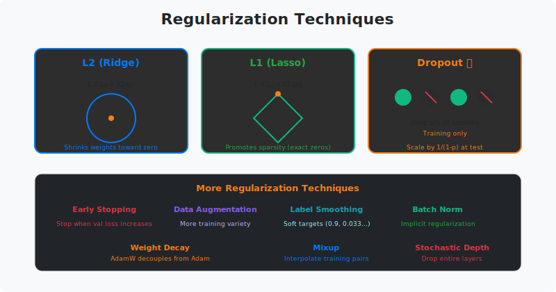

<!-- Animated Header -->
<p align="center">
  
</p>

<p align="center">
  
  
  
</p>


---

## 🎯 Visual Overview



*Caption: Regularization techniques prevent overfitting. L2 (Ridge) shrinks weights toward zero; L1 (Lasso) promotes sparsity; Dropout randomly zeros neurons during training. The goal: models that generalize to unseen data.*

---

## 📂 Overview

Regularization adds constraints or penalties to prevent models from fitting noise in training data. It's essential for achieving good generalization.

---

## 🔑 Main Techniques

| Technique | Method | Effect |
|-----------|--------|--------|
| **L2 (Ridge)** | Add λΣw² to loss | Shrink all weights |
| **L1 (Lasso)** | Add λΣ\|w\| to loss | Promote sparsity |
| **Dropout** | Zero random neurons | Ensemble effect |
| **Early Stopping** | Stop when val loss ↑ | Limit training time |
| **Weight Decay** | Decay weights each step | Similar to L2 |

---

## 📐 L1 vs L2

```
L2 Regularization:
L = L_data + λ Σ wᵢ²
∂L/∂w = ∂L_data/∂w + 2λw  → shrinks proportionally

L1 Regularization:
L = L_data + λ Σ |wᵢ|
∂L/∂w = ∂L_data/∂w + λ·sign(w)  → constant push to 0

Result: L1 creates exact zeros (sparse), L2 creates small values
```

---

## 💻 Code

```python
import torch
import torch.nn as nn

# L2 via weight_decay in optimizer (most common)
optimizer = torch.optim.AdamW(model.parameters(), lr=1e-3, weight_decay=0.01)

# L1 regularization (manual)
l1_lambda = 0.001
l1_loss = sum(p.abs().sum() for p in model.parameters())
total_loss = loss + l1_lambda * l1_loss

# Dropout layer
dropout = nn.Dropout(p=0.1)  # 10% dropout
x = dropout(x)  # Only during training!

# Label smoothing in cross-entropy
loss_fn = nn.CrossEntropyLoss(label_smoothing=0.1)
```

---

## 📚 References

| Type | Title | Link |
|------|-------|------|
| 📄 | Dropout Paper | [JMLR](https://jmlr.org/papers/v15/srivastava14a.html) |
| 📄 | L1/L2 Regularization | [ESL Ch. 3](https://hastie.su.domains/ElemStatLearn/) |
| 📖 | PyTorch Weight Decay | [Docs](https://pytorch.org/docs/stable/optim.html) |
| 🇨🇳 | 正则化详解 | [知乎](https://zhuanlan.zhihu.com/p/29360425) |
| 🇨🇳 | Dropout原理 | [CSDN](https://blog.csdn.net/qq_37466121/article/details/88619088) |
| 🇨🇳 | 防止过拟合方法 | [B站](https://www.bilibili.com/video/BV164411b7dx) |


## 🔗 Where This Topic Is Used

| Technique | Application |
|-----------|------------|
| **Dropout** | Prevent overfitting |
| **Weight Decay** | L2 regularization |
| **Data Augmentation** | CNNs, vision |
| **Early Stopping** | Validation-based |

---

⬅️ [Back: Training](../)

---

⬅️ [Back: Optimizers](../optimizers/) | ➡️ [Next: Scheduling](../scheduling/)

---

---


<p align="center">
  
</p>
