<p align="center">
  
</p>

<p align="center">
  
  
  
</p>

<p align="center">
  <a href="#-main-topics"></a>
  <a href="../07-reinforcement-learning/README.md"></a>
</p>

---

**✍️ Author:** [Gaurav Goswami](https://github.com/Gaurav14cs17) • **📅 Updated:** December 2024

---

## 📊 Learning Path

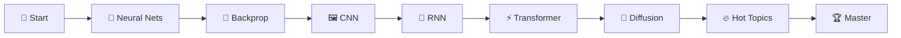

## 🎯 What You'll Learn

> 🚀 From **Perceptrons to Transformers**: Neural Networks that Changed AI

<table>
<tr>
<td align="center">

### 🧠 Fundamentals
Neural Networks, Backprop

</td>
<td align="center">

### 🏗️ Architectures
CNN, RNN, Transformer

</td>
<td align="center">

### 🔥 Cutting Edge
Flash Attention, LoRA, MoE

</td>
</tr>
</table>

---

## 📚 Main Topics

### 1️⃣ Neural Networks Basics

 

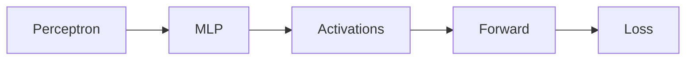

**Core:** Perceptron, MLP, Activations (ReLU, GELU), Loss Functions

<a href="./01-neural-networks/README.md"></a>

---

### 2️⃣ Backpropagation ⭐

 

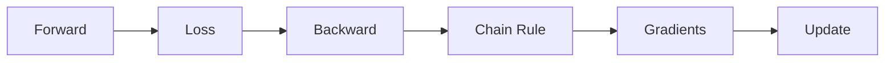

> ⭐ **MOST IMPORTANT: How neural networks learn**

**Core:** Chain Rule, Computational Graphs, Autodiff, Gradient Flow

<a href="./02-backpropagation/README.md"></a>

---

### 3️⃣ CNN - Convolutional Networks

 

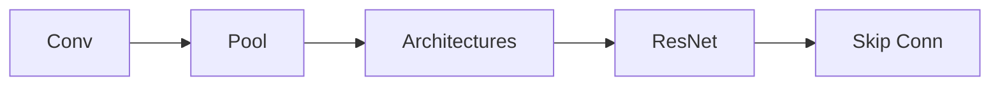

**Core:** Convolution, Pooling, ResNet, Skip Connections

<a href="./03-architectures/cnn/README.md"></a>

---

### 4️⃣ RNN - Recurrent Networks

 

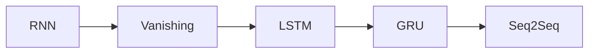

**Core:** RNN, LSTM, GRU, Vanishing Gradients

<a href="./03-architectures/rnn/README.md"></a>

---

### 5️⃣ Transformers ⭐⭐⭐

 

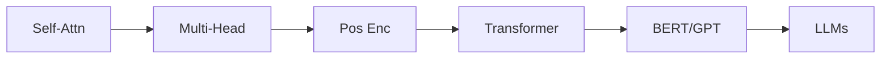

> ⭐ **FOUNDATION OF MODERN AI** - Powers GPT, BERT, LLaMA, Claude

**Core:** Self-Attention, Multi-Head, Positional Encoding, BERT vs GPT

<a href="./03-architectures/transformer/README.md"></a>

---

### 6️⃣ Generative Models

 

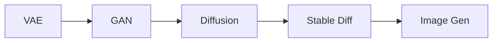

**Core:** VAE, GAN, Diffusion Models, Stable Diffusion

<a href="./03-architectures/diffusion/README.md"></a>

---

### 7️⃣ Training Techniques


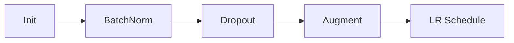

**Core:** Xavier/He Init, BatchNorm, LayerNorm, Dropout

<a href="./05-training-techniques/README.md"></a>

---

### 8️⃣ Hot Topics 🔥

 

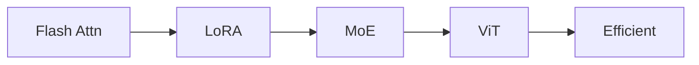

| Topic | Impact |
|-------|--------|
| ⚡ Flash Attention | 5x faster, O(n) memory |
| 🔧 LoRA | Fine-tune with 0.1% params |
| 🧩 MoE | Scale to trillions |

<a href="./06-hot-topics/flash-attention/flash-attention.md"></a>
<a href="./06-hot-topics/lora/lora.md"></a>

---

## 🔄 Architecture Evolution

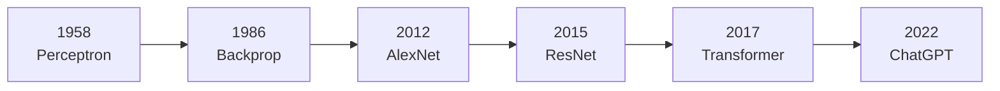

---

## 💡 Key Formulas

<table>
<tr>
<td>

### 🧠 Forward Pass
```
z = Wx + b
a = σ(z)
```

</td>
<td>

### 🔄 Backprop
```
∂L/∂W = ∂L/∂a · ∂a/∂z · ∂z/∂W
```

</td>
<td>

### ⚡ Attention
```
Attn(Q,K,V) = softmax(QKᵀ/√dₖ)V
```

</td>
</tr>
</table>

---

## 🔗 Prerequisites & Next Steps

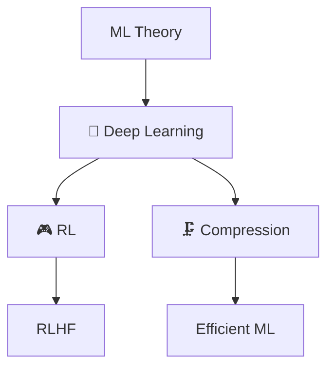

<p align="center">
  <a href="../05-ml-theory/README.md"></a>
  <a href="../07-reinforcement-learning/README.md"></a>
</p>

---

## 📚 Recommended Resources

| Type | Resource | Focus |
|:----:|----------|-------|
| 📘 | [Deep Learning Book](https://www.deeplearningbook.org/) | Goodfellow et al. |
| 🎓 | [Stanford CS231n](http://cs231n.stanford.edu/) | CNN & Vision |
| 🎓 | [Stanford CS224n](https://web.stanford.edu/class/cs224n/) | NLP & Transformers |
| 📄 | [Attention Is All You Need](https://arxiv.org/abs/1706.03762) | Original Transformer |

---

## 🗺️ Quick Navigation

| Previous | Current | Next |
|:--------:|:-------:|:----:|
| [🎯 ML Theory](../05-ml-theory/README.md) | **🧬 Deep Learning** | [🎮 RL →](../07-reinforcement-learning/README.md) |

---

<p align="center">
  
</p>
