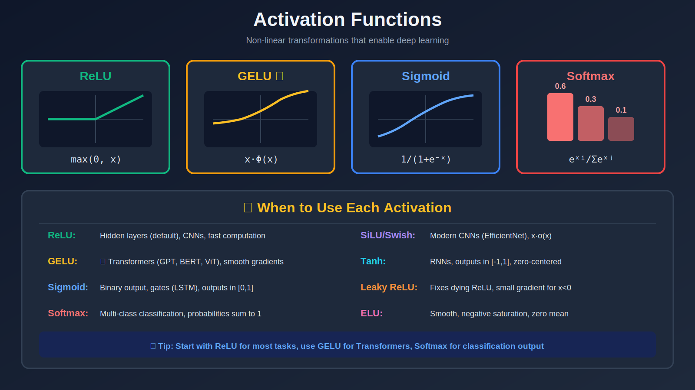

<!-- Animated Header -->
<p align="center">
  
</p>

<p align="center">
  
  
  
</p>

<p align="center">
  <a href="../">⬆️ Back to Neural Networks</a> &nbsp;|&nbsp;
  <a href="../02_initialization/">Next: Initialization ➡️</a>
</p>


---

## 🎯 Visual Overview



*Caption: Different activation functions have different shapes and use cases. ReLU is the default for hidden layers, GELU powers modern Transformers, Sigmoid for binary outputs, and Softmax for multi-class classification.*

---

## 📐 Mathematical Definitions

### Classic Activations

```
Sigmoid:        σ(x) = 1 / (1 + e⁻ˣ)
                Range: (0, 1)
                σ'(x) = σ(x)(1 - σ(x))

Tanh:           tanh(x) = (eˣ - e⁻ˣ) / (eˣ + e⁻ˣ)
                Range: (-1, 1)
                tanh'(x) = 1 - tanh²(x)

ReLU:           ReLU(x) = max(0, x)
                Range: [0, ∞)
                ReLU'(x) = 1 if x > 0, else 0

```

### Modern Activations

```
Leaky ReLU:     LeakyReLU(x) = max(αx, x),  α ≈ 0.01
                Prevents "dying ReLU" problem

GELU:           GELU(x) = x · Φ(x) = x · 0.5(1 + erf(x/√2))
                ≈ 0.5x(1 + tanh(√(2/π)(x + 0.044715x³)))
                Used in: GPT, BERT, Transformers

SiLU/Swish:     SiLU(x) = x · σ(x) = x / (1 + e⁻ˣ)
                Used in: EfficientNet, LLaMA

Softmax:        softmax(xᵢ) = exp(xᵢ) / Σⱼexp(xⱼ)
                Output: probability distribution (sums to 1)
                Gradient: ∂softmax(x)ᵢ/∂xⱼ = sᵢ(δᵢⱼ - sⱼ)

```

---

## 📊 Comparison Table

| Function | Formula | Range | Gradient | Used In |
|----------|---------|-------|----------|---------|
| **Sigmoid** | 1/(1+e⁻ˣ) | (0,1) | σ(1-σ) ≤ 0.25 | Binary output |
| **Tanh** | (eˣ-e⁻ˣ)/(eˣ+e⁻ˣ) | (-1,1) | 1-tanh² ≤ 1 | RNN hidden |
| **ReLU** | max(0,x) | [0,∞) | 0 or 1 | CNN hidden |
| **LeakyReLU** | max(αx,x) | (-∞,∞) | α or 1 | GAN |
| **GELU** | x·Φ(x) | (-0.17,∞) | smooth | Transformers |
| **SiLU** | x·σ(x) | (-0.28,∞) | smooth | LLaMA, EfficientNet |
| **Softmax** | exp(xᵢ)/Σexp(xⱼ) | (0,1)ⁿ | matrix | Classification |

---

## 🔑 Why Non-linearity?

```
Without activation:
Layer 1: y₁ = W₁x
Layer 2: y₂ = W₂y₁ = W₂W₁x = W'x

Multiple linear layers collapse to ONE linear layer!
Can only represent linear functions.

With activation:
Layer 1: y₁ = σ(W₁x)
Layer 2: y₂ = σ(W₂y₁) ≠ linear in x

Non-linearity enables:
• Universal approximation (any continuous function)
• Learning complex decision boundaries
• Deep feature hierarchies

```

### Universal Approximation Theorem

```
A feedforward network with ONE hidden layer and 
non-linear activation can approximate any continuous
function on a compact set to arbitrary accuracy.

But: May require exponentially many neurons!
     Deep networks are more parameter-efficient.

```

---

## 💻 Code Examples

```python
import torch
import torch.nn as nn
import torch.nn.functional as F

x = torch.randn(32, 128)

# ReLU - most common
relu_out = F.relu(x)
relu_out = nn.ReLU()(x)

# GELU - Transformers (GPT, BERT)
gelu_out = F.gelu(x)

# SiLU/Swish - EfficientNet, LLaMA
silu_out = F.silu(x)

# Sigmoid - binary classification output
sigmoid_out = torch.sigmoid(x)

# Softmax - multi-class classification
logits = torch.randn(32, 10)  # 32 samples, 10 classes
probs = F.softmax(logits, dim=-1)  # sums to 1 along dim=-1

# Stable log-softmax for cross-entropy
log_probs = F.log_softmax(logits, dim=-1)

# Custom activation
class Mish(nn.Module):
    """Mish: x * tanh(softplus(x))"""
    def forward(self, x):
        return x * torch.tanh(F.softplus(x))

# In a network
class MLP(nn.Module):
    def __init__(self, in_dim, hidden_dim, out_dim):
        super().__init__()
        self.fc1 = nn.Linear(in_dim, hidden_dim)
        self.fc2 = nn.Linear(hidden_dim, out_dim)
        self.act = nn.GELU()  # Modern choice
    
    def forward(self, x):
        x = self.act(self.fc1(x))
        return self.fc2(x)  # No activation on output (let loss handle it)

```

---

## 🌍 ML Applications

| Model | Activation | Reason |
|-------|------------|--------|
| **GPT, BERT, LLaMA** | GELU | Smooth, better gradient flow |
| **ResNet, VGG** | ReLU | Fast, sparse |
| **EfficientNet** | SiLU/Swish | Self-gating |
| **LSTM** | Sigmoid + Tanh | Gates need (0,1), states need (-1,1) |
| **GAN** | LeakyReLU | Prevents dying neurons |
| **Classification head** | Softmax | Probability output |
| **Binary classification** | Sigmoid | (0,1) output |

---

## 📚 References

| Type | Title | Link |
|------|-------|------|
| 🎥 | 3Blue1Brown: Neural Networks | [YouTube](https://www.youtube.com/watch?v=aircAruvnKk) |
| 🎥 | StatQuest: ReLU | [YouTube](https://www.youtube.com/watch?v=68BZ5f7P94E) |
| 📄 | GELU Paper | [arXiv](https://arxiv.org/abs/1606.08415) |
| 📄 | Swish Paper | [arXiv](https://arxiv.org/abs/1710.05941) |
| 🇨🇳 | 激活函数详解 | [知乎](https://zhuanlan.zhihu.com/p/25110450) |
| 🇨🇳 | 深度学习激活函数 | [B站](https://www.bilibili.com/video/BV1Y64y1Q7hi) |
| 🇨🇳 | ReLU/GELU对比 | [CSDN](https://blog.csdn.net/qq_37466121/article/details/88318597)

---

## 🔗 Where This Topic Is Used

| Topic | How Activations Are Used |
|-------|--------------------------|
| **Transformer FFN** | GELU between two linear layers |
| **CNN layers** | ReLU after each conv |
| **LSTM gates** | Sigmoid for gates, tanh for state |
| **Attention** | Softmax for attention weights |
| **Binary classifier** | Sigmoid output |
| **Multi-class** | Softmax output |

---

<p align="center">
  <a href="../">⬆️ Back to Neural Networks</a> &nbsp;|&nbsp;
  <a href="../02_initialization/">Next: Initialization ➡️</a>
</p>

---


<p align="center">
  
</p>
