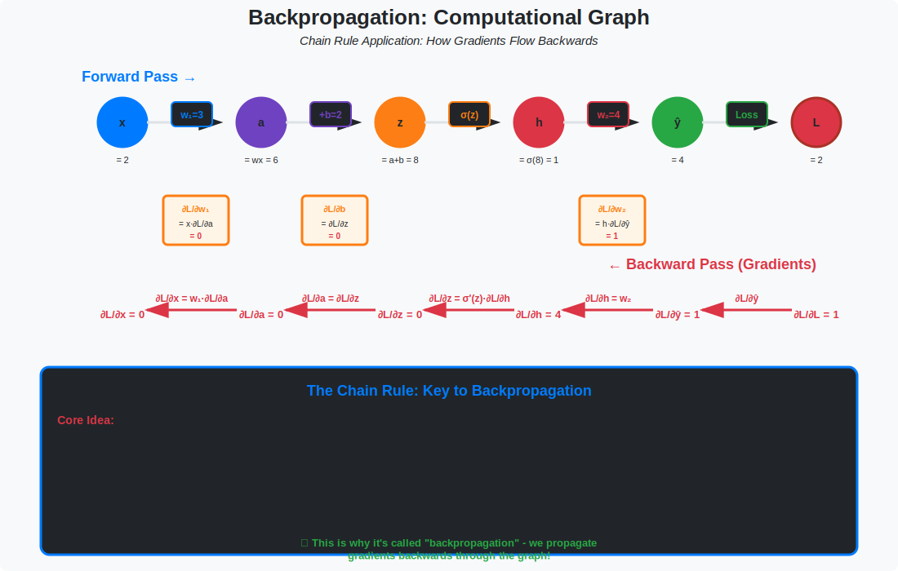

<!-- Animated Header -->
<p align="center">
  
</p>

<p align="center">
  
  
  
</p>


---

## 🎯 Visual Overview



*Caption: A computational graph shows how data flows forward through operations (blue arrows) and how gradients flow backward (red arrows). Each node represents an operation, and edges represent data flow. This is the foundation of automatic differentiation in PyTorch and TensorFlow.*

---

## 📂 Overview

A computational graph is a directed acyclic graph (DAG) where nodes represent operations and edges represent data dependencies. Understanding this is essential for:
- How PyTorch/TensorFlow compute gradients
- Memory optimization (gradient checkpointing)
- Custom autograd functions

---

## 📐 Mathematical Foundation

### Forward Pass

```
y = f(x) = f_n ∘ f_{n-1} ∘ ... ∘ f_1(x)

Each operation f_i:
    z_0 = x                    (input)
    z_1 = f_1(z_0)            (first operation)
    z_2 = f_2(z_1)            (second operation)
    ...
    z_n = f_n(z_{n-1}) = y    (output)
```

### Backward Pass (Chain Rule)

```
∂y/∂x = ∂y/∂z_{n-1} · ∂z_{n-1}/∂z_{n-2} · ... · ∂z_1/∂x

        = ∂f_n/∂z_{n-1} · ∂f_{n-1}/∂z_{n-2} · ... · ∂f_1/∂x
```

### Example: Simple Network

```
Graph:    x → [×w] → z → [+b] → a → [σ] → y

Forward:
    z = w * x
    a = z + b
    y = σ(a)

Backward (given ∂L/∂y):
    ∂L/∂a = ∂L/∂y · σ'(a)
    ∂L/∂b = ∂L/∂a · 1 = ∂L/∂a
    ∂L/∂z = ∂L/∂a · 1 = ∂L/∂a
    ∂L/∂w = ∂L/∂z · x
    ∂L/∂x = ∂L/∂z · w
```

---

## 📊 Graph Structure

### Node Types

| Type | Forward | Backward | Example |
|------|---------|----------|---------|
| **Leaf** | Input data | Accumulate gradients | Weights, inputs |
| **Unary** | f(x) → y | grad × f'(x) | ReLU, exp |
| **Binary** | f(x,y) → z | Partial derivatives | +, ×, matmul |
| **Reduction** | Σx → scalar | Broadcast gradient | sum, mean |

### DAG Properties

```
Computational Graph G = (V, E)

V: Vertices (operations + values)
E: Directed edges (data flow)

Properties:
1. Acyclic (no loops)
2. Sources = inputs/parameters
3. Sinks = outputs
4. Topological order for forward/backward
```

---

## 💻 Code Examples

### Building a Graph Manually

```python
import numpy as np

class Value:
    """Scalar value with gradient tracking"""
    
    def __init__(self, data, children=(), op=''):
        self.data = data
        self.grad = 0.0
        self._backward = lambda: None
        self._prev = set(children)
        self._op = op
    
    def __repr__(self):
        return f"Value(data={self.data}, grad={self.grad})"
    
    def __add__(self, other):
        out = Value(self.data + other.data, (self, other), '+')
        
        def _backward():
            self.grad += out.grad  # ∂L/∂self = ∂L/∂out · 1
            other.grad += out.grad  # ∂L/∂other = ∂L/∂out · 1
        
        out._backward = _backward
        return out
    
    def __mul__(self, other):
        out = Value(self.data * other.data, (self, other), '*')
        
        def _backward():
            self.grad += other.data * out.grad  # ∂L/∂self = ∂L/∂out · other
            other.grad += self.data * out.grad  # ∂L/∂other = ∂L/∂out · self
        
        out._backward = _backward
        return out
    
    def relu(self):
        out = Value(max(0, self.data), (self,), 'ReLU')
        
        def _backward():
            self.grad += (out.data > 0) * out.grad
        
        out._backward = _backward
        return out
    
    def backward(self):
        """Topological sort + backward pass"""
        topo = []
        visited = set()
        
        def build_topo(v):
            if v not in visited:
                visited.add(v)
                for child in v._prev:
                    build_topo(child)
                topo.append(v)
        
        build_topo(self)
        
        self.grad = 1.0
        for v in reversed(topo):
            v._backward()

# Example usage
x = Value(2.0)
w = Value(-3.0)
b = Value(1.0)

# Forward: y = relu(w*x + b)
z = w * x
a = z + b
y = a.relu()

print(f"Forward: y = {y.data}")  # y = 0 (since -6 + 1 = -5, relu = 0)

# Backward
y.backward()
print(f"∂y/∂w = {w.grad}")
print(f"∂y/∂x = {x.grad}")
print(f"∂y/∂b = {b.grad}")
```

### PyTorch Computational Graph

```python
import torch

# Create tensors with gradient tracking
x = torch.tensor([2.0], requires_grad=True)
w = torch.tensor([-3.0], requires_grad=True)
b = torch.tensor([1.0], requires_grad=True)

# Forward pass (builds graph)
z = w * x        # Graph: x,w → z
a = z + b        # Graph: z,b → a
y = torch.relu(a)  # Graph: a → y

# Inspect the graph
print(y.grad_fn)  # ReluBackward
print(y.grad_fn.next_functions)  # AddBackward, ...

# Backward pass (traverses graph)
y.backward()

print(f"∂y/∂w = {w.grad}")
print(f"∂y/∂x = {x.grad}")
print(f"∂y/∂b = {b.grad}")
```

### Visualizing the Graph

```python
from torchviz import make_dot

# Create a simple model
x = torch.randn(1, 10, requires_grad=True)
model = torch.nn.Sequential(
    torch.nn.Linear(10, 5),
    torch.nn.ReLU(),
    torch.nn.Linear(5, 1)
)
y = model(x)

# Visualize
dot = make_dot(y, params=dict(model.named_parameters()))
dot.render("computational_graph", format="png")
```

---

## 🔑 Key Concepts

| Concept | Description |
|---------|-------------|
| **Forward Mode** | Compute ∂output/∂input, one input at a time |
| **Backward Mode** | Compute ∂output/∂all_inputs simultaneously |
| **Gradient Accumulation** | Gradients add up at fan-in nodes |
| **Gradient Checkpointing** | Trade memory for compute |
| **Dynamic Graph** | Build graph during forward (PyTorch) |
| **Static Graph** | Define graph once (TensorFlow 1.x) |

---

## 📐 DETAILED MATHEMATICAL THEORY

### 1. The Chain Rule: Foundation of Backpropagation

**Single-Variable Chain Rule:**

```
If y = f(g(x)), then:
  dy/dx = df/dg · dg/dx

Example: y = sin(x²)
  Let u = x²
  y = sin(u)
  
  dy/dx = dy/du · du/dx
        = cos(u) · 2x
        = 2x·cos(x²)
```

**Multivariable Chain Rule (The Key!):**

```
If y depends on x through intermediate variables z₁,...,zₙ:
  
  y = f(z₁, z₂, ..., zₙ)
  z_i = g_i(x₁, x₂, ..., x_m)

Then:
  ∂y/∂x_j = Σᵢ (∂y/∂z_i) · (∂z_i/∂x_j)

This is the mathematical heart of backpropagation!
```

**Vector-to-Scalar Case (Neural Network Loss):**

```
Loss L: ℝⁿ → ℝ (scalar output)

Chain rule for gradient:
  ∂L/∂x = (∂L/∂z)ᵀ · (∂z/∂x)

where:
  ∂L/∂z ∈ ℝᵐ = gradient wrt intermediate z
  ∂z/∂x ∈ ℝᵐˣⁿ = Jacobian matrix
  ∂L/∂x ∈ ℝⁿ = gradient wrt input x

Matrix multiplication accumulates gradients through layers!
```

---

### 2. Computational Graph as DAG

**Formal Definition:**

```
Computational Graph G = (V, E, φ)

V = {v₁, v₂, ..., vₙ} = vertices (nodes)
E ⊆ V × V = directed edges
φ: V → Operations = node labels

Each node v_i:
  • Has value x_i (forward pass)
  • Has gradient ∂L/∂x_i (backward pass)
  • Represents operation: x_i = φ(x_{pa(i)})
  
where pa(i) = parents of node i

Constraints:
  1. DAG: No cycles (topological order exists)
  2. Sources: Input nodes (no incoming edges)
  3. Sink: Output node (typically loss L)
```

**Topological Ordering:**

```
A topological order is a linear ordering of vertices such that:
  For every edge (u,v), u comes before v

Algorithm (DFS-based):
  1. Visit all nodes reachable from output
  2. Add node to list after visiting all children
  3. Reverse the list

Example:
  Graph: a → b → d
         ↘c↗
  
  Topological order: [a, b, c, d] or [a, c, b, d]
  
Used in:
  • Forward pass: Process nodes in topological order
  • Backward pass: Process nodes in reverse topological order
```

---

### 3. Forward Pass: Computing Function Values

**Algorithm:**

```
Input: x (input data), θ (parameters)
Output: y (network output)

For each node v in topological order:
  1. Get inputs: x_pa = {x_u : u ∈ parents(v)}
  2. Compute: x_v = φ_v(x_pa)
  3. Store x_v for backward pass

Return x_output (typically goes into loss function)
```

**Example: 2-Layer Network**

```
Network: x → [W₁] → z₁ → [σ] → a₁ → [W₂] → z₂ → [σ] → a₂ → [loss] → L

Forward computation:
  z₁ = W₁·x
  a₁ = σ(z₁)
  z₂ = W₂·a₁
  a₂ = σ(z₂)
  L = ℓ(a₂, y)  # Loss function

Each arrow is an operation node in the graph
Values stored: {x, z₁, a₁, z₂, a₂, L}
```

**Memory Cost:**

```
For network with L layers, each layer width d:
  Forward pass stores: O(L·d) activations

Deep networks (L=100, d=1000):
  Memory ≈ 100k floats = 400KB per sample
  Batch of 32: ≈ 12.8MB

This is why deep learning needs GPUs with large memory!
```

---

### 4. Backward Pass: Computing Gradients

**Algorithm (Reverse-Mode Autodiff):**

```
Input: ∂L/∂x_output = 1 (gradient at output)
Output: {∂L/∂θ_i} for all parameters θ_i

Initialize: ∂L/∂v = 0 for all nodes v

Set: ∂L/∂(output) = 1

For each node v in reverse topological order:
  For each parent u of v:
    ∂L/∂u += ∂L/∂v · ∂v/∂u  # Chain rule!

Return {∂L/∂θ_i}
```

**Key Insight: Gradient Accumulation at Fan-In**

```
If node z has multiple children {y₁, y₂, ...}:

  ∂L/∂z = Σᵢ ∂L/∂yᵢ · ∂yᵢ/∂z

Example:
     x
    / \
   y₁  y₂
    \ /
     L

∂L/∂x = ∂L/∂y₁·∂y₁/∂x + ∂L/∂y₂·∂y₂/∂x

This is why gradients must be accumulated (+=) not overwritten (=)!
```

**Example: Complete 2-Layer Backprop**

```
Forward:
  z₁ = W₁·x
  a₁ = σ(z₁)
  z₂ = W₂·a₁
  a₂ = σ(z₂)
  L = ℓ(a₂, y)

Backward (given ∂L/∂L = 1):
  ∂L/∂a₂ = ∂ℓ/∂a₂                    # Loss gradient
  ∂L/∂z₂ = ∂L/∂a₂ ⊙ σ'(z₂)           # Element-wise
  ∂L/∂W₂ = ∂L/∂z₂ · a₁ᵀ               # Outer product
  ∂L/∂a₁ = W₂ᵀ · ∂L/∂z₂               # Matrix-vector product
  ∂L/∂z₁ = ∂L/∂a₁ ⊙ σ'(z₁)           # Element-wise
  ∂L/∂W₁ = ∂L/∂z₁ · xᵀ                # Outer product
  ∂L/∂x = W₁ᵀ · ∂L/∂z₁                # If needed

where ⊙ is element-wise multiplication (Hadamard product)
```

**Computation Cost:**

```
Forward: O(L·d²) for L layers of width d (matrix multiplications)
Backward: O(L·d²) (same operations, just transposed matrices)

Total: 2× forward pass (roughly)

Key: Backward pass is NOT more expensive than forward!
```

---

### 5. Jacobian Matrix and Vector-Jacobian Products

**Jacobian Definition:**

```
For f: ℝⁿ → ℝᵐ
  
Jacobian J ∈ ℝᵐˣⁿ:
  J_ij = ∂f_i/∂x_j

Example: f(x₁,x₂) = [x₁², x₁x₂, x₂²]
  
  J = [2x₁    0   ]
      [x₂     x₁  ]
      [0      2x₂ ]
```

**Forward-Mode Autodiff (Jacobian-Vector Product):**

```
Compute: J·v for vector v ∈ ℝⁿ

Cost: One forward pass per column
Total: O(n) forward passes

Good when: n << m (few inputs, many outputs)
Example: Computing ∂f/∂xᵢ for specific i
```

**Reverse-Mode Autodiff (Vector-Jacobian Product):**

```
Compute: vᵀ·J for vector v ∈ ℝᵐ

Cost: One backward pass
Total: O(1) backward pass for all gradients!

Good when: m << n (many inputs, few outputs)
Example: Neural network (m=1 output loss, n=millions of parameters)

This is why reverse-mode is used in deep learning!
```

**Proof that Backprop is Efficient:**

```
Network: x ∈ ℝⁿ → y ∈ ℝ¹ (scalar loss)

Forward-mode: Need n passes to get all ∂y/∂xᵢ
Reverse-mode: Need 1 pass to get all ∂y/∂xᵢ

For n = 1,000,000 parameters:
  Forward-mode: 1 million passes
  Reverse-mode: 1 pass

Speedup: 1,000,000× !

This is why backpropagation revolutionized neural networks.
```

---

### 6. Gradient Flow Through Common Operations

**Elementwise Operations:**

```
Forward:  y = f(x)  (applied element-wise)
Backward: ∂L/∂x = ∂L/∂y ⊙ f'(x)

Examples:
  ReLU:    y = max(0, x),  ∂y/∂x = 𝟙{x>0}
  Sigmoid: y = σ(x),       ∂y/∂x = σ(x)(1-σ(x))
  Tanh:    y = tanh(x),    ∂y/∂x = 1 - tanh²(x)

Gradient: Same shape as input
Cost: O(size(x))
```

**Matrix Multiplication:**

```
Forward:  Y = XW  where X ∈ ℝᵐˣⁿ, W ∈ ℝⁿˣᵖ, Y ∈ ℝᵐˣᵖ

Backward:
  ∂L/∂X = (∂L/∂Y)·Wᵀ   # ℝᵐˣⁿ
  ∂L/∂W = Xᵀ·(∂L/∂Y)   # ℝⁿˣᵖ

Proof (single element):
  Y_ij = Σₖ X_ik·W_kj
  
  ∂Y_ij/∂X_il = Σₖ δ_ik·W_kj = W_lj
  ∂Y_ij/∂W_kl = Σₖ X_ik·δ_kl·δ_lj = X_ik·δ_lj
  
Sum over i,j:
  ∂L/∂X_il = Σⱼ (∂L/∂Y_ij)·W_lj = [(∂L/∂Y)·Wᵀ]_il ✓
  ∂L/∂W_kl = Σᵢ (∂L/∂Y_ij)·X_ik = [Xᵀ·(∂L/∂Y)]_kl ✓

Memory: Store X and W for backward pass
```

**Sum/Mean (Reduction Operations):**

```
Forward:  y = Σᵢ xᵢ  (or mean)
Backward: ∂L/∂xᵢ = ∂L/∂y  (broadcast gradient)

Intuition: All inputs contribute equally to output,
           so gradient flows equally to all

Example:
  x = [1, 2, 3], y = sum(x) = 6
  ∂L/∂y = 5
  ∂L/∂x = [5, 5, 5]  (broadcast)

For mean: ∂L/∂xᵢ = (∂L/∂y)/n
```

**Indexing/Slicing:**

```
Forward:  y = x[i]  (select element)
Backward: ∂L/∂x has ∂L/∂y at position i, zeros elsewhere

Example:
  x = [1, 2, 3, 4], y = x[1] = 2
  ∂L/∂y = 7
  ∂L/∂x = [0, 7, 0, 0]

Gather/scatter operations in neural networks!
```

**Concatenation:**

```
Forward:  z = concat(x, y)
Backward: Split ∂L/∂z into ∂L/∂x and ∂L/∂y

Example:
  x = [1, 2], y = [3, 4], z = [1, 2, 3, 4]
  ∂L/∂z = [a, b, c, d]
  ∂L/∂x = [a, b]
  ∂L/∂y = [c, d]
```

---

### 7. Gradient Checkpointing: Trading Compute for Memory

**Problem:**

```
Deep network (100 layers):
  Forward pass stores 100 intermediate activations
  Memory: O(depth) = O(100)

For ResNet-152 on ImageNet:
  Batch 256 requires ~16GB GPU memory!
  Can't fit larger batches
```

**Solution: Gradient Checkpointing**

```
Idea: Don't store all activations
      Recompute them during backward pass

Strategy:
  1. Store only every k-th activation (checkpoints)
  2. During backward: Recompute from nearest checkpoint

Memory: O(depth/k)
Extra Compute: O(k) recomputations

Optimal k = √depth:
  Memory: O(√depth)
  Compute: O(√depth) extra forward passes
```

**Algorithm:**

```
Forward:
  Store: x₀, x_√n, x_{2√n}, ..., xₙ  (√n checkpoints)
  Discard: All other activations

Backward (for layer i):
  1. Find nearest checkpoint j ≤ i
  2. Recompute: x_j → x_{j+1} → ... → x_i
  3. Compute gradient: ∂L/∂x_i
  4. Discard recomputed activations

Cost analysis (for n layers):
  Normal: n forward, n backward = 2n total
  Checkpointing: n + n√n forward, n backward = n(1+√n) + n
  
  n = 100: 2×100 = 200 vs 100(1+10) + 100 = 1200
  Overhead: 6× compute for 10× memory savings
```

**PyTorch Implementation:**

```python
from torch.utils.checkpoint import checkpoint

class CheckpointedModel(nn.Module):
    def __init__(self):
        super().__init__()
        self.layers = nn.ModuleList([
            nn.Linear(100, 100) for _ in range(100)
        ])
    
    def forward(self, x):

        # Wrap expensive layers in checkpoint
        for i, layer in enumerate(self.layers):
            if i % 10 == 0:  # Checkpoint every 10 layers
                x = checkpoint(layer, x)
            else:
                x = layer(x)
        return x

# Memory usage: ~10× less than without checkpointing!
```

---

### 8. Dynamic vs Static Computational Graphs

**Static Graph (TensorFlow 1.x):**

```
Pros:
  • Graph optimization (constant folding, op fusion)
  • Can serialize for deployment
  • Memory planning (know all shapes ahead)

Cons:
  • Less flexible (no Python control flow)
  • Harder to debug
  • Separate build and run phases

Example:
  graph = tf.Graph()
  with graph.as_default():
      x = tf.placeholder(tf.float32, [None, 784])
      W = tf.Variable(tf.zeros([784, 10]))
      y = tf.matmul(x, W)
  
  session = tf.Session(graph=graph)
  session.run(y, feed_dict={x: data})
```

**Dynamic Graph (PyTorch):**

```
Pros:
  • Natural Python control flow
  • Easy debugging (standard Python debugger)
  • Flexible architectures (RNNs, trees)

Cons:
  • Less optimization opportunities
  • Slight overhead rebuilding graph each iteration

Example:
  x = torch.randn(batch_size, 784, requires_grad=True)
  W = torch.randn(784, 10, requires_grad=True)
  y = x @ W  # Graph built on-the-fly
  y.backward(torch.ones_like(y))  # Graph freed after backward
```

**Modern Approach:**

```
Both frameworks now support both modes:
  • TensorFlow 2.x: Eager execution by default
  • PyTorch: torch.jit for static graphs

Trend: Dynamic for research, compile for production
```

---

### 9. Higher-Order Derivatives

**Second-Order Derivatives (Hessian):**

```
First derivative: ∂L/∂θ
Second derivative: ∂²L/∂θ² = ∂/∂θ(∂L/∂θ)

In computational graph:
  1. Compute forward pass: L(θ)
  2. Compute backward pass: g = ∂L/∂θ
  3. Compute backward on g: H = ∂g/∂θ = ∂²L/∂θ²

PyTorch:
  x = torch.tensor([2.0], requires_grad=True)
  y = x**3
  grad_y = torch.autograd.grad(y, x, create_graph=True)[0]
  grad2_y = torch.autograd.grad(grad_y, x)[0]  # Second derivative
  print(grad2_y)  # 12.0 = 6*2
```

**Applications:**

```
1. Newton's Method:
   θ_new = θ - H⁻¹·g
   
2. Hessian-free optimization:
   Compute H·v without full H
   
3. Adversarial training:
   Regularize by gradient penalty
   
4. Meta-learning:
   MAML requires second-order gradients
```

---

### 10. Custom Autograd Functions

**When to Use:**

```
1. Operation not in PyTorch/TensorFlow
2. Need custom backward pass for efficiency
3. Want to stop gradients in specific way
4. Implement non-differentiable operations with surrogate gradients
```

**PyTorch Example:**

```python
class MyReLU(torch.autograd.Function):
    @staticmethod
    def forward(ctx, input):
        """
        ctx: context object to store information for backward
        """
        ctx.save_for_backward(input)
        return input.clamp(min=0)
    
    @staticmethod
    def backward(ctx, grad_output):
        """
        grad_output: ∂L/∂output
        returns: ∂L/∂input
        """
        input, = ctx.saved_tensors
        grad_input = grad_output.clone()
        grad_input[input < 0] = 0  # Zero gradient where input < 0
        return grad_input

# Usage
relu = MyReLU.apply
x = torch.randn(10, requires_grad=True)
y = relu(x)
y.sum().backward()
```

**Straight-Through Estimator (STE):**

```python
class QuantizeFunction(torch.autograd.Function):
    @staticmethod
    def forward(ctx, input):

        # Non-differentiable quantization
        return torch.round(input)
    
    @staticmethod
    def backward(ctx, grad_output):

        # Straight-through: pass gradient as-is
        return grad_output

# Allows training with discrete operations!
```

---

## 📊 Memory Considerations

```
Memory Usage:

Forward:  Store all intermediate activations
          O(depth × width)

Backward: Reuse stored activations + gradients
          O(depth × width)

Total:    ~2× forward pass memory

Gradient Checkpointing:
    Don't store all activations
    Recompute during backward
    Trade O(√n) memory for O(√n) extra compute
```

---

## 🔗 Connection to Other Topics

```
Computational Graph
    |
    +-- Automatic Differentiation
    |   +-- Forward Mode (for few outputs)
    |   +-- Backward Mode (for many outputs) ← Used in DL
    |
    +-- Chain Rule (mathematical foundation)
    |
    +-- Implementations
        +-- PyTorch (dynamic graph)
        +-- TensorFlow (static/eager)
        +-- JAX (functional transforms)
```

---

## 📚 References

| Type | Title | Link |
|------|-------|------|
| 📖 | Autodiff | [../autodiff/](../autodiff/) |
| 📖 | Gradient Flow | [../gradient-flow/](../gradient-flow/) |
| 🎥 | Karpathy: micrograd | [YouTube](https://www.youtube.com/watch?v=VMj-3S1tku0) |
| 📄 | PyTorch Autograd | [Docs](https://pytorch.org/docs/stable/autograd.html) |
| 🇨🇳 | 计算图与自动微分 | [知乎](https://zhuanlan.zhihu.com/p/61287482) |
| 🇨🇳 | PyTorch计算图机制 | [CSDN](https://blog.csdn.net/qq_37466121/article/details/88661776) |
| 🇨🇳 | 手写autograd | [B站](https://www.bilibili.com/video/BV1Le4y1s7HH) |
| 🇨🇳 | 深度学习框架原理 | [机器之心](https://www.jiqizhixin.com/articles/2019-06-28-3)

## 🔗 Where This Topic Is Used

| Application | Computational Graph |
|-------------|-------------------|
| **Forward Pass** | Build graph |
| **Backward Pass** | Traverse for gradients |
| **Checkpointing** | Trade compute for memory |
| **JIT Compilation** | Graph optimization |

---

⬅️ [Back: Autodiff](../01_autodiff/README.md) | ➡️ [Next: Gradient Flow](../03_gradient_flow/README.md)

---

⬅️ [Back: Backpropagation](../../README.md)

---


<p align="center">
  
</p>
