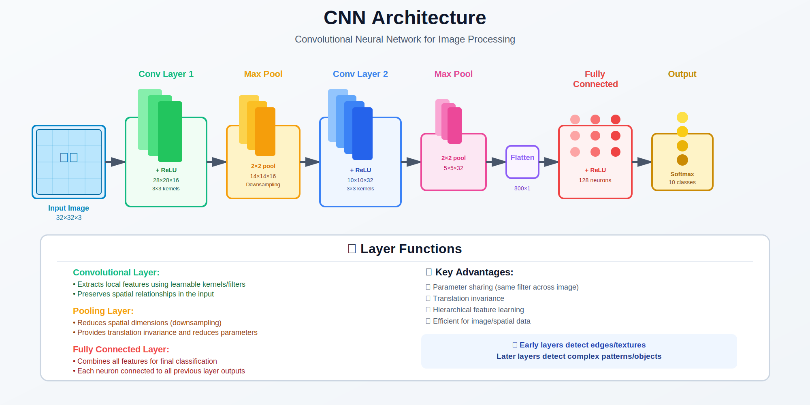

<!-- Animated Header -->
<p align="center">
  
</p>

<p align="center">
  
  
  
</p>


---

## 🎯 Visual Overview



*Caption: Complete CNN architecture showing input image flowing through convolutional layers (feature extraction), pooling layers (downsampling), and fully connected layers (classification). The diagram illustrates how spatial features are progressively extracted and transformed into class predictions. This architecture is the foundation for computer vision tasks.*

---

## 📐 Mathematical Foundations

### 1. Discrete Convolution: Definition

The 2D discrete convolution operation is defined as:

```math
(f * g)(i, j) = \sum_{m=-\infty}^{\infty} \sum_{n=-\infty}^{\infty} f(m, n) \cdot g(i-m, j-n)
```

In practice for images (cross-correlation, which deep learning calls "convolution"):

```math
\text{Output}[i,j] = \sum_{m=0}^{k_h-1} \sum_{n=0}^{k_w-1} \text{Input}[i+m, j+n] \cdot \text{Kernel}[m, n] + b
```

Where:
- $(k\_h, k\_w)$ = kernel height and width
- $b$ = bias term

### 2. Output Dimensions Formula

For input of size $(H\_{in}, W\_{in})$ with kernel size $k$, padding $p$, stride $s$, and dilation $d$:

```math
H_{out} = \left\lfloor \frac{H_{in} + 2p - d(k - 1) - 1}{s} + 1 \right\rfloor
```

**Proof:**
```
Available positions after padding: H_in + 2p
Effective kernel size with dilation: d(k-1) + 1
Remaining positions: H_in + 2p - d(k-1) - 1
Number of valid positions with stride s: floor((remaining)/s) + 1
```

**Common cases:**
| Configuration | Formula | Result |
|--------------|---------|--------|
| Same padding, stride=1 | $p = \frac{k-1}{2}$ | $H\_{out} = H\_{in}$ |
| Valid padding, stride=1 | $p = 0$ | $H\_{out} = H\_{in} - k + 1$ |
| Stride=2, no padding | $p = 0, s = 2$ | $H\_{out} \approx \frac{H\_{in}}{2}$ |

### 3. Parameter Count Analysis

For a convolutional layer with:
- $C\_{in}$ input channels
- $C\_{out}$ output channels (number of filters)
- Kernel size $(k\_h \times k\_w)$

```math
\text{Parameters} = C_{out} \times (C_{in} \times k_h \times k_w + 1)
```

The "+1" accounts for bias per filter.

**Example:**
```
Input: 3-channel RGB image
Conv layer: 64 filters of 3×3
Parameters = 64 × (3 × 3 × 3 + 1) = 64 × 28 = 1,792
```

### 4. Receptive Field Calculation

The receptive field (RF) of a neuron is the region of input it "sees":

```math
RF_l = RF_{l-1} + (k_l - 1) \times \prod_{i=1}^{l-1} s_i
```

Where:
- $RF\_l$ = receptive field at layer $l$
- $k\_l$ = kernel size at layer $l$
- $s\_i$ = stride at layer $i$

**Proof by Induction:**

Base case: $RF\_1 = k\_1$ (first layer sees kernel-sized region)

Inductive step: Each position at layer $l$ corresponds to $s\_{l-1}$ positions at layer $l-1$. Adding $(k\_l - 1)$ kernel elements, we get:

```math
RF_l = RF_{l-1} + (k_l - 1) \times \prod_{i=1}^{l-1} s_i
```

---

## 📊 Key Operations

| Operation | Purpose | Mathematical Form |
|-----------|---------|-------------------|
| **Convolution** | Local feature extraction | $y = x * w + b$ |
| **Max Pooling** | Downsampling, translation invariance | $y\_{ij} = \max\_{m,n \in \mathcal{R}\_{ij}} x\_{mn}$ |
| **Average Pooling** | Downsampling, smoother features | $y\_{ij} = \frac{1}{|\mathcal{R}\_{ij}|}\sum\_{m,n \in \mathcal{R}\_{ij}} x\_{mn}$ |
| **Stride** | Skip positions, reduce resolution | Increases step size in sliding window |
| **Padding** | Preserve spatial size | Add zeros around input border |

---

## 🔬 Properties and Proofs

### Property 1: Translation Equivariance

**Statement:** If input is shifted, output is shifted by the same amount.

```math
\text{If } x'(i,j) = x(i - \Delta_i, j - \Delta_j), \text{ then } y'(i,j) = y(i - \Delta_i, j - \Delta_j)
```

**Proof:**
```
y'(i,j) = Σ_m Σ_n x'(i+m, j+n) · w(m,n)
        = Σ_m Σ_n x(i+m-Δ_i, j+n-Δ_j) · w(m,n)
        = y(i-Δ_i, j-Δ_j)  ∎
```

### Property 2: Parameter Sharing

**Statement:** Same kernel applied at all spatial positions reduces parameters.

**Comparison:**
```
Fully connected (100×100 → 100×100): 10^8 parameters
Convolutional (3×3 kernel):          9 parameters

Reduction: 10^7 times fewer parameters!
```

### Property 3: Local Connectivity

**Statement:** Each output depends only on a local region of input.

This enables:
- Computational efficiency
- Spatial structure exploitation
- Hierarchical feature learning

---

## 📐 Backpropagation Through Convolution

### Forward Pass:

```math
y = x * w + b
```

### Backward Pass (Gradients):

**Gradient w.r.t. weights:**

```math
\frac{\partial L}{\partial w} = x * \frac{\partial L}{\partial y}
```

**Gradient w.r.t. input:**

```math
\frac{\partial L}{\partial x} = \frac{\partial L}{\partial y} *_{full} \text{rot}_{180}(w)
```

Where $*\_{full}$ denotes full convolution (with padding = k-1).

**Proof Sketch:**
```
For element w_{mn}:
∂L/∂w_{mn} = Σ_i Σ_j (∂L/∂y_{ij}) × (∂y_{ij}/∂w_{mn})
           = Σ_i Σ_j (∂L/∂y_{ij}) × x_{i+m, j+n}
           = (∂L/∂y) * x  (cross-correlation form)
```

---

## 🏗️ Famous Architectures

| Architecture | Year | Innovation | Key Math |
|--------------|------|------------|----------|
| **LeNet** | 1998 | First CNN | 5×5 kernels, subsampling |
| **AlexNet** | 2012 | Deep + GPU + ReLU | 11×11, 5×5, 3×3 kernels |
| **VGG** | 2014 | Very deep, 3×3 only | $2 \times 3^2 < 5^2$ |
| **ResNet** | 2015 | Skip connections | $y = F(x) + x$ |
| **EfficientNet** | 2019 | Compound scaling | $\alpha^\phi, \beta^\phi, \gamma^\phi$ |
| **ViT** | 2020 | Pure attention | Patches → Transformers |

### VGG Insight: Why 3×3 Kernels?

**Claim:** Two 3×3 convolutions = One 5×5 convolution (same RF)

**Proof:**
```
Parameters for 5×5: 5² = 25
Parameters for 2×(3×3): 2 × 3² = 18

Same receptive field: 3 + 2 = 5
But: 18 < 25 (fewer parameters)
Plus: 2 ReLUs vs 1 ReLU (more nonlinearity)
```

---

## 💻 Code Implementation

```python
import torch
import torch.nn as nn
import torch.nn.functional as F

class ConvBlock(nn.Module):
    """Convolution + BatchNorm + ReLU"""
    def __init__(self, in_channels, out_channels, kernel_size=3, stride=1, padding=1):
        super().__init__()
        self.conv = nn.Conv2d(in_channels, out_channels, kernel_size, stride, padding)
        self.bn = nn.BatchNorm2d(out_channels)
        self.relu = nn.ReLU(inplace=True)
    
    def forward(self, x):
        return self.relu(self.bn(self.conv(x)))

class SimpleCNN(nn.Module):
    """Simple CNN for image classification"""
    def __init__(self, num_classes=10):
        super().__init__()
        self.features = nn.Sequential(
            ConvBlock(3, 64),          # 3→64, maintain size
            nn.MaxPool2d(2),            # /2
            ConvBlock(64, 128),        # 64→128
            nn.MaxPool2d(2),            # /2
            ConvBlock(128, 256),       # 128→256
            nn.MaxPool2d(2),            # /2
            ConvBlock(256, 512),       # 256→512
            nn.AdaptiveAvgPool2d(1)    # Global average pool
        )
        self.classifier = nn.Linear(512, num_classes)
    
    def forward(self, x):
        x = self.features(x)
        x = x.view(x.size(0), -1)
        return self.classifier(x)

# Detailed convolution example
conv = nn.Conv2d(
    in_channels=3,      # RGB input
    out_channels=64,    # Number of filters
    kernel_size=3,      # 3×3 kernel
    stride=1,           # Step size
    padding=1,          # Same padding
    dilation=1,         # No dilation
    groups=1,           # Standard conv (not depthwise)
    bias=True
)

x = torch.randn(1, 3, 224, 224)  # (batch, channels, H, W)
y = conv(x)
print(f"Input shape: {x.shape}")
print(f"Output shape: {y.shape}")
print(f"Weight shape: {conv.weight.shape}")  # (64, 3, 3, 3)
print(f"Parameters: {sum(p.numel() for p in conv.parameters())}")  # 1,792
```

### Depthwise Separable Convolution (MobileNet)

```python
class DepthwiseSeparableConv(nn.Module):
    """
    Depthwise separable = Depthwise + Pointwise
    
    Standard conv: C_in × C_out × k² parameters
    Depthwise separable: C_in × k² + C_in × C_out parameters
    
    Reduction factor: k² × C_out / (k² + C_out) ≈ 8-9x for k=3, C_out=large
    """
    def __init__(self, in_channels, out_channels, kernel_size=3, stride=1, padding=1):
        super().__init__()
        # Depthwise: one filter per input channel
        self.depthwise = nn.Conv2d(
            in_channels, in_channels, kernel_size, 
            stride=stride, padding=padding, groups=in_channels
        )
        # Pointwise: 1×1 conv to combine channels
        self.pointwise = nn.Conv2d(in_channels, out_channels, 1)
    
    def forward(self, x):
        x = self.depthwise(x)
        x = self.pointwise(x)
        return x
```

---

## 🔗 Where This Topic Is Used

| Topic | How CNN Is Used |
|-------|-----------------|
| **ResNet** | Deep CNN with skip connections |
| **U-Net** | CNN encoder-decoder (diffusion, segmentation) |
| **YOLO** | CNN for object detection |
| **EfficientNet** | Scaled CNN architecture |
| **CLIP (image encoder)** | CNN or ViT for visual features |
| **Stable Diffusion** | U-Net backbone (CNN + attention) |
| **Face Recognition** | CNN for face embeddings |
| **Medical Imaging** | CNN for diagnosis |
| **Autonomous Driving** | CNN for perception |

### CNN Components Used In

| Component | Used By |
|-----------|---------|
| **Convolution** | All CNNs, U-Net in diffusion |
| **Pooling** | Downsampling in vision models |
| **ResNet blocks** | U-Net, backbone networks |
| **Depthwise Conv** | MobileNet, efficient models |

### Prerequisite For

```
CNN --> Object detection (YOLO, Faster R-CNN)
   --> Semantic segmentation (U-Net)
   --> Diffusion models (U-Net backbone)
   --> Vision encoders (CLIP)
   --> Medical image analysis
```

---

## 📚 References

| Type | Title | Link |
|------|-------|------|
| 📄 | AlexNet Paper | [NeurIPS 2012](https://papers.nips.cc/paper/2012/hash/c399862d3b9d6b76c8436e924a68c45b-Abstract.html) |
| 📄 | ResNet Paper | [arXiv](https://arxiv.org/abs/1512.03385) |
| 📄 | VGG Paper | [arXiv](https://arxiv.org/abs/1409.1556) |
| 📄 | MobileNet Paper | [arXiv](https://arxiv.org/abs/1704.04861) |
| 🎓 | Stanford CS231n | [Course](http://cs231n.stanford.edu/) |
| 🇨🇳 | CNN详解 | [知乎](https://zhuanlan.zhihu.com/p/25249694) |
| 🇨🇳 | 卷积神经网络原理 | [CSDN](https://blog.csdn.net/qq_37466121/article/details/88619088) |
| 🇨🇳 | CS231n中文 | [B站](https://www.bilibili.com/video/BV1nJ411z7fe) |

---

➡️ [Next: Diffusion](../02_diffusion/README.md)

---

⬅️ [Back: Architectures](../../README.md)

---

➡️ [Next: Diffusion](../02_diffusion/README.md)

---


<p align="center">
  
</p>
