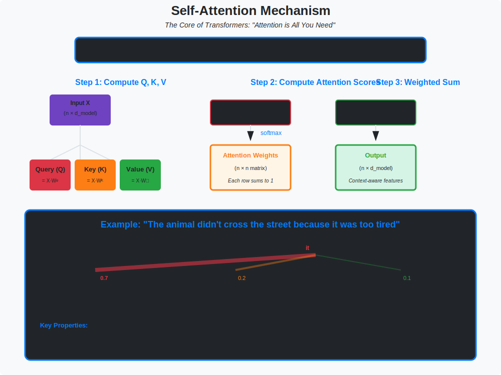

<!-- Animated Header -->
<p align="center">
  
</p>

<p align="center">
  
  
  
</p>


---

## 🎯 Visual Overview



*Caption: The self-attention mechanism computing Query-Key-Value (QKV) attention. Each token computes attention weights over all other tokens, enabling the model to capture long-range dependencies. This is the core innovation behind GPT, BERT, LLaMA, and all modern language models.*


---

## 🎯 The Architecture

```
+-------------------------------------------------------------+
|                         Transformer                          |
+-------------------------------------------------------------+
|                                                              |
|  Input: "The cat sat"    →    [Embed + Pos Encoding]        |
|                                       |                      |
|  +------------------------------------v----------------+    |
|  |              Transformer Block (× N)                 |    |
|  +-----------------------------------------------------+    |
|  |  +---------------------------------------------+    |    |
|  |  |         Multi-Head Self-Attention           |    |    |
|  |  +----------------------+----------------------+    |    |
|  |                         | + Residual                 |    |
|  |                   Layer Norm                         |    |
|  |                         |                            |    |
|  |  +----------------------v----------------------+    |    |
|  |  |            Feed-Forward Network              |    |    |
|  |  |         Linear → GELU → Linear               |    |    |
|  |  +----------------------+----------------------+    |    |
|  |                         | + Residual                 |    |
|  |                   Layer Norm                         |    |
|  +-------------------------+---------------------------+    |
|                            |                                 |
|                       [Output]                               |
|                                                              |
+-------------------------------------------------------------+
```

---

## 📐 MATHEMATICAL FOUNDATIONS

### 1. Self-Attention: Complete Derivation

**Problem:** Given input sequence $X \in \mathbb{R}^{n \times d}$, compute contextualized representations.

#### Step 1: Linear Projections

$$
Q = XW^Q, \quad K = XW^K, \quad V = XW^V
$$

Where:
- $W^Q \in \mathbb{R}^{d \times d\_k}$ (query projection)
- $W^K \in \mathbb{R}^{d \times d\_k}$ (key projection)
- $W^V \in \mathbb{R}^{d \times d\_v}$ (value projection)

**Interpretation:**
- $Q$: "What am I looking for?"
- $K$: "What do I contain?"
- $V$: "What information do I carry?"

#### Step 2: Compute Attention Scores

$$
S = QK^\top \in \mathbb{R}^{n \times n}
S_{ij} = \sum_{k=1}^{d_k} Q_{ik} \cdot K_{jk} = \langle q_i, k_j \rangle
$$

**Interpretation:** $S\_{ij}$ measures similarity between query at position $i$ and key at position $j$.

#### Step 3: Scaling

$$
\text{ScaledScores} = \frac{QK^\top}{\sqrt{d_k}}
$$

**Why scale by $\sqrt{d\_k}$?**

**Theorem:** If $q, k \sim \mathcal{N}(0, 1)$ are independent, then:

$$
\text{Var}(q \cdot k) = d_k
$$

**Proof:**
```
Let q = (q₁, ..., q_d) and k = (k₁, ..., k_d) with qᵢ, kᵢ ~ N(0,1)

E[qᵢkᵢ] = E[qᵢ]E[kᵢ] = 0
Var(qᵢkᵢ) = E[qᵢ²kᵢ²] - (E[qᵢkᵢ])² = E[qᵢ²]E[kᵢ²] = 1·1 = 1

q·k = Σᵢ qᵢkᵢ
Var(q·k) = Σᵢ Var(qᵢkᵢ) = d_k

Scaling by √d_k normalizes variance to 1.
```

**Without scaling:** Large $d\_k$ → large dot products → softmax saturates → near-binary attention.

#### Step 4: Softmax Normalization

$$
A = \text{softmax}\left(\frac{QK^\top}{\sqrt{d_k}}\right) \in \mathbb{R}^{n \times n}
A_{ij} = \frac{\exp(S_{ij}/\sqrt{d_k})}{\sum_{l=1}^n \exp(S_{il}/\sqrt{d_k})}
$$

**Properties:**
- $\sum\_j A\_{ij} = 1$ (rows sum to 1)
- $A\_{ij} \geq 0$ (non-negative)
- Interpretation: probability that token $i$ attends to token $j$

#### Step 5: Weighted Aggregation

$$
\text{Output} = AV \in \mathbb{R}^{n \times d_v}
\text{Output}_i = \sum_{j=1}^n A_{ij} \cdot V_j
$$

**Interpretation:** Each output is a weighted average of all values.

#### Complete Formula

$$
\boxed{\text{Attention}(Q, K, V) = \text{softmax}\left(\frac{QK^\top}{\sqrt{d_k}}\right) V}
$$

---

### 2. Multi-Head Attention

**Motivation:** Single attention may not capture all relationship types.

**Solution:** $H$ parallel attention heads:

$$
\text{MultiHead}(X) = \text{Concat}(\text{head}_1, ..., \text{head}_H) W^O
\text{head}_h = \text{Attention}(XW_h^Q, XW_h^K, XW_h^V)
$$

Where:
- $W\_h^Q, W\_h^K \in \mathbb{R}^{d \times d\_k}$ with $d\_k = d/H$
- $W\_h^V \in \mathbb{R}^{d \times d\_v}$ with $d\_v = d/H$
- $W^O \in \mathbb{R}^{Hd\_v \times d}$ (output projection)

**Parameter Count:**

$$
\text{Params} = 3 \cdot H \cdot d \cdot \frac{d}{H} + d^2 = 3d^2 + d^2 = 4d^2
$$

**Interpretation:** Different heads learn different relationship types:
- Head 1: Syntactic relationships
- Head 2: Semantic similarity
- Head 3: Coreference
- Head 4: Position-based patterns

---

### 3. Positional Encoding

**Problem:** Attention is permutation-equivariant!

$$
\text{Attention}(\pi(X)) = \pi(\text{Attention}(X))
$$

Where $\pi$ is any permutation. This means "dog bites man" = "man bites dog" without positions!

#### Sinusoidal Positional Encoding

$$
PE_{(pos, 2i)} = \sin\left(\frac{pos}{10000^{2i/d}}\right)
PE_{(pos, 2i+1)} = \cos\left(\frac{pos}{10000^{2i/d}}\right)
$$

**Why This Formula?**

**Property 1: Unique encoding for each position**

Each position $pos$ has a unique vector $PE(pos) \in \mathbb{R}^d$.

**Property 2: Relative position encoding**

**Theorem:** $PE(pos + k)$ is a linear function of $PE(pos)$.

**Proof:**
```
Using sin(α + β) = sin(α)cos(β) + cos(α)sin(β)
      cos(α + β) = cos(α)cos(β) - sin(α)sin(β)

PE(pos+k, 2i) = sin(ω_i(pos+k))
              = sin(ω_i·pos)cos(ω_i·k) + cos(ω_i·pos)sin(ω_i·k)
              = PE(pos,2i)·cos(ω_i·k) + PE(pos,2i+1)·sin(ω_i·k)

This is a linear combination with coefficients depending only on k!
```

**Implication:** Model can learn to attend to relative positions.

#### Modern Alternatives

| Method | Formula | Used In |
|--------|---------|---------|
| **Learned** | $PE = \text{Embedding}(pos)$ | BERT, GPT-2 |
| **RoPE** | Rotate Q, K by position | LLaMA, Mistral |
| **ALiBi** | $A\_{ij} \leftarrow A\_{ij} - m \cdot |i-j|$ | BLOOM, MPT |

---

### 4. Masked Self-Attention (Causal Attention)

**Problem:** In autoregressive generation, token $i$ should not see tokens $j > i$.

**Solution:** Add causal mask before softmax.

$$
\text{mask}_{ij} = \begin{cases}
0 & \text{if } j \leq i \\
-\infty & \text{if } j > i
\end{cases}
A = \text{softmax}\left(\frac{QK^\top}{\sqrt{d_k}} + \text{mask}\right)
$$

**Effect:** $\exp(-\infty) = 0$, so future tokens get zero attention weight.

---

### 5. Computational Complexity

**Time Complexity:**

| Operation | Complexity |
|-----------|------------|
| QKV projections | $O(nd^2)$ |
| Attention scores $QK^\top$ | $O(n^2d)$ |
| Softmax | $O(n^2)$ |
| Weighted sum $AV$ | $O(n^2d)$ |
| **Total** | $O(nd^2 + n^2d)$ |

**Space Complexity:**
- Attention matrix: $O(n^2)$
- Dominates for long sequences

**Bottleneck:** For $n > d$, the $O(n^2)$ term dominates → expensive for long sequences.

---

### 6. Gradient Flow Analysis

**Forward:**

$$
A = \text{softmax}(S), \quad O = AV
$$

**Backward (Gradient of softmax):**

For softmax row $a = \text{softmax}(s)$:

$$
\frac{\partial a_i}{\partial s_j} = a_i(\delta_{ij} - a_j)
$$

**Jacobian:**

$$
\frac{\partial a}{\partial s} = \text{diag}(a) - aa^\top
$$

**Gradient of attention output:**

$$
\frac{\partial L}{\partial V} = A^\top \frac{\partial L}{\partial O}
\frac{\partial L}{\partial A} = \frac{\partial L}{\partial O} V^\top
\frac{\partial L}{\partial S} = A \odot \left(\frac{\partial L}{\partial A} - \mathbf{1}\left(A \odot \frac{\partial L}{\partial A}\right)^\top\right)
\frac{\partial L}{\partial Q} = \frac{1}{\sqrt{d_k}} \frac{\partial L}{\partial S} K
\frac{\partial L}{\partial K} = \frac{1}{\sqrt{d_k}} \left(\frac{\partial L}{\partial S}\right)^\top Q
$$

---

### 7. Flash Attention: Memory-Efficient Attention

**Problem:** Standard attention stores $O(n^2)$ attention matrix.

**Key Insight:** Recompute attention during backward pass instead of storing.

**Algorithm (Tiled):**
```
for each block of Q:
    for each block of K, V:
        compute local attention in SRAM
        accumulate with online softmax
never materialize full n×n matrix
```

**Result:** $O(n)$ memory instead of $O(n^2)$.

---

## 💻 Complete Implementation

```python
import torch
import torch.nn as nn
import torch.nn.functional as F
import math

class ScaledDotProductAttention(nn.Module):
    """Implements Attention(Q, K, V) = softmax(QK^T / sqrt(d_k)) V"""
    
    def __init__(self, dropout=0.0):
        super().__init__()
        self.dropout = nn.Dropout(dropout)
    
    def forward(self, q, k, v, mask=None):
        """
        Args:
            q: (batch, n_heads, seq_len, d_k)
            k: (batch, n_heads, seq_len, d_k)
            v: (batch, n_heads, seq_len, d_v)
            mask: (batch, 1, 1, seq_len) or (batch, 1, seq_len, seq_len)
        """
        d_k = q.size(-1)
        
        # Attention scores: (batch, n_heads, seq_len, seq_len)
        scores = torch.matmul(q, k.transpose(-2, -1)) / math.sqrt(d_k)
        
        # Apply mask
        if mask is not None:
            scores = scores.masked_fill(mask == 0, float('-inf'))
        
        # Softmax + dropout
        attn = F.softmax(scores, dim=-1)
        attn = self.dropout(attn)
        
        # Weighted sum
        output = torch.matmul(attn, v)
        
        return output, attn

class MultiHeadAttention(nn.Module):
    """Multi-Head Self-Attention"""
    
    def __init__(self, d_model, n_heads, dropout=0.0):
        super().__init__()
        assert d_model % n_heads == 0
        
        self.d_model = d_model
        self.n_heads = n_heads
        self.d_k = d_model // n_heads
        
        # Combined projection for efficiency
        self.w_qkv = nn.Linear(d_model, 3 * d_model)
        self.w_o = nn.Linear(d_model, d_model)
        
        self.attention = ScaledDotProductAttention(dropout)
    
    def forward(self, x, mask=None):
        batch_size, seq_len, _ = x.shape
        
        # Project to Q, K, V
        qkv = self.w_qkv(x)  # (batch, seq, 3*d_model)
        qkv = qkv.view(batch_size, seq_len, 3, self.n_heads, self.d_k)
        qkv = qkv.permute(2, 0, 3, 1, 4)  # (3, batch, heads, seq, d_k)
        q, k, v = qkv[0], qkv[1], qkv[2]
        
        # Apply attention
        attn_output, attn_weights = self.attention(q, k, v, mask)
        
        # Reshape and project
        attn_output = attn_output.permute(0, 2, 1, 3).contiguous()
        attn_output = attn_output.view(batch_size, seq_len, self.d_model)
        output = self.w_o(attn_output)
        
        return output, attn_weights

class PositionalEncoding(nn.Module):
    """Sinusoidal Positional Encoding"""
    
    def __init__(self, d_model, max_len=5000, dropout=0.1):
        super().__init__()
        self.dropout = nn.Dropout(dropout)
        
        # Create positional encoding matrix
        pe = torch.zeros(max_len, d_model)
        position = torch.arange(0, max_len).unsqueeze(1).float()
        div_term = torch.exp(
            torch.arange(0, d_model, 2).float() * (-math.log(10000.0) / d_model)
        )
        
        pe[:, 0::2] = torch.sin(position * div_term)
        pe[:, 1::2] = torch.cos(position * div_term)
        
        self.register_buffer('pe', pe.unsqueeze(0))
    
    def forward(self, x):
        x = x + self.pe[:, :x.size(1)]
        return self.dropout(x)

class FeedForward(nn.Module):
    """Position-wise Feed-Forward Network"""
    
    def __init__(self, d_model, d_ff, dropout=0.1):
        super().__init__()
        self.w1 = nn.Linear(d_model, d_ff)
        self.w2 = nn.Linear(d_ff, d_model)
        self.dropout = nn.Dropout(dropout)
    
    def forward(self, x):
        return self.w2(self.dropout(F.gelu(self.w1(x))))

class TransformerBlock(nn.Module):
    """Single Transformer Block (Pre-LN version)"""
    
    def __init__(self, d_model, n_heads, d_ff, dropout=0.1):
        super().__init__()
        self.ln1 = nn.LayerNorm(d_model)
        self.attn = MultiHeadAttention(d_model, n_heads, dropout)
        self.ln2 = nn.LayerNorm(d_model)
        self.ff = FeedForward(d_model, d_ff, dropout)
        self.dropout = nn.Dropout(dropout)
    
    def forward(self, x, mask=None):

        # Pre-LN: LayerNorm before sublayer
        attn_out, _ = self.attn(self.ln1(x), mask)
        x = x + self.dropout(attn_out)
        x = x + self.dropout(self.ff(self.ln2(x)))
        return x

class Transformer(nn.Module):
    """Complete Transformer Model"""
    
    def __init__(
        self,
        vocab_size,
        d_model=512,
        n_heads=8,
        n_layers=6,
        d_ff=2048,
        max_len=512,
        dropout=0.1
    ):
        super().__init__()
        self.embedding = nn.Embedding(vocab_size, d_model)
        self.pos_encoding = PositionalEncoding(d_model, max_len, dropout)
        self.layers = nn.ModuleList([
            TransformerBlock(d_model, n_heads, d_ff, dropout)
            for _ in range(n_layers)
        ])
        self.ln_f = nn.LayerNorm(d_model)
        self.lm_head = nn.Linear(d_model, vocab_size, bias=False)
        
        # Weight tying
        self.lm_head.weight = self.embedding.weight
        
        self._init_weights()
    
    def _init_weights(self):
        for module in self.modules():
            if isinstance(module, nn.Linear):
                nn.init.normal_(module.weight, std=0.02)
                if module.bias is not None:
                    nn.init.zeros_(module.bias)
            elif isinstance(module, nn.Embedding):
                nn.init.normal_(module.weight, std=0.02)
    
    def forward(self, x, mask=None):

        # Create causal mask if not provided
        if mask is None:
            mask = self._create_causal_mask(x.size(1), x.device)
        
        x = self.embedding(x)
        x = self.pos_encoding(x)
        
        for layer in self.layers:
            x = layer(x, mask)
        
        x = self.ln_f(x)
        logits = self.lm_head(x)
        
        return logits
    
    def _create_causal_mask(self, seq_len, device):
        mask = torch.tril(torch.ones(seq_len, seq_len, device=device))
        return mask.unsqueeze(0).unsqueeze(0)  # (1, 1, seq, seq)

# Usage example
model = Transformer(
    vocab_size=50000,
    d_model=768,
    n_heads=12,
    n_layers=12,
    d_ff=3072
)

x = torch.randint(0, 50000, (2, 128))  # (batch=2, seq_len=128)
logits = model(x)
print(f"Output shape: {logits.shape}")  # (2, 128, 50000)
print(f"Parameters: {sum(p.numel() for p in model.parameters()):,}")
```

---

## 🌍 Models Using Transformers

| Model | Type | Parameters | Application |
|-------|------|------------|-------------|
| **GPT-4** | Decoder-only | ~1T? | Chat, reasoning |
| **LLaMA 3** | Decoder-only | 8B-405B | Open source LLM |
| **BERT** | Encoder-only | 110M-340M | NLU tasks |
| **T5** | Encoder-decoder | 60M-11B | Seq2seq |
| **ViT** | Encoder | 86M-632M | Vision |
| **Stable Diffusion** | Cross-attention | 1B | Image generation |

---

## 🔗 Where This Topic Is Used

| Topic | How Transformer Is Used |
|-------|------------------------|
| **GPT / LLaMA** | Decoder-only transformer |
| **BERT** | Encoder-only transformer |
| **T5** | Encoder-decoder transformer |
| **ViT** | Vision transformer (patches → tokens) |
| **Whisper** | Audio → text transformer |
| **CLIP** | Image + text transformers |
| **Stable Diffusion** | Cross-attention in U-Net |
| **DALL-E** | Text-to-image transformer |
| **Mixtral** | Transformer + MoE |
| **Flash Attention** | Optimized transformer attention |

---

## 📚 References

| Type | Title | Link |
|------|-------|------|
| 📄 | Attention Is All You Need | [arXiv](https://arxiv.org/abs/1706.03762) |
| 📄 | BERT | [arXiv](https://arxiv.org/abs/1810.04805) |
| 📄 | GPT-2 | [OpenAI](https://openai.com/research/better-language-models) |
| 📄 | Flash Attention | [arXiv](https://arxiv.org/abs/2205.14135) |
| 🎥 | Jay Alammar's Illustrated Transformer | [Blog](https://jalammar.github.io/illustrated-transformer/) |
| 🎥 | 3Blue1Brown on Attention | [YouTube](https://www.youtube.com/watch?v=eMlx5fFNoYc) |
| 🇨🇳 | Transformer详解 | [知乎](https://zhuanlan.zhihu.com/p/44121378) |
| 🇨🇳 | 注意力机制原理 | [CSDN](https://blog.csdn.net/qq_37466121/article/details/89599399) |

---

⬅️ [Back: RNN](../05_rnn/README.md)

---

⬅️ [Back: Architectures](../../README.md)

---


<p align="center">
  
</p>
