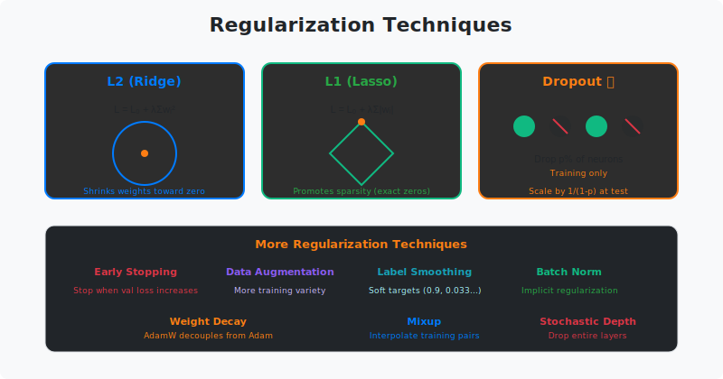

<!-- Animated Header -->
<p align="center">
  
</p>

<p align="center">
  
  
  
</p>


---

## 🎯 Visual Overview



*Caption: Regularization techniques prevent overfitting. L2 (Ridge) shrinks weights toward zero; L1 (Lasso) promotes sparsity; Dropout randomly zeros neurons during training. The goal: models that generalize to unseen data.*

---

## 📂 Overview

Regularization adds constraints or penalties to prevent models from fitting noise in training data. It's essential for achieving good generalization.

---

## 📐 Mathematical Foundations

### The Overfitting Problem

**Bias-Variance Decomposition:**

```math
\mathbb{E}[(y - \hat{f}(x))^2] = \underbrace{\text{Bias}^2(\hat{f})}_{\text{underfitting}} + \underbrace{\text{Var}(\hat{f})}_{\text{overfitting}} + \underbrace{\sigma^2}_{\text{irreducible}}
```

Regularization reduces variance at the cost of slightly increased bias.

---

## 🔬 L2 Regularization (Ridge / Weight Decay)

### Formulation

```math
L_{\text{total}} = L_{\text{data}} + \frac{\lambda}{2} \sum_i w_i^2 = L_{\text{data}} + \frac{\lambda}{2} \|w\|_2^2
```

**Gradient:**

```math
\frac{\partial L_{\text{total}}}{\partial w} = \frac{\partial L_{\text{data}}}{\partial w} + \lambda w
```

**Update Rule:**

```math
w_{t+1} = w_t - \alpha \left(\frac{\partial L_{\text{data}}}{\partial w} + \lambda w_t\right) = (1 - \alpha\lambda) w_t - \alpha \frac{\partial L_{\text{data}}}{\partial w}
```

**Interpretation:** Each step, weights shrink by factor $(1 - \alpha\lambda)$ — hence "weight decay."

### Bayesian Interpretation

**Theorem:** L2 regularization is equivalent to MAP estimation with Gaussian prior.

**Proof:**

```math
p(w|D) \propto p(D|w) \cdot p(w)
```

With Gaussian prior $p(w) = \mathcal{N}(0, \sigma^2 I)$:

```math
\log p(w|D) = \log p(D|w) - \frac{1}{2\sigma^2} \|w\|_2^2 + \text{const}
```

Maximizing this equals minimizing:

```math
L_{\text{data}} + \frac{1}{2\sigma^2} \|w\|_2^2
```

where $\lambda = 1/\sigma^2$. ∎

---

## 🔬 L1 Regularization (Lasso)

### Formulation

```math
L_{\text{total}} = L_{\text{data}} + \lambda \sum_i |w_i| = L_{\text{data}} + \lambda \|w\|_1
```

**Subgradient:**

```math
\frac{\partial L_{\text{total}}}{\partial w_i} = \frac{\partial L_{\text{data}}}{\partial w_i} + \lambda \cdot \text{sign}(w_i)
```

### Why L1 Creates Sparsity

**Key difference from L2:**
- L2: Push weights toward zero proportionally
- L1: Constant push toward zero regardless of magnitude

**Geometric intuition:**

L1 constraint region is a diamond (corners at axes).  
L2 constraint region is a sphere (no corners).

Optimal point more likely to hit corner in L1 → exact zeros.

**Proof (1D case):**

For $L = (y - wx)^2 + \lambda|w|$:

```math
\frac{\partial L}{\partial w} = -2x(y-wx) + \lambda \cdot \text{sign}(w)
```

Setting to zero:

```math
w^* = \text{sign}(w^*) \cdot \max\left(0, |yx| - \frac{\lambda}{2x^2}\right)
```

If $|yx| < \frac{\lambda}{2x^2}$, then $w^* = 0$ exactly. ∎

---

## 🔬 Dropout

### Algorithm

**Training:**
```
For each forward pass:
    mask ~ Bernoulli(1 - p)    # Keep with probability 1-p
    h = mask * h / (1 - p)      # Scale to maintain expectation
```

**Inference:**
```
h = h    # No dropout, no scaling (inverted dropout)
```

### Mathematical Analysis

**Expectation preservation:**

```math
\mathbb{E}[\text{dropout}(h)] = \mathbb{E}\left[\frac{m \odot h}{1-p}\right] = \frac{(1-p) h}{1-p} = h
```

### Why Dropout Works

**1. Prevents Co-adaptation:**
- Neurons cannot rely on specific other neurons
- Forces redundant representations

**2. Implicit Ensemble:**
- Each forward pass uses different "thinned" network
- Exponentially many sub-networks: $2^n$ for $n$ units
- At inference: geometric ensemble of all sub-networks

**3. Bayesian Interpretation:**

**Theorem (Gal & Ghahramani, 2016):** Dropout is approximate variational inference in Bayesian neural networks.

Training with dropout ≈ minimizing KL divergence between:
- Approximate posterior $q(W)$
- True posterior $p(W|D)$

### Dropout Variants

| Variant | Description | Use Case |
|---------|-------------|----------|
| **Standard** | Drop neurons | Dense layers |
| **Spatial** | Drop entire channels | CNNs |
| **DropConnect** | Drop weights | Alternative |
| **DropPath** | Drop entire layers | ResNets, ViT |
| **DropBlock** | Drop contiguous regions | Vision |

---

## 🔬 Early Stopping

### Algorithm

```python
best_val_loss = float('inf')
patience_counter = 0

for epoch in range(max_epochs):
    train_epoch()
    val_loss = evaluate()
    
    if val_loss < best_val_loss:
        best_val_loss = val_loss
        save_checkpoint()
        patience_counter = 0
    else:
        patience_counter += 1
        if patience_counter >= patience:
            break  # Stop training
```

### Theoretical Justification

**Theorem:** Early stopping is equivalent to L2 regularization for linear models.

For gradient descent on linear regression with learning rate $\alpha$:

```math
w_t = (I - (I - \alpha X^\top X)^t) w^*_{\text{OLS}}
```

This has similar effect to:

```math
w^*_{\lambda} = (X^\top X + \lambda I)^{-1} X^\top y
```

where $\lambda$ is determined by number of iterations $t$.

---

## 🔬 Label Smoothing

### Formulation

Instead of one-hot labels:

```math
y_{\text{hard}} = [0, 0, 1, 0, 0]
```

Use smoothed labels:

```math
y_{\text{smooth}} = (1-\epsilon) \cdot y_{\text{hard}} + \frac{\epsilon}{K}
```

For $\epsilon = 0.1$, $K = 5$:

```math
y_{\text{smooth}} = [0.02, 0.02, 0.92, 0.02, 0.02]
```

### Why It Helps

1. **Prevents overconfidence:** Model doesn't try to output probability 1
2. **Softens gradients:** Reduces magnitude of gradients near convergence
3. **Improves calibration:** Better probability estimates

---

## 💻 Implementation

```python
import torch
import torch.nn as nn
import torch.nn.functional as F

# ============== L2 Regularization (Weight Decay) ==============
# Most common: use weight_decay in optimizer
optimizer = torch.optim.AdamW(model.parameters(), lr=1e-3, weight_decay=0.01)

# Manual L2 regularization
def l2_loss(model, lambda_l2=0.01):
    l2_reg = sum(p.pow(2).sum() for p in model.parameters())
    return lambda_l2 * l2_reg

# In training loop:
loss = criterion(output, target) + l2_loss(model)

# ============== L1 Regularization ==============
def l1_loss(model, lambda_l1=0.001):
    l1_reg = sum(p.abs().sum() for p in model.parameters())
    return lambda_l1 * l1_reg

# Elastic Net (L1 + L2)
def elastic_net_loss(model, lambda_l1=0.001, lambda_l2=0.01):
    l1 = sum(p.abs().sum() for p in model.parameters())
    l2 = sum(p.pow(2).sum() for p in model.parameters())
    return lambda_l1 * l1 + lambda_l2 * l2

# ============== Dropout ==============
class MLPWithDropout(nn.Module):
    def __init__(self, d_in, d_hidden, d_out, dropout_p=0.1):
        super().__init__()
        self.fc1 = nn.Linear(d_in, d_hidden)
        self.fc2 = nn.Linear(d_hidden, d_out)
        self.dropout = nn.Dropout(dropout_p)
    
    def forward(self, x):
        x = F.relu(self.fc1(x))
        x = self.dropout(x)  # Apply dropout after activation
        x = self.fc2(x)
        return x

# ============== Spatial Dropout for CNNs ==============
class SpatialDropout2d(nn.Module):
    """Drops entire channels instead of individual pixels"""
    def __init__(self, p=0.1):
        super().__init__()
        self.dropout = nn.Dropout2d(p)
    
    def forward(self, x):
        return self.dropout(x)

# ============== DropPath (Stochastic Depth) ==============
class DropPath(nn.Module):
    """Drop entire residual path with probability p"""
    def __init__(self, p=0.0):
        super().__init__()
        self.p = p
    
    def forward(self, x):
        if not self.training or self.p == 0:
            return x
        
        keep_prob = 1 - self.p

        # Random tensor shape: (batch, 1, 1, 1, ...) for broadcasting
        shape = (x.shape[0],) + (1,) * (x.ndim - 1)
        random_tensor = keep_prob + torch.rand(shape, device=x.device)
        random_tensor = random_tensor.floor()  # Binarize
        return x / keep_prob * random_tensor

# ============== Label Smoothing ==============
class LabelSmoothingCrossEntropy(nn.Module):
    def __init__(self, smoothing=0.1):
        super().__init__()
        self.smoothing = smoothing
    
    def forward(self, pred, target):
        n_classes = pred.size(-1)
        log_probs = F.log_softmax(pred, dim=-1)
        
        # Smooth one-hot targets
        with torch.no_grad():
            smooth_targets = torch.zeros_like(log_probs)
            smooth_targets.fill_(self.smoothing / (n_classes - 1))
            smooth_targets.scatter_(1, target.unsqueeze(1), 1 - self.smoothing)
        
        return -(smooth_targets * log_probs).sum(dim=-1).mean()

# Or use PyTorch built-in:
loss_fn = nn.CrossEntropyLoss(label_smoothing=0.1)

# ============== Early Stopping ==============
class EarlyStopping:
    def __init__(self, patience=7, min_delta=0):
        self.patience = patience
        self.min_delta = min_delta
        self.counter = 0
        self.best_loss = None
        self.early_stop = False
    
    def __call__(self, val_loss, model, path='checkpoint.pt'):
        if self.best_loss is None:
            self.best_loss = val_loss
            torch.save(model.state_dict(), path)
        elif val_loss > self.best_loss - self.min_delta:
            self.counter += 1
            if self.counter >= self.patience:
                self.early_stop = True
        else:
            self.best_loss = val_loss
            torch.save(model.state_dict(), path)
            self.counter = 0

# ============== Data Augmentation (Regularization for Vision) ==============
from torchvision import transforms

train_transform = transforms.Compose([
    transforms.RandomHorizontalFlip(p=0.5),
    transforms.RandomRotation(10),
    transforms.RandomResizedCrop(224, scale=(0.8, 1.0)),
    transforms.ColorJitter(brightness=0.2, contrast=0.2),
    transforms.ToTensor(),
    transforms.Normalize(mean=[0.485, 0.456, 0.406], 
                        std=[0.229, 0.224, 0.225])
])
```

---

## 📊 When to Use What

| Technique | When to Use | Strength |
|-----------|-------------|----------|
| **L2 / Weight Decay** | Always (default) | Shrinks all weights |
| **L1** | When sparsity desired | Feature selection |
| **Dropout** | Large networks, limited data | Prevents co-adaptation |
| **Early Stopping** | Always (monitor val loss) | Free regularization |
| **Data Augmentation** | Vision tasks | Domain knowledge |
| **Label Smoothing** | Classification, calibration | Reduces overconfidence |
| **DropPath** | Very deep models (ViT, ResNet) | Scales with depth |

---

## 🔗 Where This Topic Is Used

| Technique | Application |
|-----------|------------|
| **Dropout** | Transformers (after attention, after FFN) |
| **Weight Decay** | All models (AdamW) |
| **Label Smoothing** | Classification (especially with CE loss) |
| **DropPath** | ViT, DeiT, ResNets |
| **Data Augmentation** | CNNs, vision models |
| **Early Stopping** | All training pipelines |

---

## 📚 References

| Type | Title | Link |
|------|-------|------|
| 📄 | Dropout Paper | [JMLR](https://jmlr.org/papers/v15/srivastava14a.html) |
| 📄 | DropPath / Stochastic Depth | [arXiv](https://arxiv.org/abs/1603.09382) |
| 📄 | Label Smoothing (Rethinking ImageNet) | [arXiv](https://arxiv.org/abs/1906.02629) |
| 📄 | L1/L2 Regularization | [ESL Ch. 3](https://hastie.su.domains/ElemStatLearn/) |
| 📄 | Dropout as Bayesian | [arXiv](https://arxiv.org/abs/1506.02142) |
| 📖 | PyTorch Weight Decay | [Docs](https://pytorch.org/docs/stable/optim.html) |
| 🇨🇳 | 正则化详解 | [知乎](https://zhuanlan.zhihu.com/p/29360425) |
| 🇨🇳 | Dropout原理 | [CSDN](https://blog.csdn.net/qq_37466121/article/details/88619088) |
| 🇨🇳 | 防止过拟合方法 | [B站](https://www.bilibili.com/video/BV164411b7dx) |

---

⬅️ [Back: Optimizers](../02_optimizers/README.md) | ➡️ [Next: Scheduling](../04_scheduling/README.md)

---

⬅️ [Back: Training](../../README.md)

---


<p align="center">
  
</p>
