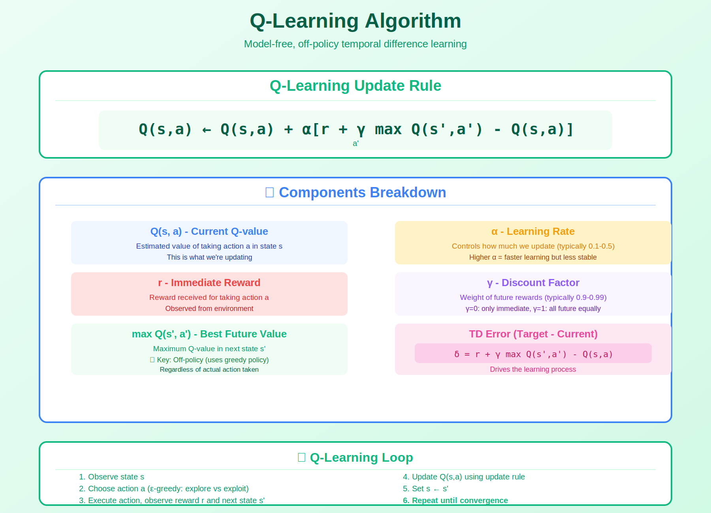

<!-- Animated Header -->
<p align="center">
  
</p>

<p align="center">
  
  
  
</p>


---

## 🎯 Visual Overview



*Caption: Q-Learning maintains a Q-table of state-action values and updates them using the TD error. The key insight is using max Q(s',a') - this makes it off-policy, learning Q* regardless of the behavior policy. DQN extends this with neural networks.*

---

## 📐 Mathematical Foundation

### Q-Function Definition

```
Q(s, a) = E[Σₜ₌₀^∞ γᵗ rₜ | s₀ = s, a₀ = a, π]

The expected discounted return starting from state s,
taking action a, then following policy π
```

### Bellman Optimality Equation

```
Q*(s, a) = E[r + γ max_a' Q*(s', a') | s, a]

The optimal Q-function satisfies this recursive equation
```

### Q-Learning Update Rule

```
Q(s, a) ← Q(s, a) + α [r + γ max_a' Q(s', a') - Q(s, a)]
                      +------- TD Target ------+
                      +----------- TD Error -------------+

α: Learning rate
γ: Discount factor
r: Immediate reward
s': Next state
```

---

## 📐 Algorithm

```
Initialize Q(s,a) arbitrarily (e.g., zeros)
For each episode:
    s ← initial state
    While not terminal:
        a ← ε-greedy(Q, s)  # Exploration
        Take action a, observe r, s'
        
        # Q-Learning update (off-policy!)
        Q(s,a) ← Q(s,a) + α[r + γ max_a' Q(s',a') - Q(s,a)]
        
        s ← s'
```

---

## 🔑 Key Properties

| Property | Description |
|----------|-------------|
| **Off-policy** | Learns Q* regardless of behavior policy (uses max) |
| **Model-free** | No need for transition probabilities P(s'\|s,a) |
| **Convergence** | Converges to Q* with sufficient exploration |
| **Tabular** | Works for discrete state/action spaces |

### Off-Policy vs On-Policy

```
Q-Learning (Off-policy):
    Uses max_a' Q(s',a')  ← Always greedy target

SARSA (On-policy):
    Uses Q(s', a')        ← Uses actual next action
    
Q-Learning learns optimal policy even with random exploration!
```

---

## 📊 Convergence Conditions

```
Q-Learning converges to Q* if:

1. All state-action pairs visited infinitely often
2. Learning rate satisfies:
   Σₜ αₜ = ∞   and   Σₜ αₜ² < ∞
   (e.g., αₜ = 1/t works)

3. Stochastic approximation conditions hold
```

---

## 💻 Code

### Basic Q-Learning

```python
import numpy as np

def q_learning(env, num_episodes, alpha=0.1, gamma=0.99, epsilon=0.1):
    """
    Tabular Q-Learning implementation
    """
    Q = np.zeros((env.observation_space.n, env.action_space.n))
    
    for episode in range(num_episodes):
        state = env.reset()
        done = False
        
        while not done:
            # ε-greedy action selection
            if np.random.random() < epsilon:
                action = env.action_space.sample()  # Explore
            else:
                action = np.argmax(Q[state])  # Exploit
            
            # Take action, observe outcome
            next_state, reward, done, _ = env.step(action)
            
            # Q-Learning update (KEY: max over next actions)
            td_target = reward + gamma * np.max(Q[next_state]) * (1 - done)
            td_error = td_target - Q[state, action]
            Q[state, action] += alpha * td_error
            
            state = next_state
    
    return Q
```

### Single Update Step

```python
def q_learning_step(Q, s, a, r, s_next, done, alpha=0.1, gamma=0.99):
    """One Q-learning update"""
    if done:
        td_target = r
    else:
        td_target = r + gamma * np.max(Q[s_next])
    
    td_error = td_target - Q[s, a]
    Q[s, a] += alpha * td_error
    return Q
```

---

## 🔗 Extensions to Q-Learning

| Extension | Key Idea | When to Use |
|-----------|----------|-------------|
| **DQN** | Q(s,a;θ) neural network | Large/continuous states |
| **Double DQN** | Separate target network | Reduce overestimation |
| **Dueling DQN** | V(s) + A(s,a) split | State value important |
| **Rainbow** | Combine all improvements | Best performance |

### DQN Architecture

```
State s --> [Neural Network θ] --> Q(s, a₁), Q(s, a₂), ..., Q(s, aₙ)

Loss = (r + γ max_a' Q(s', a'; θ⁻) - Q(s, a; θ))²
                    +--- Target network (frozen) ---+
```

---

## ⚠️ Common Issues

| Issue | Cause | Solution |
|-------|-------|----------|
| **Overestimation** | max operator bias | Double Q-Learning |
| **No convergence** | Insufficient exploration | Decay ε slowly |
| **Slow learning** | Low learning rate | Tune α |
| **Large state space** | Tabular doesn't scale | Use function approximation |

---

## 📚 References

| Type | Title | Link |
|------|-------|------|
| 📄 | Original Q-Learning Paper | [Watkins 1989](https://link.springer.com/article/10.1007/BF00992698) |
| 📄 | DQN Paper | [Mnih et al. 2015](https://www.nature.com/articles/nature14236) |
| 📖 | Sutton & Barto Ch. 6 | [RL Book](http://incompleteideas.net/book/) |
| 🎥 | David Silver RL Lecture 5 | [YouTube](https://www.youtube.com/watch?v=0g4j2k_Ggc4) |
| 🇨🇳 | Q-Learning算法详解 | [知乎](https://zhuanlan.zhihu.com/p/26052182) |
| 🇨🇳 | 强化学习之Q-Learning | [CSDN](https://blog.csdn.net/qq_30615903/article/details/80739243) |
| 🇨🇳 | Q-Learning原理与实践 | [B站](https://www.bilibili.com/video/BV1yp4y1s7Qw) |
| 🇨🇳 | DQN论文解读 | [机器之心](https://www.jiqizhixin.com/articles/2018-04-17-3)


## 🔗 Where This Topic Is Used

| Application | Q-Learning |
|-------------|-----------|
| **Atari Games** | DQN foundation |
| **Robotics** | Action-value for control |
| **Trading** | Optimal action selection |
| **Navigation** | Path planning |

---

⬅️ [Back: Value Methods](../)

---

⬅️ [Back: Dynamic Programming](../dynamic-programming/) | ➡️ [Next: Td Learning](../td-learning/)

---

---


<p align="center">
  
</p>
