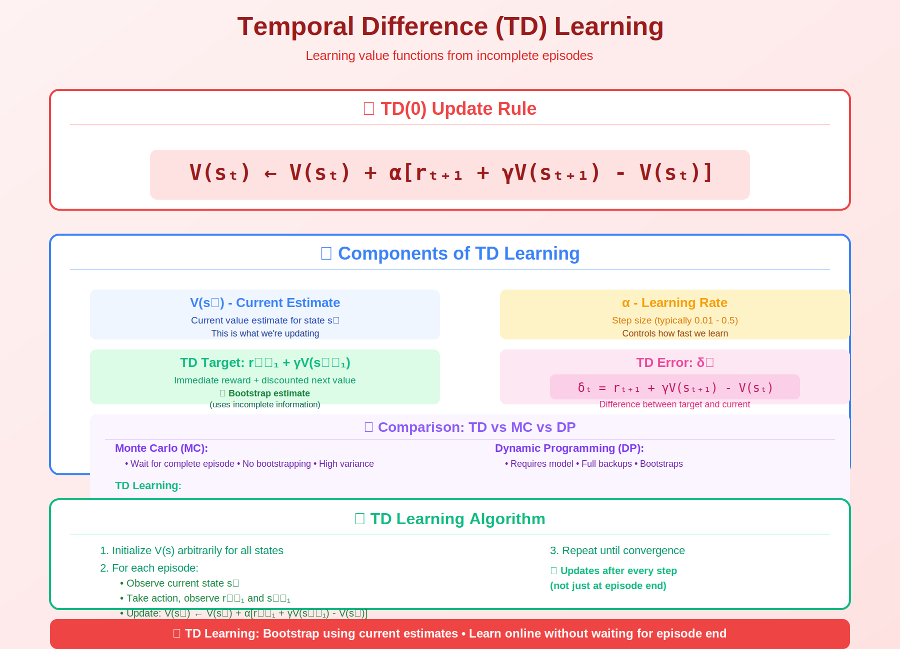

<!-- Animated Header -->
<p align="center">
  
</p>

<p align="center">
  
  
  
</p>


---

## 🎯 Visual Overview



*Caption: TD learning combines the best of Monte Carlo (sample-based) and Dynamic Programming (bootstrapping). Instead of waiting for episode end, TD updates values after each step using estimated future values.*

---

## 📂 Overview

TD learning is a model-free method that learns directly from experience. It updates value estimates based on other estimates (bootstrapping), enabling online learning without waiting for episode termination.

---

## 📐 Mathematical Foundation

### TD(0) Update Rule

```
V(sₜ) ← V(sₜ) + α [rₜ₊₁ + γV(sₜ₊₁) - V(sₜ)]
              +--------------------------------+
                         TD Error (δₜ)

Where:
    α: Learning rate
    γ: Discount factor
    rₜ₊₁: Reward received after action
    V(sₜ₊₁): Estimated value of next state (bootstrap!)
```

### TD Error (δ)

```
δₜ = rₜ₊₁ + γV(sₜ₊₁) - V(sₜ)
     +------- TD Target ---+   +-- Current Estimate

δ > 0: Better than expected → increase V(sₜ)
δ < 0: Worse than expected  → decrease V(sₜ)
δ = 0: Exactly as expected  → no change
```

### TD(λ) - Eligibility Traces

```
TD(λ) interpolates between TD(0) and Monte Carlo:

λ = 0: TD(0), one-step bootstrap
λ = 1: Monte Carlo, full returns
0 < λ < 1: Multi-step weighted average

Update with eligibility trace e(s):
    δₜ = rₜ₊₁ + γV(sₜ₊₁) - V(sₜ)
    e(sₜ) ← γλ e(sₜ) + 1
    V(s) ← V(s) + α δₜ e(s)  for all s
```

---

## 📊 TD vs Monte Carlo vs DP

| Method | Update When | Uses Model? | Bootstraps? |
|--------|-------------|-------------|-------------|
| **TD** | Every step | No | Yes |
| **Monte Carlo** | Episode end | No | No |
| **Dynamic Programming** | Sweep | Yes (P) | Yes |

### Bias-Variance Tradeoff

```
Monte Carlo:
    Target = G = rₜ₊₁ + γrₜ₊₂ + γ²rₜ₊₃ + ...
    Unbiased but high variance (many random steps)

TD(0):
    Target = rₜ₊₁ + γV(sₜ₊₁)
    Biased (if V wrong) but low variance (one random step)
```

---

## 🔑 Key Concepts

| Concept | Description |
|---------|-------------|
| **TD(0)** | One-step lookahead: V(s) ← V(s) + α[r + γV(s') - V(s)] |
| **TD Error (δ)** | δ = r + γV(s') - V(s), measures surprise |
| **Bootstrapping** | Use estimated values to update estimates |
| **Online Learning** | Update after every step, no episode wait |
| **Eligibility Traces** | TD(λ) combines multiple time scales |

---

## 📐 TD for Control: SARSA

```
SARSA: State-Action-Reward-State-Action (On-policy)

Q(s, a) ← Q(s, a) + α [r + γQ(s', a') - Q(s, a)]
                               +--------------------+
                                Uses actual next action!

Algorithm:
    Initialize Q(s,a)
    For each episode:
        s ← initial state
        a ← ε-greedy(Q, s)
        While not terminal:
            Take action a, observe r, s'
            a' ← ε-greedy(Q, s')  ← Choose next action
            Q(s,a) ← Q(s,a) + α[r + γQ(s',a') - Q(s,a)]
            s ← s', a ← a'
```

---

## 💻 Code Examples

### TD(0) Value Estimation

```python
import numpy as np

def td_zero(env, policy, num_episodes, alpha=0.1, gamma=0.99):
    """
    TD(0) for estimating V^π
    """
    V = np.zeros(env.observation_space.n)
    
    for _ in range(num_episodes):
        state = env.reset()
        done = False
        
        while not done:
            action = policy(state)
            next_state, reward, done, _ = env.step(action)
            
            # TD(0) update
            td_target = reward + gamma * V[next_state] * (1 - done)
            td_error = td_target - V[state]
            V[state] += alpha * td_error
            
            state = next_state
    
    return V
```

### TD Update Step

```python
def td_update(V, s, r, s_next, done, alpha=0.1, gamma=0.99):
    """Single TD(0) update"""
    if done:
        td_target = r
    else:
        td_target = r + gamma * V[s_next]
    
    td_error = td_target - V[s]
    V[s] += alpha * td_error
    
    return V, td_error
```

### SARSA (On-policy TD Control)

```python
def sarsa(env, num_episodes, alpha=0.1, gamma=0.99, epsilon=0.1):
    """
    SARSA: On-policy TD control
    """
    Q = np.zeros((env.observation_space.n, env.action_space.n))
    
    def epsilon_greedy(state):
        if np.random.random() < epsilon:
            return env.action_space.sample()
        return np.argmax(Q[state])
    
    for _ in range(num_episodes):
        state = env.reset()
        action = epsilon_greedy(state)
        done = False
        
        while not done:
            next_state, reward, done, _ = env.step(action)
            next_action = epsilon_greedy(next_state)  # Key: choose next action
            
            # SARSA update
            td_target = reward + gamma * Q[next_state, next_action] * (1 - done)
            Q[state, action] += alpha * (td_target - Q[state, action])
            
            state, action = next_state, next_action
    
    return Q
```

### TD(λ) with Eligibility Traces

```python
def td_lambda(env, policy, num_episodes, alpha=0.1, gamma=0.99, lam=0.9):
    """
    TD(λ) with eligibility traces
    """
    n_states = env.observation_space.n
    V = np.zeros(n_states)
    
    for _ in range(num_episodes):
        state = env.reset()
        e = np.zeros(n_states)  # Eligibility traces
        done = False
        
        while not done:
            action = policy(state)
            next_state, reward, done, _ = env.step(action)
            
            # TD error
            td_error = reward + gamma * V[next_state] * (1-done) - V[state]
            
            # Update eligibility trace
            e[state] += 1  # Accumulating trace
            
            # Update all states
            V += alpha * td_error * e
            
            # Decay traces
            e *= gamma * lam
            
            state = next_state
    
    return V
```

---

## 📊 Convergence Properties

```
TD(0) converges to true V^π if:
1. Policy is fixed
2. Step size satisfies: Σₜ αₜ = ∞, Σₜ αₜ² < ∞
3. All states visited infinitely often

In practice: α = 0.01 to 0.1 works well
```

---

## 🔗 Connection to Other Methods

```
TD Learning
    |
    +-- TD(0) ----------> SARSA (on-policy control)
    |                    
    |                    ╭--> Q-Learning (off-policy)
    +-- Q-values --------+
    |                    ╰--> DQN (neural network)
    |
    +-- TD(λ) ----------> Multi-step returns
                         +-- n-step TD
                         +-- GAE (PPO/A3C)
```

---

## 📚 References

| Type | Title | Link |
|------|-------|------|
| 📖 | Sutton & Barto Ch. 6-7 | [RL Book](http://incompleteideas.net/book/) |
| 📖 | Q-Learning | [../q-learning/](../q-learning/) |
| 📖 | DQN | [../dqn/](../dqn/) |
| 🎥 | David Silver Lecture 4 | [YouTube](https://www.youtube.com/watch?v=PnHCvfgC_ZA) |
| 🇨🇳 | TD学习算法详解 | [知乎](https://zhuanlan.zhihu.com/p/28084942) |
| 🇨🇳 | SARSA与Q-Learning对比 | [CSDN](https://blog.csdn.net/qq_30615903/article/details/80739243) |
| 🇨🇳 | 强化学习-时序差分 | [B站](https://www.bilibili.com/video/BV1sd4y167NS) |
| 🇨🇳 | TD(λ)与资格迹 | [机器之心](https://www.jiqizhixin.com/articles/2018-02-27-5)


## 🔗 Where This Topic Is Used

| Application | TD Learning |
|-------------|------------|
| **Online Learning** | Update after each step |
| **Eligibility Traces** | TD(λ) for credit assignment |
| **Actor-Critic** | TD error for advantage |
| **Game Playing** | TD-Gammon success story |

---

⬅️ [Back: Value Methods](../)

---

⬅️ [Back: Q Learning](../q-learning/)

---

---


<p align="center">
  
</p>
