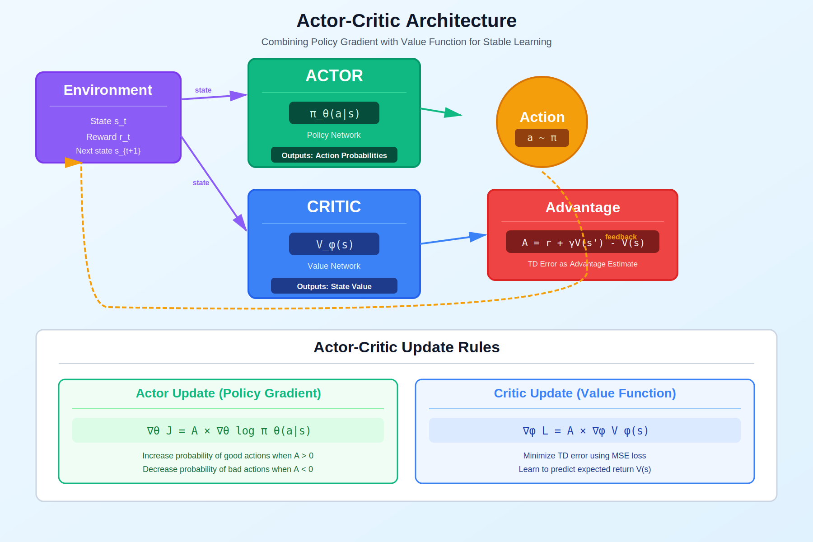

# Actor-Critic Methods

> **Combine policy gradient with value function for lower variance**

---

## 🎯 Visual Overview



*Caption: Actor-Critic uses two networks: the Actor (policy) decides actions, while the Critic (value function) evaluates states. The advantage A = r + γV(s') - V(s) tells the actor which actions are better than average.*

---

## 📂 Overview

Actor-Critic methods combine the benefits of policy gradient (Actor) with value function estimation (Critic). The critic provides a baseline that dramatically reduces variance.

---

## 🔑 Key Components

| Component | Role |
|-----------|------|
| **Actor** | Policy network π_θ(a\|s) |
| **Critic** | Value network V_φ(s) |
| **Advantage** | A = r + γV(s') - V(s) |
| **TD Error** | Used as advantage estimate |

---

## 📐 Update Rules

```
Actor (policy gradient with advantage):
∇_θ J = 𝔼[A · ∇_θ log π_θ(a|s)]

Critic (minimize TD error):
L_critic = (r + γV(s') - V(s))²

Advantage reduces variance without adding bias!
```

---

## 🌍 Popular Variants

| Algorithm | Innovation |
|-----------|------------|
| **A2C** | Synchronous actor-critic |
| **A3C** | Asynchronous parallel actors |
| **GAE** | Generalized advantage estimation |
| **PPO** | Clipped objective, stable |
| **SAC** | Entropy regularization |

---

## 💻 Code

```python
class ActorCritic(nn.Module):
    def __init__(self, state_dim, action_dim):
        super().__init__()
        # Shared backbone
        self.backbone = nn.Sequential(nn.Linear(state_dim, 128), nn.ReLU())
        self.actor = nn.Linear(128, action_dim)  # Policy head
        self.critic = nn.Linear(128, 1)          # Value head
    
    def forward(self, x):
        features = self.backbone(x)
        action_probs = F.softmax(self.actor(features), dim=-1)
        value = self.critic(features)
        return action_probs, value

def compute_advantage(rewards, values, gamma=0.99):
    """TD(0) advantage: A = r + γV(s') - V(s)"""
    returns = rewards + gamma * values[1:]
    advantages = returns - values[:-1]
    return advantages
```

---

## 📚 References

| Type | Title | Link |
|------|-------|------|
| 📄 | A3C Paper | [arXiv](https://arxiv.org/abs/1602.01783) |
| 📄 | SAC Paper | [arXiv](https://arxiv.org/abs/1801.01290) |
| 📖 | Sutton & Barto Ch. 13 | [RL Book](http://incompleteideas.net/book/) |
| 🇨🇳 | Actor-Critic详解 | [知乎](https://zhuanlan.zhihu.com/p/26174099) |
| 🇨🇳 | A2C/A3C实现 | [CSDN](https://blog.csdn.net/qq_30615903/article/details/81275638) |
| 🇨🇳 | 强化学习AC方法 | [B站](https://www.bilibili.com/video/BV1sd4y167NS) |


## 🔗 Where This Topic Is Used

| Application | Actor-Critic |
|-------------|-------------|
| **A3C/A2C** | Parallel training |
| **PPO** | Clipped actor-critic |
| **SAC** | Soft actor-critic |
| **Robotics** | Continuous control |

---

⬅️ [Back: Policy Methods](../)

---

➡️ [Next: Policy Gradient](../policy-gradient/)
