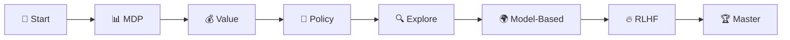
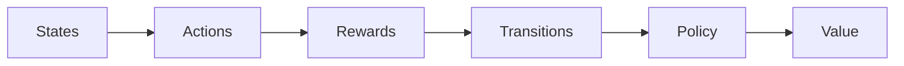
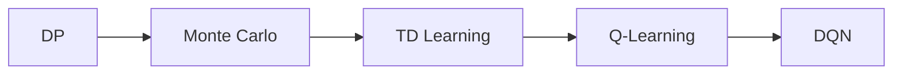
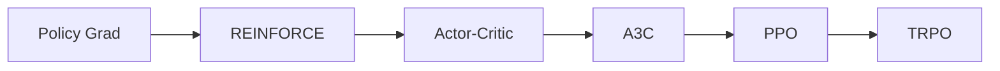
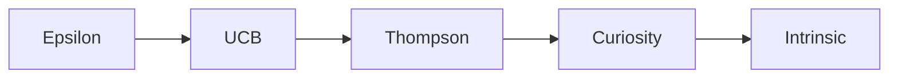
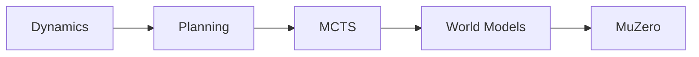
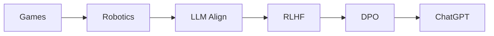
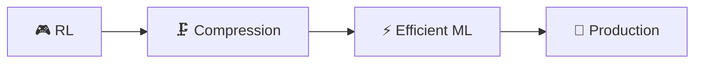

  

  
  
  

  
  

---

**✍️ Author:** [Gaurav Goswami](https://github.com/Gaurav14cs17) • **📅 Updated:** December 2024

---

## 📊 Learning Path

## 🎯 What You'll Learn

> 💡 How agents learn through **interaction with environments** - powers ChatGPT alignment!

<table>
<tr>
<td align="center">

### 💰 Value Methods
Q-Learning, DQN

</td>
<td align="center">

### 🎯 Policy Methods
PPO (Default!)

</td>
<td align="center">

### 🔥 RLHF
ChatGPT's secret

</td>
</tr>
</table>

---

## 📚 Topics

### 1️⃣ Markov Decision Process

**Foundation:** States, Actions, Rewards, Bellman Equations

---

### 2️⃣ Value-Based Methods

**Core:** TD Learning, Q-Learning, SARSA, Deep Q-Network (Atari!)

---

### 3️⃣ Policy-Based Methods ⭐

 

> ⭐ **PPO is the default algorithm** - powers robotics and RLHF

---

### 4️⃣ Exploration Strategies

---

### 5️⃣ Model-Based RL

**Core:** Planning, Monte Carlo Tree Search (AlphaGo!)

---

### 6️⃣ Applications & RLHF 🔥🔥🔥

 

> 🔥 **RLHF powers ChatGPT** - Aligns AI with human values

| Technique | Used In |
|:---------:|---------|
| RLHF | ChatGPT, Claude |
| DPO | Faster alternative |
| PPO | Training backbone |

---

## 🔗 Next Steps

  
  

---

## 📚 Key Resources

| Type | Resource | Link |
|:----:|----------|------|
| 📘 | RL: An Introduction | Sutton & Barto |
| 🎓 | David Silver RL Course | DeepMind |
| 🎓 | Berkeley CS285 | Deep RL |

---

## 🗺️ Quick Navigation

| Previous | Current | Next |
|:--------:|:-------:|:----:|
| [🧬 Deep Learning](../06-deep-learning/README.md) | **🎮 RL** | [🗜️ Compression →](../08-model-compression/README.md) |

---

  

